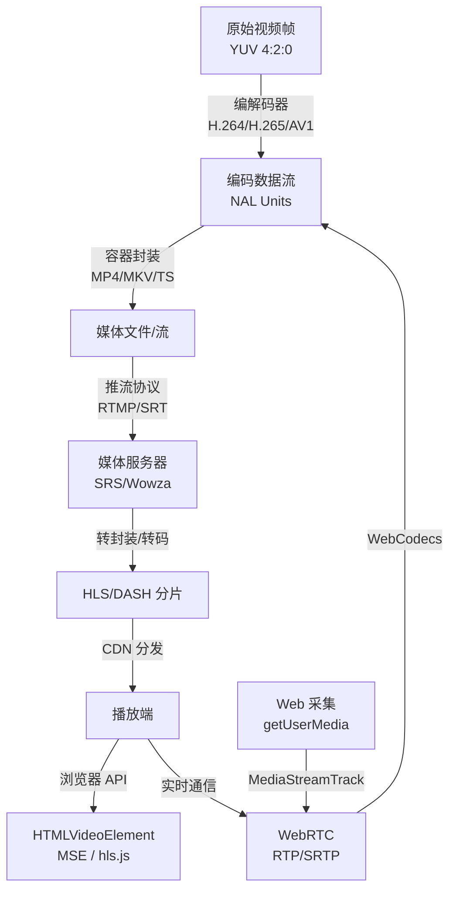

## 引言

视频技术是现代互联网基础设施中最复杂的领域之一。一段 10 分钟的 1080p 视频，原始数据可能超过 100GB，经过编码压缩后缩减到几百 MB，再经过分片、推流、CDN 分发，最终在用户浏览器里流畅播放——这背后涉及的技术栈跨越信号处理、网络协议、容器格式、浏览器 API 等多个层次。

本文的目标是帮你建立一张完整的"视频技术地图"：从最底层的**视频帧**出发，向上理解**编解码**、**容器格式**、**流媒体协议**，再到**推流架构**和**Web 播放 API**。无论你是做直播系统、点播平台，还是需要在 Web 端处理音视频，读完本文都应该能定位自己需要深入的模块。

---

## 一、视频的本质：帧与时间轴

### 1.1 什么是视频帧

视频的本质是**一系列静止图像按时间顺序播放**，每一张静止图像叫做一帧（Frame）。人眼的视觉暂留效应使得当帧率（FPS，Frames Per Second）达到一定阈值时，大脑会将连续图像感知为流畅运动。

```
帧序列示意：
帧0  帧1  帧2  帧3  帧4  帧5 ...
 |    |    |    |    |    |
 0   33   66   99  132  165  ms  （30fps，每帧约33ms）
```

常见帧率及使用场景：

| 帧率 | 场景 |
|---|---|
| 24 fps | 电影（胶片时代遗留，有电影感运动模糊） |
| 30 fps | 电视、网络视频标准帧率 |
| 60 fps | 游戏直播、体育赛事、高流畅度内容 |
| 120 fps | 高刷电影（李安《比利·林恩的中场战事》）、VR |

### 1.2 帧的类型：I/P/B 帧

原始视频中每帧都是完整图像，但编码后视频使用了**帧间预测**技术，将帧分为三种类型：

```
I  P  P  B  P  B  P  I  P ...
↑              ↑
关键帧         关键帧
（完整图像）
```

- **I 帧（Intra Frame / 关键帧）**：完整的独立图像，不依赖其他帧，可单独解码。文件体积最大。
- **P 帧（Predicted Frame / 预测帧）**：只记录与前一个 I 帧或 P 帧的差异（前向预测）。体积约为 I 帧的 1/3。
- **B 帧（Bidirectional Frame / 双向预测帧）**：参考前后两帧的差异。体积最小，但解码延迟高，直播场景通常禁用。

:::tip
直播推流时常见配置 `no-bframe`（禁用 B 帧），原因就是 B 帧需要先缓冲后面的帧才能解码，会增加延迟。点播场景可以保留 B 帧以提升压缩率。
:::

**GOP（Group of Pictures）** 是两个相邻 I 帧之间的帧序列，是视频切片、随机跳转的最小单位。GOP 越小，随机定位越精确，但压缩率越低。

```
|<------ GOP (2s) ------->|<------ GOP (2s) ------->|
I P B P B P I P B P B P I ...
```

### 1.3 原始帧的数据量

以 1080p 30fps 的未压缩视频为例，估算原始数据量：

```
每帧像素数：1920 × 1080 = 2,073,600 像素
每像素 YUV 4:2:0 格式：1.5 字节
每帧数据量：2,073,600 × 1.5 ≈ 3 MB
每秒数据量：3 MB × 30 ≈ 90 MB/s
每小时数据量：90 MB × 3600 ≈ 316 GB
```

这就是为什么必须压缩编码——未经压缩的视频完全无法网络传输。

---

## 二、颜色空间：RGB 与 YUV

### 2.1 为什么视频用 YUV 而不是 RGB

RGB 是显示设备的颜色模型，每个像素由红（R）、绿（G）、蓝（B）三个通道组成，各 8 bit，共 24 bit/像素。

视频使用 **YUV**（也叫 YCbCr）颜色空间：

- **Y**：亮度（Luma），人眼对亮度最敏感
- **U（Cb）**：蓝色色差
- **V（Cr）**：红色色差

YUV 的优势在于可以利用人眼"对亮度敏感、对色度不敏感"的特性进行**色度子采样（Chroma Subsampling）**。

### 2.2 色度子采样：4:4:4 / 4:2:2 / 4:2:0

用 `J:a:b` 格式表示：

```
4:4:4（无子采样，每像素完整 YUV）
Y Y Y Y    U U U U    V V V V
Y Y Y Y    U U U U    V V V V

4:2:2（水平方向 U/V 减半）
Y Y Y Y    U . U .    V . V .
Y Y Y Y    U . U .    V . V .

4:2:0（水平和垂直各减半，最常用）
Y Y Y Y    U . . .    V . . .
Y Y Y Y    . . . .    . . . .
```

**4:2:0** 是最常见的格式（H.264、H.265 默认），相比 4:4:4 节省 50% 色度数据，而画面质量对大多数人肉眼几乎无差别。

---

## 三、视频编解码

### 3.1 编解码器（Codec）是什么

**编解码器（Codec = Coder + Decoder）** 是将原始视频帧压缩为编码数据（编码），以及将编码数据还原为帧（解码）的算法实现。

编码的核心技术：

1. **帧内压缩（Intra Coding）**：类似 JPEG，对单帧内的空间冗余压缩
2. **帧间压缩（Inter Coding）**：利用相邻帧的时间冗余，只编码差异（运动估计 + 运动补偿）
3. **变换编码（DCT）**：把像素值转换到频域，人眼不敏感的高频分量用更少 bit 表示
4. **熵编码（Entropy Coding）**：Huffman/CABAC 等无损压缩去除统计冗余

### 3.2 主流视频编解码器对比

| 编解码器 | 标准组织 | 发布年份 | 压缩效率 | 硬件支持 | 授权 |
|---|---|---|---|---|---|
| H.264 (AVC) | ITU-T + MPEG | 2003 | 基准 | 几乎全覆盖 | 专利授权（免费条款） |
| H.265 (HEVC) | ITU-T + MPEG | 2013 | H.264 的 2x | 主流设备支持 | 专利费用高 |
| VP9 | Google | 2013 | ≈ H.265 | 部分硬件 | 免费开源 |
| AV1 | AOM 联盟 | 2018 | H.265 的 1.5x | 新设备逐步支持 | 免费开源 |
| H.266 (VVC) | ITU-T + MPEG | 2020 | H.265 的 2x | 极少 | 专利授权 |

:::note
**H.264 为什么仍是主流？** 尽管更新的编解码器压缩效率更高，但 H.264 拥有无与伦比的硬件解码支持（从低端手机到智能电视），编码速度快，兼容性最好。对于追求广泛兼容的场景，H.264 + AAC 组合仍然是最安全的选择。
:::

### 3.3 码率（Bitrate）与质量的权衡

**码率** 是单位时间内编码数据的大小，通常以 kbps（千位/秒）或 Mbps 为单位。

```
码率越高 → 图像质量越好 → 文件越大 → 对带宽要求越高
```

常见推荐码率（H.264）：

| 分辨率 | 帧率 | 推荐码率（直播） | 推荐码率（点播） |
|---|---|---|---|
| 480p | 30 | 500-1000 kbps | 400-600 kbps |
| 720p | 30 | 1500-3000 kbps | 1000-1500 kbps |
| 1080p | 30 | 3000-6000 kbps | 2000-4000 kbps |
| 1080p | 60 | 4500-9000 kbps | 3000-6000 kbps |
| 4K | 30 | 13000-34000 kbps | 8000-16000 kbps |

**恒定码率（CBR）vs 可变码率（VBR）**：

- **CBR**：码率固定，便于带宽规划，适合直播推流
- **VBR**：根据画面复杂度动态调整，静止画面少 bit，快速运动多 bit，整体质量更好，适合点播

### 3.4 CRF（Constant Rate Factor）

CRF 是 x264/x265 等软件编码器的质量控制参数，范围 0-51（H.264），值越小质量越高：

```bash
# ffmpeg 使用 CRF 编码
ffmpeg -i input.mp4 -c:v libx264 -crf 23 -preset slow output.mp4

# CRF 参考值
# 0  : 无损
# 17-18 : 视觉无损
# 23 : 默认，质量与大小平衡
# 28 : 较低质量但文件小
# 51 : 最低质量
```

---

## 四、音频编解码

视频文件通常包含视频流和音频流，音频有独立的编解码标准：

| 编解码器 | 特点 | 常见场景 |
|---|---|---|
| **AAC** | 有损，高质量，兼容性好 | MP4 容器标配音频，直播推流 |
| **MP3** | 有损，兼容性极好，稍旧 | 历史遗留 |
| **Opus** | 有损，低延迟，WebRTC 默认 | 实时通信 |
| **PCM** | 无损原始，体积大 | 录制、后期处理 |
| **FLAC** | 无损压缩 | 音乐存档 |
| **AC-3 / E-AC-3** | 杜比音效标准 | 影院、流媒体平台 |

AAC 的主要 Profile：
- **AAC-LC**（Low Complexity）：最常用，质量与兼容性最佳
- **HE-AAC v1**：加入 SBR（频谱带宽复制），低码率下质量更好
- **HE-AAC v2**：加入 PS（参数立体声），极低码率场景

---

## 五、容器格式（封装格式）

### 5.1 容器 vs 编解码器

**容器格式（Container Format）** 是将视频流、音频流、字幕、元数据等封装在一起的文件格式，解决的是"如何打包"的问题；**编解码器**解决的是"如何压缩"的问题。两者是正交的概念：

```
MP4 容器
├── 视频轨道（Track）：H.264 编码
├── 音频轨道（Track）：AAC 编码
├── 字幕轨道（Track）：SRT / WebVTT
└── 元数据：时长、标题、封面图...
```

同一个容器（如 MKV）可以容纳几乎任何编解码器的流；同一个编解码器（如 H.264）可以被放进不同容器（MP4、MKV、TS 等）。

### 5.2 主流容器格式

| 格式 | 扩展名 | 特点 | 典型场景 |
|---|---|---|---|
| **MP4** | `.mp4` | 兼容性最好，浏览器原生支持 | 点播、本地播放 |
| **MKV** | `.mkv` | 支持几乎所有编解码器，无专利限制 | 个人收藏、高质量视频 |
| **FLV** | `.flv` | Flash 时代遗留，RTMP 推流使用 | 直播流（正在被 TS 替代） |
| **TS** | `.ts` | MPEG 传输流，支持边下边播，抗误码 | HLS 分片、广播电视 |
| **WebM** | `.webm` | Google 开源，VP8/VP9 + Vorbis/Opus | Web 视频、Chrome 优先 |
| **MOV** | `.mov` | Apple QuickTime 格式 | macOS/iOS 录制 |
| **AVI** | `.avi` | 微软旧格式，兼容性好但功能有限 | 历史遗留 |

### 5.3 MP4 内部结构

MP4 基于 ISO 基础媒体文件格式（ISOBMFF），采用 Box（盒子）结构：

```
MP4 文件
├── ftyp box：文件类型声明
├── moov box：全局元数据（必须先读取）
│   ├── mvhd：Movie Header（时长、时间基）
│   ├── trak（视频轨道）
│   │   ├── tkhd：Track Header
│   │   ├── mdia：媒体信息
│   │   │   ├── mdhd：Media Header（时间基、语言）
│   │   │   ├── hdlr：Handler（vide/soun/subs）
│   │   │   └── minf → stbl：采样表（关键帧位置、偏移量）
│   └── trak（音频轨道）
└── mdat box：实际的媒体数据
```

:::warning
`moov box` 默认在文件末尾。如果要支持 HTTP 渐进下载（边下边播），需要将 moov 移动到文件头部（`faststart`）：

```bash
ffmpeg -i input.mp4 -movflags +faststart output.mp4
```
:::

---

## 六、轨道（Track）详解

### 6.1 轨道是什么

**轨道（Track）** 是容器格式中的一个独立媒体序列，每条轨道包含一种类型的数据流：

```
视频文件
├── 视频轨道 0：英文版 H.264 (1080p)
├── 视频轨道 1：SDR 版本 H.265 (4K HDR)  ← 多码率
├── 音频轨道 0：英语 AAC 5.1
├── 音频轨道 1：中文 AAC 2.0
├── 字幕轨道 0：中文 SRT
└── 字幕轨道 1：英文 SRT
```

### 6.2 Web 中的 MediaStreamTrack

在浏览器 WebRTC / MediaStream API 中，`MediaStreamTrack` 是对单条媒体轨道的抽象：

```js
// 获取摄像头+麦克风流
const stream = await navigator.mediaDevices.getUserMedia({
  video: { width: 1280, height: 720, frameRate: 30 },
  audio: { echoCancellation: true, noiseSuppression: true }
});

// stream 包含多条 track
const tracks = stream.getTracks();
// [MediaStreamTrack(video), MediaStreamTrack(audio)]

const videoTrack = stream.getVideoTracks()[0];
const audioTrack = stream.getAudioTracks()[0];

console.log(videoTrack.kind);       // "video"
console.log(videoTrack.label);      // "HD WebCam (USB)" 
console.log(videoTrack.readyState); // "live" | "ended"

// 获取当前约束（实际生效的参数）
const settings = videoTrack.getSettings();
console.log(settings);
// { width: 1280, height: 720, frameRate: 30, facingMode: "user", ... }

// 临时静音（不停止采集，只停止发送）
audioTrack.enabled = false;

// 完全停止轨道（释放摄像头）
videoTrack.stop();
```

### 6.3 从屏幕、Canvas 获取视频轨道

```js
// 屏幕共享
const screenStream = await navigator.mediaDevices.getDisplayMedia({
  video: { cursor: 'always' },
  audio: true  // 系统音频（Chrome 支持）
});

// 从 Canvas 获取视频流（用于录制或推流 Canvas 动画）
const canvas = document.querySelector('canvas');
const canvasStream = canvas.captureStream(30); // 30fps
const canvasVideoTrack = canvasStream.getVideoTracks()[0];

// 混合：把摄像头和麦克风合并到一个 stream
const combinedStream = new MediaStream([
  ...cameraStream.getVideoTracks(),
  ...micStream.getAudioTracks(),
]);
```

---

## 七、流媒体协议

### 7.1 流媒体 vs 下载播放

**流媒体（Streaming）** 允许用户一边接收数据一边播放，而无需等待完整文件下载完毕。这对于直播（没有完整文件）和长视频（下载时间太长）都是必须的。

流媒体协议分两大类：

- **基于 HTTP 的自适应流（ABR）**：HLS、DASH、HLS+fMP4（VOD 和直播均适用）
- **实时传输协议**：RTMP、RTSP、SRT、WebRTC（主要用于低延迟直播）

### 7.2 RTMP（Real-Time Messaging Protocol）

RTMP 是 Adobe 开发的实时消息传输协议，曾经是直播推流的绝对标准，至今仍是推流端（OBS → 直播平台）最广泛使用的协议。

```
推流端（OBS） ─── RTMP推流 ──→ 媒体服务器（SRS/Nginx-RTMP）
                                        │
                                        ├── 转码 → HLS 分发给观众
                                        └── 转码 → WebRTC 低延迟分发
```

- **传输层**：TCP（可靠）
- **延迟**：通常 1-3 秒
- **端口**：1935（或 80/443 RTMPS）
- **现状**：Adobe 已停止开发，浏览器不支持直接播放 RTMP 流，但推流端仍广泛使用

```bash
# OBS 推流配置
服务器: rtmp://live.example.com/live
串流密钥: my-stream-key

# ffmpeg 推流示例
ffmpeg -re -i input.mp4 \
  -c:v libx264 -preset veryfast -b:v 2000k -maxrate 2000k -bufsize 4000k \
  -c:a aac -b:a 128k \
  -f flv rtmp://live.example.com/live/stream-key
```

### 7.3 HLS（HTTP Live Streaming）

HLS 是 Apple 开发、基于 HTTP 的自适应流协议，已成为直播和点播的主流分发协议。

**工作原理**：

```
媒体服务器将视频切分为若干 .ts 分片（每片 2-10s），
生成 M3U8 索引文件描述分片列表，
播放器定期拉取 M3U8 更新，顺序下载并播放分片。

m3u8 索引文件（直播）：
#EXTM3U
#EXT-X-TARGETDURATION:5
#EXT-X-MEDIA-SEQUENCE:14
#EXTINF:5.0,
seg014.ts
#EXTINF:5.0,
seg015.ts
#EXTINF:5.0,
seg016.ts
```

**多码率自适应（ABR）**：

```
master.m3u8（总索引）
├── 指向 high/index.m3u8   (1080p 5Mbps)
├── 指向 mid/index.m3u8    (720p 2Mbps)
└── 指向 low/index.m3u8    (480p 800kbps)

播放器根据当前网络速度自动切换码率分片
```

- **延迟**：传统 HLS 10-30 秒，LHLS（Low-Latency HLS）可降到 1-3 秒
- **传输层**：HTTP/HTTPS，CDN 友好
- **浏览器支持**：Safari 原生，Chrome/Firefox 需要 hls.js

### 7.4 DASH（Dynamic Adaptive Streaming over HTTP）

DASH 是 MPEG 标准化的协议，与 HLS 类似但使用 XML 格式的 MPD（Media Presentation Description）替代 M3U8：

```xml
<!-- MPD 文件片段 -->
<MPD type="dynamic" minimumUpdatePeriod="PT5S">
  <Period>
    <AdaptationSet mimeType="video/mp4">
      <Representation id="1080p" bandwidth="5000000" width="1920" height="1080">
        <SegmentTemplate media="seg_$Number$.m4s" initialization="init.mp4"/>
      </Representation>
      <Representation id="720p" bandwidth="2000000" width="1280" height="720">
        <SegmentTemplate media="seg_$Number$.m4s" initialization="init.mp4"/>
      </Representation>
    </AdaptationSet>
  </Period>
</MPD>
```

DASH 使用 **fMP4（Fragmented MP4）** 格式的分片而非 .ts，与 H.265/AV1 兼容性更好。

### 7.5 SRT（Secure Reliable Transport）

SRT 是 Haivision 开发的开源协议，专为**不稳定网络条件**下的低延迟高质量传输设计：

- **传输层**：基于 UDP，内置前向纠错（FEC）和 ARQ 重传
- **延迟**：通常 300ms-1s
- **安全性**：内置 AES 加密
- **适用场景**：跨公网的专业直播推流（替代 RTMP 的趋势）

```bash
# ffmpeg SRT 推流
ffmpeg -re -i input.mp4 \
  -c:v libx264 -preset veryfast -b:v 3000k \
  -c:a aac -b:a 128k \
  -f mpegts "srt://live.example.com:9000?streamid=publish/live/stream1&latency=200000"
```

### 7.6 RTSP（Real Time Streaming Protocol）

RTSP 是 IETF 标准的流媒体控制协议，常见于 IP 摄像头（安防监控）：

- 使用 RTSP 控制播放（PLAY/PAUSE/TEARDOWN 命令）
- 实际媒体数据通过 **RTP（Real-time Transport Protocol）** 传输
- 浏览器不直接支持，通常需要服务器转码为 HLS/WebRTC 才能在 Web 播放

```
IP 摄像头 ──RTSP──→ 流媒体服务器（SRS/Mediamtx）──HLS/WebRTC──→ 浏览器
```

### 7.7 WebRTC 传输层

WebRTC 的媒体传输使用：

- **RTP（Real-time Transport Protocol）**：承载音视频数据，带时间戳和序列号
- **RTCP（RTP Control Protocol）**：控制信息，报告网络质量、请求关键帧
- **DTLS（Datagram TLS）**：加密 RTP 流
- **SRTP（Secure RTP）**：最终的安全媒体传输
- **SCTP（Stream Control Transmission Protocol）**：DataChannel 的传输层

延迟可低至 **`<100ms`**，是所有协议中最低的。

---

## 八、推流架构

### 8.1 完整直播推流链路


### 8.2 关键组件职责

**采集与编码（推流端）**

推流客户端负责：
1. 从摄像头/麦克风采集原始音视频
2. 软硬件编码（H.264 + AAC）
3. 封装为 FLV/TS 格式
4. 通过 RTMP/SRT 推送到接入服务器

```bash
# OBS 等价的 ffmpeg 命令（采集屏幕+麦克风推流）
ffmpeg \
  -f gdigrab -framerate 30 -i desktop \          # 采集屏幕（Windows）
  -f dshow -i audio="Microphone" \               # 采集麦克风
  -c:v libx264 -preset veryfast \
  -b:v 2500k -maxrate 2500k -bufsize 5000k \
  -g 60 \                                        # GOP = 60帧 = 2s @ 30fps
  -c:a aac -ar 44100 -b:a 128k \
  -f flv rtmp://live.example.com/live/key
```

**媒体服务器**

媒体服务器是直播系统的核心，主要功能：

| 功能 | 说明 |
|---|---|
| RTMP 接收 | 接受推流客户端的连接 |
| 转封装 | FLV → HLS(TS) / DASH(fMP4) |
| 转码 | 1080p → 720p + 480p（多码率） |
| 录制 | 保存直播录像到对象存储 |
| 鉴权 | 验证推流/拉流权限 |
| 回源 | 从源站拉取流到 CDN 边缘节点 |

常见媒体服务器：

- **SRS（Simple Realtime Server）**：开源，国内广泛使用，支持 RTMP/HLS/WebRTC
- **Nginx-RTMP-Module**：Nginx 扩展模块，轻量
- **MediaMTX**（原 rtsp-simple-server）：Go 编写，支持协议齐全
- **Wowza Streaming Engine**：商业方案，功能完整

**CDN 分发**

直播 CDN 与普通 CDN 的区别：

```
普通 CDN：源站文件 → 缓存 → 用户（静态缓存）

直播 CDN：
推流端 → 源站 → 边缘节点1 ─→ 用户1
                └→ 边缘节点2 ─→ 用户2
                └→ 边缘节点N ─→ 用户N
（实时分发，每个边缘节点只拉取一次流，向多个用户分发）
```

### 8.3 关键帧与推流稳定性

直播推流中，以下参数直接影响观看体验：

```
关键帧间隔（GOP）= 1~2 秒
缓冲区大小（bufsize）= 2x 视频码率
最大码率（maxrate）= 等于目标码率（CBR 模式）
```

:::warning
关键帧间隔过大（如 10s）会导致：
1. 用户打开直播需要等待更长时间（需要等到下一个 I 帧才能解码）
2. CDN 切换边缘节点时花屏
3. 网络抖动恢复慢

建议直播推流 GOP ≤ 2 秒。
:::

---

## 九、Web 视频 API

### 9.1 HTMLVideoElement

`<video>` 是浏览器播放视频的基础元素：

```html
<video
  id="player"
  src="/video/demo.mp4"
  controls
  preload="metadata"
  poster="/images/thumbnail.jpg"
  playsinline          <!-- iOS 内联播放（不自动全屏） -->
  muted                <!-- 允许自动播放（浏览器策略要求静音才能自动播放） -->
  crossorigin="anonymous"
></video>
```

```js
const video = document.getElementById('player');

// 播放控制
video.play();
video.pause();
video.currentTime = 30;   // 跳转到第30秒
video.playbackRate = 1.5; // 1.5倍速播放

// 事件
video.addEventListener('loadedmetadata', () => {
  console.log('时长:', video.duration);         // 秒
  console.log('宽高:', video.videoWidth, video.videoHeight);
});

video.addEventListener('timeupdate', () => {
  const progress = video.currentTime / video.duration;
  console.log('进度:', (progress * 100).toFixed(1) + '%');
});

video.addEventListener('waiting', () => console.log('缓冲中...'));
video.addEventListener('playing', () => console.log('播放中'));

// 缓冲信息
video.addEventListener('progress', () => {
  for (let i = 0; i < video.buffered.length; i++) {
    console.log(`缓冲段 ${i}: ${video.buffered.start(i)}s - ${video.buffered.end(i)}s`);
  }
});
```

### 9.2 Media Source Extensions（MSE）

MSE 允许 JavaScript 动态向 `<video>` 喂入媒体数据，是 hls.js、dash.js 等播放器库的底层基础：

```js
const video = document.querySelector('video');
const mediaSource = new MediaSource();
video.src = URL.createObjectURL(mediaSource);

mediaSource.addEventListener('sourceopen', async () => {
  // 创建 SourceBuffer（指定编解码器）
  const sourceBuffer = mediaSource.addSourceBuffer(
    'video/mp4; codecs="avc1.42E01E, mp4a.40.2"'
    //                     ↑H.264 Baseline  ↑AAC-LC
  );

  // 下载并追加 fMP4 分片
  const response = await fetch('/segment_001.m4s');
  const data = await response.arrayBuffer();

  sourceBuffer.addEventListener('updateend', () => {
    console.log('分片追加完成，缓冲区:', sourceBuffer.buffered);
    if (!video.paused) return;
    video.play();
  });

  sourceBuffer.appendBuffer(data);
});
```

MSE 的核心概念：

- **SourceBuffer**：一条媒体轨道的缓冲区，只能接受特定编解码格式
- **MediaSource.readyState**：`closed` → `open` → `ended`
- **appendBuffer**：向缓冲区追加分片数据（只接受 fMP4 或 WebM 格式）
- **remove**：移除已播放的老数据，防止内存溢出

### 9.3 在浏览器中播放 HLS（hls.js）

Safari 原生支持 HLS，Chrome/Firefox 需要 hls.js：

```js
import Hls from 'hls.js';

const video = document.querySelector('video');
const src = 'https://cdn.example.com/live/stream.m3u8';

if (Hls.isSupported()) {
  const hls = new Hls({
    maxBufferLength: 30,         // 最大缓冲时长（秒）
    maxMaxBufferLength: 600,
    liveSyncDuration: 3,         // 直播同步延迟目标（秒）
    liveMaxLatencyDuration: 10,  // 最大允许延迟
  });

  hls.loadSource(src);
  hls.attachMedia(video);

  hls.on(Hls.Events.MANIFEST_PARSED, () => {
    console.log('可用码率:', hls.levels.map(l => l.bitrate));
    video.play();
  });

  // 监听码率切换
  hls.on(Hls.Events.LEVEL_SWITCHED, (event, data) => {
    console.log('切换到码率级别:', data.level, hls.levels[data.level].bitrate);
  });

  hls.on(Hls.Events.ERROR, (event, data) => {
    if (data.fatal) {
      hls.destroy();
    }
  });

} else if (video.canPlayType('application/vnd.apple.mpegurl')) {
  // Safari 原生 HLS
  video.src = src;
}
```

### 9.4 MediaRecorder API

MediaRecorder 用于在浏览器中录制音视频流：

```js
// 获取媒体流
const stream = await navigator.mediaDevices.getUserMedia({ video: true, audio: true });
const video = document.querySelector('video');
video.srcObject = stream;
video.play();

// 创建录制器
const mimeType = MediaRecorder.isTypeSupported('video/webm;codecs=vp9,opus')
  ? 'video/webm;codecs=vp9,opus'
  : 'video/webm';

const recorder = new MediaRecorder(stream, {
  mimeType,
  videoBitsPerSecond: 2_500_000,  // 2.5 Mbps
  audioBitsPerSecond: 128_000,
});

const chunks = [];
recorder.ondataavailable = (e) => {
  if (e.data.size > 0) chunks.push(e.data);
};

recorder.onstop = () => {
  const blob = new Blob(chunks, { type: mimeType });
  
  // 下载录制文件
  const url = URL.createObjectURL(blob);
  const a = document.createElement('a');
  a.href = url;
  a.download = `recording-${Date.now()}.webm`;
  a.click();
  URL.revokeObjectURL(url);
};

// 开始录制（每1秒触发一次 ondataavailable）
recorder.start(1000);

// 5秒后停止
setTimeout(() => recorder.stop(), 5000);
```

:::note
MediaRecorder 只能录制为 **WebM**（Chrome/Firefox）或 **MP4**（Safari）格式。
如果需要输出 MP4 格式，Chrome 目前支持 `video/mp4;codecs=avc1,mp4a.40.2` 但支持度仍在完善中，跨浏览器方案通常需要 WebAssembly 版的 FFmpeg 在客户端转码。
:::

### 9.5 Web Codecs API

Web Codecs 是较新的底层 API，允许 JavaScript 直接访问视频帧级别的编解码能力：

```js
// 解码单帧（用于视频截图、逐帧处理等）
const decoder = new VideoDecoder({
  output: (frame) => {
    // 把视频帧绘制到 Canvas
    const canvas = document.querySelector('canvas');
    const ctx = canvas.getContext('2d');
    ctx.drawImage(frame, 0, 0);
    frame.close(); // 必须手动释放！
  },
  error: (e) => console.error('解码错误', e),
});

decoder.configure({
  codec: 'avc1.42E01E',  // H.264 Baseline
  codedWidth: 1280,
  codedHeight: 720,
});

// 喂入编码数据
const chunk = new EncodedVideoChunk({
  type: 'key',                    // 'key' | 'delta'
  timestamp: 0,                   // 微秒
  data: encodedData,              // ArrayBuffer
});

decoder.decode(chunk);
await decoder.flush();

// 编码（视频采集 → 编码 → 推流）
const encoder = new VideoEncoder({
  output: (chunk, metadata) => {
    // chunk 是编码后的数据，发送到推流管道
    sendToRTMP(chunk);
  },
  error: (e) => console.error(e),
});

encoder.configure({
  codec: 'avc1.42E01E',
  width: 1280,
  height: 720,
  bitrate: 2_000_000,
  framerate: 30,
  latencyMode: 'realtime',  // 直播场景用 realtime，减少缓冲
});

// 从 VideoFrame 编码
const frame = new VideoFrame(imageData, { timestamp: performance.now() * 1000 });
encoder.encode(frame, { keyFrame: forceKeyFrame });
frame.close();
```

Web Codecs 是 WebRTC 替代方案（如自定义直播推流、视频编辑器）的关键 API。

---

## 十、视频处理工具链：FFmpeg

FFmpeg 是视频开发中不可绕过的工具，掌握常用命令能极大提升效率。

### 10.1 基础操作

```bash
# 查看视频信息
ffprobe -v quiet -print_format json -show_streams input.mp4

# 转换格式（重新封装，不重新编码）
ffmpeg -i input.mkv -c copy output.mp4

# 重新编码为 H.264
ffmpeg -i input.mov \
  -c:v libx264 -crf 22 -preset slow \
  -c:a aac -b:a 128k \
  output.mp4

# 调整分辨率（保持宽高比，宽度720）
ffmpeg -i input.mp4 -vf scale=720:-2 output.mp4

# 裁剪时间段（无重新编码，从10s开始取30s）
ffmpeg -ss 00:00:10 -i input.mp4 -t 30 -c copy output.mp4

# 提取截图（第5秒的帧）
ffmpeg -ss 5 -i input.mp4 -frames:v 1 thumbnail.jpg

# 视频转 GIF
ffmpeg -i input.mp4 -vf "fps=12,scale=640:-1:flags=lanczos" -loop 0 output.gif
```

### 10.2 生成 HLS 流

```bash
# 生成单码率 HLS
ffmpeg -i input.mp4 \
  -c:v libx264 -crf 23 -preset fast \
  -c:a aac -b:a 128k \
  -f hls \
  -hls_time 6 \           # 每片6秒
  -hls_playlist_type vod \  # vod | event | 空（直播）
  -hls_segment_filename "seg_%03d.ts" \
  output.m3u8

# 生成多码率 HLS（自适应码率）
ffmpeg -i input.mp4 \
  -filter_complex "[0:v]split=3[v1][v2][v3]" \
  -map "[v1]" -c:v libx264 -b:v 5000k -s 1920x1080 \
  -map "[v2]" -c:v libx264 -b:v 2000k -s 1280x720 \
  -map "[v3]" -c:v libx264 -b:v 800k  -s 854x480 \
  -map 0:a -c:a aac -b:a 128k \
  -f hls -hls_time 6 \
  -master_pl_name master.m3u8 \
  -hls_segment_filename "v%v/seg_%03d.ts" \
  -var_stream_map "v:0,a:0 v:1,a:1 v:2,a:2" \
  stream_%v/index.m3u8
```

### 10.3 视频分析

```bash
# 查看关键帧分布
ffprobe -select_streams v:0 -show_frames -show_entries frame=pict_type,pts_time \
  input.mp4 | grep "I"

# 统计每秒码率
ffprobe -select_streams v:0 -show_packets -show_entries packet=pts_time,size \
  input.mp4 | awk -F= '{...}'

# 检测场景切换（可用于自动打关键帧）
ffmpeg -i input.mp4 -vf select='gt(scene\,0.3)' -vsync vfr scene_%04d.jpg
```

---

## 十一、视频质量指标

### 11.1 主观质量 vs 客观指标

视频质量分为主观（人眼感知）和客观（数学计算）两个维度：

**客观质量指标**：

| 指标 | 全称 | 含义 | 范围 |
|---|---|---|---|
| **PSNR** | 峰值信噪比 | 像素级均方误差，值越高越好 | 通常 30-50 dB |
| **SSIM** | 结构相似度 | 考虑亮度/对比度/结构，更接近主观感受 | 0-1，越接近1越好 |
| **VMAF** | Netflix 开发 | 机器学习模型，与主观评分相关性最高 | 0-100 |

```bash
# ffmpeg 计算 PSNR/SSIM（比较原始视频和编码后视频）
ffmpeg -i original.mp4 -i encoded.mp4 \
  -lavfi "[0:v][1:v]psnr;[0:v][1:v]ssim" \
  -f null -
```

### 11.2 直播质量监控关键指标

**推流端指标**：

| 指标 | 正常值 | 异常影响 |
|---|---|---|
| 推流码率稳定性 | 波动 < ±10% | 码率波动大 → 画质忽好忽坏 |
| 帧率稳定性 | 波动 < ±2fps | 帧率不稳 → 卡顿感 |
| 丢帧率 | < 1% | 丢帧 → 画面跳帧 |
| RTT（往返延迟） | < 200ms | RTT 高 → 推流延迟大 |

**播放端指标**：

| 指标 | 说明 |
|---|---|
| 首帧时间（TTFF） | 从点击播放到看到第一帧的时间，目标 < 2s |
| 卡顿率 | 播放期间缓冲等待次数/时长 |
| 端到端延迟 | 推流端画面到播放端显示的时间差 |
| 码率切换次数 | ABR 算法触发多路切换，过于频繁影响体验 |

---

## 十二、完整示例：浏览器推流到 SRS

以下是一个在浏览器中采集摄像头、通过 WebRTC 推流到 SRS 服务器的完整示例：

```js
// 浏览器端 WebRTC 推流（SRS 支持 WebRTC 推流）
class WebRTCPublisher {
  constructor(serverUrl) {
    this.serverUrl = serverUrl; // e.g. "https://srs.example.com/rtc/v1/publish/"
    this.pc = null;
    this.stream = null;
  }

  async startPublish(streamUrl) {
    // 1. 采集本地媒体
    this.stream = await navigator.mediaDevices.getUserMedia({
      video: { width: 1280, height: 720, frameRate: 30 },
      audio: { echoCancellation: true }
    });

    // 2. 创建 PeerConnection
    this.pc = new RTCPeerConnection({
      iceServers: [{ urls: 'stun:stun.l.google.com:19302' }]
    });

    // 3. 添加媒体轨道
    this.stream.getTracks().forEach(track => {
      this.pc.addTrack(track, this.stream);
    });

    // 4. 创建 SDP Offer（告知对端我能发送什么格式）
    const offer = await this.pc.createOffer();

    // 5. 强制 H.264（去掉 VP8/VP9/AV1 以确保服务器兼容性）
    offer.sdp = this._preferH264(offer.sdp);
    await this.pc.setLocalDescription(offer);

    // 6. 发送 Offer 给 SRS 信令接口，获取 Answer
    const response = await fetch(this.serverUrl, {
      method: 'POST',
      headers: { 'Content-Type': 'application/json' },
      body: JSON.stringify({
        api: this.serverUrl,
        streamurl: streamUrl,  // rtmp://srs.example.com/live/stream1
        sdp: offer.sdp
      })
    });
    const { sdp: answerSdp } = await response.json();

    // 7. 设置远端描述（建立连接）
    await this.pc.setRemoteDescription({ type: 'answer', sdp: answerSdp });

    console.log('推流已建立');
    return this.stream;
  }

  _preferH264(sdp) {
    // 简化：保留 H.264 相关的 payload，移除其他视频编解码器
    return sdp.replace(/a=rtpmap:(\d+) VP[89]\/.*\r\n/g, '');
  }

  async stopPublish() {
    this.stream?.getTracks().forEach(t => t.stop());
    this.pc?.close();
  }
}

// 使用
const publisher = new WebRTCPublisher('https://srs.example.com/rtc/v1/publish/');
const stream = await publisher.startPublish('webrtc://srs.example.com/live/stream1');
document.querySelector('#localVideo').srcObject = stream;
```

---

## 总结

视频技术的知识体系可以用这张脉络图来概括：



每一层都是一个独立的专业方向，但理解整条链路才能在遇到问题时快速定位：

- 画质差 → 检查码率、编码参数、CRF 设置
- 直播延迟高 → 检查 GOP 大小、HLS 分片时长、CDN 边缘策略
- 卡顿 → 检查推流稳定性、CDN 节点质量、播放器缓冲策略
- 首帧慢 → 检查 moov box 位置、HLS 分片数量、CDN 回源时间
- 浏览器兼容 → 检查编解码器支持、MSE 支持、容器格式

希望这篇文章能帮你建立起对视频技术的整体认知，在遇到具体问题时知道去哪个层次找答案。
