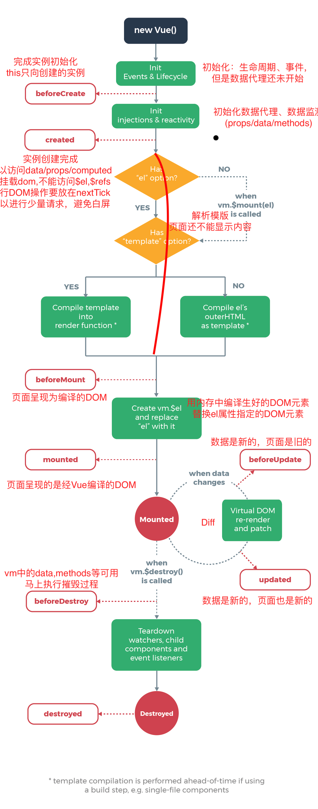

Vue 组件实例从创建到销毁的完整过程中，会依次触发一系列生命周期钩子函数，开发者可以在这些钩子中执行特定的逻辑。理解每个钩子的触发时机和父子组件间的执行顺序，对于正确编写组件逻辑至关重要。

## 创建阶段

- **beforeCreate**：实例刚被初始化，data、methods、computed 等尚未初始化，`this` 无法访问到这些属性。此时可用于一些不需要依赖组件数据的初始化操作。
- **created**：实例已完全初始化，data、methods、computed、watch 均已设置完成，可以访问 `this.data`、`this.methods` 等。但此时 DOM 还未挂载，`$el` 不存在。通常在这里发起异步请求获取数据。

## 挂载阶段

- **beforeMount**：模板编译完成，即将执行首次渲染。此时 `$el` 虽已创建但尚未替换页面中的 DOM 元素。
- **mounted**：实例挂载完成，DOM 渲染完毕，`$el` 可访问。可以在这里操作 DOM、初始化第三方库等。注意子组件的 mounted 先于父组件触发。

## 更新阶段

- **beforeUpdate**：数据变化后，DOM 重新渲染之前调用。可以在这里获取更新前的 DOM 状态。
- **updated**：DOM 重新渲染完成后调用。注意避免在此钩子中修改状态，否则可能导致无限循环。

## 销毁阶段

- **beforeDestroy**：实例销毁之前调用。此时实例仍然可用，常用于清理定时器、解绑事件监听等。
- **destroyed**：实例销毁后调用。所有指令解绑、事件监听器移除、子实例销毁。

## 父子生命周期

### 创建与挂载

父 beforeCreate → 父 created → 父 beforeMount → **子 beforeCreate → 子 created → 子 beforeMount → 子 mounted** → 父 mounted

父组件先进入挂载阶段，但在自身的 `mounted` 之前，需要等待子组件完成创建和挂载。这是因为父组件的渲染过程依赖子组件的 VNode。

### 更新

父 beforeUpdate → **子 beforeUpdate → 子 updated** → 父 updated

数据更新时，父组件先开始更新流程，但同样需要等待子组件更新完成后，父组件的 `updated` 才会触发。

### 销毁

父 beforeDestroy → **子 beforeDestroy → 子 destroyed** → 父 destroyed

销毁顺序与挂载一致：父组件先开始销毁，等待子组件完全销毁后，父组件才完成销毁。

:::tip 记忆规律
无论是挂载、更新还是销毁，子组件的完整生命周期总是嵌套在父组件的 before 和 after 钩子之间——父组件先开始，子组件完成，父组件再完成。
:::