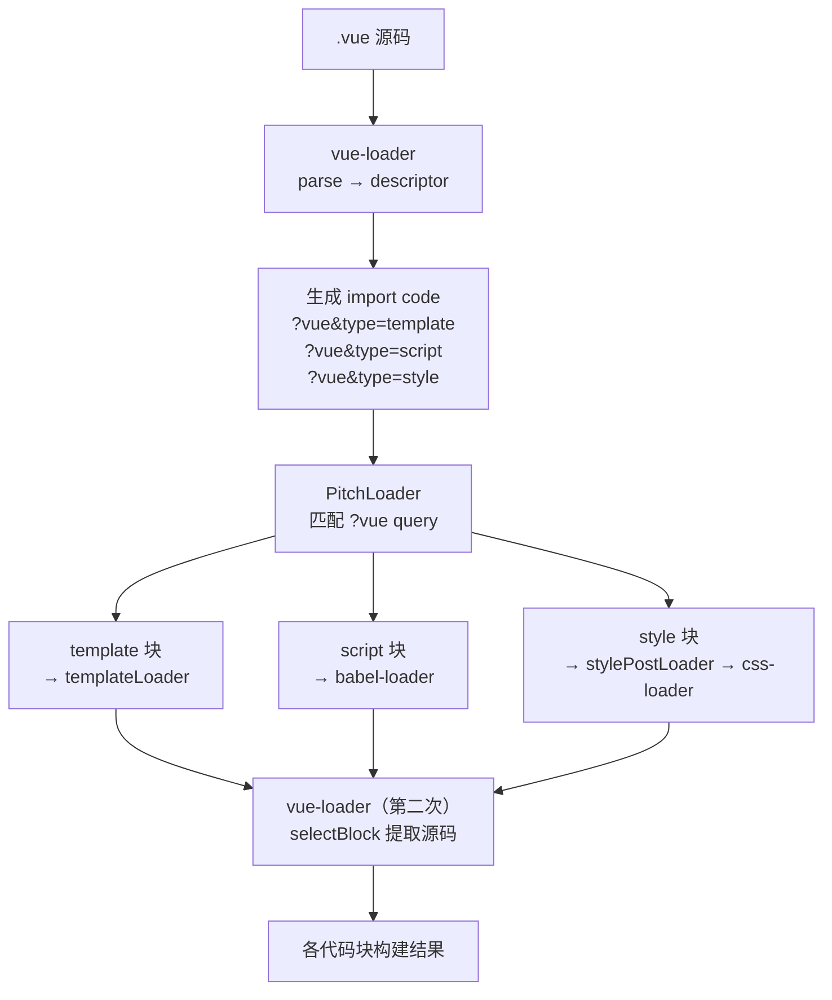
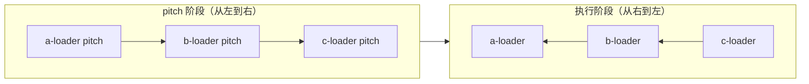
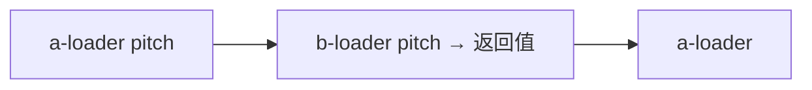
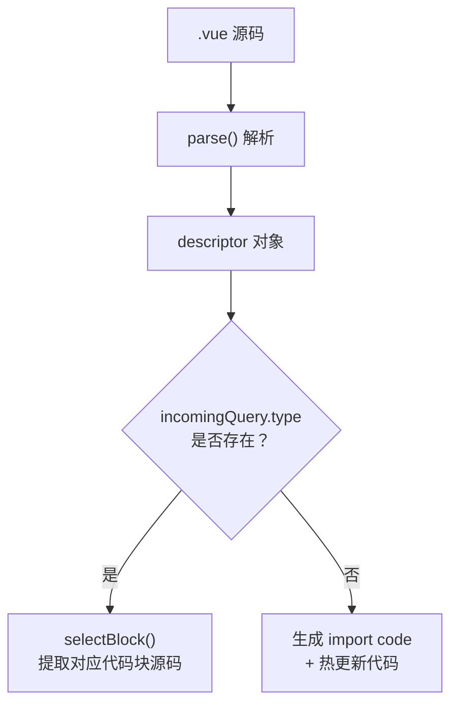
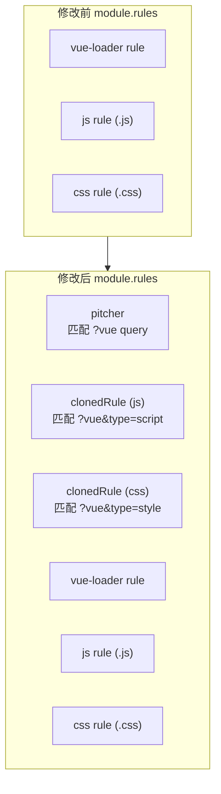
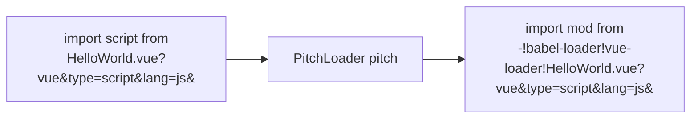
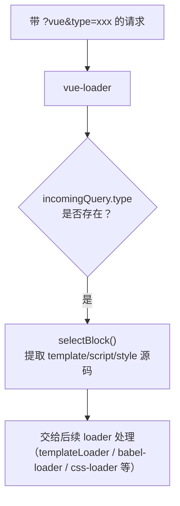
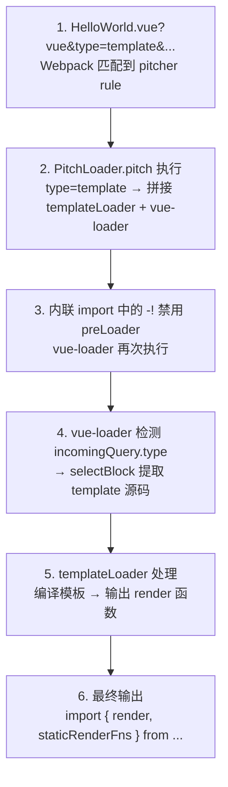
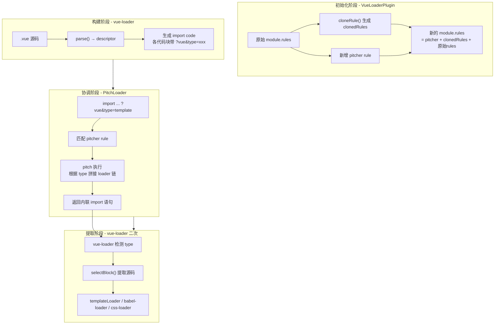

`.vue` 单文件组件（SFC）需要通过 vue-loader 和 VueLoaderPlugin 配合 Webpack 才能被打包使用。本文从源码层面分析 SFC 的完整构建流程：vue-loader 如何拆分代码块、VueLoaderPlugin 如何修改 rules、pitch loader 如何协调其他 loader，以及最终各代码块如何被正确匹配和处理。

## 整体流程

SFC 经过 Webpack 打包的完整流程如下图所示：



整个流程可以分为四个阶段：

1. **vue-loader 首次处理**：将 `.vue` 源码解析为 descriptor，生成各代码块的 import 语句
2. **VueLoaderPlugin 预处理**：修改 `module.rules`，添加 pitcher 和 clonedRules
3. **PitchLoader 协调**：根据 `?vue&type=xxx` 拼接对应的 loader 链
4. **vue-loader 二次处理**：仅提取对应代码块的源码，交给后续 loader 处理

## Webpack loader 执行顺序

在深入 vue-loader 之前，需要理解 Webpack loader 的执行机制：

- **从左到右**执行 loader 上的 `pitch` 方法，如果某个 pitch 方法返回了实际值，则会**跳过后续的 pitch 和 loader**
- **从右到左**执行 loader 本身



如果 `b-loader` 的 pitch 方法返回了实际值，则执行顺序变为：



这个特性是理解 PitchLoader 工作原理的关键——它通过在 pitch 阶段返回值，跳过了不需要的 loader，直接生成了内联 import 语句。

## vue-loader 首次处理

vue-loader 的入口文件是 `lib/index.js`。当 Webpack 遇到 `.vue` 文件时，调用 vue-loader 进行处理：

1. 调用 `@vue/component-compiler-utils` 的 `parse` 函数，将 SFC 源码解析为 **descriptor** 对象
2. 如果请求带有 `?vue&type=xxx` 参数（即第二次进入），则直接调用 `selectBlock` 提取对应代码块
3. 否则，根据 descriptor 生成各代码块的 import 语句，并注入热更新代码



```js
const { parse } = require("@vue/component-compiler-utils");

module.exports = function (source) {
  const descriptor = parse({
    source,
    compiler: options.compiler || loadTemplateCompiler(loaderContext),
    filename,
    sourceRoot,
    needMap: sourceMap,
  });
  /**
  descriptor {
    template: { ... },
    script: { ... },
    styles: [ ... ],
    customBlocks: [],
    errors: []
  }
  */
  if (incomingQuery.type) {
    return selectBlock(
      descriptor,
      loaderContext,
      incomingQuery,
      !!options.appendExtension
    );
  }

  if (needsHotReload) {
    code += `\n` + genHotReloadCode(id, hasFunctional, templateRequest);
  }
  return code;
};
```

### SFC 的输入和输出

以一个实际的 `HelloWorld.vue` 为例，经过 vue-loader 首次处理后，各个代码块被转化为对应的 import 语句：

::: details HelloWorld.vue 源码

```html
<template>
  <div class="hello">
    <h1>{{ msg }}</h1>
    <p>
      For a guide and recipes on how to configure / customize this project,<br>
      check out the
      <a href="https://cli.vuejs.org" target="_blank" rel="noopener">vue-cli documentation</a>.
    </p>
    <h3>Installed CLI Plugins</h3>
    <ul>
      <li><a href="https://github.com/vuejs/vue-cli/tree/dev/packages/%40vue/cli-plugin-babel" target="_blank" rel="noopener">babel</a></li>
      <li><a href="https://github.com/vuejs/vue-cli/tree/dev/packages/%40vue/cli-plugin-eslint" target="_blank" rel="noopener">eslint</a></li>
    </ul>
  </div>
</template>

<script>
export default {
  name: 'HelloWorld',
  props: {
    msg: String
  },
  data(){
    return {
      pageName:'App'
    }
  }
}
</script>

<style scoped>
h3 {
  margin: 40px 0 0;
}
ul {
  list-style-type: none;
  padding: 0;
}
</style>
```

:::

::: details parse 解析后的 descriptor

```js
  template: {
    type: 'template',
    content: '\n<div class="hello">...</div>\n',
    start: 10,
    attrs: {},
    end: 1681
  },
  script: {
    type: 'script',
    content: "export default { name: 'HelloWorld', ... }\n",
    start: 1702,
    attrs: {},
    end: 1942
  },
  styles: [
    {
      type: 'style',
      content: '\nh3 { margin: 40px 0 0; }\n...',
      start: 2035,
      attrs: [Object],
      scoped: true,
      end: 2183
    }
  ],
  customBlocks: [],
  errors: [ 'tag <br> has no matching end tag.' ]
```

:::

::: details vue-loader 生成的 code

```js
import {
  render,
  staticRenderFns,
} from "./HelloWorld.vue?vue&type=template&id=469af010&scoped=true&";
import script from "./HelloWorld.vue?vue&type=script&lang=js&";
export * from "./HelloWorld.vue?vue&type=script&lang=js&";
import style0 from "./HelloWorld.vue?vue&type=style&index=0&id=469af010&scoped=true&lang=css&";

/* normalize component */
import normalizer from "!../../source-code/vue-loader-15.9.8/lib/runtime/componentNormalizer.js";
var component = normalizer(
  script,
  render,
  staticRenderFns,
  false,
  null,
  "469af010",
  null
);

/* hot reload */
if (module.hot) {
  var api = require("F:\\github\\vue2-test\\node_modules\\vue-hot-reload-api\\dist\\index.js");
  api.install(require("vue"));
  if (api.compatible) {
    module.hot.accept();
    if (!api.isRecorded("469af010")) {
      api.createRecord("469af010", component.options);
    } else {
      api.reload("469af010", component.options);
    }
    module.hot.accept(
      "./HelloWorld.vue?vue&type=template&id=469af010&scoped=true&",
      function () {
        api.rerender("469af010", {
          render: render,
          staticRenderFns: staticRenderFns,
        });
      }
    );
  }
}
component.options.__file = "src/components/HelloWorld.vue";
export default component.exports;
```

:::

可以看到，原有的 template、script、style 代码块在输出结果中已经转化为对应的 import 逻辑，每个 import 都带有 `?vue&type=xxx` 参数。这些参数的作用是什么？答案在 VueLoaderPlugin 中。

## VueLoaderPlugin

VueLoaderPlugin 是 vue-loader 的配套插件，它在 Webpack 初始化阶段修改 `module.rules`，使得带有 `?vue&type=xxx` 参数的请求能够被正确匹配到对应的 loader 规则。

Webpack Plugin 的两个核心能力：

- 能够 hook 到在每个编译（compilation）中触发的所有关键事件
- 在插件实例的 `apply` 方法中，可以通过 `compiler.options` 获取 Webpack 配置，并进行修改

VueLoaderPlugin 利用了第二个能力，在初始化阶段对 `module.rules` 进行动态修改。

### 对 rules 的修改

VueLoaderPlugin 在原有的 rules 基础上，加入了 **pitcher** 和 **clonedRules**。新增的 rule 能识别形如 `?vue&type=template` 的 querystring，让不同语言的代码块匹配到对应的 loader 规则。



关键点在于 `clonedRules` 使用 `resourceQuery` 选项对资源的 querystring 进行匹配。例如，原本匹配 `.js` 文件的 rule 被克隆后，新增了匹配 `?vue&type=script` 的条件，这样 `HelloWorld.vue?vue&type=script&lang=js&` 就能被 babel-loader 等处理。

```js
class VueLoaderPlugin {
  apply (compiler) {
    const rules = compiler.options.module.rules

    const clonedRules = rules
      .filter(r => r !== rawVueRules)
      .map((rawRule) => cloneRule(rawRule, refs))

    const pitcher = {
      loader: require.resolve('./loaders/pitcher'),
      resourceQuery: query => {
        if (!query) { return false }
        const parsed = qs.parse(query.slice(1))
        return parsed.vue != null
      },
      options: { ... }
    }

    compiler.options.module.rules = [
       pitcher,
       ...clonedRules,
       ...rules
     ];
  }
}
```

## PitchLoader

PitchLoader 是 vue-loader 协调其他 loader 的核心。当 Webpack 解析到带有 `?vue` 参数的 import 语句时，PitchLoader 首先被匹配并执行 pitch 方法。

PitchLoader 的工作流程：

1. 解析 `resourceQuery` 中的 `type` 参数，判断当前处理的是哪种代码块
2. 根据代码块类型，拼接对应的 loader 链（使用内联 import 语法）
3. 在 pitch 阶段返回拼接结果，**跳过后续的 loader**

以 script 块为例，PitchLoader 的转化流程如下：



内联 import 语法拆解：

```
-!babel-loader??clonedRuleSet-1[0].rules[0].use!vue-loader??vue-loader-options!./HelloWorld.vue?vue&type=script&lang=js&
│    │                              │                            │
│    │                              │                            └── 原始请求路径
│    │                              └── vue-loader 第二次处理，提取源码
│    └── 通过 clonedRule 匹配到的 babel-loader
└── 禁用所有已配置的 preLoader 和 loader（不禁用 postLoader）
```

```js
// vue-loader lib/loaders/pitcher.js
module.exports.pitch = function (remainingRequest) {
  const query = qs.parse(this.resourceQuery.slice(1))
  if (query.type === 'style') { ... }
  if (query.type === 'template') { ... }

  return `import mod from ${request}; export default mod; export * from ${request}`;
}
```

::: details PitchLoader 处理结果

```js
//  template ?vue&type=template&id=39502b8f&scoped=true&
export * from "-!../../source-code/vue-loader-15.9.8/lib/loaders/templateLoader.js??vue-loader-options!../../source-code/vue-loader-15.9.8/lib/index.js??vue-loader-options!./HelloWorld.vue?vue&type=template&id=469af010&scoped=true&";

//  style vue&type=style&index=0&id=469af010&scoped=true&lang=css&
export * from "-!../../node_modules/style-loader/dist/cjs.js!../../node_modules/css-loader/dist/cjs.js!../../source-code/vue-loader-15.9.8/lib/loaders/stylePostLoader.js!../../node_modules/postcss-loader/dist/cjs.js!../../node_modules/less-loader/dist/cjs.js!../../source-code/vue-loader-15.9.8/lib/index.js??vue-loader-options!./HelloWorld.vue?vue&type=style&index=0&id=469af010&scoped=true&lang=css&";

//  script vue&type=script&lang=js&
// clonedRuleSet-1[0].rules[0].use 使用配置的js rule处理
import mod from "-!../../node_modules/babel-loader/lib/index.js??clonedRuleSet-1[0].rules[0].use!../../source-code/vue-loader-15.9.8/lib/index.js??vue-loader-options!./HelloWorld.vue?vue&type=script&lang=js&";
export default mod;
export * from "-!../../node_modules/babel-loader/lib/index.js??clonedRuleSet-1[0].rules[0].use!../../source-code/vue-loader-15.9.8/lib/index.js??vue-loader-options!./HelloWorld.vue?vue&type=script&lang=js&";
```

:::

## vue-loader 二次处理

在 PitchLoader 的转化结果中，vue-loader 作为第一个处理的 loader 再次出现。与首次不同的是，这次 vue-loader 的作用仅仅是**将 SFC 中对应代码块的源码提取出来**，交给后面的 loader 进行处理。

当请求带有 `incomingQuery.type` 时，vue-loader 直接调用 `selectBlock` 返回对应代码块的源码，跳过 parse 和 code 生成逻辑：

```js
if (incomingQuery.type) {
  return selectBlock(
    descriptor,
    loaderContext,
    incomingQuery,
    !!options.appendExtension
  );
}
```



## 完整匹配过程

以 template 块为例，完整的匹配和处理流程如下：



::: details template 匹配过程源码

```js
//  1. Vue-loader处理 ?vue 匹配到pitch loader
"./HelloWorld.vue?vue&type=template&id=469af010&scoped=true&";
// 2. pitch Loader 匹配 type=template 进行处理 结果
export * from "-!../../source-code/vue-loader-15.9.8/lib/loaders/templateLoader.js??vue-loader-options!../../source-code/vue-loader-15.9.8/lib/index.js??vue-loader-options!./HelloWorld.vue?vue&type=template&id=469af010&scoped=true&";
// 3. -! 禁用所有已配置的 preLoader 和 loader，但是不禁用 postLoaders 再次进入vue-loader处理后续.vue文件  type= template
if (incomingQuery.type) {
  return selectBlock(
    descriptor,
    loaderContext,
    incomingQuery,
    !!options.appendExtension
  );
}
// 4. 匹配 templateLoader 的postLoader
return code + `\nexport { render, staticRenderFns }`;
// 5. Vue-loader 输出
import {
  render,
  staticRenderFns,
} from "./HelloWorld.vue?vue&type=template&id=469af010&scoped=true&";
var component = normalizer(
  script,
  render,
  staticRenderFns,
  false,
  null,
  "469af010",
  null
);
```

:::

## 总结

用一张完整的流程图回顾 SFC 构建的全过程：



整个 SFC 构建流程的核心设计思想是**两次进入 vue-loader**：第一次负责拆分代码块并生成带参数的 import 语句，第二次仅提取对应代码块的源码。中间通过 VueLoaderPlugin 修改 rules 和 PitchLoader 协调 loader 链，确保每种代码块都能被正确的 loader 处理。
