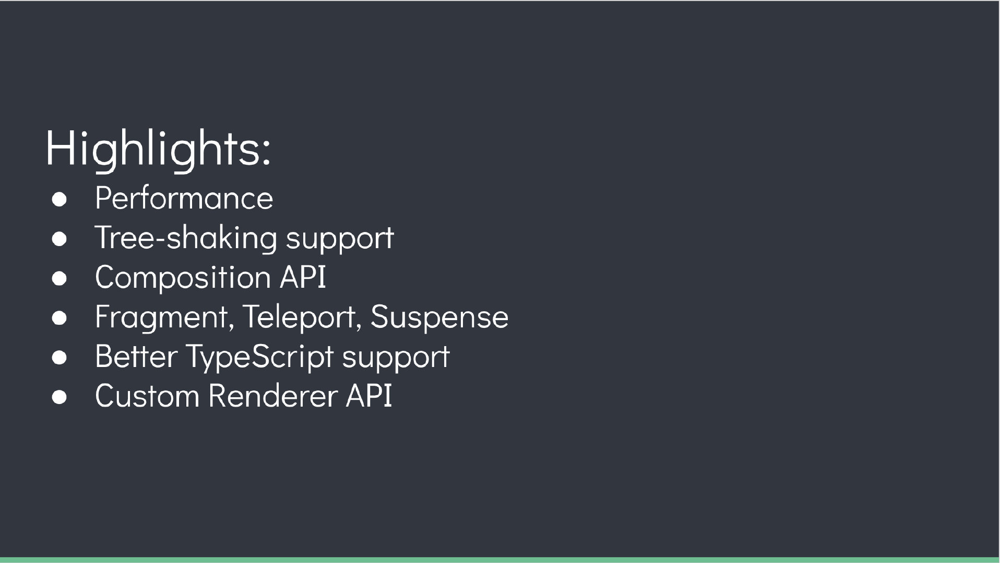
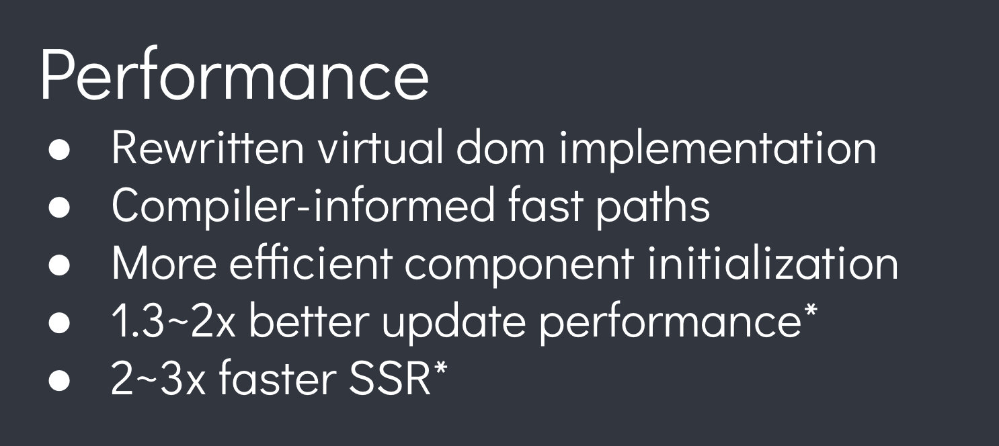
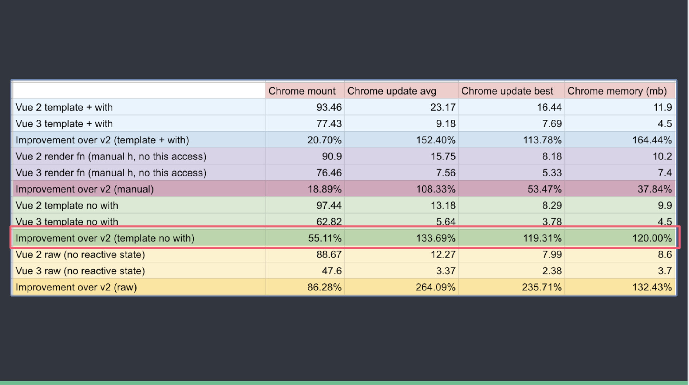
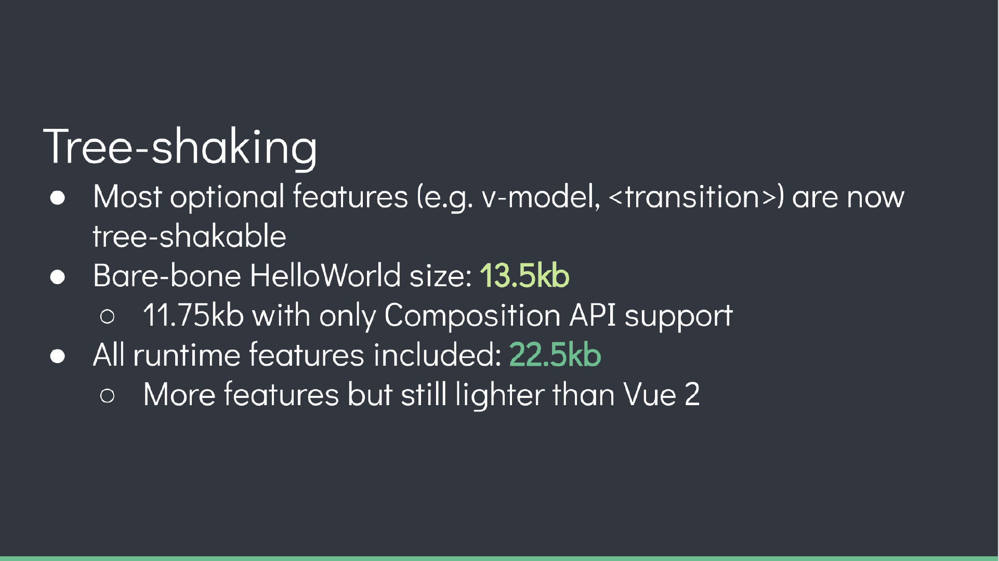
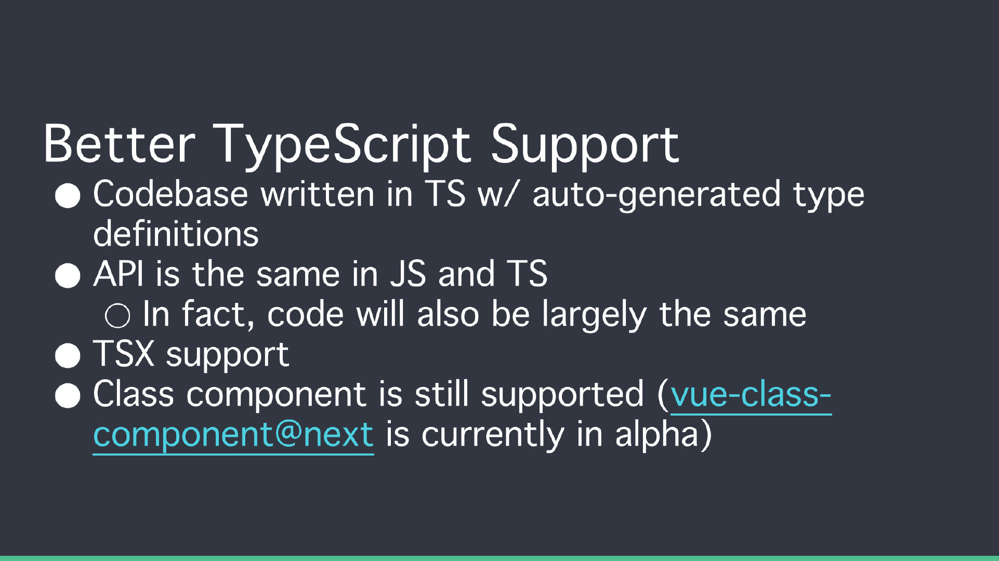
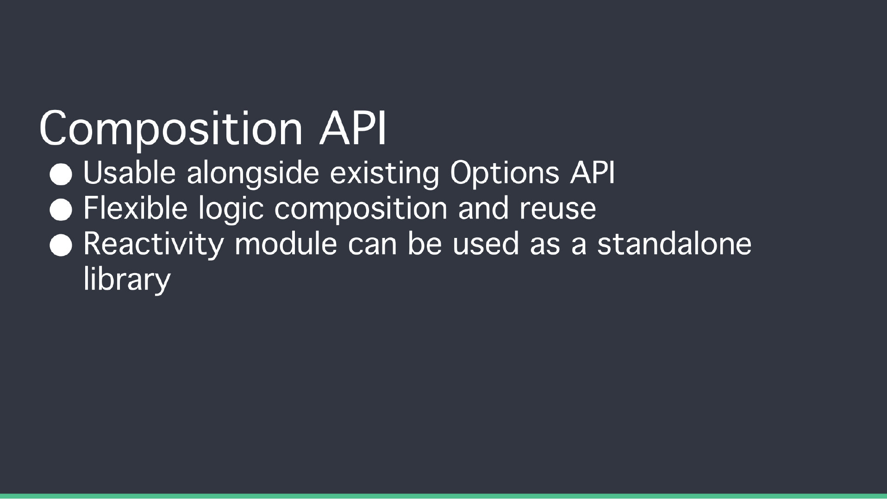
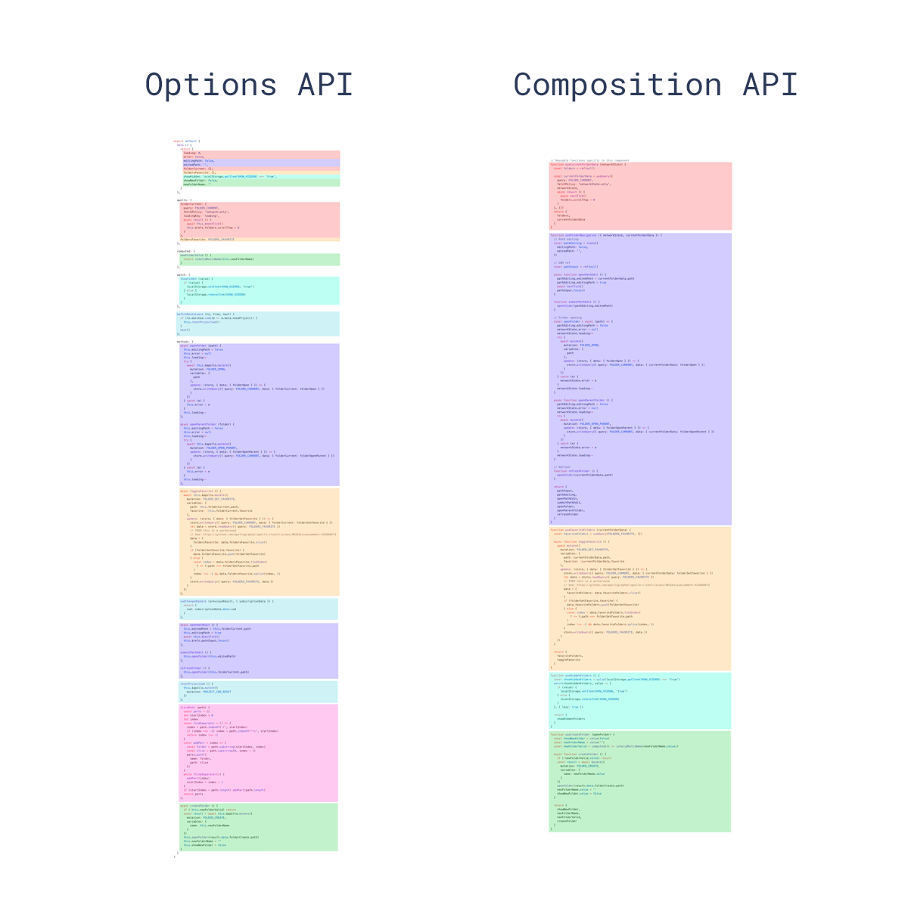
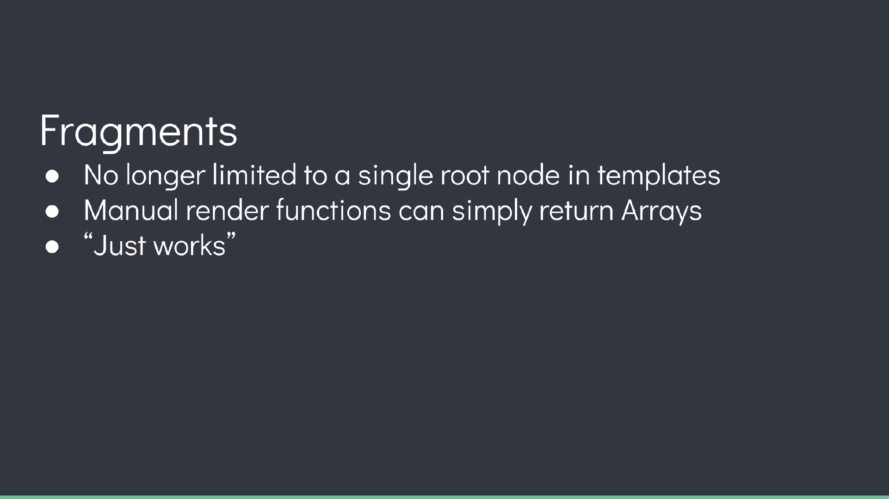
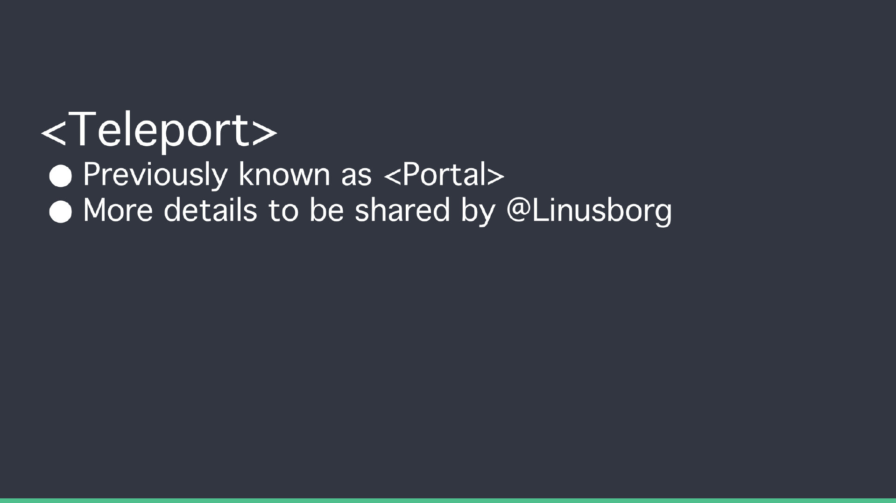

Vue3 相比 Vue2 是一次近乎重写的重大升级，底层从 TypeScript 重新实现，在性能、开发体验和可维护性上都有显著提升。本文将从编译优化、API 设计、内置组件等维度逐一对比 Vue3 与 Vue2 的核心差异，帮助你理解每一项变更背后的设计动机以及它带来的实际收益。

## Performance




Vue3 在整体性能上较 Vue2 有了质的飞跃，官方 benchmark 显示渲染速度提升约 33%~55%，内存占用减少约 50%。这得益于底层使用 TypeScript 重写，使得代码结构更利于编译器做静态分析和运行时优化。同时 Vue3 重写了虚拟 DOM 的实现，引入了更高效的 diff 策略和编译期提示，大幅减少了运行时的无谓计算。

## diff 算法的优化

vue2 中的虚拟 dom 是全量的对比（每个节点不论写死的还是动态的都会一层一层比较，这就浪费了大部分事件在对比静态节点上）

vue3 新增了静态标记（patchflag）与上次虚拟节点对比时，只对比带有 patch flag 的节点（动态数据所在的节点）；可通过 flag 信息得知当前节点要对比的具体内容。

具体来说，Vue3 编译器在生成渲染函数时会对动态节点打上 PatchFlag 标记，例如 `TEXT` 表示只含动态文本、`CLASS` 表示只含动态类名、`PROPS` 表示含动态属性等。diff 时跳过所有无标记的静态节点，有标记的节点也只检查标记指定的部分，而非整个 vnode。这种"精准 diff"将模板规模与 diff 开销从线性关系变为只与动态节点数量相关，模板越大、静态内容越多，收益越明显。

## hoistStatic 静态提升

vue2无论元素是否参与更新，每次都会重新创建然后再渲染。
vue3对于不参与更新的元素，会做静态提升，只会被创建一次，在渲染时直接复用即可。

静态提升的本质是将渲染函数中不会变化的节点提取到函数外部，使其只执行一次创建。例如一个包含纯静态 `<div>` 的模板，Vue2 每次渲染都会重新创建该 vnode，而 Vue3 会将其提升为模块级常量，所有渲染共享同一个引用。对于大量静态内容的模板（如长列表的表头、布局框架），这既减少了 GC 压力，也降低了每次渲染的创建开销。此外，被提升的静态节点还会被进一步标记为 `HOISTED`，在 diff 阶段直接跳过。

## 更高效的组件初始化

Vue2组件必须有一个跟节点
```vue
<template>
<div>1</div>
<div>2</div>
</template>
```

Vue2 要求每个组件模板必须有唯一的根节点，当需要渲染多个同级元素时，开发者不得不包裹一层额外的 `<div>`，这不仅产生无意义的 DOM 层级，还可能影响 CSS 布局和语义结构。Vue3 通过 Fragment 支持，允许组件返回多个根节点，消除了这一限制。

## cacheHandlers 事件侦听器缓存

vue2.x中，绑定事件每次触发都要重新生成全新的function去更新，cacheHandlers 是Vue3中提供的事件缓存对象，当 cacheHandlers 开启，会自动生成一个内联函数，同时生成一个静态节点。当事件再次触发时，只需从缓存中调用即可，无需再次更新。
默认情况下onClick会被视为动态绑定，所以每次都会追踪它的变化，但是同一个函数没必要追踪变化，直接缓存起来复用即可。

在 Vue2 中，模板里的 `@click="handler"` 每次渲染都会生成新的函数引用，导致子组件认为 prop 变化而触发不必要的更新。Vue3 编译器会自动识别内联事件处理器并将其缓存，使其在多次渲染中保持引用稳定。这意味着即使父组件重新渲染，子组件也不会因为事件回调变化而重新执行，配合 patch flag 可以将事件绑定的 diff 开销降到最低。

## Tree Shaking


Vue 3.0 中没有被用到的模块可以不被打包到编译后的文件中，被 TreeShake 掉。当只有一个HelloWorld的时候 Vue3打包后 13.5kb。所有的组件全部加载进来时是 22.5kb

Tree Shaking 的前提是代码基于 ES Module 的静态导入/导出结构，打包工具（如 Rollup、Webpack）可以在编译阶段分析出哪些导出从未被引用并将其移除。Vue3 将整个框架拆分为细粒度的模块导出，例如 `v-model`、`<Transition>`、`<KeepAlive>` 等功能均为独立模块，未使用时不会进入最终产物。对比 Vue2 将所有功能打包在一个不可拆分的运行时中，Vue3 的按需引入使项目体积大幅缩减——一个仅渲染文本的 HelloWorld 应用打包后仅约 13.5kb，而 Vue2 同等场景约为 23kb。

## 更好的ts支持



Vue2 本身使用 JavaScript 编写，对 TypeScript 的支持依赖 `vue-class-component` 等第三方装饰器方案，类型推导不够完善，`this` 上属性的类型经常丢失。Vue3 从底层使用 TypeScript 重写，所有 API 都提供了完整的类型声明，`defineComponent`、`ref`、`computed`、`watch` 等均能获得精确的类型推导。此外，Volar（现 Vue Official Extensions）为 `<script setup>` 提供了模板级类型检查，使得 prop 类型、事件类型、模板引用等都能在编辑器中得到完整的类型提示和错误检查。

## Composition API




Options API 按选项类型组织代码（data 放数据、methods 放方法、computed 放计算属性），同一个功能的逻辑被分散在不同选项中，组件越大越难维护。Composition API 允许按功能/关注点组织代码，相关逻辑集中在同一个 `setup` 函数或组合函数中，不仅提升了可读性，也让逻辑复用从 Vue2 的 mixin（存在命名冲突和来源不透明问题）进化为显式导入的组合函数。`<script setup>` 语法糖进一步简化了写法，让 Composition API 的使用体验更加简洁。

## Fragment


类似于react的<></>

Fragment 让组件模板不再受限于单一根节点，多个根元素会被编译为一个 Fragment 类型的 vnode，在 DOM 中直接渲染为兄弟节点，不产生额外的包裹元素。这对设计组件库特别有用：按钮组件可以直接渲染 `<button>` 而无需套一层 `<div>`，表格行组件可以返回多个 `<td>` 而不破坏 `<table>` 结构，保持语义化和样式的一致性。

## Teleport


类似react的 portal
**但因为Chrome有个提案，会增加一个名为Portal的原生element，为避免命名冲突，改为Teleport**

Teleport 允许将组件的模板内容渲染到 DOM 中的任意位置，而不受组件层级的限制。最常见的场景是模态框（Modal）、通知提示（Toast）、全屏遮罩等——这些 UI 元素在视觉上需要脱离当前组件的容器（如避免被父级的 `overflow: hidden` 裁剪、被父级 `z-index` 遮挡），但逻辑上仍属于当前组件。使用 `<Teleport to="body">` 即可将内容传送到 `<body>` 下，事件和状态依然由原组件管理，完美解决了 DOM 层级与逻辑层级不一致的问题。

## 总结

Vue3 相比 Vue2 的升级是全方位的：编译期优化（PatchFlag、静态提升、事件缓存）让渲染性能大幅提升；Tree Shaking 让框架体积按需缩减；Composition API 从根本上改善了代码组织和逻辑复用；Fragment 和 Teleport 补齐了模板层面的灵活性短板；原生 TypeScript 重写则让开发体验迈上新台阶。对于新项目，Vue3 已是明确的选择；对于存量 Vue2 项目，官方提供了 `@vue/compat` 兼容构建和迁移指南，可以渐进式升级。
