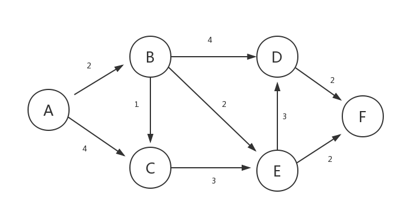

# 狄克斯特拉算法

**Dijkstra算法的前提：**

- 首先，Dijkstra处理的是带正权值的 有权图，那么，就需要一个二维数组（如果空间大用list数组）存储各个点到达( 边)的权值大小。(邻接矩阵或者邻接表存储)
- 其次，还需要一个boolean数组判断那些点已经确定最短长度，那些点没有确定。int数组记录距离(在算法执行过程可能被多次更新)。
- 需要优先队列加入已经确定点的周围点。每次抛出确定最短路径的那个并且确定最短，直到所有点路径确定最短为止。

**简单的概括流程为：**

一般从选定点开始抛入优先队列。（路径一般为0）， boolean数组标记0的位置(最短为0) , 然后0 周围连通的点抛入优先队列中（可能是node类），并把各个点的距离记录到对应数组内(如果小于就更新，大于就不动，初始第一次是无穷肯定会更新)，第一次就结束了
从队列中抛出 距离最近的那个点 B（第一次就是0周围邻居）。这个点距离一定是最近的（所有权值都是正的，点的距离只能越来越长。）标记这个点为 true，并且将这个点的邻居加入队列(下一次确定的最短点在前面未确定和这个点邻居中产生),并更新通过 B点计算各个位置的长度，如果小于则更新！

**Dijkstra 算法是一种贪心算法**

- (1) 找出最便宜的节点，即可在最短时间内前往的节点。
- (2) 对于该节点的邻居，检查是否有前往它们的更短路径，如果有，就更新其开销。
- (3) 重复这个过程，直到对图中的每个节点都这样做了。
- (4) 计算最终路径。



```js
//A B C D E F
let graph = [
  [0, 2, 4, 0, 0, 0], //A  A=>B=2 A=>C=4
  [0, 0, 1, 4, 2, 0], //B  B=>C=1 B=>D=4 B=>E=2
  [0, 0, 0, 0, 3, 0], //C
  [0, 0, 0, 0, 0, 2], //D
  [0, 0, 0, 3, 0, 2], //E
  [0, 0, 0, 0, 0, 0], //F
];
```

```js
// graph 邻接矩阵
// src 起点
const dijkstra = (graph: number[][], src: number) => {
  let dist = []; // 储存当前A顶点到其它各个顶点间的距离
  let visited = []; //储存ABCDEF顶点是否被访问过，以免重复访问，形成环
  let length = graph.length; //储存所有顶点的数量
  let INF = Number.MAX_SAFE_INTEGER; //Number javascript的最大整数  9007199254740991
  //初始化
  for (let i = 0; i < length; i++) {
    dist[i] = INF;
    visited[i] = false;
  }
  //第一个节点
  dist[src] = 0;

  let i = 0;
  while (i < length - 1) {
    //此时对应节点 已经访问设置 true
    visited[src] = true;
    //找到对应节点 的 对应的边集合
    let currentEdges = graph[src];
    //遍历边,更新路径
    for (let i = 0; i < currentEdges.length; i++) {
      if (currentEdges[i] !== 0) {
        //存在边 , 找到最短路径  例如
        //A=>B=>C 最短路径的权
        //为 A=>B 的权(dist[src]) +  B=>C的权(currentEdegs[i]) 和 A=>C(dist[i]) 的权 进行比较
        if (dist[src] + currentEdges[i] < dist[i]) {
          //符合上面条件 更新dist[i] 保证dist[i]是每次探路的最短路径
          dist[i] = currentEdges[i] + dist[src];
        }
      }
    }
    //迪杰斯特拉的核心算法 , 找到最短路径 重新探路.
    //选择最短路径
    let min = INF;
    let minIndex = -2;
    for (let i = 0; i < dist.length; i++) {
      if (!visited[i] && dist[i] < min) {
        min = dist[i];
        minIndex = i;
      }
    }

    //进入下一次循环
    src = minIndex;
    i++;
  }
  return dist;
};
```

# 参考

- <https://zhuanlan.zhihu.com/p/114203860>
