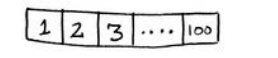
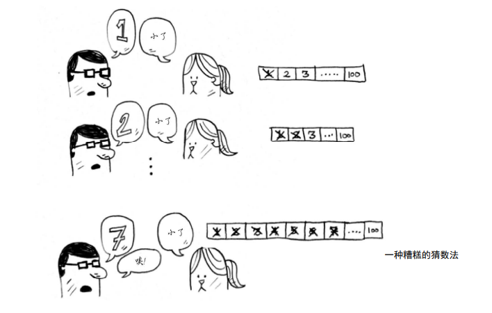
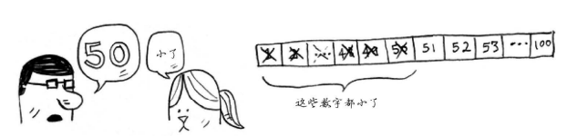
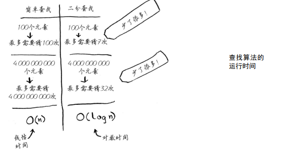

**仅当列表是有序的时候，二分查找才管用**

# 工作原理

我随便想一个 1 ～ 100 的数字。
**糟糕的算法**
  

**更佳的查找方式**
  
  

  

```js
const binary_search = (list, aim) => {
  let low = 0;
  let hight = list.length - 1;
  let mid = 0;
  while (low < hight) {
    mid = parseInt((low + hight) / 2);
    guess = list[mid];
    if (guess == aim) {
      return mid;
    } else if (guess > aim) {
      high = mid - 1;
    } else {
      low = mid + 1;
    }
  }
  return null;
};
// 运行时间 log2(n)
```
