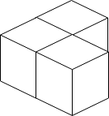
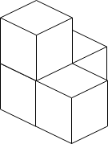
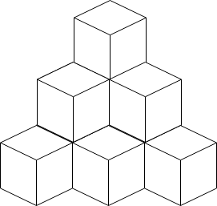

**仅当列表是有序的时候，二分查找才管用**

找到列表的中间值，如果中间值大于查找值，则往数组的左边继续查找，如果小于查找值这往右边继续查找。

```js
const binary_search = (list, aim) => {
  let low = 0;
  let hight = list.length - 1;
  let mid = 0;
  let guess;
  while (low <= hight) {
    mid = parseInt((low + hight) / 2);
    guess = list[mid];
    if (guess == aim) {
      return mid;
    } else if (guess > aim) {
      high = mid - 1;
    } else {
      low = mid + 1;
    }
  }
  return null;
};
// 运行时间 log2(n)
```

# [两个数组的交集](https://leetcode.cn/problems/intersection-of-two-arrays/description/?envType=problem-list-v2&envId=binary-search)

给定两个数组 nums1 和 nums2 ，返回它们的交集。输出结果中的每个元素一定是 唯一 的。我们可以不考虑输出结果的顺序 。

```ts
function intersection(nums1: number[], nums2: number[]): number[] {
      // 数组去重 
        let set1: Set<number> = new Set<number>();
        let set2: Set<number> = new Set<number>();
        for (let num of nums1) {
            set1.add(num);
        }
        for (let num of nums2) {
            set2.add(num);
        }
        // 获取数组唯一值
        return this.getIntersection(set1, set2);
}
//  set1 要小于set2
//  便利set1，判断set2中是否存在
function getIntersection(set1: Set<number>, set2: Set<number>): number[] {
        if (set1.size > set2.size) {
            return this.getIntersection(set2, set1);
        }
        let intersectionSet: Set<number> = new Set<number>();
        for (let num of set1) {
            if (set2.has(num)) {
                intersectionSet.add(num);
            }
        }
        let intersection: number[] = [];
        let index: number = 0;
        for (let num of intersectionSet) {
            intersection[index++] = num;
        }
        return intersection;
}
```

# [在排序数组中查找元素的第一个和最后一个位置](https://leetcode.cn/problems/find-first-and-last-position-of-element-in-sorted-array/)

给你一个按照非递减顺序排列的整数数组 nums，和一个目标值 target。请你找出给定目标值在数组中的开始位置和结束位置。

如果数组中不存在目标值 target，返回 [-1, -1]。

你必须设计并实现**时间复杂度为 O(log n)** 的算法解决此问题。

```md
输入：nums = [5,7,7,8,8,10], target = 8
输出：[3,4]

输入：nums = [5,7,7,8,8,10], target = 6
输出：[-1,-1]
```

```ts
function searchRange(nums: number[], target: number): number[] {
  let result:number[] = [-1,-1]
  const leftIdx = search(nums,target,true)
  const rightIdx = search(nums,target,false) -1

  if(leftIdx <= rightIdx && rightIdx< nums.length && nums[leftIdx ]=== target  && nums[rightIdx] === target) {
    result = [leftIdx,rightIdx]
  }
  return result
}

// lower = true 获取左边界
// lower = false 获取右边界
function search(nums: number[], target: number, lower: boolean): number {
  let left = 0,
    right = nums.length - 1;
  while (left <= right) {
    const mid = Math.floor((left + right) / 2);
    //  > right 最终会得到比target大的第一位数  右边界
    //  >= right 最终会得到target所在位置，right -1后，即target已经离开匹配范围，左边界
    if (nums[mid] > target || (lower && nums[mid] >= target)) {
      right = mid - 1;
    } else {
      left = mid + 1;
    }
  }
  return right + 1;
}
```

# [寻找两个正序数组的中位数](https://leetcode.cn/problems/median-of-two-sorted-arrays/)

给定两个大小分别为 m 和 n 的正序（从小到大）数组 nums1 和 nums2。请你找出并返回这两个正序数组的 中位数

```md
输入：nums1 = [1,2,2,1], nums2 = [2,2]
输出：[2]

输入：nums1 = [4,9,5], nums2 = [9,4,9,8,4]
输出：[9,4]
解释：[4,9] 也是可通过的

```

```ts
// https://leetcode.cn/problems/median-of-two-sorted-arrays/solutions/258842/xun-zhao-liang-ge-you-xu-shu-zu-de-zhong-wei-s-114/
function  findMedianSortedArrays(nums1: number[], nums2: number[]): number {
        let length1 = nums1.length, length2 = nums2.length;
        let totalLength = length1 + length2;
        // 如果两个数组长度之和为奇数，则中位数是两个数组中的第 (totalLength / 2 + 1) 个数
        if (totalLength % 2 == 1) {
            let midIndex = totalLength / 2;
            let median = this.getKthElement(nums1, nums2, midIndex + 1);
            return median;
        // 如果两个数组长度之和为偶数，则中位数是两个数组中的第 (totalLength / 2) 个数和第 (totalLength / 2 + 1) 个数的平均值
        } else {
            let midIndex1 = totalLength / 2 - 1, midIndex2 = totalLength / 2;
            let median = (this.getKthElement(nums1, nums2, midIndex1 + 1) + this.getKthElement(nums1, nums2, midIndex2 + 1)) / 2.0;
            return median;
        }
}

function  getKthElement(nums1: number[], nums2: number[], k: number): number {
    let length1 = nums1.length, length2 = nums2.length;
    let index1 = 0, index2 = 0;
    let kthElement = 0
    while (true) {
        if (index1 == length1) {
            return nums2[index2 + k - 1];
        }
        if (index2 == length2) {
            return nums1[index1 + k - 1];
        }
        if (k == 1) {
            return Math.min(nums1[index1], nums2[index2]);
        }
        
        let half = k / 2;
        let newIndex1 = Math.min(index1 + half, length1) - 1;
        let newIndex2 = Math.min(index2 + half, length2) - 1;
        let pivot1 = nums1[newIndex1], pivot2 = nums2[newIndex2];
        if (pivot1 <= pivot2) {
            k -= (newIndex1 - index1 + 1);
            index1 = newIndex1 + 1;
        } else {
            k -= (newIndex2 - index2 + 1);
            index2 = newIndex2 + 1;
        }
    }
}
```

# [放置盒子](https://leetcode.cn/problems/building-boxes/description/?envType=problem-list-v2&envId=greedy)

有一个立方体房间，其长度、宽度和高度都等于 n 个单位。请你在房间里放置 n 个盒子，每个盒子都是一个单位边长的立方体。放置规则如下：

你可以把盒子放在地板上的任何地方。
如果盒子 x 需要放置在盒子 y 的顶部，那么盒子 y 竖直的四个侧面都 必须 与另一个盒子或墙相邻。
给你一个整数 n ，返回接触地面的盒子的 最少 可能数量。



```md
输入：n = 3
输出：3
解释：上图是 3 个盒子的摆放位置。
这些盒子放在房间的一角，对应左侧位置。
``



```md
输入：n = 4
输出：3
解释：上图是 3 个盒子的摆放位置。
这些盒子放在房间的一角，对应左侧位置。
```



```md
输入：n = 10
输出：6
解释：上图是 10 个盒子的摆放位置。
这些盒子放在房间的一角，对应后方位置。
```

```ts
// https://leetcode.cn/problems/building-boxes/solutions/2030450/fang-zhi-he-zi-by-leetcode-solution-7ah2/?envType=problem-list-v2&envId=greedy
function minimumBoxes(n: number): number {
    let i = 0, j = 0;
    let low = 1, high = Math.min(n, 100000);
    while (low < high) {
        const mid = Math.floor((low + high) / 2);
        const sum = (mid * (mid + 1) * (mid + 2)) / 6;
        if (sum >= n) {
            high = mid;
        } else {
            low = mid + 1;
        }
    }
    i = low;
    n -= Math.floor((i - 1) * i * (i + 1)) / 6;
    low = 1;
    high = i;
    while (low < high) {
        const mid = Math.floor((low + high) / 2);
        const sum = (mid * (mid + 1)) / 2;
        if (sum >= n) {
            high = mid;
        } else {
            low = mid + 1;
        }
    }
    j = low;
    return Math.floor((i - 1) * i / 2) + j;
}
```
