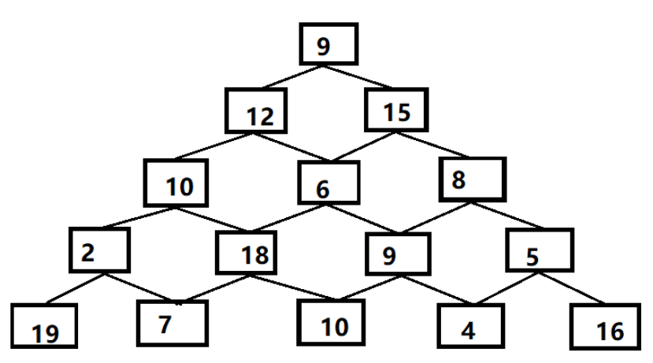

## 拿走最有价值的物品

背包可装 3kg,商品有 3 件

| 音响    | 笔记本电脑 | 吉他    |
| ------- | ---------- | ------- |
| 3000 元 | 2000 元    | 1500 元 |
| 4 kg    | 3 kg       | 1 kg    |

将问题分成一个个网格

| 商品/重量  | 1kg | 2kg | 3kg | 4kg |
| ---------- | --- | --- | --- | --- |
| 吉他       |     |     |     |     |
| 音响       |     |     |     |     |
| 笔记本电脑 |     |     |     |     |

| 商品/重量  | 1kg   | 2kg   | 3kg   | 4kg   |
| ---------- | ----- | ----- | ----- | ----- |
| 吉他       | ¥1500 | ¥1500 | ¥1500 | ¥1500 |
| 音响       |       |       |       |       |
| 笔记本电脑 |       |       |       |       |

| 商品/重量  | 1kg   | 2kg   | 3kg   | 4kg   |
| ---------- | ----- | ----- | ----- | ----- |
| 吉他       | ¥1500 | ¥1500 | ¥1500 | ¥1500 |
| 音响       | ¥1500 | ¥1500 | ¥1500 | ¥3000 |
| 笔记本电脑 |       |       |       |       |

| 商品/重量  | 1kg   | 2kg   | 3kg   | 4kg   |
| ---------- | ----- | ----- | ----- | ----- |
| 吉他       | ¥1500 | ¥1500 | ¥1500 | ¥1500 |
| 音响       | ¥1500 | ¥1500 | ¥1500 | ¥3000 |
| 笔记本电脑 | ¥1500 | ¥1500 | ¥2000 | ¥3500 |

发现第四件商品 iPhone
| 音响 | 笔记本电脑 | 吉他 | iphone|
| ------- | ---------- | ------- |--|
| 3000 元 | 2000 元 | 1500 元 | 2000 元|
| 4 kg | 3 kg | 1 kg | 1kg|

| 商品/重量  | 1kg   | 2kg   | 3kg   | 4kg   |
| ---------- | ----- | ----- | ----- | ----- |
| 吉他       | ¥1500 | ¥1500 | ¥1500 | ¥1500 |
| 音响       | ¥1500 | ¥1500 | ¥1500 | ¥3000 |
| 笔记本电脑 | ¥1500 | ¥1500 | ¥2000 | ¥3500 |
| iphone     | ¥2000 | ¥3500 | ¥3500 | ¥4000 |


## 三角形

来源：https://blog.csdn.net/qq_44398094/article/details/111318003

有一个群岛，共分为若干层，第1层有一个岛屿,第2层有2个岛屿，……，第n层有n个岛屿。每个岛上都有一块宝，其价值是一个正整数（图中圆圈中的整数)。寻宝者只允许从第一层的岛屿进人，从第n层的岛屿退出，不能后退，他能收集他所经过的所有岛屿上的宝贝。但是，从第i层的岛屿进入第i-1层的岛屿时，有且仅有有2条路径。你的任务是:对于给定的群岛和岛上宝贝的价值，计算一个寻宝者行走一趟所能收集宝贝的最大价值。





```js
//自底向上，逐层递推，把较大的数字与上一层相加，把得到的数字存到解的数组中
/*
9
12 5
10 6 8	
2 18	9	5	
19	7	10	4	16
*/

const arr = [
  [9],
  [12, 5],
  [10, 6, 8],
  [2, 18, 9, 5],
  [19, 7, 10, 4, 16],
];

const findMaxValue= (arr)=>{
  // 
  const resultArr = []
  let i = arr.length - 1;
  let j = arr[i-1].length - 1;

}


```


## K 站中转内最便宜的航班

来源：https://leetcode.cn/problems/cheapest-flights-within-k-stops/

有 n 个城市通过一些航班连接。给你一个数组 flights ，其中 flights[i] = [fromi, toi, pricei] ，表示该航班都从城市 fromi 开始，以价格 pricei 抵达 toi。

现在给定所有的城市和航班，以及出发城市 src 和目的地 dst，你的任务是找到出一条最多经过 k 站中转的路线，使得从 src 到 dst 的 价格最便宜 ，并返回该价格。 如果不存在这样的路线，则输出 -1。

```md
输入:
n 三个城市 0->1 100 元,1 -> 2 100 元 ， 0 -> 2 500 元
n = 3, edges = [[0,1,100],[1,2,100],[0,2,500]]
src 出发城市 dst 目的地 k 经过一站
src = 0, dst = 2, k = 1
输出: 200
```


```js
//来源  https://leetcode.cn/problems/cheapest-flights-within-k-stops/solutions/954402/k-zhan-zhong-zhuan-nei-zui-bian-yi-de-ha-abzi/

var findCheapestPrice = function (n, flights, src, dst, k) {
  const INF = 10000 * 101 + 1;

  /*     1   2   3   航班
     1  花费
     2
     3
     城市
  */
  // 最多达成k+1次航班 =》 生成 k+2的数组
  // n 个城市
  // f => 一个二维数组 城市和航班次数
  const f = new Array(k + 2).fill(0).map(() => new Array(n).fill(INF));
  //0城市 话费为0 
  f[0][src] = 0;
  for (let t = 1; t <= k + 1; ++t) {
    for (const flight of flights) {
      const j = flight[0],
        i = flight[1],
        cost = flight[2];
        // t 航班 i 城市 =  话费
      f[t][i] = Math.min(f[t][i], f[t - 1][j] + cost);
    }
  }
  let ans = INF;
  // 遍历航班次数 筛选最小话费
  for (let t = 1; t <= k + 1; ++t) {
    ans = Math.min(ans, f[t][dst]);
  }
  return ans == INF ? -1 : ans;
};
```
