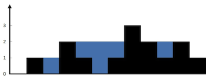

# 拿走最有价值的物品

背包可装 3kg,商品有 3 件

| 音响    | 笔记本电脑 | 吉他    |
| ------- | ---------- | ------- |
| 3000 元 | 2000 元    | 1500 元 |
| 4 kg    | 3 kg       | 1 kg    |

将问题分成一个个网格

| 商品/重量  | 1kg | 2kg | 3kg | 4kg |
| ---------- | --- | --- | --- | --- |
| 吉他       |     |     |     |     |
| 音响       |     |     |     |     |
| 笔记本电脑 |     |     |     |     |

| 商品/重量  | 1kg   | 2kg   | 3kg   | 4kg   |
| ---------- | ----- | ----- | ----- | ----- |
| 吉他       | ¥1500 | ¥1500 | ¥1500 | ¥1500 |
| 音响       |       |       |       |       |
| 笔记本电脑 |       |       |       |       |

| 商品/重量  | 1kg   | 2kg   | 3kg   | 4kg   |
| ---------- | ----- | ----- | ----- | ----- |
| 吉他       | ¥1500 | ¥1500 | ¥1500 | ¥1500 |
| 音响       | ¥1500 | ¥1500 | ¥1500 | ¥3000 |
| 笔记本电脑 |       |       |       |       |

| 商品/重量  | 1kg   | 2kg   | 3kg   | 4kg   |
| ---------- | ----- | ----- | ----- | ----- |
| 吉他       | ¥1500 | ¥1500 | ¥1500 | ¥1500 |
| 音响       | ¥1500 | ¥1500 | ¥1500 | ¥3000 |
| 笔记本电脑 | ¥1500 | ¥1500 | ¥2000 | ¥3500 |

发现第四件商品 iPhone

| 音响 | 笔记本电脑 | 吉他 | iphone|
| ------- | ---------- | ------- |--|
| 3000 元 | 2000 元 | 1500 元 | 2000 元|
| 4 kg | 3 kg | 1 kg | 1kg|

| 商品/重量  | 1kg   | 2kg   | 3kg   | 4kg   |
| ---------- | ----- | ----- | ----- | ----- |
| 吉他       | ¥1500 | ¥1500 | ¥1500 | ¥1500 |
| 音响       | ¥1500 | ¥1500 | ¥1500 | ¥3000 |
| 笔记本电脑 | ¥1500 | ¥1500 | ¥2000 | ¥3500 |
| iphone     | ¥2000 | ¥3500 | ¥3500 | ¥4000 |

# [爬楼梯](https://leetcode.cn/problems/climbing-stairs/description/?envType=problem-list-v2&envId=dynamic-programming)

假设你正在爬楼梯。需要 n 阶你才能到达楼顶。

每次你可以爬 1 或 2 个台阶。你有多少种不同的方法可以爬到楼顶呢？

```md
输入：n = 2
输出：2
解释：有两种方法可以爬到楼顶。
1. 1 阶 + 1 阶
2. 2 阶

输入：n = 3
输出：3
解释：有三种方法可以爬到楼顶。
1. 1 阶 + 1 阶 + 1 阶
2. 1 阶 + 2 阶
3. 2 阶 + 1 阶

```

目的地1：青蛙在只剩一个台阶到达终点
目的地2：青蛙在只剩两个台阶到达终点
到达 目的地1 的路线数，我们记做 f(n−1)；
到达 目的地2 的路线数，我们记做 f(n−2)；
因为两个目的地不同，所以 f(n−1) 绝对不包含 f(n−2)，即不重复。（一开始我就是这里没想通）

接下来分析, 从上面两个目的地 到达 终点 的路线数:

目的地1 到达 终点 的路线数，只能有一个选择，即跳一个台阶，所以只能是 f(n−1)∗1 ，注意不是+1，这里我们求的是路线数。

目的地2 到达 终点 的路线数，这里有两个选择，即跳一个一个台阶跳 或 一次跳两个台阶，但是我们发现如果选择一个一个台阶跳，会经过上面的目的地1，即重复路线，所以我们也只能有一个选择，即一次跳两个台阶，这时，目的地2 到达 终点 的路线数是 f(n−2)∗1，注意不是+1，这里我们求的是路线数。

最后：由于一次跳一个台阶或者两个台阶的限制，所以达到终点的前一步，只能可能是从上面两个目的地出发。即得出到达终点的路线数为f(n)=f(n−1)+f(n−2)。

发散一下：
明白上面的逻辑之后，你就可以知道，如果这只青蛙一次可以跳1个台阶 或 2个台阶 或 3个台阶的时候，公式怎么写了，如下： f(n)=f(n−1)+f(n−2)+f(n−3)

```ts
function climbStairs(n: number): number {
    let p: number = 0, q: number = 0, r: number = 1;
    // 只有两种上楼方式，从前一层再爬一楼和从前二层再爬两楼。
    // 可以推出 f(n) = f(n -1) + f(n -2)
    for (let i = 1; i <= n; ++i) {
        // x -2
        p = q;
        // x - 1 
        q = r; 
        // 第 x 级台阶的方案数是爬到第 x−1 级台阶的方案数和爬到第 x−2 级台阶的方案数的和。
        r = p + q;
    }
    return r;
};
```

# [K 站中转内最便宜的航班](https://leetcode.cn/problems/cheapest-flights-within-k-stops/)

有 n 个城市通过一些航班连接。给你一个数组 flights ，其中 flights[i] = [fromi, toi, pricei] ，表示该航班都从城市 fromi 开始，以价格 pricei 抵达 toi。

现在给定所有的城市和航班，以及出发城市 src 和目的地 dst，你的任务是找到出一条最多经过 k 站中转的路线，使得从 src 到 dst 的 价格最便宜 ，并返回该价格。 如果不存在这样的路线，则输出 -1。

```md
输入:
n 三个城市 0->1 100 元,1 -> 2 100 元 ， 0 -> 2 500 元
n = 3, edges = [[0,1,100],[1,2,100],[0,2,500]]
src 出发城市 dst 目的地 k 经过一站
src = 0, dst = 2, k = 1
输出: 200
```


```js
//来源  https://leetcode.cn/problems/cheapest-flights-within-k-stops/solutions/954402/k-zhan-zhong-zhuan-nei-zui-bian-yi-de-ha-abzi/

var findCheapestPrice = function (n, flights, src, dst, k) {
  const INF = 10000 * 101 + 1;

  /*     1   2   3   航班
     1  花费
     2
     3
     城市
  */
  // 最多达成k+1次航班 =》 生成 k+2的数组
  // n 个城市
  // f => 一个二维数组 城市和航班次数
  const f = new Array(k + 2).fill(0).map(() => new Array(n).fill(INF));
  //0城市 话费为0 
  f[0][src] = 0;
  for (let t = 1; t <= k + 1; ++t) {
    for (const flight of flights) {
      const j = flight[0],
        i = flight[1],
        cost = flight[2];
        // t 航班 i 城市 =  话费
      f[t][i] = Math.min(f[t][i], f[t - 1][j] + cost);
    }
  }
  let ans = INF;
  // 遍历航班次数 筛选最小话费
  for (let t = 1; t <= k + 1; ++t) {
    ans = Math.min(ans, f[t][dst]);
  }
  return ans == INF ? -1 : ans;
};
```

# [接雨水](https://leetcode.cn/problems/trapping-rain-water/description/?envType=problem-list-v2&envId=dynamic-programming)

给定 n 个非负整数表示每个宽度为 1 的柱子的高度图，计算按此排列的柱子，下雨之后能接多少雨水。




```md
输入：height = [0,1,0,2,1,0,1,3,2,1,2,1]
输出：6
解释：上面是由数组 [0,1,0,2,1,0,1,3,2,1,2,1] 表示的高度图，在这种情况下，可以接 6 个单位的雨水（蓝色部分表示雨水）。 

输入：height = [4,2,0,3,2,5]
输出：9
```

```ts
function trap(height: number[]): number {
    const n = height.length;
    if (n == 0) {
        return 0;
    }

    const leftMax = new Array(n).fill(0);
    leftMax[0] = height[0];
    for (let i = 1; i < n; ++i) {
        leftMax[i] = Math.max(leftMax[i - 1], height[i]);
    }

    const rightMax = new Array(n).fill(0);
    rightMax[n - 1] = height[n - 1];
    for (let i = n - 2; i >= 0; --i) {
        rightMax[i] = Math.max(rightMax[i + 1], height[i]);
    }

    let ans = 0;
    for (let i = 0; i < n; ++i) {
        ans += Math.min(leftMax[i], rightMax[i]) - height[i];
    }
    return ans;
}
```
