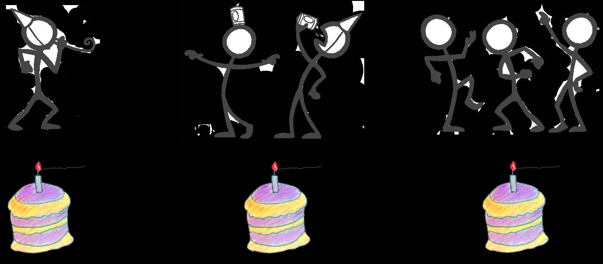
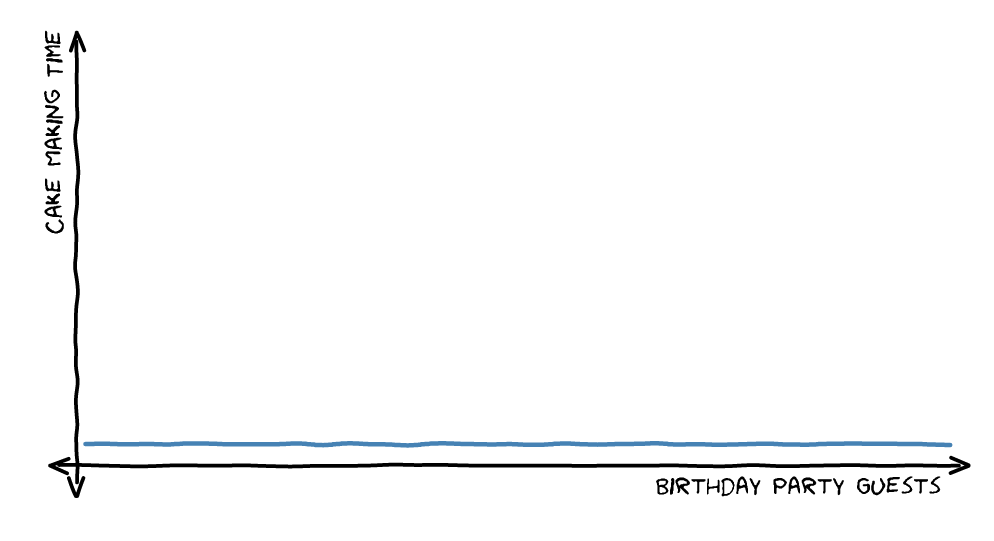
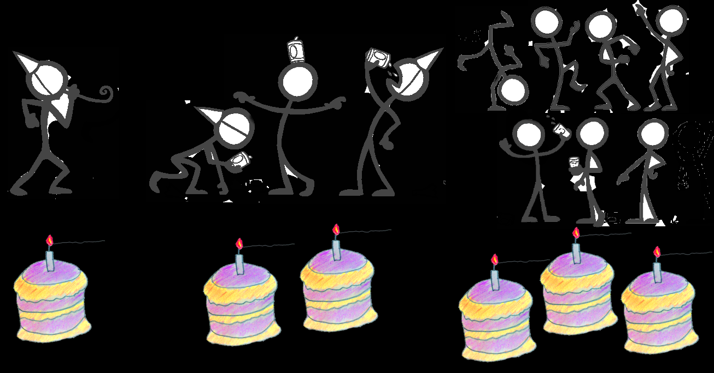
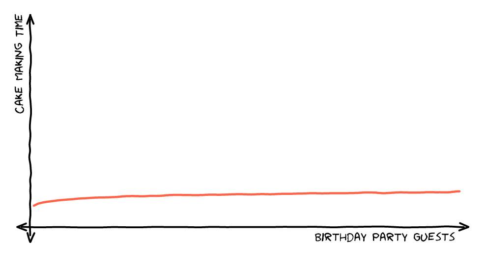
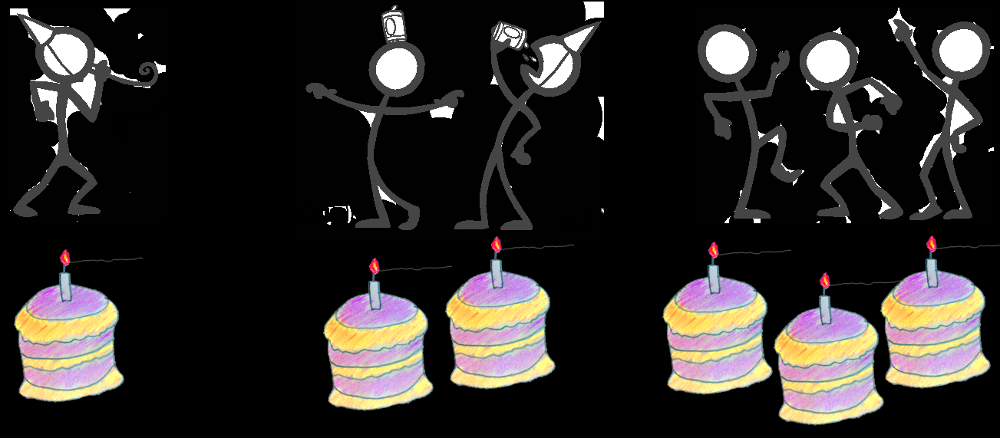
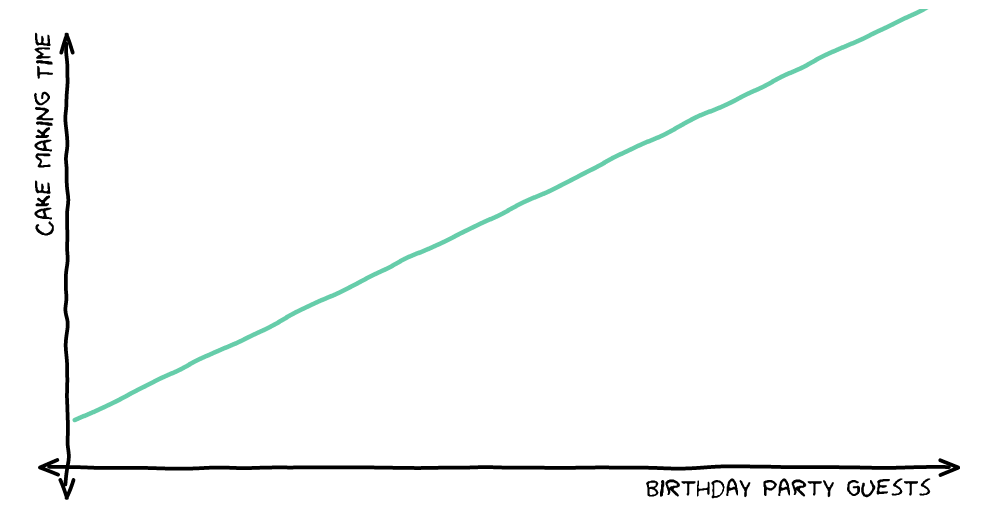
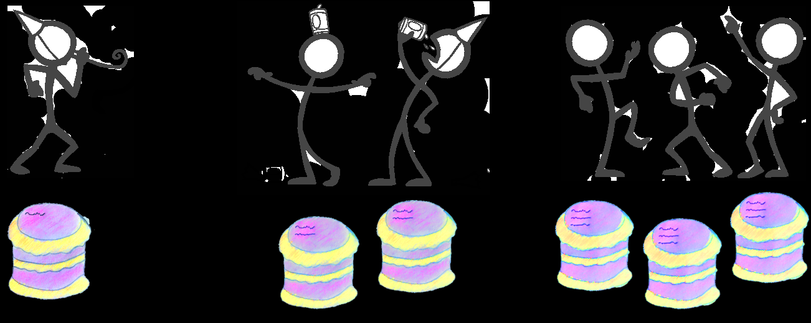
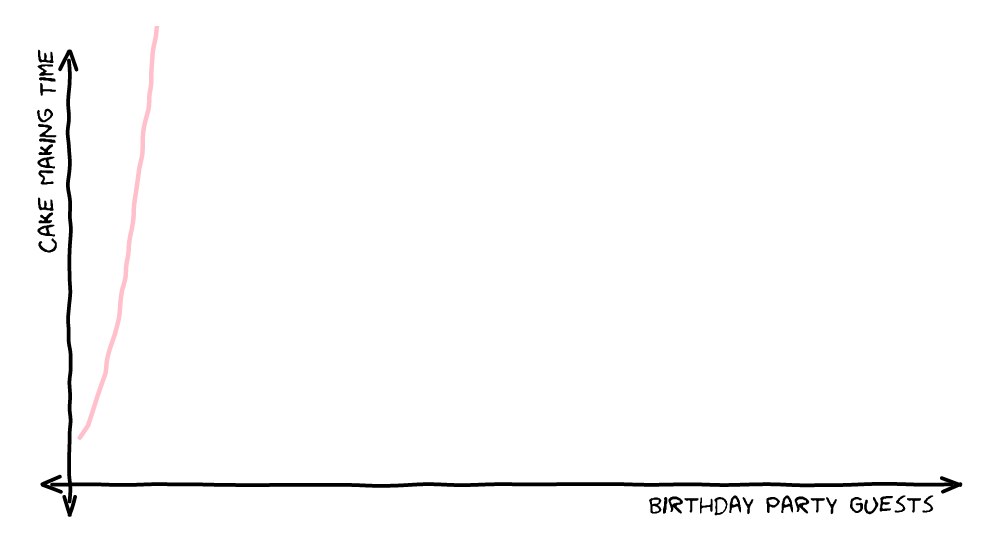
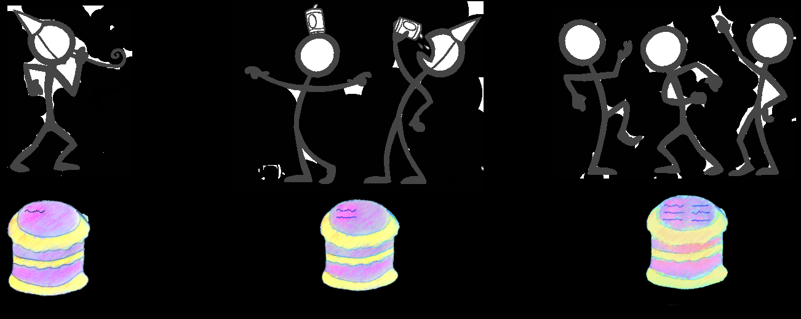
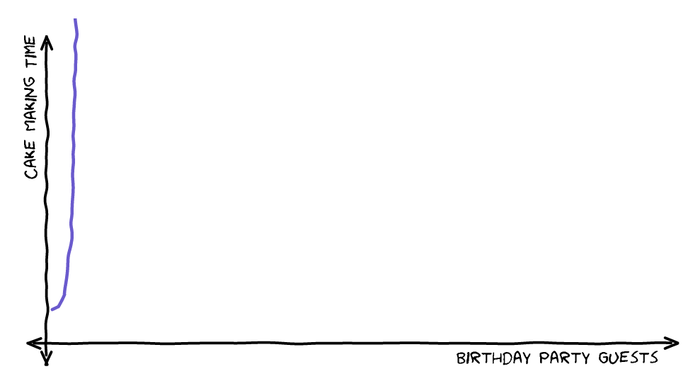

**大 O 表示法是一种特殊的表示法，指出了算法的速度有多快。**
将算法的所有步骤转换为代数项，然后排除不会对问题的整体复杂度产生较大影响的较低阶常数和系数

## 时间复杂度

用于评估执行程序所消耗的时间，可以估算出程序对处理器的使用程度。
时间复杂度的公式是：`T(n) = O( f(n) )`，其中f(n) 表示每行代码执行次数之和，而 O 表示正比例关系，这个公式的全称是：算法的渐进时间复杂度。

|常见算法| 时间复杂度|
|----|----|
|简单查找|O(n)|
|二分查找|O($log_{}{n}$)|
|快速排序|O($nlog_{}{n}$)|
|选择排序|O($n^{2}$)|

## 空间复杂度

用于评估执行程序所占用的内存空间，可以估算出程序对计算机内存的使用程度。

## O(1) - 常数时间

对于常数时间，不管多少人参加生日聚会，都只需要做一个蛋糕。因此制作蛋糕的时间是一个常量。

一个 O(1) 操作的例子是通过 index 访问数组的元素。从 10 个元素的数组检索一个元素和从 100 万个元素的数组里检索一个元素一样快。

## O(log n) - 对数时间

第一个到的人独享蛋糕，接下来到的两个人分一个蛋糕，在接着到的四个人分一个蛋糕，以此类推。

因此一个人聚会需要一个蛋糕。两人或者三人聚会需要两个蛋糕。4 - 7人聚会需要 3 个蛋糕。8 - 15 人聚会需要四个蛋糕。 ‘n’ 个人聚会需要 log_2_(n) 个蛋糕。

一个 O(log n) 操作的例子是有序数组的二分查找。

二分查找算法找到数组中间的元素，和要找的元素进行对比。因为数组是有序的，所以可以知道要找的值在数组的哪一半里面。

然后再一半的数组里面重复这一过程。对于 16 个元素的数组，第一次迭代将搜索范围缩小到 8，然后依次是 4、2、1。最多 4 次，也就是 log_2_(16) 次，迭代结束。

## O(n) - 线性时间

每个参会的人都有一个蛋糕。如果 ‘n’ 个人参会需要准备 ‘n’ 个蛋糕，因此花费的时间和参会的人数相关。

一个 O(n) 操作的例子是用最粗暴的方式在数组里遍历找到指定元素。在 10 个元素的数组里，最坏情况下需要找十次才能找到指定元素。在 100 万个元素的数组里，可能需要找 100 万次。

## O(n^2) - 平方时间

一人参会需要 1 个蛋糕和 1 个签名。两人参会需要 2 个蛋糕，每个蛋糕都需要 2 个名字（一共 4 个名字）。三人参会需要 3个蛋糕，每个蛋糕都有 3 个名字，一共 9 个名字。

O(n^2) 操作的一个例子是暴力搜索数组中的重复项。遍历数组中的所有元素，对于每一个元素，在遍历一遍数组看是否有和其相同的元素。
对于 10 个元素的数组，外部需要循环 10 次，每一次外部循环都需要内部循环 10 次，总共是 100 次。对于 100 万个元素的数组，需要 10000 亿次。

## O(n!) - 阶乘时间

阶乘时间，所有参会的人进行法式滚球比赛，赢的人拿走蛋糕。

还存在一个小问题，先投球的玩家会更劣势。为了解决这个问题，同时进行多场比赛，每组都会先手一次。所有比赛的排列都会写在蛋糕的奶油上。

这意味着两人参会会有两场比赛，每一个选手都会依次先手。三人参会会有 6 场比赛（假设选手为安娜 A、布莱恩 B 和克里斯 C，那么排列会是 ABC、ACB、BAC、BCA、CAB、CBA）。

n! 的计算是从 n 到 1 的所有数相乘， “n *(n - 1)* (n - 2) …… *2* 1”。对于两人聚会就是 2 *1 也就是 2。对于三人聚会就是 3* 2 * 1，也就是 6。

# 参考

- [算法图解](https://book.douban.com/subject/26616292/)
- [大O表示法](https://www.freecodecamp.org/chinese/news/big-o-notation/)
