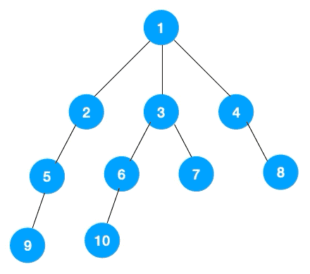

深度优先遍历(Depth First Search, 简称 DFS) 与广度优先遍历(Breath First Search)是图论中两种非常重要的算法，生产上广泛用于拓扑排序，寻路(走迷宫)，搜索引擎，爬虫等

# 深度优先遍历

主要思路是从图中一个未访问的顶点 V 开始，沿着一条路一直走到底，然后从这条路尽头的节点回退到上一个节点，再从另一条路开始走到底...，不断递归重复此过程，直到所有的顶点都遍历完成，它的特点是不撞南墙不回头，先走完一条路，再换一条路继续走。


- 我们从根节点 1 开始遍历，它相邻的节点有 2，3，4，先遍历节点 2，再遍历 2 的子节点 5，然后再遍历 5 的子节点 9。


- 此时就从 9 回退到上一个节点 5，看下节点 5 是否还有除 9 以外的节点，没有继续回退到 2，2 也没有除 5 以外的节点，回退到 1，1 有除 2 以外的节点 3，所以从节点 3 开始进行深度优先遍历


- 同理从 10 开始往上回溯到 6, 6 没有除 10 以外的子节点，再往上回溯，发现 3 有除 6 以外的子点 7，所以此时会遍历 7。


- 从 7 往上回溯到 3， 1，发现 1 还有节点 4 未遍历，所以此时沿着 4， 8 进行遍历,这样就遍历完成了。


# 广度优先遍历

广度优先遍历，指的是从图的一个未遍历的节点出发，先遍历这个节点的相邻节点，再依次遍历每个相邻节点的相邻节点。



# [二叉树的最小深度](https://leetcode.cn/problems/minimum-depth-of-binary-tree/description/?envType=problem-list-v2&envId=depth-first-search)

给定一个二叉树，找出其最小深度。

最小深度是从根节点到最近叶子节点的最短路径上的节点数量。

说明：叶子节点是指没有子节点的节点。


```md

输入：root = [3,9,20,null,null,15,7]
输出：2

输入：root = [2,null,3,null,4,null,5,null,6]
输出：5

```

```ts
// 深度
function minDepth(root: TreeNode | null): number {
  if (!root) return 0
  if (!root.left && !root.right) return 1
  let min = Number.MAX_SAFE_INTEGER
  if (root.left) {
    min = Math.min(minDepth(root.left), min)
  }
  if (root.right) {
    min = Math.min(minDepth(root.right), min)
  }
  return min + 1
}

// 广度
function minDepth(root: TreeNode | null): number {
  if(!root) return 0
  const queue = [root]
  let depth = 1
  while(queue.length) {
    const len = queue.length
    for(let i = 0; i < len; i++) {
      const node = queue.shift()
      if(!node.left && !node.right) return depth
      if(node.left) queue.push(node.left)
      if(node.right) queue.push(node.right)
    }
    depth++
  }
  return depth
}

```

# [岛屿数量](https://leetcode.cn/problems/number-of-islands/description/?envType=problem-list-v2&envId=depth-first-search)

给你一个由 '1'（陆地）和 '0'（水）组成的的二维网格，请你计算网格中岛屿的数量。

岛屿总是被水包围，并且每座岛屿只能由水平方向和/或竖直方向上相邻的陆地连接形成。

此外，你可以假设该网格的四条边均被水包围。

```md

输入：grid = [
  ["1","1","1","1","0"],
  ["1","1","0","1","0"],
  ["1","1","0","0","0"],
  ["0","0","0","0","0"]
]
输出：1

输入：grid = [
  ["1","1","0","0","0"],
  ["1","1","0","0","0"],
  ["0","0","1","0","0"],
  ["0","0","0","1","1"]
]
输出：3
```

```ts
// DPS

function dfs(grid: string[][], r: number, c: number): void {
   const nr = grid.length;
   const nc = grid[0].lengt
   if (r < 0 || c < 0 || r >= nr || c >= nc || grid[r][c] === '0') {
       return;
  
   grid[r][c] = '0';
   this.dfs(grid, r - 1, c);
   this.dfs(grid, r + 1, c);
   this.dfs(grid, r, c - 1);
   this.dfs(grid, r, c + 1);
}
function numIslands(grid: string[][]): number {
        if (grid == null || grid.length === 0) {
            return 0;
        }

        const nr = grid.length;
        const nc = grid[0].length;
        let num_islands = 0;
        for (let r = 0; r < nr; ++r) {
            for (let c = 0; c < nc; ++c) {
                if (grid[r][c] === '1') {
                    ++num_islands;
                    this.dfs(grid, r, c);
                }
            }
        }

        return num_islands;
}

// BPS
function numIslands(grid: string[][]): number {
    if (grid == null || grid.length == 0) {
        return 0;
    
    let nr = grid.length;
    let nc = grid[0].length;
    let num_islands = 0
    for (let r = 0; r < nr; ++r) {
        for (let c = 0; c < nc; ++c) {
            if (grid[r][c] == '1') {
                ++num_islands;
                grid[r][c] = '0';
                let neighbors = new LinkedList<number>();
                neighbors.add(r * nc + c);
                while (!neighbors.isEmpty()) {
                    let id = neighbors.remove();
                    let row = Math.floor(id / nc);
                    let col = id % nc;
                    if (row - 1 >= 0 && grid[row-1][col] == '1') {
                        neighbors.add((row-1) * nc + col);
                        grid[row-1][col] = '0';
                    }
                    if (row + 1 < nr && grid[row+1][col] == '1') {
                        neighbors.add((row+1) * nc + col);
                        grid[row+1][col] = '0';
                    }
                    if (col - 1 >= 0 && grid[row][col-1] == '1') {
                        neighbors.add(row * nc + col-1);
                        grid[row][col-1] = '0';
                    }
                    if (col + 1 < nc && grid[row][col+1] == '1') {
                        neighbors.add(row * nc + col+1);
                        grid[row][col+1] = '0';
                    }
                }
            }
        }
    
    return num_islands;
}

```

# [省份数量](https://leetcode.cn/problems/number-of-provinces/description/?envType=problem-list-v2&envId=depth-first-search)

有 n 个城市，其中一些彼此相连，另一些没有相连。如果城市 a 与城市 b 直接相连，且城市 b 与城市 c 直接相连，那么城市 a 与城市 c 间接相连。

省份 是一组直接或间接相连的城市，组内不含其他没有相连的城市。

给你一个 n x n 的矩阵 isConnected ，其中 isConnected[i][j] = 1 表示第 i 个城市和第 j 个城市直接相连，而 isConnected[i][j] = 0 表示二者不直接相连。

返回矩阵中 省份 的数量。


```md
输入：isConnected = [[1,1,0],[1,1,0],[0,0,1]]
输出：2
```


```md
输入：isConnected = [[1,0,0],[0,1,0],[0,0,1]]
输出：3
```

```ts
// DPS
// https://leetcode.cn/problems/number-of-provinces/solutions/549895/sheng-fen-shu-liang-by-leetcode-solution-eyk0/
function findCircleNum(isConnected: number[][]): number {
    const cities = isConnected.length;
    const visited = new Set<number>();
    let provinces = 0;
    for (let i = 0; i < cities; i++) {
        if (!visited.has(i)) {
            dfs(isConnected, visited, cities, i);
            provinces++;
        }
    }
    return provinces;
}

const dfs = (isConnected: number[][], visited: Set<number>, cities: number, i: number) => {
    for (let j = 0; j < cities; j++) {
        if (isConnected[i][j] == 1 && !visited.has(j)) {
            visited.add(j);
            dfs(isConnected, visited, cities, j);
        }
    }
}

// BPS

function findCircleNum(isConnected: number[][]): number {
    const cities = isConnected.length;
    const visited = new Set<number>();
    let provinces = 0;
    const queue = new Array<number>();
    for (let i = 0; i < cities; i++) {
        if (!visited.has(i)) {
            queue.push(i);
            while (queue.length) {
                const j = queue.shift()!;
                visited.add(j);
                for (let k = 0; k < cities; k++) {
                    if (isConnected[j][k] === 1 && !visited.has(k)) {
                        queue.push(k);
                    }
                }
            }
            provinces++;
        }
    }
    return provinces;
}

```

# 参考

- [图文详解两种算法：深度优先遍历（DFS）和广度优先遍历（BFS）](https://www.51cto.com/article/614590.html)
