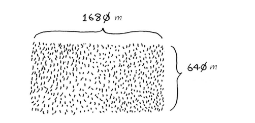
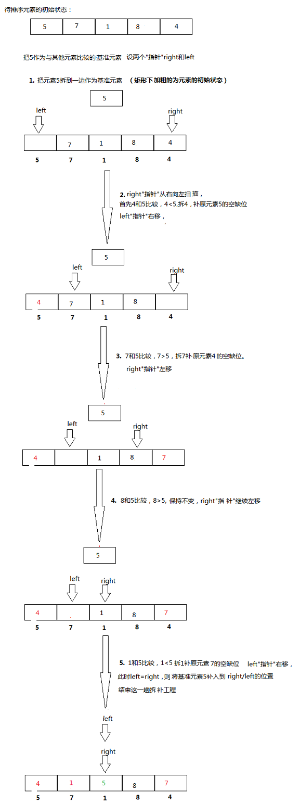

# 分而治之

(1) 找出基线条件，这种条件必须尽可能简单。
(2) 不断将问题分解（或者说缩小规模），直到符合基线条件
将一块 1680 x 640 的图片分成方块，方块要尽可能的大


1. 1680 x 640=> 640x640 + 640x640 + 640x400
2. 640x 400 => 400x 400 + 400x240
3. 400x240 => 240x240 + 240x160
4. 240x160 => 160x 160 + 160 x80
5. 160x80 => 80x80 +80x80
   适用的方块为 80x80

```js
// 计算数组的值
const sum = (arrays, total = 0) => {
  if (arrays.length === 1) return arrays[0] + total;
  total += arrays.pop();
  sum(arrays, total);
};
```

# 快速排序

(1) 选择基准值。
(2) 将数组分成两个子数组：小于基准值的元素和大于基准值的元素。
(3) 对这两个子数组进行快速排序。

有[2,4,3,9,1,6,5]数组
选2作为基准值，挑选比2小的数值组成左侧数组，比2大的组成右侧数组
对挑选出的2个数组，重复上述操作

<a><https://www.cnblogs.com/MOBIN/p/4681369.html/></a>

