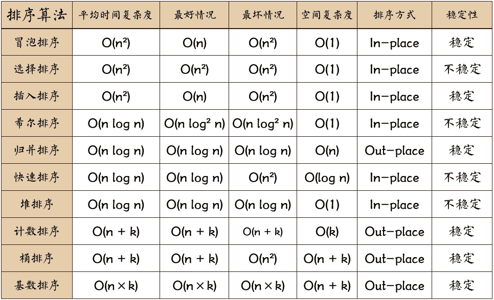

## 冒泡排序

- 比较相邻的元素。如果第一个比第二个大，就交换它们两个；
- 对每一对相邻元素作同样的工作，从开始第一对到结尾的最后一对，这样在最后的元素应该会是最大的数；
- 针对所有的元素重复以上的步骤，除了最后一个；
- 重复步骤 1~3，直到排序完成。

```js
function bubbleSort(oldArr) {
  let arr = oldArr;
  for (let i = 0; i < arr.length - 1; i++) {
    // -i 跟i后面的元素进行比较
    for (let j = 0; j < arr.length - 1 - i; j++) {
      // 相邻元素比较
      if (arr[j] > arr[j + 1]) {
        // 元素交换
        const TEMP = arr[j + 1];
        arr[j + 1] = arr[j];
        arr[j] = TEMP;
      }
    }
  }
  return arr;
}
```

## 选择排序

- 首先在未排序序列中找到最小（大）元素，存放到排序序列的起始位置
- 再从剩余未排序元素中继续寻找最小（大）元素，然后放到已排序序列的末尾
- 以此类推，直到所有元素均排序完毕。

```js
function selectionSort(oldArr) {
  let arr = oldArr;

  let minIndex, temp;

  for (let i = 0; i < arr.length - 1; i++) {
    minIndex = j;
    // 比较后面的元素
    for (let j = i + 1; j < arr.length; j++) {
      if (arr[j] < arr[minIndex]) {
        // 获取最小元素的index
        minIndex = j;
      }
    }
    // 将最小元素移动到已排序的末尾
    temp = arr[i];
    arr[i] = arr[minIndex];
    arr[minIndex] = temp;
  }
  return arr;
}
```

## 插入排序

- 以第一个元素建立排序序列
- 取出下一个元素，在排序好的序列中进行对比排序插入
- 以此类推，直到所有元素均排序完毕。

```js
function insertionSort(oldArr) {
  let arr = oldArr;
  let preIndex, current;
  for (let i = 1; i < arr.length; i++) {
    // 获取序列末尾元素
    preIndex = i - 1;
    current = arr[i];
    // 与末尾元素进行比较  末尾元素大于比较元素 进行后移
    while (preIndex >= 0 && arr[preIndex] > current) {
      arr[preIndex + 1] = arr[preIndex];
      preIndex--;
    }
    // 插入小于的元素前面
    arr[preIndex + 1] = current;
  }
  return arr;
}
```

## 希尔排序

- 先将整个待排序的记录序列分割成为若干子序列分别进行直接插入排序
- 待整个序列中的记录"基本有序"时，再对全体记录进行依次直接插入排序。

| 平均时间复杂度 | 最好情况     | 最坏情况     | 空间复杂度 | 排序方式 | 稳定性 |
| -------------- | ------------ | ------------ | ---------- | -------- | ------ |
| O(nlogn)       | O(nlog^2^ n) | O(nlog^2^ n) | O(1)       | In-place | 不稳定 |

```js
function shellSort(oldArr) {
  let arr = oldArr;
  const len = arr.length;
  //以第gap个元素建立 排序序列 分为若干个子序列进行插入排序
  for (let gap = Math.floor(len / 2); gap > 0; gap = Math.floor(gap / 2)) {
    // 开始插入排序
    for (let i = gap; i < len; i++) {
      let j = i;
      let current = arr[i];
      while (j - gap >= 0 && current < arr[j - gap]) {
        arr[j] = arr[j - gap];
        j = j - gap;
      }
      arr[j] = current;
    }
  }
  return arr;
}
```

## 归并排序

- 先使每个子序列有序，再使子序列段间有序
- 将已有序的子序列合并
  | 平均时间复杂度 | 最好情况 | 最坏情况 | 空间复杂度 | 排序方式 | 稳定性 |
  | -------------- | ----------- | ----------- | ---------- | -------- | ------ |
  | O(nlogn) | O(nlog n) | O(nlog n) | O(n) | In-place | 不稳定 |

```js
function mergeSort(oldArr) {
  let arr = oldArr;
  const len = arr.length;
  if (len < 2) {
    return arr;
  }
  let middle = Math.floor(len / 2),
    left = arr.slice(0, middle),
    right = arr.slice(middle);

  return merge(mergeSort(left), mergeSort(right));
}

function merge(left, right) {
  const result = [];
  while (left.length > 0 && right.length > 0) {
    if (left[0] <= right[0]) {
      result.push(left.shift());
    } else {
      result.push(right.shift());
    }
  }
  while (left.length) {
    result.push(left.shift());
  }
  while (right.length) {
    result.push(right.shift());
  }

  return result;
}
```

## 快速排序

- 从数列中挑出一个元素，称为 “基准”（pivot）
- 把比基准值小的摆放在基准前面，比基准值大的摆在基准的后面
- 对左右两边数组重复上述操作

```js
function quickSort(arr, left, right) {
  let len = arr.length,
    partitionIndex,
    left = typeof left != "number" ? 0 : left,
    right = typeof right != "number" ? len - 1 : right;

  if (left < right) {
    partitionIndex = partition(arr, left, right);
    quickSort(arr, left, partitionIndex - 1);
    quickSort(arr, partitionIndex + 1, right);
  }
  return arr;
}
function partition(arr, left, right) {
  // 基准值
  let pivot = left,
    index = pivot + 1;
  for (let i = index; i <= right; i++) {
    if (arr[i] < arr[pivot]) {
      // 交换位置
      swap(arr, i, index);
      index++;
    }
  }
  swap(arr, pivot, (index = 1));
  return index - 1;
}

function swap(arr, i, j) {
  let temp = arr[i];
  arr[i] = arr[j];
  arr[j] = temp;
}
```

## 堆排序

- 二叉树每个结点的值都大于其左孩子和右孩子结点的值，称之为大根堆
- 首先将待排序的数组构造成一个大根堆，此时，整个数组的最大值就是堆结构的顶端
- 将顶端的数与末尾的数交换，此时，末尾的数为最大值，剩余待排序数组个数为 n-1
- 将剩余的 n-1 个数再构造成大根堆，再将顶端数与 n-1 位置的数交换，如此反复执行，便能得到有序数组

```js
function heapSort(arr) {
  heapInsert(arr);
  let size = arr.length;
  while (size > 1) {
    swap(arr, 0, size - 1);
    size--;
    heapify(arr, 0, size);
  }
}

function heapInsert(arr) {
  for (let i = 0; i < arr.length; i++) {
    let currentIndex = i;
    let fatherIndex = (currentIndex - 1) / 2;
    while (arr[currentIndex] > arr[fatherIndex]) {
      swap(arr, currentIndex, fatherIndex);
      currentIndex = fatherIndex;
      fatherIndex = (currentIndex - 1) / 2;
    }
  }
}

function heapify(arr, index, size) {
  let left = 2 * index + 1;
  let right = 2 * index + 2;
  while (left < size) {
    let largestIndex;
    if (arr[left] < arr[right] && right < size) {
      largestIndex = right;
    } else {
      largestIndex = left;
    }

    if (arr[index > arr[largestIndex]]) {
      largestIndex = index;
    }

    if (index === largestIndex) {
      break;
    }
    swap(arr, largestIndex, index);
    index = largestIndex;
    left = 2 * index + 1;
    right = 2 * index + 2;
  }
}
```

## 计数排序

- 找出数组中的最大值 max、最小值 min。
- 创建一个新数组 count，其长度是 max-min 加 1，其元素默认值都为 0。
- 遍历原数组中的元素，以原数组中的元素值作为 count 数组的索引，以原数组中的元素出现次数作为 count 数组的元素值。
- 创建结果数组 result,将每个元素 i 放在新数组的第[i]项，每放一个元素就将 count[i]减去 1。

```js
function countingSort(arr, maxValue) {
  let bucket = new Array(maxValue + 1),
    sortedIndex = 0;
  (arrLen = arr.length), (bucketLen = maxValue + 1);

  for (let i = 0; i < arrLen; i++) {
    if (!bucket[arr[i]]) {
      bucket[arr[i]] = 0;
    }
    bucket[arr[i]]++;
  }

  for (let j = 0; j < bucketLen; j++) {
    while (bucket[j] > 0) {
      arr[sortedIndex++] = j;
      bucket[j]--;
    }
  }

  return arr;
}
```

## 桶排序

- 设多个数组为桶
- 将数据分到桶里
- 对桶内数据进行排序
- 将排序好的桶进行拼接

```js
function bucketSort(arr, bucketSize) {
  if (arr.length === 0) {
    return arr;
  }

  let i;
  let minValue = arr[0];
  let maxValue = arr[0];
  for (i = 1; i < arr.length; i++) {
    if (arr[i] < minValue) {
      minValue = arr[i]; // 输入数据的最小值
    } else if (arr[i] > maxValue) {
      maxValue = arr[i]; // 输入数据的最大值
    }
  }

  // 桶的初始化
  let DEFAULT_BUCKET_SIZE = 5; // 设置桶的默认数量为5
  bucketSize = bucketSize || DEFAULT_BUCKET_SIZE;
  let bucketCount = Math.floor((maxValue - minValue) / bucketSize) + 1;
  let buckets = new Array(bucketCount);
  for (i = 0; i < buckets.length; i++) {
    buckets[i] = [];
  }

  // 利用映射函数将数据分配到各个桶中
  for (i = 0; i < arr.length; i++) {
    buckets[Math.floor((arr[i] - minValue) / bucketSize)].push(arr[i]);
  }

  arr.length = 0;
  for (i = 0; i < buckets.length; i++) {
    insertionSort(buckets[i]); // 对每个桶进行排序，这里使用了插入排序
    for (let j = 0; j < buckets[i].length; j++) {
      arr.push(buckets[i][j]);
    }
  }

  return arr;
}
```

## 基数排序

- 将所有待比较数值（正整数）统一为同样的数位长度（个十百千万），数位较短的数前面补零
- 从最低位开始，依次进行一次排序。
  - 按照个位数进行排序。
  - 按照十位数进行排序。
  - 按照百位数进行排序。
- 这样从最低位排序一直到最高位排序完成以后, 数列就变成一个有序序列。

```js
let counter = [];
function radixSort(arr, maxDigit) {
    let mod = 10;
    let dev = 1;
    for (let i = 0; i < maxDigit; i++, dev *= 10, mod *= 10) {
        for(let j = 0; j < arr.length; j++) {
            let bucket = parseInt((arr[j] % mod) / dev);
            if(counter[bucket]==null) {
                counter[bucket] = [];
            }
            counter[bucket].push(arr[j]);
        }
        let pos = 0;
        for(let j = 0; j < counter.length; j++) {
            let value = null;
            if(counter[j]!=null) {
                while ((value = counter[j].shift()) != null) {
                      arr[pos++] = value;
                }
          }
        }
    }
    return arr;
}
```