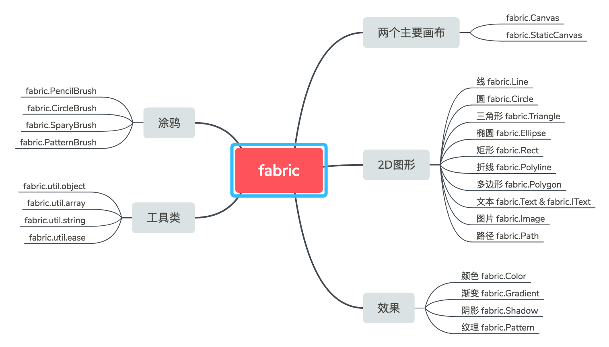

Fabric.js is a powerful and simple JavaScript HTML5 canvas library. It is useful for drawing shapes, text, images, and more on a canvas element. Fabric.js provides a wide range of features and tools to help developers create interactive and dynamic canvas applications.

#

# 参考

- [Fabric.js 从入门到________](https://juejin.cn/post/7026941253845516324#heading-17)
- [每一个用到canvas的小伙伴都应该了解的fabric.js](https://juejin.cn/post/6993801903121367048)
