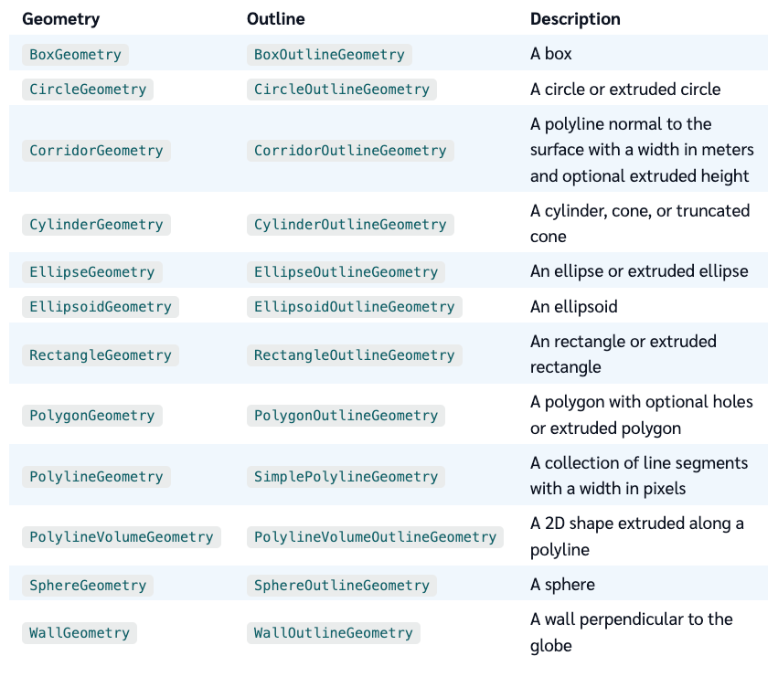

## 区别


1. 功能不同：Entity对象主要用于描述地球上的实际物体，如车辆、建筑物、飞机等，它包含的属性可以控制该物体的位置、朝向、尺寸、颜色等。而Primitive对象主要用于绘制地球上的图形，如线、面、点等，它可以通过设置顶点和属性来控制图形的形状和样式。

2. 属性不同：Entity对象包含一系列可控制物体的属性，如位置(position)、朝向(orientation)、名称(name)、描述(description)、几何形状(geometry)、材质(material)等。而Primitive对象包含的属性则根据不同类型的图形而异，如几何形状(geometry)、材质(material)、深度测试(depthTest)、线条宽度(lineWidth)、面的反向渲染(backfaceCulling)等。

3. 更新方式不同：Entity对象的更新通常是通过修改属性值来实现的，例如更改位置(position)、名称(name)、朝向(orientation)等属性。而Primitive对象的更新通常需要重新生成并渲染整个图形，例如添加或删除顶点、更改材质(material)、更改几何形状(geometry)等属性。

4. 动态性质不同：Entity对象通常更适合处理需要动态更新的物体，如飞机、车辆等，因为可以在实时更新它们的属性值。而Primitive对象通常更适合处理静态图形，如建筑物、河流等，因为它们不需要频繁更新。


## Primitive


| 属性                     | 类型       | 默认值           | 描述                                                     |
| ------------------------ | ---------- | ---------------- | -------------------------------------------------------- |
| appearance               | Appearance | undefined        | 这个图元的外观，通常是由内置的Appearance子类之一创建的。 |
| geometryInstances        | Array      | undefined        | 要呈现的几何体实例数组。                                 |
| show                     | Boolean    | true             | 指定图元是否应该显示。                                   |
| modelMatrix              | Matrix4    | Matrix4.IDENTITY | 一个用于转换模型坐标的4x4矩阵。                          |
| id                       | Object     | undefined        | 每个primitive可以关联一个自定义的id属性。                |
| allowPicking             | Boolean    | true             | 指定是否启用拾取。                                       |
| asynchronous             | Boolean    | true             | 指定几何体是否应该异步加载。                             |
| compressVertices         | Boolean    | true             | 指定是否要压缩顶点数据。                                 |
| releaseGeometryInstances | Boolean    | true             | 指定在卸载此primitive的实例时是否应该释放其几何实例。    |

```js
var viewer = new Cesium.Viewer('cesiumContainer');

var primitive = new Cesium.Primitive({
  geometryInstances: new Cesium.GeometryInstance({
    geometry: new Cesium.SphereGeometry({
      radius: 100000.0
    }),
    modelMatrix: Cesium.Matrix4.IDENTITY,
    attributes: {
      color: Cesium.ColorGeometryInstanceAttribute.fromColor(Cesium.Color.BLUE)
    }
  }),
  appearance: new Cesium.PerInstanceColorAppearance()
});

viewer.scene.primitives.add(primitive);
```
<iframe src="/cesium/examples/primitive-cesium-primitive.html" width="100%" height="500px"></iframe>

```js
// 添加3D建筑
const osmBuildings = viewer.scene.primitives.add(
  new Cesium.createOsmBuildings()
);


```

## GeometryInstance

| Option              | Type                      | Default Value       | Description                                                                |
| ------------------- | ------------------------- | ------------------- | -------------------------------------------------------------------------- |
| geometry            | Geometry                  |                     | 几何体实例                                                                 |
| modelMatrix         | Matrix4                   | Matrix4.IDENTITY    | 模型矩阵，用于定义几何体的位置、旋转和缩放等变换                           |
| id                  | Any                       | undefined           | 实例ID，便于在需要时对其进行引用                                           |
| attributes          | Object                    | {}                  | 定义几何体顶点属性的属性集合，如顶点颜色、法向量等。                       |
| boundingSphere      | BoundingSphere            | undefined           | 几何体的包围球                                                             |
| show                | Boolean                   | true                | 指定几何体实例是否应该显示                                                 |
| pick                | Boolean                   | true                | 指定几何体实例是否应该支持选择                                             |
| shadows             | ShadowMode                | ShadowMode.DISABLED | 控制几何体实例的阴影模式，可设置为启用/禁用阴影/只接收阴影                 |
| vertexCacheOptimize | Boolean                   | true                | 指定是否应优化几何体的渲染，以便在相邻帧之间缓存几何体的渲染数据以提高性能 |
| interleave          | Boolean                   | false               | 指定几何体实例中是否应该将所有属性打包到单个缓冲区中                       |
| compressVertices    | Boolean                   | true                | 指定是否应压缩几何体实例的顶点，以减少GPU内存使用量                        |
| instanceId          | Number                    | undefined           | 实例ID，可用于在渲染时区分不同的实例                                       |
| attributesEnabled   | Boolean                   | true                | 指定几何体实例中是否应启用属性                                             |
| geometryInstances   | Array\<GeometryInstance\> | undefined           | 定义由多个几何体实例组成的几何体。                                         |

```js
let rectGeometry = new Cesium.RectangleGeometry({
  rectangle: Cesium.Rectangle.fromDegrees(
    // 西边的经度
    115,
    // 南边维度
    20,
    // 东边经度
    135,
    // 北边维度
    30
  ),
  // 距离表面高度
  height: 0,
  vertexFormat: Cesium.PerInstanceColorAppearance.VERTEX_FORMAT,
});

let instance = new Cesium.GeometryInstance({
  id: "blueRect",
  geometry: rectGeometry,
  attributes: {
    color: Cesium.ColorGeometryInstanceAttribute.fromColor(
      Cesium.Color.RED.withAlpha(0.5)
    ),
  },
});


```

## Geometry




1. 矩形（RectangleGeometry）

矩形可以用于创建一个经纬度范围内的平面矩形。它可以通过指定中心点、宽度和高度以及旋转角度来创建。

```javascript
var rectangle = Cesium.Rectangle.fromDegrees(-100.0, 20.0, -90.0, 30.0);
var rectangleInstance = new Cesium.GeometryInstance({
    geometry : new Cesium.RectangleGeometry({
        rectangle : rectangle,
        vertexFormat : Cesium.VertexFormat.POSITION_AND_NORMAL
    })
});
```

2. 盒子（BoxGeometry）

盒子是一个由六个面组成的长方体，可以用于创建建筑物等模型。

```javascript
var boxInstance = new Cesium.GeometryInstance({
    geometry : new Cesium.BoxGeometry({
        vertexFormat : Cesium.VertexFormat.POSITION_ONLY
    })
});
```

3. 圆柱体（CylinderGeometry）

圆柱体是一个有底面和顶面的圆柱体。

```javascript
var cylinderInstance = new Cesium.GeometryInstance({
    geometry : new Cesium.CylinderGeometry({
        length : 100000.0,
        topRadius : 200000.0,
        bottomRadius : 200000.0,
        vertexFormat : Cesium.VertexFormat.POSITION_ONLY
    })
});
```

4. 椭球体（EllipsoidGeometry）

椭球体是一个由中心点、半径和高度模型组成的三维椭球体。

```javascript
var ellipsoidInstance = new Cesium.GeometryInstance({
    geometry : new Cesium.EllipsoidGeometry({
        radii : new Cesium.Cartesian3(100000.0, 200000.0, 300000.0),
        vertexFormat : Cesium.VertexFormat.POSITION_ONLY
    })
});
```

5. 平面（PlaneGeometry）

平面是一个无限平面，可以用于创建墙壁等模型。

```javascript
var planeInstance = new Cesium.GeometryInstance({
    geometry : new Cesium.PlaneGeometry({
        vertexFormat : Cesium.VertexFormat.POSITION_ONLY
    })
});
```

6. 多边形（PolygonGeometry）

多边形可以用于创建一个由多个点组成的平面多边形。

```javascript
var polygonInstance = new Cesium.GeometryInstance({
    geometry : new Cesium.PolygonGeometry({
        polygonHierarchy : new Cesium.PolygonHierarchy(
            Cesium.Cartesian3.fromDegreesArray([
                -72.0, 40.0,
                -70.0, 35.0,
                -75.0, 30.0,
                -80.0, 33.0,
                -78.0, 38.0
            ])
        ),
        vertexFormat : Cesium.VertexFormat.POSITION_ONLY
    })
});
```

7. 球体（SphereGeometry）

球体是一个由中心点和半径组成的三维球体。

```javascript
var sphereInstance = new Cesium.GeometryInstance({
    geometry : new Cesium.SphereGeometry({
        radius : 100000.0,
        vertexFormat : Cesium.VertexFormat.POSITION_ONLY
    })
});
```


<iframe src="/cesium/examples/primitive-cesium-geometry.html" width="100%" height="500px"></iframe>
