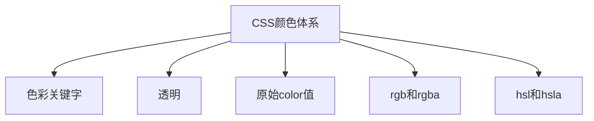

# CSS 颜色体系



<!-- parent=>start: CSS颜色体系
keyWord=>operation: 色彩关键字
transparent=>operation: 透明
currentColor=>operation: 原始color值
rg=>operation: rgb和rgba
hs=>operation: hsl和hsla

parent(path1)->keyWord
parent(path2)->transparent
parent(path3)->currentColor
parent(path4)->rg
parent(path5)->hs -->

## 色彩关键字

::: normal-demo 色彩关键字

```html
<div class="html-colors">
  <button class="color" style="--bgc:#FFFFFF; --tc:#999999;">
    <span>white</span> <span style="display: none;">8.3K</span></button
  ><button class="color" style="--bgc:#F5F5F5; --tc:#939393;">
    <span>whitesmoke</span> <span style="display: none;">6K</span></button
  ><button class="color" style="--bgc:#DCDCDC; --tc:#848484;">
    <span>gainsboro</span> <span style="display: none;">8.6K</span></button
  ><button class="color" style="--bgc:#D3D3D3; --tc:#7F7F7F;">
    <span>lightgrey</span> <span style="display: none;">9.6K</span></button
  ><button class="color" style="--bgc:#C0C0C0; --tc:#737373;">
    <span>silver</span> <span style="display: none;">8.6K</span></button
  ><button class="color" style="--bgc:#A9A9A9; --tc:#656565;">
    <span>darkgrey</span> <span style="display: none;">6.8K</span></button
  ><button class="color" style="--bgc:#808080; --tc:#4D4D4D;">
    <span>grey</span> <span style="display: none;">7K</span></button
  ><button class="color" style="--bgc:#696969; --tc:#939393;">
    <span>dimgrey</span> <span style="display: none;">7.9K</span></button
  ><button class="color" style="--bgc:#000000; --tc:#000000;">
    <span>black</span> <span style="display: none;">12.9K</span></button
  ><button class="color" style="--bgc:#FFE4E1; --tc:#FF3721;">
    <span>mistyrose</span> <span style="display: none;">2.8K</span></button
  ><button class="color" style="--bgc:#F08080; --tc:#C51717;">
    <span>lightcoral</span> <span style="display: none;">4.2K</span></button
  ><button class="color" style="--bgc:#FA8072; --tc:#D31C07;">
    <span>salmon</span> <span style="display: none;">5.9K</span></button
  ><button class="color" style="--bgc:#BC8F8F; --tc:#7C4A4A;">
    <span>rosybrown</span> <span style="display: none;">3.1K</span></button
  ><button class="color" style="--bgc:#FF6347; --tc:#C41E00;">
    <span>tomato</span> <span style="display: none;">7.6K</span></button
  ><button class="color" style="--bgc:#CD5C5C; --tc:#E9B7B7;">
    <span>indianred</span> <span style="display: none;">4.6K</span></button
  ><button class="color" style="--bgc:#FF0000; --tc:#FF6666;">
    <span>red</span> <span style="display: none;">8.3K</span></button
  ><button class="color" style="--bgc:#B22222; --tc:#DD4C4C;">
    <span>firebrick</span> <span style="display: none;">4.3K</span></button
  ><button class="color" style="--bgc:#A52A2A; --tc:#D24F4F;">
    <span>brown</span> <span style="display: none;">2.4K</span></button
  ><button class="color" style="--bgc:#8B0000; --tc:#C30000;">
    <span>darkred</span> <span style="display: none;">6.3K</span></button
  ><button class="color" style="--bgc:#800000; --tc:#B30000;">
    <span>maroon</span> <span style="display: none;">4.3K</span></button
  ><button class="color" style="--bgc:#FFF5EE; --tc:#FF8129;">
    <span>seashell</span> <span style="display: none;">2K</span></button
  ><button class="color" style="--bgc:#FFDAB9; --tc:#FF7D09;">
    <span>peachpuff</span> <span style="display: none;">3.2K</span></button
  ><button class="color" style="--bgc:#FFA07A; --tc:#E24100;">
    <span>lightsalmon</span> <span style="display: none;">5.6K</span></button
  ><button class="color" style="--bgc:#E9967A; --tc:#B7451E;">
    <span>darksalmon</span> <span style="display: none;">2.8K</span></button
  ><button class="color" style="--bgc:#F4A460; --tc:#BF5F0D;">
    <span>sandybrown</span> <span style="display: none;">2.4K</span></button
  ><button class="color" style="--bgc:#FF7F50; --tc:#C93600;">
    <span>coral</span> <span style="display: none;">4.7K</span></button
  ><button class="color" style="--bgc:#CD853F; --tc:#805021;">
    <span>peru</span> <span style="display: none;">2K</span></button
  ><button class="color" style="--bgc:#FF4500; --tc:#FF8F66;">
    <span>orangered</span> <span style="display: none;">7.9K</span></button
  ><button class="color" style="--bgc:#D2691E; --tc:#E99D67;">
    <span>chocolate</span> <span style="display: none;">2.3K</span></button
  ><button class="color" style="--bgc:#A0522D; --tc:#CE7951;">
    <span>sienna</span> <span style="display: none;">2.4K</span></button
  ><button class="color" style="--bgc:#8B4513; --tc:#C3611B;">
    <span>saddlebrown</span> <span style="display: none;">3.4K</span></button
  ><button class="color" style="--bgc:#FFFAFA; --tc:#FF3030;">
    <span>snow</span> <span style="display: none;">3.7K</span></button
  ><button class="color" style="--bgc:#FFFAF0; --tc:#FFB82A;">
    <span>floralwhite</span> <span style="display: none;">1.6K</span></button
  ><button class="color" style="--bgc:#FDF5E6; --tc:#EFAD33;">
    <span>oldlace</span> <span style="display: none;">1.2K</span></button
  ><button class="color" style="--bgc:#FAF0E6; --tc:#DA9046;">
    <span>linen</span> <span style="display: none;">1.2K</span></button
  ><button class="color" style="--bgc:#FFEFD5; --tc:#FFA81A;">
    <span>papayawhip</span> <span style="display: none;">2.5K</span></button
  ><button class="color" style="--bgc:#FAEBD7; --tc:#E59832;">
    <span>antiquewhite</span> <span style="display: none;">1.8K</span></button
  ><button class="color" style="--bgc:#FFEBCD; --tc:#FFA115;">
    <span>blanchedalmond</span> <span style="display: none;">1.9K</span></button
  ><button class="color" style="--bgc:#FFE4C4; --tc:#FF9110;">
    <span>bisque</span> <span style="display: none;">2.1K</span></button
  ><button class="color" style="--bgc:#FFE4B5; --tc:#FFA407;">
    <span>moccasin</span> <span style="display: none;">2.3K</span></button
  ><button class="color" style="--bgc:#FFDEAD; --tc:#FF9902;">
    <span>navajowhite</span> <span style="display: none;">2.6K</span></button
  ><button class="color" style="--bgc:#F5DEB3; --tc:#E19D1E;">
    <span>wheat</span> <span style="display: none;">2.9K</span></button
  ><button class="color" style="--bgc:#DEB887; --tc:#A8732E;">
    <span>burlywood</span> <span style="display: none;">3.4K</span></button
  ><button class="color" style="--bgc:#D2B48C; --tc:#97703B;">
    <span>tan</span> <span style="display: none;">2.8K</span></button
  ><button class="color" style="--bgc:#FF8C00; --tc:#995400;">
    <span>darkorange</span> <span style="display: none;">6K</span></button
  ><button class="color" style="--bgc:#FFA500; --tc:#996300;">
    <span>orange</span> <span style="display: none;">5.1K</span></button
  ><button class="color" style="--bgc:#DAA520; --tc:#836313;">
    <span>goldenrod</span> <span style="display: none;">3.7K</span></button
  ><button class="color" style="--bgc:#B8860B; --tc:#6E5007;">
    <span>darkgoldenrod</span> <span style="display: none;">2.4K</span></button
  ><button class="color" style="--bgc:#FFF8DC; --tc:#FFD21E;">
    <span>cornsilk</span> <span style="display: none;">2.9K</span></button
  ><button class="color" style="--bgc:#FFFACD; --tc:#FFE815;">
    <span>lemonchiffon</span> <span style="display: none;">2.6K</span></button
  ><button class="color" style="--bgc:#EEE8AA; --tc:#CCBE29;">
    <span>palegoldenrod</span> <span style="display: none;">1.3K</span></button
  ><button class="color" style="--bgc:#F0E68C; --tc:#CAB81A;">
    <span>khaki</span> <span style="display: none;">2.7K</span></button
  ><button class="color" style="--bgc:#BDB76B; --tc:#7B7637;">
    <span>darkkhaki</span> <span style="display: none;">1.6K</span></button
  ><button class="color" style="--bgc:#FFD700; --tc:#998100;">
    <span>gold</span> <span style="display: none;">7.5K</span></button
  ><button class="color" style="--bgc:#FFFFF0; --tc:#FFFF2A;">
    <span>ivory</span> <span style="display: none;">1.8K</span></button
  ><button class="color" style="--bgc:#FFFFE0; --tc:#FFFF20;">
    <span>lightyellow</span> <span style="display: none;">4.5K</span></button
  ><button class="color" style="--bgc:#F5F5DC; --tc:#CCCC4B;">
    <span>beige</span> <span style="display: none;">2.7K</span></button
  ><button class="color" style="--bgc:#FAFAD2; --tc:#E8E82C;">
    <span>lightgoldenrodyellow</span>
    <span style="display: none;">2.3K</span></button
  ><button class="color" style="--bgc:#FFFF00; --tc:#999900;">
    <span>yellow</span> <span style="display: none;">6.3K</span></button
  ><button class="color" style="--bgc:#808000; --tc:#B3B300;">
    <span>olive</span> <span style="display: none;">1.2K</span></button
  ><button class="color" style="--bgc:#ADFF2F; --tc:#6EB500;">
    <span>greenyellow</span> <span style="display: none;">2K</span></button
  ><button class="color" style="--bgc:#9ACD32; --tc:#5C7B1E;">
    <span>yellowgreen</span> <span style="display: none;">3K</span></button
  ><button class="color" style="--bgc:#6B8E23; --tc:#96C731;">
    <span>olivedrab</span> <span style="display: none;">1.7K</span></button
  ><button class="color" style="--bgc:#556B2F; --tc:#779642;">
    <span>darkolivegreen</span> <span style="display: none;">1.3K</span></button
  ><button class="color" style="--bgc:#7FFF00; --tc:#4C9900;">
    <span>chartreuse</span> <span style="display: none;">1.5K</span></button
  ><button class="color" style="--bgc:#7CFC00; --tc:#4A9700;">
    <span>lawngreen</span> <span style="display: none;">1.5K</span></button
  ><button class="color" style="--bgc:#F0FFF0; --tc:#2AFF2A;">
    <span>honeydew</span> <span style="display: none;">2.2K</span></button
  ><button class="color" style="--bgc:#98FB98; --tc:#09E909;">
    <span>palegreen</span> <span style="display: none;">2.2K</span></button
  ><button class="color" style="--bgc:#90EE90; --tc:#1EC71E;">
    <span>lightgreen</span> <span style="display: none;">3.6K</span></button
  ><button class="color" style="--bgc:#8FBC8F; --tc:#4A7C4A;">
    <span>darkseagreen</span> <span style="display: none;">1.2K</span></button
  ><button class="color" style="--bgc:#00FF00; --tc:#009900;">
    <span>lime</span> <span style="display: none;">3.6K</span></button
  ><button class="color" style="--bgc:#32CD32; --tc:#1E7B1E;">
    <span>limegreen</span> <span style="display: none;">4.8K</span></button
  ><button class="color" style="--bgc:#228B22; --tc:#30C330;">
    <span>forestgreen</span> <span style="display: none;">3.9K</span></button
  ><button class="color" style="--bgc:#008000; --tc:#00B300;">
    <span>green</span> <span style="display: none;">5.5K</span></button
  ><button class="color" style="--bgc:#006400; --tc:#008C00;">
    <span>darkgreen</span> <span style="display: none;">5.7K</span></button
  ><button class="color" style="--bgc:#00FF7F; --tc:#00994C;">
    <span>springgreen</span> <span style="display: none;">2.5K</span></button
  ><button class="color" style="--bgc:#3CB371; --tc:#246B44;">
    <span>mediumseagreen</span> <span style="display: none;">3.3K</span></button
  ><button class="color" style="--bgc:#2E8B57; --tc:#42C17A;">
    <span>seagreen</span> <span style="display: none;">3.1K</span></button
  ><button class="color" style="--bgc:#F5FFFA; --tc:#2DFF96;">
    <span>mintcream</span> <span style="display: none;">1.8K</span></button
  ><button class="color" style="--bgc:#7FFFD4; --tc:#00E598;">
    <span>aquamarine</span> <span style="display: none;">2.7K</span></button
  ><button class="color" style="--bgc:#66CDAA; --tc:#2D8B6B;">
    <span>mediumaquamarine</span>
    <span style="display: none;">2.3K</span></button
  ><button class="color" style="--bgc:#00FA9A; --tc:#00965C;">
    <span>mediumspringgreen</span>
    <span style="display: none;">2.6K</span></button
  ><button class="color" style="--bgc:#40E0D0; --tc:#189588;">
    <span>turquoise</span> <span style="display: none;">3.9K</span></button
  ><button class="color" style="--bgc:#48D1CC; --tc:#228783;">
    <span>mediumturquoise</span>
    <span style="display: none;">1.6K</span></button
  ><button class="color" style="--bgc:#20B2AA; --tc:#136B66;">
    <span>lightseagreen</span> <span style="display: none;">3.1K</span></button
  ><button class="color" style="--bgc:#F0FFFF; --tc:#2AFFFF;">
    <span>azure</span> <span style="display: none;">2.4K</span></button
  ><button class="color" style="--bgc:#E0FFFF; --tc:#20FFFF;">
    <span>lightcyan</span> <span style="display: none;">3.5K</span></button
  ><button class="color" style="--bgc:#AFEEEE; --tc:#2BCCCC;">
    <span>paleturquoise</span> <span style="display: none;">2.3K</span></button
  ><button class="color" style="--bgc:#B0E0E6; --tc:#3BABB9;">
    <span>powderblue</span> <span style="display: none;">3.1K</span></button
  ><button class="color" style="--bgc:#ADD8E6; --tc:#389AB9;">
    <span>lightblue</span> <span style="display: none;">9.6K</span></button
  ><button class="color" style="--bgc:#00FFFF; --tc:#009999;">
    <span>cyan</span> <span style="display: none;">4.5K</span></button
  ><button class="color" style="--bgc:#5F9EA0; --tc:#395F60;">
    <span>cadetblue</span> <span style="display: none;">2.3K</span></button
  ><button class="color" style="--bgc:#00CED1; --tc:#007C7D;">
    <span>darkturquoise</span> <span style="display: none;">3.1K</span></button
  ><button class="color" style="--bgc:#008B8B; --tc:#00C3C3;">
    <span>darkcyan</span> <span style="display: none;">2.2K</span></button
  ><button class="color" style="--bgc:#008080; --tc:#00B3B3;">
    <span>teal</span> <span style="display: none;">4.3K</span></button
  ><button class="color" style="--bgc:#2F4F4F; --tc:#426F6F;">
    <span>darkslategrey</span> <span style="display: none;">7.5K</span></button
  ><button class="color" style="--bgc:#F0F8FF; --tc:#2A9CFF;">
    <span>aliceblue</span> <span style="display: none;">3.7K</span></button
  ><button class="color" style="--bgc:#87CEFA; --tc:#098CDE;">
    <span>lightskyblue</span> <span style="display: none;">4.9K</span></button
  ><button class="color" style="--bgc:#87CEEB; --tc:#2090BE;">
    <span>skyblue</span> <span style="display: none;">6.3K</span></button
  ><button class="color" style="--bgc:#1E90FF; --tc:#90C8FF;">
    <span>dodgerblue</span> <span style="display: none;">9.2K</span></button
  ><button class="color" style="--bgc:#00BFFF; --tc:#007399;">
    <span>deepskyblue</span> <span style="display: none;">7.3K</span></button
  ><button class="color" style="--bgc:#4682B4; --tc:#8CB2D2;">
    <span>steelblue</span> <span style="display: none;">6.5K</span></button
  ><button class="color" style="--bgc:#B0C4DE; --tc:#4671A8;">
    <span>lightsteelblue</span> <span style="display: none;">2.7K</span></button
  ><button class="color" style="--bgc:#6495ED; --tc:#154EB5;">
    <span>cornflowerblue</span> <span style="display: none;">3.3K</span></button
  ><button class="color" style="--bgc:#4169E1; --tc:#A5B8F1;">
    <span>royalblue</span> <span style="display: none;">5.5K</span></button
  ><button class="color" style="--bgc:#778899; --tc:#46525D;">
    <span>lightslategrey</span> <span style="display: none;">3.6K</span></button
  ><button class="color" style="--bgc:#708090; --tc:#AAB3BD;">
    <span>slategrey</span> <span style="display: none;">4.1K</span></button
  ><button class="color" style="--bgc:#E6E6FA; --tc:#4646DA;">
    <span>lavender</span> <span style="display: none;">2.4K</span></button
  ><button class="color" style="--bgc:#7B68EE; --tc:#E6E3FC;">
    <span>mediumslateblue</span>
    <span style="display: none;">2.6K</span></button
  ><button class="color" style="--bgc:#6A5ACD; --tc:#BCB5E8;">
    <span>slateblue</span> <span style="display: none;">1.4K</span></button
  ><button class="color" style="--bgc:#0000FF; --tc:#6666FF;">
    <span>blue</span> <span style="display: none;">5.7K</span></button
  ><button class="color" style="--bgc:#0000CD; --tc:#2020FF;">
    <span>mediumblue</span> <span style="display: none;">3.4K</span></button
  ><button class="color" style="--bgc:#483D8B; --tc:#6C5FB9;">
    <span>darkslateblue</span> <span style="display: none;">1.7K</span></button
  ><button class="color" style="--bgc:#00008B; --tc:#0000C3;">
    <span>darkblue</span> <span style="display: none;">5K</span></button
  ><button class="color" style="--bgc:#191970; --tc:#23239D;">
    <span>midnightblue</span> <span style="display: none;">4.3K</span></button
  ><button class="color" style="--bgc:#000080; --tc:#0000B3;">
    <span>navy</span> <span style="display: none;">4.2K</span></button
  ><button class="color" style="--bgc:#9370DB; --tc:#4F289F;">
    <span>mediumpurple</span> <span style="display: none;">1.8K</span></button
  ><button class="color" style="--bgc:#F8F8FF; --tc:#2F2FFF;">
    <span>ghostwhite</span> <span style="display: none;">2.6K</span></button
  ><button class="color" style="--bgc:#8A2BE2; --tc:#BE8AEF;">
    <span>blueviolet</span> <span style="display: none;">2.3K</span></button
  ><button class="color" style="--bgc:#9932CC; --tc:#C283E1;">
    <span>darkorchid</span> <span style="display: none;">1.2K</span></button
  ><button class="color" style="--bgc:#9400D3; --tc:#BF28FF;">
    <span>darkviolet</span> <span style="display: none;">1.4K</span></button
  ><button class="color" style="--bgc:#4B0082; --tc:#6900B6;">
    <span>indigo</span> <span style="display: none;">3.2K</span></button
  ><button class="color" style="--bgc:#BA55D3; --tc:#78258D;">
    <span>mediumorchid</span> <span style="display: none;">1.3K</span></button
  ><button class="color" style="--bgc:#D8BFD8; --tc:#985C98;">
    <span>thistle</span> <span style="display: none;">1.2K</span></button
  ><button class="color" style="--bgc:#DDA0DD; --tc:#A83CA8;">
    <span>plum</span> <span style="display: none;">1.6K</span></button
  ><button class="color" style="--bgc:#EE82EE; --tc:#C21AC2;">
    <span>violet</span> <span style="display: none;">1.9K</span></button
  ><button class="color" style="--bgc:#DA70D6; --tc:#9D2999;">
    <span>orchid</span> <span style="display: none;">1.2K</span></button
  ><button class="color" style="--bgc:#FF00FF; --tc:#FF66FF;">
    <span>magenta</span> <span style="display: none;">3.6K</span></button
  ><button class="color" style="--bgc:#8B008B; --tc:#C300C3;">
    <span>darkmagenta</span> <span style="display: none;">1.5K</span></button
  ><button class="color" style="--bgc:#800080; --tc:#B300B3;">
    <span>purple</span> <span style="display: none;">2.8K</span></button
  ><button class="color" style="--bgc:#FF1493; --tc:#FF82C6;">
    <span>deeppink</span> <span style="display: none;">6.1K</span>
  </button>
</div>
```

```css
.html-colors {
  display: grid;
  grid-template-columns: repeat(5, 1fr);
  gap: 0.25rem;
  overflow: hidden;
  padding: 5px;
}
.html-colors .color {
  display: flex;
  height: 40px;
  align-items: flex-end;
  justify-content: flex-start;
  padding: 5px;
  font-size: 1.25rem;
  line-height: 1.75rem;
  overflow: hidden;
  background-color: var(--bgc);
  color: var(--tc);
}
```

:::

## transparent

transparent 的字面意思就是透明 类似`rgba(0,0,0,0)`

## currentColor

表示当前颜色

**元素继承的值**

1. 元素的文本内容
2. 文本的轮廓
3. 元素的边框
4. 元素的盒阴影
5. filter:drop-shadow()
6. `` 的 alt 文本。也就是，当无法显示图像时，代替图像出现的文本，会继承这个颜色值。
7. 列表项的小黑点和边框
8. 一些浏览器（比如 Chrome）水平线（ `<hr>`）的边框颜色。（没有边框的话，颜色就不会受影响）。

::: normal-demo currentColor

```html
<div class="div1">currentColor</div>
```

```css
.div1 {
  color: deeppink;
  height: 80px;
  width: 160px;

  border: 1px solid currentColor;
  box-shadow: 0px 0px 1px 1px currentColor;
}
```

:::

## rgb()和 rgba()

rgb() 表示颜色的红-绿-蓝（red-green-blue (RGB)）模式
rgba() 多一个 a ，表示其透明度，取值为 0-1

<GgbaColorPicker />
## hsl()和 hsla()

hsl()被定义为色相-饱和度-明度（Hue-saturation-lightness）

hsla() 多一个 a ，表示其透明度，取值为 0-1

- 色相（H）是色彩的基本属性，就是平常所说的颜色名称，如红色、黄色等。
- 饱和度（S）是指色彩的纯度，越高色彩越纯，低则逐渐变灰，取 0-100%的数值。
- 明度（V），亮度（L），取 0-100%。
  <ColorPicker />

<script>
import { ColorPicker } from 'vue-accessible-color-picker'
import { ColorPicker as GgbaColorPicker } from 'vue-color-kit'
// import {   ColorPicker     } from 'vue-color-gradient-picker';
export default {
 name: 'MyComponent',
 components: {
  ColorPicker,
    GgbaColorPicker
    // Sketch
 },
}

</script>
<style>
@import 'vue-color-kit/dist/vue-color-kit.css';

</style>
