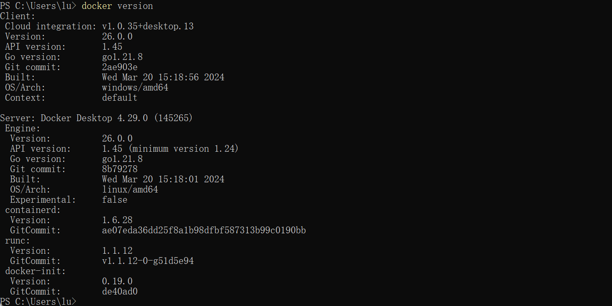
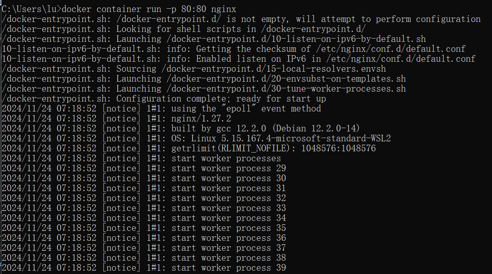
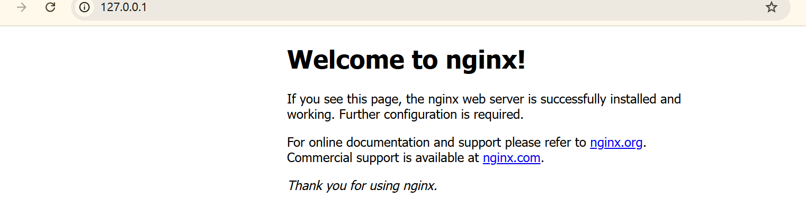
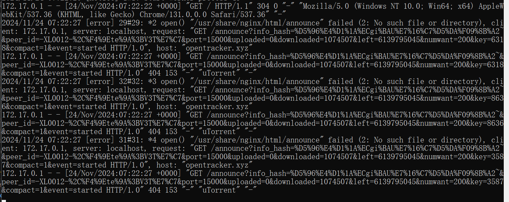
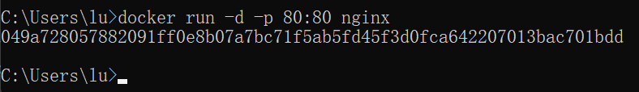
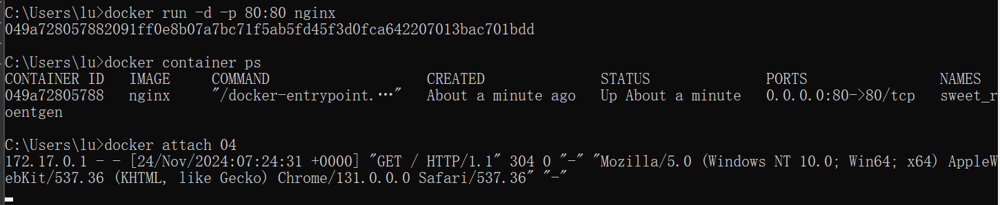
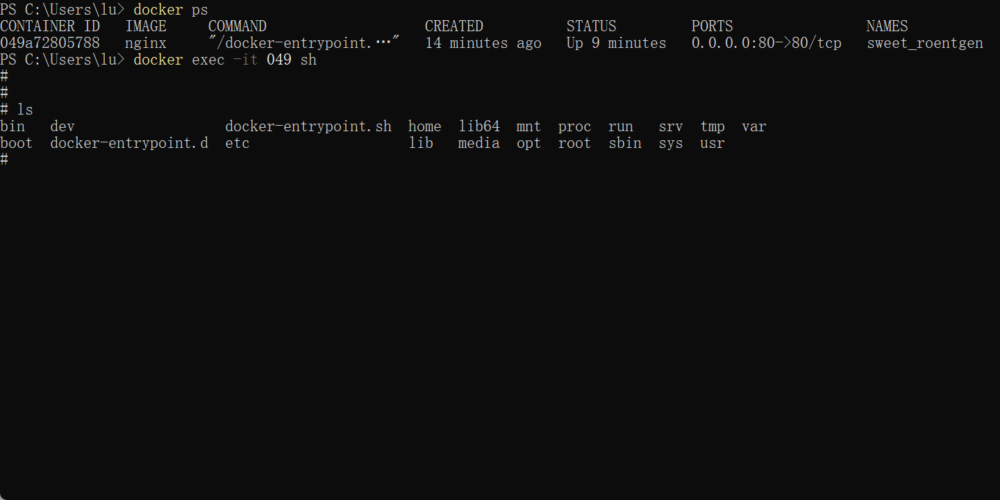
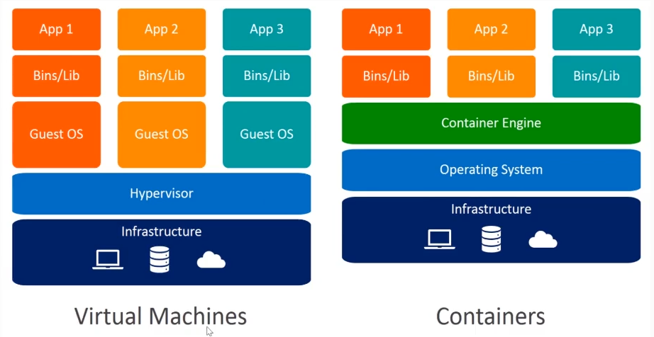

# CLI

`docker version`



- **Client**: 表示 Docker 客户端的版本信息。
  - **Docker Engine - Community**: Docker 客户端的类型，这里是社区版。
  - **Version**: 客户端的版本号。
  - **API version**: 客户端支持的最高 Docker API 版本。
  - **Go version**: 构建 Docker 客户端所使用的 Go 语言版本。
  - **Git commit**: 客户端版本的 Git 提交哈希值。
  - **Built**: 客户端构建的时间。
  - **OS/Arch**: 客户端运行的操作系统和架构。
  - **Experimental**: 表示是否启用了实验性功能。
- **Server**: 表示 Docker 服务器的版本信息，通常指的是 Docker 引擎。
  - **Engine**: Docker 引擎的详细版本信息。
    - **Version**: 引擎的版本号。
    - **API version**: 引擎支持的 Docker API 版本，后面通常会注明最低支持的 API 版本。
    - **Go version**: 构建 Docker 引擎所使用的 Go 语言版本。
    - **Git commit**: 引擎版本的 Git 提交哈希值。
    - **Built**: 引擎构建的时间。
    - **OS/Arch**: 引擎运行的操作系统和架构。
    - **Experimental**: 表示是否启用了实验性功能。

# Image and Container

## Image

- 镜像类似模板
- read-only 文件

## container

- 一个运行中的 docker image
- 实质是复制了 image，并添加了可写层
- 基于同一个image可以创建多个container

# container

```shell
# 创建容器
docker container run nginx

docker container ls
# 等价于
docker ls

docker stop container_id

# 删除容器
docker container rm container_id
# 等价于
docker rm container_id


```

## 常用命令

### 容器生命周期管理

| 命令 | 实例 | 说明 |
| --- | --- | --- |
| `docker run` | `docker run -d --name mynginx nginx` | 创建并启动一个名为 `mynginx` 的 Nginx 容器，`-d` 表示后台运行 |
| `docker start` | `docker start mynginx` | 启动名为 `mynginx` 的已停止容器 |
| `docker stop` | `docker stop mynginx` | 停止名为 `mynginx` 的运行中容器 |
| `docker restart` | `docker restart mynginx` | 重启名为 `mynginx` 的容器 |
| `docker kill` | `docker kill mynginx` | 强制停止名为 `mynginx` 的容器 |
| `docker rm` | `docker rm mynginx` | 删除名为 `mynginx` 的已停止容器 |
| `docker pause` | `docker pause mynginx` | 暂停名为 `mynginx` 的容器 |
| `docker unpause` | `docker unpause mynginx` | 恢复名为 `mynginx` 的容器 |

### 容器查看

| 命令 | 实例 | 说明 |
| --- | --- | --- |
| `docker ps` | `docker ps` | 列出当前运行中的容器 |
| `docker container ls` | `docker container ls -a` | 列出所有容器，包括停止的 |
| `docker inspect` | `docker inspect mynginx` | 获取名为 `mynginx` 的容器的详细信息 |

在 Docker 的上下文中，`ps` 和 `ls` 命令都用于列出信息，但它们针对的对象和提供的功能有所不同：

`docker ps`

- **用途**：`docker ps` 命令用于列出当前运行中的容器。
- **默认行为**：默认情况下，`docker ps` 只显示当前正在运行的容器。
- **选项**：
  - `-a`：列出所有容器（包括停止的容器）。
  - `-q`：只显示容器 ID。
  - `-s`：显示容器的大小。
  - 其他选项可用于过滤和格式化输出。

 `docker container ls`

- **用途**：`docker container ls` 命令用于列出容器的信息。
- **默认行为**：与 `docker ps` 类似，默认情况下，`docker container ls` 只显示当前正在运行的容器。
- **选项**：
  - `-a`：列出所有容器（包括停止的容器）。
  - `-q`：只显示容器 ID。
  - `-s`：显示容器的大小。
  - 其他选项与 `docker ps` 命令相似。

- **历史和命名**：`docker ps` 是 Docker 早期版本中的命令，后来随着 Docker 命令行界面（CLI）的更新，引入了更结构化的命令格式，如 `docker container ls`。尽管 `docker ps` 仍然可用，但 `docker container ls` 更符合 Docker 命令的现代命名约定。
- **功能**：实际上，`docker ps` 和 `docker container ls` 在功能上是相同的。它们接受相同的选项，并执行相同的操作。使用哪一个主要取决于个人习惯或特定脚本的要求。
在实践中，你可以根据自己的偏好选择使用 `docker ps` 或 `docker container ls`，它们都会提供相同的结果。不过，要注意的是，随着 Docker 的不断更新，未来可能会有新的命令和选项被引入。

### 镜像管理

| 命令 | 实例 | 说明 |
| --- | --- | --- |
| `docker images` | `docker images` | 列出本地所有镜像 |
| `docker pull` | `docker pull nginx:latest` | 从 Docker Hub 拉取最新版的 Nginx 镜像 |
| `docker rmi` | `docker rmi nginx:latest` | 删除本地名为 `nginx:latest` 的镜像 |
| `docker build` | `docker build -t myapp .` | 使用当前目录的 Dockerfile 构建名为 `myapp` 的镜像 |
| `docker tag` | `docker tag myapp:latest myregistry.com/myapp:latest` | 将本地镜像 `myapp:latest` 标记为 `myregistry.com/myapp:latest` |
| `docker push` | `docker push myregistry.com/myapp:latest` | 将本地镜像推送到 `myregistry.com` 仓库 |

### 网络管理

| 命令 | 实例 | 说明 |
| --- | --- | --- |
| `docker network ls` | `docker network ls` | 列出所有 Docker 网络 |
| `docker network create` | `docker network create mynet` | 创建名为 `mynet` 的新网络 |
| `docker network rm` | `docker network rm mynet` | 删除名为 `mynet` 的网络 |

### 数据管理

| 命令 | 实例 | 说明 |
| --- | --- | --- |
| `docker volume create` | `docker volume create mydata` | 创建名为 `mydata` 的新卷 |
| `docker volume ls` | `docker volume ls` | 列出所有 Docker 卷 |
| `docker volume rm` | `docker volume rm mydata` | 删除名为 `mydata` 的卷 |

### 系统日志

| 命令 | 实例 | 说明 |
| --- | --- | --- |
| `docker logs` | `docker logs mynginx` | 获取名为 `mynginx` 的容器的日志输出 |
| `docker logs -f` | `docker logs -f mynginx` | 动态获取名为 `mynginx` 的容器的日志输出 |

## 命令

```shell
docker container rm $(docker ps -aq)
```

$() 是一个命令替换（command substitution）的语法，它允许你将一个命令的输出作为另一个命令的参数

- docker ps -aq：这个命令列出所有容器的 ID（包括运行中和已停止的容器），其中 -a 表示列出所有容器，-q 表示只显示容器 ID。
- $(...)：将 docker ps -aq 命令的输出（即所有容器的 ID 列表）作为参数传递给 docker container rm 命令。

| 选项            | 简写 | 说明                                                         |
|-----------------|------|--------------------------------------------------------------|
| `--interactive` | `-i` | 交互模式，即使没有附加终端，也保持 STDIN 打开。               |
| `--tty`         | `-t` | 分配一个伪终端。                                             |
| `--detach`      | `-d` | 后台运行模式，在后台运行容器并打印容器 ID。                 |
| `--publish`     | `-p` | 将容器的端口映射到宿主机。                                   |
| `--volume`      | `-v` | 绑定挂载宿主机的卷到容器内。                                 |
| `--name`        |      | 为容器指定一个名称。                                         |
| `--rm`          |      | 当容器退出时自动删除容器。                                   |
| `--env`         | `-e` | 设置环境变量。                                               |
| `--network`     |      | 将容器连接到指定的网络。                                     |
| `--restart`     |      | 设置容器的重启策略（例如，`always`, `on-failure`, `unless-stopped`）。 |
| `--user`        | `-u` | 指定运行容器的用户名或 UID。                                 |
| `--cpus`        |      | 限制容器可以使用的 CPU 数量。                                 |
| `--memory`      | `-m` | 限制容器可以使用的内存量。                                   |
| `--memory-swap` |      | 限制容器可以使用的内存和交换空间总量。                       |
| `--cpu-shares`  |      | 设置 CPU 使用权重（相对权重）。                               |
| `--cpuset-cpus` |      | 限制容器可以使用的 CPU（例如，`0-3`，`1,3`）。                |
| `--hostname`    |      | 设置容器的主机名。                                           |
| `--workdir`     | `-w` | 为容器设置工作目录。                                         |
| `--entrypoint`  |      | 覆盖容器默认的 `ENTRYPOINT`。                                |
| `--cmd`         |      | 覆盖容器的默认命令（`CMD`）。                                |

## attached和detached

- **attached**：在 `docker run` 命令中，如果使用 `-it` 选项，容器将会以交互模式运行，并且命令行会附加到容器中。这意味着你可以直接在命令行中与容器进行交互，例如运行 shell 命令、编辑文件等。这种模式通常用于调试和开发。
- **detached**：在 `docker run` 命令中，如果使用 `-d` 选项，容器将会在后台运行，并且命令行会与容器分离。这意味着你可以关闭命令行窗口，容器将继续运行。这种模式通常用于运行长期运行的服务，例如 web 服务器、数据库等。

```shell
# 前台执行
docker container run -p 80:80 nginx
```

访问直接输出了日志




```shell
docker run -d -p 80:80 nginx
```





## 连接容器的shell

### 创建一个容器并进入交互模式

```shell
docker run -it  my_container  sh
```

### 进入一个运行的容器

```shell
docker exec -it container_id sh
```

在指定的运行中的容器内执行一个新进程

- i：交互模式，即使没有附加终端，也保持 STDIN 打开。
- t：分配一个伪终端。
- container_id：你需要执行命令的容器的唯一标识符。
- sh：在容器内部启动的进程。这里，sh 是一个 shell 程序，它会启动一个新的 shell 环境，允许你与容器内的操作系统进行交互。



## container和虚拟机



容器和虚拟机（Virtual Machines, VMs）是两种不同的技术，它们在软件部署和应用隔离方面各有优势。

### 容器（Containers）

- **定义**：容器是一种轻量级的、可移植的、自给自足的软件打包技术。它们包含应用程序及其所有依赖项，如库、框架和设置，以便在各种环境中一致地运行。
- **技术原理**：容器使用宿主机的内核，共享宿主机的操作系统，但它们有自己的文件系统、网络栈和进程空间。
- **优势**：
  - **启动速度快**：容器直接在宿主机的内核上运行，启动时间非常短。
  - **资源利用率高**：容器共享宿主机的操作系统内核，因此它们比虚拟机更节省资源。
  - **易于迁移和扩展**：容器可以在任何支持它们的平台上运行，使得应用程序的迁移和扩展变得简单。
  - **隔离性**：容器提供了一个相对轻量级的隔离环境，可以确保应用程序的安全性和稳定性。

### 虚拟机（Virtual Machines）

- **定义**：虚拟机是一种软件层，它允许在一台物理服务器上运行多个操作系统。每个虚拟机都模拟了物理硬件，包括CPU、内存、硬盘等。
- **技术原理**：虚拟机使用虚拟化技术，在物理硬件上模拟出一个或多个物理机器，每个虚拟机都有自己的操作系统和硬件资源。
- **优势**：
  - **隔离性强**：虚拟机提供了完整的硬件模拟，每个虚拟机之间完全隔离，可以运行不同的操作系统和应用程序。
  - **灵活性和可扩展性**：虚拟机可以在需要时增加或减少资源，易于扩展。
  - **易于备份和恢复**：虚拟机可以作为一个文件进行备份和恢复，方便进行数据保护和灾难恢复。
  - **安全性**：虚拟机提供了硬件级别的隔离，使得每个虚拟机都是一个安全的沙箱环境。

- 容器不是mini虚拟机
- 容器是进程组，共享宿主机的内核，共享资源，隔离环境
- 虚拟机是完整的操作系统，有完整的内核，不共享资源，隔离环境

## 容器的创建

1. **镜像选择**：
   - Docker 首先检查本地存储是否有指定的镜像。如果没有，它会尝试从 Docker Hub 或您指定的镜像仓库中拉取镜像。
2. **镜像解包**：
   - 如果镜像不在本地，Docker 会从仓库下载镜像，并将镜像的层（layers）逐层解包到内存中。这个过程称为镜像的解包。
3. **创建容器文件系统**：
   - Docker 使用镜像的顶层文件系统来创建容器的文件系统。如果这是从仓库拉取的镜像，它将使用仓库中的最新层。
4. **设置容器上下文**：
   - Docker 创建一个与容器相关的上下文，包括命令行参数、环境变量、卷、端口映射等。
5. **命名和标识**：
   - Docker 为新容器分配一个唯一的标识符（通常是一个 64 位的数字），并可能为其分配一个名称。
6. **网络配置**：
   - Docker 配置容器的网络接口，包括设置 IP 地址、端口映射、创建网络命名空间等。
7. **进程管理**：
   - Docker 创建一个或多个进程来运行容器的应用。这些进程通常是容器镜像中定义的 `ENTRYPOINT` 或 `CMD` 指令指定的命令。
8. **资源限制**：
   - Docker 设置容器的资源限制，如 CPU、内存、进程限制等。
9. **生命周期管理**：
   - Docker 管理容器的生命周期，包括启动、停止、重启等操作。
10. **日志和监控**：
    - Docker 收集和记录容器的日志，并可能监控容器的性能和状态。
在整个过程中，Docker 使用其核心组件（如 Docker 引擎、Docker 客户端、Docker 守护进程等）来执行这些操作。这些组件共同工作，确保容器能够按照预期的方式运行。

# Image

## 镜像的获取

- pull from registry
- build from Dockerfile
- load from file
