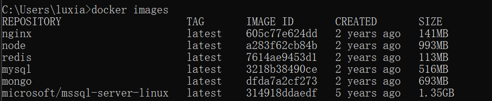

查看镜像

```bash
docker images

```



```bash
docker pull mysql
docker run -p 3306:3306 --name mysql -v /opt/mysql/conf:/etc/mysql/conf.d -v /opt/mysql/logs:/logs -v /opt/mysql/data:/var/lib/mysql -e MYSQL_ROOT_PASSWORD=123456 -d 56a8c14e1404 --lower_case_table_names=1

```

-p 3306:3306：将容器的3306端口映射到主机的3306端口

-v /opt/mysql/conf:/etc/mysql/conf.d：将主机路径下的conf目录挂载到容器的/etc/mysql/conf.d目录

-v /opt/mysql/logs:/logs：将主机目录下的logs目录挂载到容器的/logs

-v /opt/mysql/data:/var/lib/mysql：将主机目录下的data目录挂载到容器的/mysql

938b57d64674  是镜像的id

-e MYSQL_ROOT_PASSWORD=123456：初始化root用户的密码

--lower_case_table_names=1 设置表名参数名等忽略大小写

查看容器运行状态

```bash
docker ps
# 进入容器
docker exec -it mysql /bin/bash
# 登录数据库
mysql -uroot -p123456 --default-character-set=utf8
# 创建数据库
create database qiu character set utf8;
```
