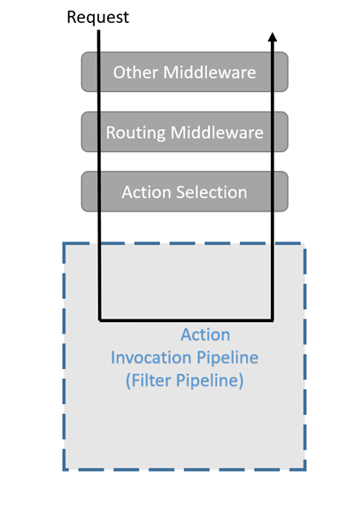
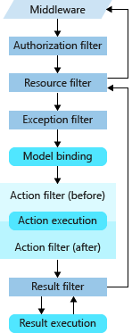

过滤器（Filter） 是一种用于在请求处理管道中插入自定义逻辑的机制。过滤器通常用于执行一些通用的任务，如日志记录、身份验证、授权、异常处理、数据校验等。在ASP.NET Core中，过滤器是中间件（Middleware）的一种特殊形式，它们可以更细粒度地控制请求的处理流程。

::: info 请求处理管道
请求处理管道（Request Processing Pipeline） 是一个由一系列中间件（Middleware）组成的处理流程，用于处理每个进入应用程序的HTTP请求。请求处理管道定义了请求从到达服务器到返回响应的整个生命周期中，将依次经过哪些处理步骤。
:::



Request
  ↓
[Authorization Filter]
  ↓
[Resource Filter]
  ↓
[Model Binding]
  ↓
[Action Filter]
  ↓
[Action Execution]
  ↓
[Result Filter]
  ↓
[Exception Filter (on any error)]
  ↓
Response

## 作用域

|作用域 | 说明 | 示例|
|:---:|:---:|:---:|
|全局作用域 | 应用于所有 Controller/Action | 在 Startup 或 Program.cs 注册|
|控制器作用域 | 只作用于特定 Controller |`[ServiceFilter(typeof(...))]`|
|方法作用域 | 只作用于某个 Action 方法 | 直接加在方法上 `[TypeFilter(...)]`|

+---------------------+
| 全局作用域          | ---> 所有请求
+---------------------+
        ↓
+---------------------+
| 控制器作用域        | ---> 特定 Controller 请求
+---------------------+
        ↓
+---------------------+
| 方法作用域          | ---> 特定 Action 请求
+---------------------+

**执行顺序**



## 注册

```csharp
using Microsoft.AspNetCore.Mvc.Filters;
using Microsoft.Extensions.Logging;
using System.Diagnostics;

public class TimingActionFilter : IActionFilter
{
    private readonly ILogger<TimingActionFilter> _logger;
    private Stopwatch _stopwatch;

    public TimingActionFilter(ILogger<TimingActionFilter> logger)
    {
        _logger = logger;
        _stopwatch = new Stopwatch();
    }

    public void OnActionExecuting(ActionExecutingContext context)
    {
        _stopwatch.Restart();
        _logger.LogInformation("Action 开始执行...");
    }

    public void OnActionExecuted(ActionExecutedContext context)
    {
        _stopwatch.Stop();
        _logger.LogInformation($"Action 执行完成，用时：{_stopwatch.ElapsedMilliseconds} ms");
    }
}
```

### 全局注册

```csharp
var builder = WebApplication.CreateBuilder(args);

builder.Services.AddControllers(options =>
{
    // 全局作用域注册 Filter（适用于所有 Controller）
    options.Filters.Add<TimingActionFilter>();
});

// 注册到 DI 容器
builder.Services.AddScoped<TimingActionFilter>();

var app = builder.Build();

app.UseRouting();
app.MapControllers();
app.Run();
```

### 控制器级注册

```csharp
using Microsoft.AspNetCore.Mvc;

[ApiController]
[Route("api/[controller]")]
[ServiceFilter(typeof(TimingActionFilter))] // 控制器作用域
public class UsersController : ControllerBase
{
    [HttpGet]
    public IActionResult GetUsers()
    {
        return Ok(new[] { "Alice", "Bob" });
    }
}

```

**ServiceFilter**是如何创建过滤器实例？

```csharp
public interface IFilterFactory : IFilterMetadata
{
    // 过滤器实例是否可跨请求重用
    bool IsReusable { get; }

    // 通过 IServiceProvider 创建指定过滤器类型的实例
    IFilterMetadata CreateInstance(IServiceProvider serviceProvider);
}

public class ServiceFilterAttribute : Attribute, IFilterFactory, IFilterMetadata, IOrderedFilter
{
    // type 就是要创建的过滤器的类型
    public ServiceFilterAttribute(Type type) 
    {
        ServiceType = type ?? throw new ArgumentNullException(nameof(type)); 
    }

    public int Order { get; set; }

    // 获取过滤器的类型，也就是构造函数中传进来的
    public Type ServiceType { get; }

    // 过滤器实例是否可跨请求重用，默认 false
    public bool IsReusable { get; set; }

    // 通过 IServiceProvider.GetRequiredService 创建指定过滤器类型的实例
    // 所以要求该过滤器和构造函数参数要在DI容器中注册
    public IFilterMetadata CreateInstance(IServiceProvider serviceProvider) 
    {
        var filter = (IFilterMetadata)serviceProvider.GetRequiredService(ServiceType);
        if (filter is IFilterFactory filterFactory)
        {
            // 展开 IFilterFactory
            filter = filterFactory.CreateInstance(serviceProvider);
        }

        return filter;
    }
}
```

### 方法级注册

```csharp
using Microsoft.AspNetCore.Mvc;

[ApiController]
[Route("api/[controller]")]
public class ProductsController : ControllerBase
{
    [HttpGet]
    [ServiceFilter(typeof(TimingActionFilter))] // 方法作用域
    public IActionResult GetProducts()
    {
        return Ok(new[] { "Apple", "Banana" });
    }
}

```

### TypeFilterAttribute

TypeFilter 让你可以通过指定 过滤器类型（Type） 和 构造参数，由框架自动通过 DI 创建过滤器实例。

- 过滤器有依赖注入 + 需要传递构造参数时

- 不想把过滤器预先注册到 Program.cs 的 DI 容器中

```csharp
public class CustomMessageFilter : IActionFilter
{
    private readonly string _message;
    private readonly ILogger<CustomMessageFilter> _logger;

    public CustomMessageFilter(string message, ILogger<CustomMessageFilter> logger)
    {
        _message = message;
        _logger = logger;
    }

    public void OnActionExecuting(ActionExecutingContext context)
    {
        _logger.LogInformation("开始：{Message}", _message);
    }

    public void OnActionExecuted(ActionExecutedContext context)
    {
        _logger.LogInformation("结束：{Message}", _message);
    }
}
```

```csharp
[HttpGet]
[TypeFilter(typeof(CustomMessageFilter), Arguments = new object[] { "用户访问 GetAll 方法" })]
public IActionResult GetAll()
{
    return Ok("数据列表");
}

```

`console`

```shell
info: CustomMessageFilter[0]
      开始：用户访问 GetAll 方法
info: CustomMessageFilter[0]
      结束：用户访问 GetAll 方法
```

**TypeFilterAttribute**

```csharp
public class TypeFilterAttribute : Attribute, IFilterFactory, IFilterMetadata, IOrderedFilter
{
    private ObjectFactory _factory;

    // type 就是要创建的过滤器的类型
    public TypeFilterAttribute(Type type) 
    { 
        ImplementationType = type ?? throw new ArgumentNullException(nameof(type));
    }

    // 要传递给过滤器构造函数的非DI容器提供的参数
    public object[] Arguments { get; set; }

    // 获取过滤器的类型，也就是构造函数中传进来的
    public Type ImplementationType { get; }

    public int Order { get; set; }

    public bool IsReusable { get; set; }

    // 通过 ObjectFactory 创建指定过滤器类型的实例
    public IFilterMetadata CreateInstance(IServiceProvider serviceProvider) 
    { 
        if (_factory == null)
        {
            var argumentTypes = Arguments?.Select(a => a.GetType())?.ToArray();
            _factory = ActivatorUtilities.CreateFactory(ImplementationType, argumentTypes ?? Type.EmptyTypes);
        }

        var filter = (IFilterMetadata)_factory(serviceProvider, Arguments);
        if (filter is IFilterFactory filterFactory)
        {
            // 展开 IFilterFactory
            filter = filterFactory.CreateInstance(serviceProvider);
        }

        return filter;
    }
}
```

## 过滤器种类

|类型 | 接口 | 说明|
|---|---|---|
|Authorization | IAuthorizationFilter | 请求开始前，进行授权验证（最早执行）|
|Resource | IResourceFilter | 请求前后，能缓存或短路后续过滤器|
|Action | IActionFilter | 调用 Controller Action 前后执行|
|Exception | IExceptionFilter | 捕获处理 Action 中未捕捉的异常|
|Result | IResultFilter | Action 执行完后，处理 IActionResult 的生成|

```shell
Authorization -> Resource -> Action -> Result
                             ↑
                         Exception（拦截 Action/Result 中的异常）
```

```csharp
// Program.cs
var builder = WebApplication.CreateBuilder(args);

builder.Services.AddControllers(options =>
{
    options.Filters.Add<GlobalExceptionFilter>(); // 注册全局异常处理
});

builder.Services.AddScoped<GlobalExceptionFilter>();
builder.Services.AddScoped<LoggingActionFilter>();
builder.Services.AddScoped<AuthFilter>();
builder.Services.AddScoped<CustomResourceFilter>();
builder.Services.AddScoped<CustomResultFilter>();

var app = builder.Build();

app.UseRouting();

app.UseEndpoints(endpoints =>
{
    endpoints.MapControllers();
});

app.Run();

// Filters/LoggingActionFilter.cs
using Microsoft.AspNetCore.Mvc.Filters;
using Microsoft.Extensions.Logging;

public class LoggingActionFilter : IActionFilter
{
    private readonly ILogger<LoggingActionFilter> _logger;

    public LoggingActionFilter(ILogger<LoggingActionFilter> logger)
    {
        _logger = logger;
    }

    public void OnActionExecuting(ActionExecutingContext context)
    {
        _logger.LogInformation("[ActionFilter] - Before executing action");
    }

    public void OnActionExecuted(ActionExecutedContext context)
    {
        _logger.LogInformation("[ActionFilter] - After executing action");
    }
}

// Filters/GlobalExceptionFilter.cs
using Microsoft.AspNetCore.Mvc;
using Microsoft.AspNetCore.Mvc.Filters;
using Microsoft.Extensions.Logging;

public class GlobalExceptionFilter : IExceptionFilter
{
    private readonly ILogger<GlobalExceptionFilter> _logger;

    public GlobalExceptionFilter(ILogger<GlobalExceptionFilter> logger)
    {
        _logger = logger;
    }

    public void OnException(ExceptionContext context)
    {
        _logger.LogError(context.Exception, "[ExceptionFilter] - Unhandled exception caught");

        context.Result = new JsonResult(new
        {
            Message = "Oops! Something went wrong."
        })
        {
            StatusCode = 500
        };

        context.ExceptionHandled = true;
    }
}

// Filters/AuthFilter.cs
using Microsoft.AspNetCore.Mvc;
using Microsoft.AspNetCore.Mvc.Filters;

public class AuthFilter : IAuthorizationFilter
{
    public void OnAuthorization(AuthorizationFilterContext context)
    {
        var authorized = false; // 模拟权限校验失败
        if (!authorized)
        {
            context.Result = new UnauthorizedResult();
        }
    }
}

// Filters/CustomResourceFilter.cs
using Microsoft.AspNetCore.Mvc.Filters;
using Microsoft.Extensions.Logging;

public class CustomResourceFilter : IResourceFilter
{
    private readonly ILogger<CustomResourceFilter> _logger;

    public CustomResourceFilter(ILogger<CustomResourceFilter> logger)
    {
        _logger = logger;
    }

    public void OnResourceExecuting(ResourceExecutingContext context)
    {
        _logger.LogInformation("[ResourceFilter] - Before resource execution");
    }

    public void OnResourceExecuted(ResourceExecutedContext context)
    {
        _logger.LogInformation("[ResourceFilter] - After resource execution");
    }
}

// Filters/CustomResultFilter.cs
using Microsoft.AspNetCore.Mvc.Filters;
using Microsoft.Extensions.Logging;

public class CustomResultFilter : IResultFilter
{
    private readonly ILogger<CustomResultFilter> _logger;

    public CustomResultFilter(ILogger<CustomResultFilter> logger)
    {
        _logger = logger;
    }

    public void OnResultExecuting(ResultExecutingContext context)
    {
        _logger.LogInformation("[ResultFilter] - Before result execution");
    }

    public void OnResultExecuted(ResultExecutedContext context)
    {
        _logger.LogInformation("[ResultFilter] - After result execution");
    }
}

// Controllers/TestController.cs
using Microsoft.AspNetCore.Mvc;

[ApiController]
[Route("api/[controller]")]
public class TestController : ControllerBase
{
    [HttpGet("success")]
    [ServiceFilter(typeof(LoggingActionFilter))]
    [ServiceFilter(typeof(CustomResourceFilter))]
    [ServiceFilter(typeof(CustomResultFilter))]
    public IActionResult Success() => Ok("Success!");

    [HttpGet("error")]
    public IActionResult Error() => throw new Exception("Something bad happened");

    [HttpGet("auth")]
    [ServiceFilter(typeof(AuthFilter))]
    public IActionResult AuthTest() => Ok("Authorized!");
} 

```
