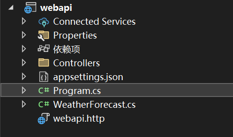

```cs
namespace webapi
{
    // 定义一个名为 webapi 的命名空间
    public class Program
    {
        // 公共静态 void Main 方法，它是应用程序的入口点
        public static void Main(string[] args)
        {
            // 创建一个 WebApplicationBuilder 实例，用于构建 Web 应用程序
            var builder = WebApplication.CreateBuilder(args);

            // 使用 builder.Services 添加服务到依赖注入容器中
            // AddControllers 添加控制器服务，这些控制器用于处理 HTTP 请求
            builder.Services.AddControllers();
            // AddEndpointsApiExplorer 添加 Endpoints API 探索器服务，用于生成 API 文档
            builder.Services.AddEndpointsApiExplorer();
            // AddSwaggerGen 添加 Swagger 生成服务，用于生成 API 文档和 Swagger UI
            builder.Services.AddSwaggerGen();

            // 构建 Web 应用程序实例
            var app = builder.Build();

            // 配置 HTTP 请求管道
            // 如果应用程序环境是开发环境，则启用 Swagger 和 Swagger UI
            if (app.Environment.IsDevelopment())
            {
                app.UseSwagger();
                app.UseSwaggerUI();
            }

            // 使用 HttpsRedirection 中间件，确保所有请求都被重定向到 HTTPS
            app.UseHttpsRedirection();

            // 使用 Authorization 中间件，允许身份验证和授权
            app.UseAuthorization();

            // MapControllers 中间件将控制器映射到路由，以便处理 HTTP 请求
            app.MapControllers();

            // 启动应用程序并等待请求
            app.Run();
        }
    }
}


```

# Restful

RESTful 是一种基于 REST（Representational State Transfer，表述性状态转移） 架构风格的设计方法，主要用于构建面向资源的网络应用程序（通常是 Web API）。

# apiController

```cs
[ApiController]
[Route("api/[controller]")]
public class UsersController : ControllerBase
{
    // GET /api/users
    [HttpGet]
    public IActionResult GetUsers()
    {
        var users = new List<string> { "Alice", "Bob", "Charlie" };
        return Ok(users);
    }

    // GET /api/users/{id}
    [HttpGet("{id}")]
    public IActionResult GetUser(int id)
    {
        var user = "User" + id;
        return Ok(user);
    }

    // POST /api/users
    [HttpPost]
    public IActionResult CreateUser([FromBody] string userName)
    {
        return CreatedAtAction(nameof(GetUser), new { id = 1 }, userName);
    }

    // PUT /api/users/{id}
    [HttpPut("{id}")]
    public IActionResult UpdateUser(int id, [FromBody] string userName)
    {
        return NoContent();
    }

    // DELETE /api/users/{id}
    [HttpDelete("{id}")]
    public IActionResult DeleteUser(int id)
    {
        return NoContent();
    }
}
```

## ControllerBase 和 Controller

Controller类继承⾃ControllerBase，Controller类在ControllerBase的基础上增加了和视图相关的⽅法

```cs
public class HomeController : Controller
{
    // GET: /Home/Index
    public IActionResult Index()
    {
        var model = new { Message = "Welcome to ASP.NET Core MVC!" };
        return View(model);  // Returns a view with the model data
    }

    // POST: /Home/Submit
    [HttpPost]
    public IActionResult Submit(string name)
    {
        // Handle form submission
        return RedirectToAction("Index"); // Redirects to another action (Index)
    }
}
```

## `[Route]`

### `[action]`

```cs
[ApiController]

[Route("api/[controller]/[action]")]
public class ProductController : ControllerBase
{   
  // GET /api/product/getproducts
    [HttpGet]
    public IActionResult GetProducts()
    {
        return Ok(new { Products = new[] { "Laptop", "Phone", "Tablet" } });
    }
    // GET /api/product/getproductbyid/1
    [HttpGet("{id}")]
    public IActionResult GetProductById(int id)
    {
        return Ok(new { ProductId = id, Name = "Laptop" });
    }
}
```

### `{id}`

```cs
[ApiController]
[Route("api/[controller]/{id}")]
public class ProductController : ControllerBase
{ 
  // GET /api/product/1 (where 1 is the id parameter).
    [HttpGet]
    public IActionResult GetProductById(int id)
    {
        return Ok(new { ProductId = id, Name = "Laptop" });
    }
}
```

### `[action]/{id}`

```cs
[ApiController]
[Route("api/[controller]/[action]/{id}")]
public class ProductController : ControllerBase
{
    [HttpGet]
    public IActionResult GetProductById(int id)
    {
        return Ok(new { ProductId = id, Name = "Laptop" });
    }
}
```

### `[area]`

```cs
[ApiController]
[Route("api/[area]/[controller]/[action]")]
[Area("Admin")]
public class AdminProductController : ControllerBase
{   
  // Route: GET /api/admin/adminproduct/getadminproductdetails
    [HttpGet]
    public IActionResult GetAdminProductDetails()
    {
        return Ok(new { ProductId = 1, AdminAccess = true });
    }
}
```

### `{language}`

```cs
[ApiController]
[Route("api/[controller]/[action]/{language}")]
public class ProductController : ControllerBase
{
    [HttpGet]
    public IActionResult GetLocalizedProductInfo(string language)
    {
        return Ok(new { Language = language, ProductName = "Laptop" });
    }
}

```

### Routing Attribute and Action Method Name

```cs
[HttpGet("forecast")]
public IActionResult GetForecast()
{
    return Ok("Forecast data");
}
```

**Routing Attribute**

- `[HttpGet("forecast")]` 定义了方法响应的请求路径
- 代表处理`api/{controller}/forecast` 路径的 GET 请求。

```cs
[Route("api/[controller]/[action]")]
public class WeatherController : ControllerBase
{   
  // GET /api/weather/forecast2
    [HttpGet("forecast2")]
    public IActionResult GetForecast()
    {
        return Ok("Forecast data");
    }
}
```

**Action Method Name**

- 只是方法名

```cs
[Route("api/[controller]/[action]")]
public class WeatherController : ControllerBase
{   
  // GET /api/weather/forecast
    [HttpGet]
    public IActionResult GetForecast()
    {
        return Ok("Forecast data");
    }
    // GET /api/weather/getweather
    [HttpGet]
    public IActionResult GetWeather()
    {
        return Ok("Weather data");
    }
}
```

## parameter

### `[FromBody]`

```cs
public class WeatherForecast
{
    public string Date { get; set; }
    public int TemperatureC { get; set; }
    public string Summary { get; set; }
}


[ApiController]
[Route("api/[controller]")]
public class WeatherController : ControllerBase
{
    // POST /api/weather
    [HttpPost]
    public IActionResult CreateForecast([FromBody] WeatherForecast forecast)
    {
        // The 'forecast' object will be populated from the request body
        /*
        
          {
            "Date": "2024-11-25",
            "TemperatureC": 22,
            "Summary": "Sunny"
          }
        */ 
        return Ok(forecast);
    }
}
```
