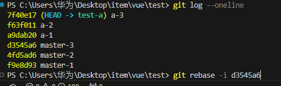
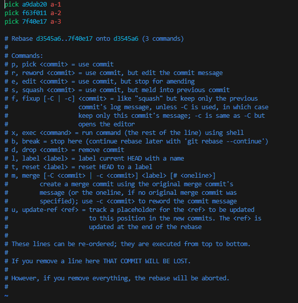
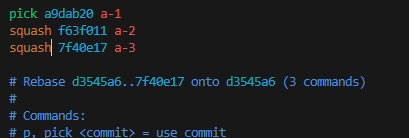
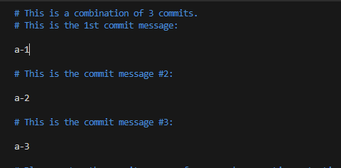
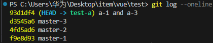

"HEAD"当前活跃分支的游标,

```sequence Greetings
Original ->> WorkSpace:  edit file
WorkSpace ->> Original: git checkout .(已跟踪)
WorkSpace ->> Original: git clean -df(未跟踪)
WorkSpace ->> Stage: git add .
Stage ->> WorkSpace: git reset HEAD/[fileName]
Stage ->> Repository: git commit
Repository ->>Stage: git reset --soft HEAD^
Repository ->> Remote: git push
Remote ->> Repository: git fetch
Remote ->> Repository: git remote update
Remote ->> WorkSpace: git pull
```


# stash

代码写一半，有bug要改

```bash
# 隐藏
git stash
# 弹出
git stash pop
```
- `git stash save "save message"`：执行存储时，添加备注，方便查找，只有 git stash 也是可以的
- `git stash list`：查看stash了哪些存储
- `git stash show`：显示做了哪些改动，默认show第一个存储,如果要显示其他存贮，后面加 stash@{$num}，比如第二个 git stash show stash@{1}
- `git stash show -p`：显示第一个存储的改动，如果想显示其他存存储，命令：git stash show stash@{$num} -p ，比如第二个：git stash show stash@{1} -p
- `git stash apply`：应用某个存储，但不会把存储从存储列表中删除，默认使用第一个存储,即 stash@{0}，如果要使用其他的，git stash apply stash@{$num}， 比如第二个：git stash apply stash@{1}
- `git stash pop`：恢复之前缓存的工作目录，将缓存堆栈中的对应stash删除，并将对应修改应用到当前的工作目录下，默认为第一个 stash，即 stash@{0}，如果要应用并删除其他stash，命令：git stash pop stash@{$num}，比如应用并删除第二个：git stash pop stash@{1}
- `git stash drop stash@{$num}`：丢弃 stash@{$num} 存储，从列表中删除这个存储
- `git stash clear`：删除所有缓存的stash

# branch

## merge 和 rebase

```txt
     D---E test
    /
A---B---C---F master
```
`git merge test`

```txt
     D--------E
    /          \
A---B---C---F---G    test , master

```
`git rebase test`

```txt
 A---C---D---E---C `---F` test , master

```

## fork项目更新

```bash
git remote add <originname> <gitaddress>
git fetch <originname>
git checkout master
git rebase <originname>/master
```

## 合并其他分支的文件

```bash
# 合并其他分支的文件
git checkout <其他分支>  <合并的文件路径>
# --patch 交互式地从另一个分支或提交中选择性地合并文件的一部分
git checkout --patch <其他分支>  <合并的文件路径>
```


# commit

## 更改提交的commit注释

```bash
git commit --amend -m "new commit message"
```
## 找回被删除的文件

```bash
#  查找删除文件的记录， 获取对应的commitID及要恢复的文件路径filepath
git log --diff-filter=D --summary
#  恢复filepath这个文件， 原理： 撤回filepath这个文件到上次(～1)提交的commit状态
git checkout <commitID>~1 filepath
```
## 本地回到某次commit

```bash
# 会清除工作区和暂存区
git reset <commitId> --hard
```
## 合并单个commit

把某个commit id提交合并到当前分支
```bash
# 把某个commit id提交合并到当前分支
git cheery-pick <commitID>
```

## 合并多个commit


合并[startcommit] ~ [endCommitID] 到master分支
```bash
# 创建一个commit到[endcommitId]的新分支
git checkout -b <newbranch> <endcommitId>
# 从[startcommit]开始合并
git rebase --onto master <startcommit>^
```

## 将多个commit信息合并为一个commit


```bash
# 从HEAD版本开始往过去数3个版本
$ git rebase -i HEAD~3

# 合并到指定版本号（不包含此版本）
$ git rebase -i [commitid]
```



pick：保留该commit`（缩写:p) `
squash：将该commit和前一个commit合并`（缩写:s）`

保存后再次进入vim

更改去掉前面的commit信息，将最后一次的commit信息 `a-3`改为`a-1 and a-3`



**vim操作**
打开文件：`vim 文件名`
编辑文件：进入编辑模式（按 `i` 键）
保存文件：退出插入模式（按 `Esc` 键），然后输入 `:w` 或 `:wq`
光标移动、复制粘贴、删除等操作在普通模式下进行
末行模式下的操作包括保存退出、替换、分屏等

# tag

## 对当前最新的commit打tag

```bash
git tag v1.0
```

## 对历史提交的


# rebase and revert
