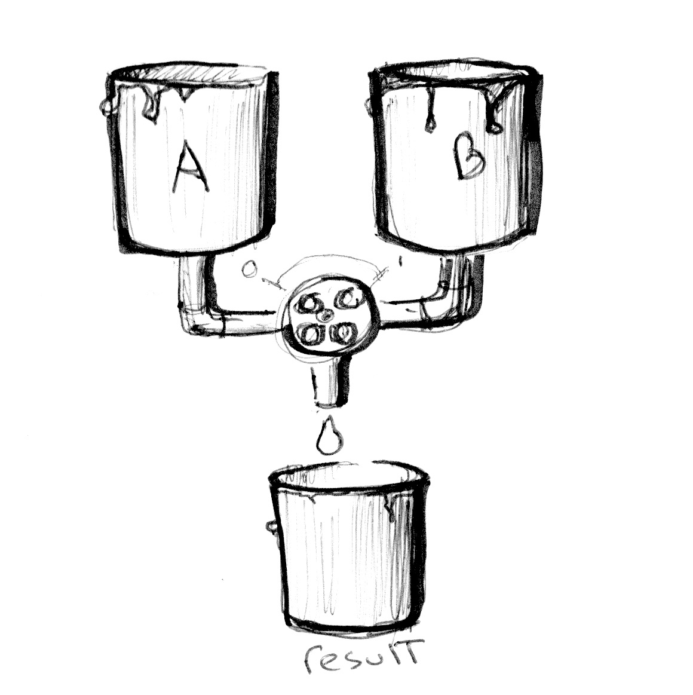
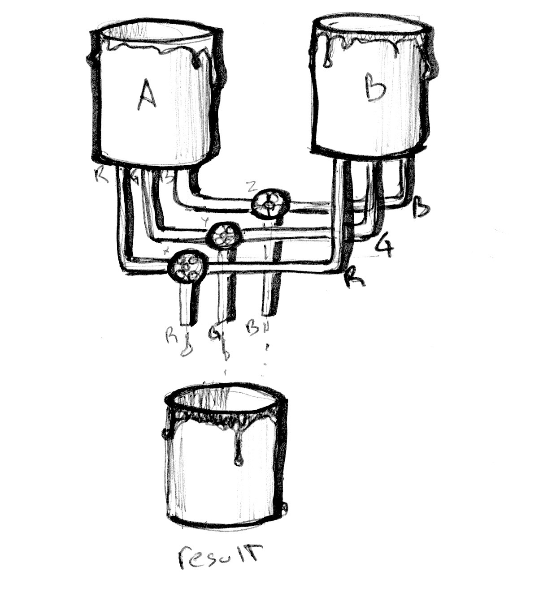

 部分参考： 《OpenGL 编程指南》、《The Book of Shader》

## 混合颜色



```glsl
#ifdef GL_ES
precision mediump float;
#endif

uniform vec2 u_resolution;
uniform float u_time;

vec3 colorA = vec3(0.149,0.141,0.912);
vec3 colorB = vec3(1.000,0.833,0.224);

void main() {
    vec3 color = vec3(0.0);

    float pct = abs(sin(u_time));

    // Mix uses pct (a value from 0-1) to
    // mix the two colors
    color = mix(colorA, colorB, pct);

    gl_FragColor = vec4(color,1.0);
}


```

<div ref="mixRef"></div>

## 渐变



```glsl
#ifdef GL_ES
precision mediump float;
#endif

#define PI 3.14159265359

uniform vec2 u_resolution;
uniform vec2 u_mouse;
uniform float u_time;

vec3 colorA = vec3(0.149,0.141,0.912);
vec3 colorB = vec3(1.000,0.833,0.224);

float plot (vec2 st, float pct){
  return  smoothstep( pct-0.01, pct, st.y) -
          smoothstep( pct, pct+0.01, st.y);
}

void main() {
    vec2 st = gl_FragCoord.xy/u_resolution.xy;
    vec3 color = vec3(0.0);

    vec3 pct = vec3(st.x);

    // pct.r = smoothstep(0.0,1.0, st.x);
    // pct.g = sin(st.x*PI);
    // pct.b = pow(st.x,0.5);

    color = mix(colorA, colorB, pct);

    // Plot transition lines for each channel
    color = mix(color,vec3(1.0,0.0,0.0),plot(st,pct.r));
    color = mix(color,vec3(0.0,1.0,0.0),plot(st,pct.g));
    color = mix(color,vec3(0.0,0.0,1.0),plot(st,pct.b));

    gl_FragColor = vec4(color,1.0);
}


```

<div ref="fadeRef"></div>


###

<div ref="sunsetRef"></div>

## HSB

```glsl
#ifdef GL_ES
precision mediump float;
#endif

uniform vec2 u_resolution;
uniform float u_time;

vec3 rgb2hsb( in vec3 c ){
    vec4 K = vec4(0.0, -1.0 / 3.0, 2.0 / 3.0, -1.0);
    vec4 p = mix(vec4(c.bg, K.wz),
                 vec4(c.gb, K.xy),
                 step(c.b, c.g));
    vec4 q = mix(vec4(p.xyw, c.r),
                 vec4(c.r, p.yzx),
                 step(p.x, c.r));
    float d = q.x - min(q.w, q.y);
    float e = 1.0e-10;
    return vec3(abs(q.z + (q.w - q.y) / (6.0 * d + e)),
                d / (q.x + e),
                q.x);
}

//  Function from Iñigo Quiles
//  https://www.shadertoy.com/view/MsS3Wc
vec3 hsb2rgb( in vec3 c ){
    vec3 rgb = clamp(abs(mod(c.x*6.0+vec3(0.0,4.0,2.0),
                             6.0)-3.0)-1.0,
                     0.0,
                     1.0 );
    rgb = rgb*rgb*(3.0-2.0*rgb);
    return c.z * mix(vec3(1.0), rgb, c.y);
}

void main(){
    vec2 st = gl_FragCoord.xy/u_resolution;
    vec3 color = vec3(0.0);

    // We map x (0.0 - 1.0) to the hue (0.0 - 1.0)
    // And the y (0.0 - 1.0) to the brightness
    color = hsb2rgb(vec3(st.x,1.0,st.y));

    gl_FragColor = vec4(color,1.0);
}


```

<div ref="hsbRef"></div>

```glsl
#ifdef GL_ES
precision mediump float;
#endif

#define TWO_PI 6.28318530718

uniform vec2 u_resolution;
uniform float u_time;

//  Function from Iñigo Quiles
//  https://www.shadertoy.com/view/MsS3Wc
vec3 hsb2rgb( in vec3 c ){
    vec3 rgb = clamp(abs(mod(c.x*6.0+vec3(0.0,4.0,2.0),
                             6.0)-3.0)-1.0,
                     0.0,
                     1.0 );
    rgb = rgb*rgb*(3.0-2.0*rgb);
    return c.z * mix( vec3(1.0), rgb, c.y);
}

void main(){
    vec2 st = gl_FragCoord.xy/u_resolution;
    vec3 color = vec3(0.0);

    // Use polar coordinates instead of cartesian
    vec2 toCenter = vec2(0.5)-st;
    float angle = atan(toCenter.y,toCenter.x);
    float radius = length(toCenter)*2.0;

    // Map the angle (-PI to PI) to the Hue (from 0 to 1)
    // and the Saturation to the radius
    color = hsb2rgb(vec3((angle/TWO_PI)+0.5,radius,1.0));

    gl_FragColor = vec4(color,1.0);
}
```

<div ref="rgbRef"></div>

<script setup>
import {ref,onMounted} from 'vue'
import * as THREE from 'three'
import {
    OrbitControls
} from 'three/examples/jsm/controls/OrbitControls'

const initScene = (shader)=>{
    // 1.创建场景
    const scene = new THREE.Scene()
    const clock = new THREE.Clock();
    const uniforms = {
        u_time: { type: "f", value: 1.0 },
        u_resolution: { type: "v2", value: new THREE.Vector2()}
    }
    // 2.创建相机
    const camera = new THREE.PerspectiveCamera(75,
    2 , 0.1, 1000);

    // 设置相机位置
    camera.position.set(0, 0, 20)
    scene.add(camera)

    // 着色器配置
    const shaderMaterial = new THREE.ShaderMaterial({
        uniforms:uniforms,
            vertexShader:`
        precision lowp float;
        varying vec2 v_uv;
        void main(){
            v_uv = uv;
            gl_Position = projectionMatrix * viewMatrix * modelMatrix * vec4( position, 1.0 );
        }
        `,
        fragmentShader: shader.fragmentShader,
        side: THREE.DoubleSide
    })
    // 创建平面
    const floor = new THREE.Mesh(new THREE.PlaneGeometry(100, 100), shaderMaterial)
    floor.position.set(0,0,0)
    scene.add(floor)
    // 初始化渲染器
    const renderer = new THREE.WebGLRenderer()
    if(!__VUEPRESS_SSR__) {
        renderer.setPixelRatio( window.devicePixelRatio );
    }
    // 设置渲染器大小

    renderer.setSize(shader.shaderDom.value.offsetWidth, shader.shaderDom.value.offsetWidth/2)
    renderer.shadowMap.enabled = true
    shader.shaderDom.value.appendChild(renderer.domElement)
    renderer.render(scene,camera)
        // 创建轨道控制器
    const controls = new OrbitControls(camera, renderer.domElement)
    // 设置控制器阻尼
    controls.enableDamping = true
    uniforms.u_resolution.value.x = renderer.domElement.width
    uniforms.u_resolution.value.y = renderer.domElement.height
    function render() {
        uniforms.u_time.value += clock.getDelta();
        controls.update()
        renderer.render(scene, camera)
        requestAnimationFrame(render)
    }

    render()

}
const mixRef = ref()
const mixShader = {
        shaderDom:mixRef,
        fragmentShader:`
# ifdef GL_ES
precision mediump float;
# endif

uniform vec2 u_resolution;
uniform float u_time;

vec3 colorA = vec3(0.149,0.141,0.912);
vec3 colorB = vec3(1.000,0.833,0.224);

void main() {
    vec3 color = vec3(0.0);

    float pct = abs(sin(u_time));

    // Mix uses pct (a value from 0-1) to
    // mix the two colors
    color = mix(colorA, colorB, pct);

    gl_FragColor = vec4(color,1.0);
}
`}

const fadeRef = ref()
const fadeShader = {
    shaderDom:fadeRef,
    fragmentShader:`
    #ifdef GL_ES
precision mediump float;
# endif

# define PI 3.14159265359

uniform vec2 u_resolution;
uniform vec2 u_mouse;
uniform float u_time;

vec3 colorA = vec3(0.149,0.141,0.912);
vec3 colorB = vec3(1.000,0.833,0.224);

float plot (vec2 st, float pct){
  return  smoothstep( pct-0.01, pct, st.y) -
          smoothstep( pct, pct+0.01, st.y);
}

void main() {
    vec2 st = gl_FragCoord.xy/u_resolution.xy;
    vec3 color = vec3(0.0);

    vec3 pct = vec3(st.x);

    // pct.r = smoothstep(0.0,1.0, st.x);
    // pct.g = sin(st.x*PI);
    // pct.b = pow(st.x,0.5);

    color = mix(colorA, colorB, pct);

    // Plot transition lines for each channel
    color = mix(color,vec3(1.0,0.0,0.0),plot(st,pct.r));
    color = mix(color,vec3(0.0,1.0,0.0),plot(st,pct.g));
    color = mix(color,vec3(0.0,0.0,1.0),plot(st,pct.b));

    gl_FragColor = vec4(color,1.0);
}

    `
}

const hsbRef = ref()
const hsbShader = {
    shaderDom:hsbRef,
    fragmentShader:`
    #ifdef GL_ES
precision mediump float;
# endif

uniform vec2 u_resolution;
uniform float u_time;

vec3 rgb2hsb( in vec3 c ){
    vec4 K = vec4(0.0, -1.0 / 3.0, 2.0 / 3.0, -1.0);
    vec4 p = mix(vec4(c.bg, K.wz),
                 vec4(c.gb, K.xy),
                 step(c.b, c.g));
    vec4 q = mix(vec4(p.xyw, c.r),
                 vec4(c.r, p.yzx),
                 step(p.x, c.r));
    float d = q.x - min(q.w, q.y);
    float e = 1.0e-10;
    return vec3(abs(q.z + (q.w - q.y) / (6.0 * d + e)),
                d / (q.x + e),
                q.x);
}

//  Function from Iñigo Quiles
//  https://www.shadertoy.com/view/MsS3Wc
vec3 hsb2rgb( in vec3 c ){
    vec3 rgb = clamp(abs(mod(c.x*6.0+vec3(0.0,4.0,2.0),
                             6.0)-3.0)-1.0,
                     0.0,
                     1.0 );
    rgb = rgb*rgb*(3.0-2.0*rgb);
    return c.z * mix(vec3(1.0), rgb, c.y);
}

void main(){
    vec2 st = gl_FragCoord.xy/u_resolution;
    vec3 color = vec3(0.0);

    // We map x (0.0 - 1.0) to the hue (0.0 - 1.0)
    // And the y (0.0 - 1.0) to the brightness
    color = hsb2rgb(vec3(st.x,1.0,st.y));

    gl_FragColor = vec4(color,1.0);
}

    `
}

const rgbRef = ref()
const rgbShader = {
    shaderDom:rgbRef,
    fragmentShader:`
    #ifdef GL_ES
precision mediump float;
# endif

# define TWO_PI 6.28318530718

uniform vec2 u_resolution;
uniform float u_time;

//  Function from Iñigo Quiles
//  https://www.shadertoy.com/view/MsS3Wc
vec3 hsb2rgb( in vec3 c ){
    vec3 rgb = clamp(abs(mod(c.x*6.0+vec3(0.0,4.0,2.0),
                             6.0)-3.0)-1.0,
                     0.0,
                     1.0 );
    rgb = rgb*rgb*(3.0-2.0*rgb);
    return c.z * mix( vec3(1.0), rgb, c.y);
}

void main(){
    vec2 st = gl_FragCoord.xy/u_resolution;
    vec3 color = vec3(0.0);

    // Use polar coordinates instead of cartesian
    vec2 toCenter = vec2(0.5)-st;
    float angle = atan(toCenter.y,toCenter.x);
    float radius = length(toCenter)*2.0;

    // Map the angle (-PI to PI) to the Hue (from 0 to 1)
    // and the Saturation to the radius
    color = hsb2rgb(vec3((angle/TWO_PI)+0.5,radius,1.0));

    gl_FragColor = vec4(color,1.0);
}

    `

}

const sunsetRef = ref()
const sunsetShader = {
    shaderDom:sunsetRef,
    fragmentShader:`
    uniform float u_time;
varying vec2 v_uv;
vec4 HorizontalGradient(vec2 uv, vec4 color1, vec4 color2){
  float t = uv.x;
  return color1 * (1.0 - t) + color2 * t;
}
void main(){
  // 落日效果
  vec4 gradientColor = HorizontalGradient(v_uv, vec4(1.0, 0.5, 0.0, 1.0), vec4(1.0, 0.0, 0.0, 1.0));
  vec4 sunColor = vec4(1.0, 1.0, 0.0, 1.0);
  vec4 skyColor = vec4(0.0, 0.2, 0.6, 1.0);
  
  // 设置光照
  vec3 sunDir = vec3(cos(u_time), sin(u_time), 0.0);
  float sunDot = dot(sunDir, vec3(0.0, 0.0, 1.0));
  sunColor.a = smoothstep(-0.03, 0.0, sunDot);
  
  // 定义最终颜色
  vec4 finalColor = gradientColor + skyColor * (1.0 - sunColor.a) + sunColor * sunColor.a;
  gl_FragColor = finalColor;
}
    `

}


onMounted(()=>{
    initScene(mixShader)
    initScene(fadeShader)
    initScene(hsbShader)
    initScene(rgbShader)
    initScene(sunsetShader)
})
</script>
