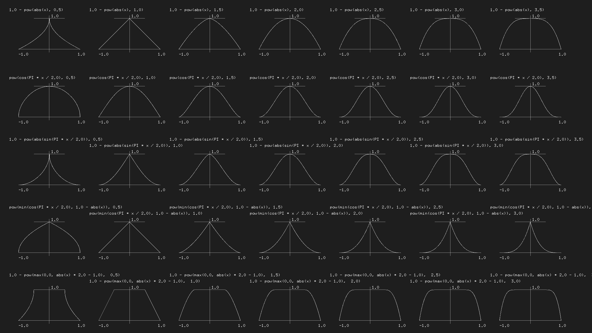

 部分参考： 《OpenGL 编程指南》、《The Book of Shader》

## 造型函数



```glsl
// 指定GLSL版本和浮点数精度
#ifdef GL_ES
precision mediump float;
#endif

// 声明需要用到的uniform数据，分别是画布大小和鼠标位置和时间
uniform vec2 u_resolution;
uniform vec2 u_mouse;
uniform float u_time;

// Plot a line on Y using a value between 0.0-1.0
// 定义一个绘制Y轴上线条的函数，接受一个vec2类型的参数st，可以表示屏幕上的任意位置
float plot(vec2 st) {    
    // 使用smoothstep函数定义线条形状，参数分别为线条宽度（0.0-1.0）、起点、终点
    // smoothstep函数会将参数在起点和终点之间线性插值，返回一个0.0-1.0之间的值，用于表示线条的明暗程度
    return smoothstep(0.02, 0.0, abs(st.y - st.x));
}
/*
plot 函数返回一个介于 0 到 1 之间的值 
pct，表示当前像素在曲线上的位置占总曲线长度的比例。为了让这条曲线具有动态效果，我们需要将原本的灰色线条逐步变成绿色。

这时候，这行代码起到的作用就是根据 pct 来控制从灰色逐渐过渡到绿色的过程。
首先，(1.0-pct)*color 表示计算出当前像素的颜色混合值，
其中 (1.0-pct) 表示一个从 1 到 0 的过渡值，
表示当前像素离曲线终点越来越近，因此越来越接近绿色；
而 color 表示原本的灰色线条的颜色混合值。

同时，pct*vec3(0.0,1.0,0.0) 表示一个绿色条条的混合值，
其中 pct 表示从 0 到 1 的过渡值，表示当前像素离曲线起点越来越近，
因此越来越应该有绿色条条的颜色混合；
而 vec3(0.0,1.0,0.0) 表示绿色条条的 RGB 值。

通过这两个混合值的相加，就得到了逐步从灰色到绿色的颜色过渡效果。
具体而言，当 pct 为 0 时，(1.0-pct)*color 计算出的混合值是灰色线条的颜色混合值；
当 pct 为 1 时，pct*vec3(0.0,1.0,0.0) 计算出的混合值是绿色条条的颜色混合值；
而在中间的过程中，灰色的混合值和绿色的混合值按比例相加，得到的颜色就逐步过渡从灰色到绿色。

*/
void main() {
    // 获取当前像素在屏幕中的位置，将其转换为归一化的坐标系（0.0-1.0之间）
    vec2 st = gl_FragCoord.xy/u_resolution;

    // 将当前位置的x坐标作为y值
    float y = st.x;

    // 设置颜色为y对应的灰色
    vec3 color = vec3(y);

    // 使用plot函数绘制一条线条
    // 将plot函数的返回值作为透明度，使线条逐渐出现
    float pct = plot(st);

    color = (1.0-pct)*color+pct*vec3(0.0,1.0,0.0);

    // 输出颜色
    gl_FragColor = vec4(color,1.0);
}
```

<div ref="plotRef"></div>

```glsl
// Author: Inigo Quiles
// Title: Expo

// 精度修饰符
#ifdef GL_ES
precision mediump float;
#endif

// 定义常量PI
#define PI 3.14159265359

// 顶点着色器传入的变量
uniform vec2 u_resolution; // 屏幕分辨率
uniform vec2 u_mouse; // 鼠标位置
uniform float u_time; // 时间戳

// 定义一个用于绘制曲线的函数
float plot(vec2 st, float pct){
  return  smoothstep( pct-0.02, pct, st.y) -
          smoothstep( pct, pct+0.02, st.y); 
          // smoothstep函数是一个常用的插值函数，用于进行平滑过渡，
          //具体实现可见链接：http://lolengine.net/blog/2015/03/14/better-function-for-linearly-interpolating-between-two-values
}

// 主函数
void main() {
    vec2 st = gl_FragCoord.xy/u_resolution; // 获取片元坐标，转化为0~1范围内的值

    float y = pow(st.x,5.0); // 计算x的5次方

    vec3 color = vec3(y); // 用y的值作为RGB颜色通道，生成一个颜色向量

    float pct = plot(st,y); // 计算st点在曲线上的位置

    // 根据st点在曲线上的位置来改变渲染颜色
    color = (1.0-pct)*color+pct*vec3(0.0,1.0,0.0);

    gl_FragColor = vec4(color,1.0); // 把颜色向量转化为，最终的片元颜色
}

```

<div ref="powRef"></div>

```glsl
#ifdef GL_ES
precision mediump float;
#endif

#define PI 3.14159265359

uniform vec2 u_resolution;
uniform float u_time;

/*
smoothstep(edge0, edge1, x) 函数的作用是在 edge0 和 edge1 之间，
按照第二个自变量 x 的值进行插值计算，返回一个0到1之间的值。
当 x 小于等于 edge0 时，返回0.0，当 x 大于等于 edge1 时，返回1.0。

st =  gl_FragCoord.xy
pct = step(0.5,st.x)


*/
float plot(vec2 st, float pct){
  return  smoothstep( pct-0.02, pct, st.y) -
          smoothstep( pct, pct+0.02, st.y);
}

void main() {
    vec2 st = gl_FragCoord.xy/u_resolution;

    /*
    edge 的值被设为0.5，而 x 的值是当前像素点的横坐标 st.x 。
    由于 x 只有大于0.5时，step函数才会返回1.0，
    所以，当 st.x 大于0.5时， y 的值为1.0，也就是白色，
    反之则是0.0，也就是黑色。
    */
    float y = step(0.5,st.x);

    vec3 color = vec3(y);
    /*
    
    ct=0时的颜色值为color； 
    pct * vec3(0.0, 1.0, 0.0) 表示当前像素在曲线上的位置是绿色区域时，即pct=1时颜色值为绿色，
    */
    float pct = plot(st,y);
    color = (1.0-pct)*color+pct*vec3(0.0,1.0,0.0);

    gl_FragColor = vec4(color,1.0);
}
```

<div ref="stepRef"></div>

### smoothstep

```glsl
/*
当x等于t1时，结果值为0；
当x等于t2时，结果值为1
*/

float smoothstep(float t1, float t2, float x) {
  // Scale, bias and saturate x to 0..1 range
 
  x = clamp((x - t1) / (t2 - t1), 0.0, 1.0); 
  // Evaluate polynomial
  return x * x * (3 - 2 * x);
}
```

### clamp

是一个用于将值限制在指定范围内的 GLSL 函数。

这个函数接收三个参数：x 表示要限制的值，minVal 表示值允许的最小值，maxVal 表示值允许的最大值。函数的具体作用是：

如果 x 小于最小值，则返回最小值 minVal。

如果 x 大于最大值，则返回最大值 maxVal。

```glsl
float clamp(float x, float minVal, float maxVal)
{
    return min(max(x, minVal), maxVal);
}

```

## 控制函数

1. 布尔类型 `bool`
   - 描述：只有两个可能取值 true/false 的类型。
   - 示例：

     ```glsl
     /* 声明一个布尔类型变量。*/
     bool b = true;
     ```

2. 浮点数类型 `float`
   - 描述：浮点数类型变量，用于存储实数。
   - 示例：

     ```glsl
     /* 声明一个浮点数类型变量。*/
     float f = 1.0;
     ```

3. 整数类型 `int`
   - 描述：用于表示整数类型的变量。
   - 示例：

     ```glsl
     /* 声明一个整数类型变量。*/
     int i = 1;
     ```

4. 无符号整数类型 `uint`
   - 描述：只有正整数的整数类型。
   - 示例：

     ```glsl
     /* 声明一个无符号整数类型的变量。*/
     uint u = 1u;
     ```

5. 双精度浮点数类型 `double`
   - 描述：用于存储双精度浮点数的类型变量。
   - 示例：

     ```glsl
     /* 声明一个双精度浮点数类型变量。*/
     double d = 1.0;
     ```

6. 布尔向量类型 `bvec2`, `bvec3`, `bvec4`
   - 描述：由布尔类型组成的矢量类型。
   - 示例：

     ```glsl
     /* 声明一个长度为2的布尔向量类型变量。*/
     bvec2 b = bvec2(true, false);
     ```

7. 整数向量类型 `ivec2`, `ivec3`, `ivec4`

- 描述：由整数类型组成的矢量类型。
- 示例：

     ```glsl
     /* 声明一个长度为2的整数向量类型变量。*/
     ivec2 i = ivec2(1, 2);
     ```

8. 无符号整数向量类型 `uvec2`, `uvec3`, `uvec4`

- 描述：由无符号整数类型组成的矢量类型。
- 示例：

     ```glsl
     /* 声明一个长度为2的无符号整数向量类型变量。*/
     uvec2 u = uvec2(1u, 2u);
     ```

9. 浮点数向量类型 `vec2`, `vec3`, `vec4`

- 描述：由浮点数类型组成的矢量类型。
- 示例：

     ```glsl
     /* 声明一个长度为2的浮点数向量类型变量。*/
     vec2 v = vec2(1.0, 2.0);
     ```

10. 2x2、3x3、4x4 矩阵类型 `mat2`, `mat3`, `mat4`

- 描述：由浮点数类型组成的矩阵类型，可用于表示变换矩阵。
- 示例：

     ```glsl
     /* 声明一个2x2矩阵类型变量。*/
     mat2 M = mat2(1.0, 2.0, 3.0, 4.0);
     ```

11. 2x3、2x4、3x2、3x4、4x2、4x3 矩阵类型 `mat2x3`, `mat2x4`, `mat3x2`, `mat3x4`, `mat4x2`, `mat4x3`

- 描述：由浮点数类型组成的矩阵类型，可用于表示变换矩阵。
- 示例：

     ```glsl
     /* 声明一个2x3矩阵类型变量。*/
     mat2x3 M = mat2x3(1.0, 2.0, 3.0, 4.0, 5.0, 6.0);
     ```

## 函数可视化

<iframe src="https://graphtoy.com/" style="width:100%;min-height:1000px;"></iframe>

## 数学函数

1. `abs`
   - 使用格式：`abs(x)`
   - 功能：计算参数 `x` 的绝对值。
   - 参数说明：`x` 可以是标量或矢量。
   - 示例：

     ```glsl
     /* 计算标量的绝对值。 */
     float a = 3.14159;
     float absA = abs(a);
     
     /* 计算矢量的绝对值。 */
     vec3 v = vec3(-1.0, 2.0, -3.0);
     vec3 absV = abs(v);
     ```

2. `sign`
   - 使用格式：`sign(x)`
   - 功能：返回参数 `x` 的符号，如果 `x` 是正数则返回 `1.0`，如果 `x` 是负数则返回 `-1.0`，如果 `x` 是零则返回 `0.0`。
   - 参数说明：`x` 可以是标量或矢量。
   - 示例：

     ```glsl
     /* 计算标量的符号。 */
     float a = -8.6;
     float sgnA = sign(a);
     
     /* 计算矢量的符号。 */
     vec4 v = vec4(1.5, -2.7, 0.0, 12.6);
     vec4 sgnV = sign(v);
     ```

3. `floor`
   - 使用格式：`floor(x)`
   - 功能：返回比参数 `x` 小的最大整数。如果 `x` 为正数，则返回小于或等于 `x` 的最大整数；如果 `x` 为负数，则返回小于 `x` 的最大整数。
   - 参数说明：`x` 可以是标量或矢量。
   - 示例：

     ```glsl
     /* 计算标量的下舍整数。 */
     float a = 3.8;
     float floorA = floor(a);
     
     /* 计算矢量的下舍整数。 */
     vec3 v = vec3(-1.2, 2.7, 3.9);
     vec3 floorV = floor(v);
     ```

4. `trunc`
   - 使用格式：`trunc(x)`
   - 功能：返回与参数 `x` 相等或比它小的最大整数。如果 `x` 为正数，则返回小于或等于 `x` 的最大整数；如果 `x` 为负数，则返回大于或等于 `x` 的最大整数。
   - 参数说明：`x` 可以是标量或矢量。
   - 示例：

     ```glsl
     /* 计算标量的截断整数。 */
     float a = -2.7;
     float truncA = trunc(a);
     
     /* 计算矢量的截断整数。 */
     vec3 v = vec3(-1.2, 2.7, 3.9);
     vec3 truncV = trunc(v);
     ```

5. `round`
   - 使用格式：`round(x)`
   - 功能：将参数 `x` 四舍五入到最接近的整数。
   - 参数说明：`x` 可以是标量或矢量。
   - 示例：

     ```glsl
     /* 四舍五入标量到最接近的整数。 */
     float a = 3.8;
     float roundA = round(a);
     
     /* 四舍五入矢量到最接近的整数。 */
     vec3 v = vec3(-1.2, 2.7, 3.9);
     vec3 roundV = round(v);
     ```

6. `roundEven`
   - 使用格式：`roundEven(x)`
   - 功能：将参数 `x` 四舍五入到最接近的偶数。
   - 参数说明：`x` 可以是标量或矢量。
   - 示例：

     ```glsl
     /* 四舍五入标量到最接近的偶数。 */
     float a = 3.5;
     float roundEvenA = roundEven(a);
     
     /* 四舍五入矢量到最接近的偶数。 */
     vec3 v = vec3(-1.2, 2.5, 3.9);
     vec3 roundEvenV = roundEven(v);
     ```

7. `ceil`
   - 使用格式：`ceil(x)`
   - 功能：返回比参数 `x` 大的最小整数，即返回大于或等于 `x` 的最小整数。
   - 参数说明：`x` 可以是标量或矢量。
   - 示例：

     ```glsl
     /* 计算标量的上舍整数。 */
     float a = -1.8;
     float ceilA = ceil(a);
     
     /* 计算矢量的上舍整数。 */
     vec3 v = vec3(-1.2, 2.7, 3.9);
     vec3 ceilV = ceil(v);
     ```

8. `fract`
   - 使用格式：`fract(x)`
   - 功能：返回参数 `x` 的小数部分，即返回 `x - floor(x)`。
   - 参数说明：`x` 可以是标量或矢量。
   - 示例：

     ```glsl
     /* 计算标量的小数部分。 */
     float a = 3.8;
     float fractA = fract(a);
     
     /* 计算矢量的小数部分。 */
     vec3 v = vec3(-1.2, 2.7, 3.9);
     vec3 fractV = fract(v);
     ```

9. `mod`
   - 使用格式：`mod(x, y)`
   - 功能：计算 `x` 除以 `y` 的余数。返回值的符号与 `y` 相同。
   - 参数说明：`x`、`y` 可以是标量或矢量，但它们必须是同维度的。
   - 示例：

     ```glsl
     /* 计算标量的余数。 */
     float a = -11.3;
     float b = 3.0;
     float modAB = mod(a, b);
     
     /* 计算矢量的余数。 */
     vec4 v1 = vec4(-5.8, 7.6, -9.9, 12.3);
     vec4 v2 = vec4(2.0, 3.0, -2.2, 10.0);
     vec4 modV = mod(v1, v2);
     ```

10. `modf`

- 使用格式：`modf(x, ip)`
- 功能：返回 `x` 的小数部分和整数部分。将整数部分存储在 `ip` 中，返回值为 `x` 的小数部分。
- 参数说明：
  - `x`：任意类型的数值。
  - `ip`：与 `x` 相同类型的变量，用于存储 `x` 的整数部分。
- 示例：

     ```glsl
     /* 使用 modf 函数将一个浮点数分解为整数部分和小数部分。 */
     float num = 3.14159;
     float ipart;
     float fpart = modf(num, ipart);
     /* ipart 等于 3，fpart 等于 0.14159 */
     ```

11. `min`

- 使用格式：`min(x, y)` 或 `min(x, y, z)` 或 `min(v1, v2)`（其中 `v1` 和 `v2` 为向量类型，且长度相同）
- 功能：返回 `x` 和 `y` 中的最小值，或返回 `x`、`y`、`z` 中的最小值，或返回向量 `v1` 和 `v2` 中每个对应位置的最小值。
- 参数说明：
  - `x`：任意类型的数值。
  - `y`：任意类型的数值，或 `z`（如果使用三个参数的形式）。
  - `z`：任意类型的数值（如果使用三个参数的形式）。
  - `v1`：与 `v2` 相同长度的向量。
  - `v2`：与 `v1` 相同长度的向量。
- 示例：

     ```glsl
     /* 使用 min 函数比较两个数的大小。 */
     float num1 = 10.0;
     float num2 = 20.0;
     float minValue = min(num1, num2);
     if (minValue == num1) {
         /* num1 是最小值 */
     } else {
         /* num2 是最小值 */
     }
     ```

12. `max`

- 使用格式：`max(x, y)` 或 `max(x, y, z)` 或 `max(v1, v2)`（其中 `v1` 和 `v2` 为向量类型，且长度相同）
- 功能：返回 `x` 和 `y` 中的最大值，或返回 `x`、`y`、`z` 中的最大值，或返回向量 `v1` 和 `v2` 中每个对应位置的最大值。
- 参数说明：
  - `x`：任意类型的数值。
  - `y`：任意类型的数值，或 `z`（如果使用三个参数的形式）。
  - `z`：任意类型的数值（如果使用三个参数的形式）。
  - `v1`：与 `v2` 相同长度的向量。
  - `v2`：与 `v1` 相同长度的向量。
- 示例：

     ```glsl
     /* 使用 max 函数比较两个数的大小。 */
     float num1 = 10.0;
     float num2 = 20.0;
     float maxValue = max(num1, num2);
     if (maxValue == num1) {
         /* num1 是最大值 */
     } else {
         /* num2 是最大值 */
     }
     ```

13. `clamp`

- 使用格式：`clamp(x, minVal, maxVal)` 或 `clamp(v, minVal, maxVal)`（其中 `v` 为向量类型）
- 功能：对 `x` 进行范围约束，返回在最小值 `minVal` 和最大值 `maxVal` 之间的值。对于向量 `v`，与 `x` 的处理方式相同。
- 参数说明：
  - `x`：任意类型的数值。
  - `v`：任意长度的向量。
  - `minVal`：任意类型的数值，表示下限。
  - `maxVal`：任意类型的数值，表示上限。
- 示例：

     ```glsl
     /* 使用 clamp 函数限制一个角度在 0 到 360 度之间。 */
     float angle = 420.0;
     angle = clamp(angle, 0.0, 360.0);
     /* angle 被约束在 0 到 360 度之间 */
     ```

14. `mix`

- 使用格式：`mix(x, y, a)`
- 功能：对 `x` 和 `y` 进行线性插值，系数为 `a`。若 `a = 0`，则结果为 `x`；若 `a = 1`，则结果为 `y`；若 `a = 0.5`，则结果为 `x` 和 `y` 的平均值。
- 参数说明：
  - `x`：类型和长度与 `y` 相同的矢量或标量。
  - `y`：类型和长度与 `x` 相同的矢量或标量。
  - `a`：类型和长度与 `x` 和 `y` 相同的矢量或标量。表示进行线性插值的系数。
- 示例：

     ```glsl
     /* 使用 mix 函数将两个颜色进行混合。 */
     vec4 color1 = vec4(1.0, 0.0, 0.0, 1.0);
     vec4 color2 = vec4(0.0, 1.0, 0.0, 1.0);
     float alpha = 0.5;
     vec4 blendedColor = mix(color1, color2, alpha);
     ```

15. `step`

- 使用格式：`step(edge, x)` 或 `step(v, x)`（其中 `v` 为向量类型）
- 功能：将 `x` 与阈值 `edge` 进行比较，若 `x` 小于等于 `edge`，则返回 0，否则返回 1。对于向量 `v`，与 `x` 的处理方式相同。
- 参数说明：
  - `edge`：任意类型的数值，表示阈值。
  - `x`：任意类型的数值。
  - `v`：任意长度的向量。
- 示例：

     ```glsl
     /* 使用 step 函数判断一个数是否在指定范围内。 */
     float num = 3.0;
     float low = 2.0;
     float high = 4.0;
     float result = step(low, num) * step(num, high);
     if (result == 1.0) {
         /* num 在指定范围内 */
     } else {
         /* num 不在指定范围内 */
     }
     ```

16. `smoothstep`

- 使用格式：`smoothstep(edge0, edge1, x)`
- 功能：对一个输入值 `x` 进行插值，返回一个在 `edge0` 和 `edge1` 之间的值，插值函数会在 `edge0` 和 `edge1` 之外返回 0 和 1。
- 参数说明：
  - `edge0`：类型和长度与 `x` 相同的矢量或标量。表示左插值边缘。
  - `edge1`：类型和长度与 `x` 相同的矢量或标量。表示右插值边缘。
  - `x`：类型和长度与 `edge0` 和 `edge1` 相同的矢量或标量。表示插值位置。
- 示例：

     ```glsl
     /* 使用 smoothstep 函数创建一个渐变效果。 */
     float start = 0.3;
     float end = 0.7;
     float value = 0.5;
     float smoothValue = smoothstep(start, end, value);
     ```

17. `isnan`

- 使用格式：`isnan(x)`
- 功能：判断输入值是否为 NaN。
- 参数说明：
  - `x`：类型和长度可以是任何 GLSL 支持的数值类型和矢量类型，表示需要检查的值。
- 示例：

     ```glsl
     /* 使用 isnan 函数检查值是否为 NaN。 */
     float value = 0.0 / 0.0;
     if (isnan(value)) {
         /* 处理 NaN 值 */
     }
     ```

18. `isinf`

- 使用格式：`isinf(x)`
- 功能：判断输入值是否为正无穷或负无穷。
- 参数说明：
  - `x`：类型和长度可以是任何 GLSL 支持的数值类型和矢量类型，表示需要检查的值。
- 示例：

     ```glsl
     /* 使用 isinf 函数检查值是否为正无穷或负无穷。 */
     float value = 1.0 / 0.0;
     if (isinf(value)) {
         /* 处理无穷大值 */
     }
     ```

19. `floatBitsToInt`

- 使用格式：`int floatBitsToInt(float value)`
- 功能：将 `value` 浮点数的位表示转换为整数。例如，若 `value` 的二进制表示为 `01000000100100000000000000000000`，则对应的整数为 `1071225248`。
- 参数说明：
  - `value`：需要转换为整数的单精度浮点数。
- 示例：

     ```glsl
     /* 将浮点数转换为整数。 */
     float myFloat = 3.14;
     int myInt = floatBitsToInt(myFloat);
     ```

20. `floatBitsToUint`

- 使用格式：`uint floatBitsToUint(float value)`
- 功能：将 `value` 浮点数的位表示转换为无符号整数。例如，若 `value` 的二进制表示为 `01000000100100000000000000000000`，则对应的无符号整数为 `1071225248`。
- 参数说明：
  - `value`：需要转换为无符号整数的单精度浮点数。
- 示例：

     ```glsl
     /* 将浮点数转换为无符号整数。 */
     float myFloat = 3.14;
     uint myUint = floatBitsToUint(myFloat);
     ```

21. `intBitsToFloat`

- 使用格式：`float intBitsToFloat(int value)`
- 功能：将 `value` 整数的位表示转换为单精度浮点数。例如，若 `value` 的二进制表示为 `01000000100100000000000000000000`，则对应的浮点数为 `3.1400001049041748`。
- 参数说明：
  - `value`：需要转换为浮点数的有符号整数。
- 示例：

     ```glsl
     /* 将整数转换为浮点数。 */
     int myInt = 1071225248;
     float myFloat = intBitsToFloat(myInt);
     ```

22. `uintBitsToFloat`

- 使用格式：`float uintBitsToFloat(uint value)`
- 功能：将 `value` 无符号整数的位表示转换为单精度浮点数。例如，若 `value` 的二进制表示为 `01000000100100000000000000000000`，则对应的浮点数为 `3.1400001049041748`。
- 参数说明：
  - `value`：需要转换为浮点数的无符号整数。
- 示例：

     ```glsl
     /* 将无符号整数转换为浮点数。 */
     uint myUint = 1071225248;
     float myFloat = uintBitsToFloat(myUint);
     ```

## 矩阵函数

1. `determinant`
   - 使用格式：`determinant(m)`
   - 功能：求矩阵 `m` 的行列式，表示矩阵的线性变换对面积或体积的伸缩因子。
   - 参数说明：
     - `m`：类型为矩阵的变量。要求矩阵是方阵，即行数和列数相等。
   - 返回值：类型为浮点数的变量，表示矩阵 `m` 的行列式值。
   - 示例：

     ```glsl
     /* 使用 determinant 函数计算一个矩阵的行列式值。 */
     mat2 m = mat2(
         vec2(1.0, 2.0),
         vec2(3.0, 4.0)
     );
     float det = determinant(m);
     ```

2. `mat4 translate(vec3 v)`
   - 使用格式：`mat4 translate(vec3 v)`
   - 功能：返回一个平移变换矩阵，将向量 `v` 指定的距离沿着坐标轴进行平移变换。
   - 参数说明：
     - `v`：一个包含三个浮点数的向量，表示沿着 x、y 和 z 轴平移的距离。
   - 示例：

     ```glsl
     /* 将一个三维物体沿着 x 轴平移 2.0 个单位。 */
     mat4 modelMatrix = translate(vec3(2.0, 0.0, 0.0));
     ```

3. `mat4 rotate(float angle, vec3 axis)`
   - 使用格式：`mat4 rotate(float angle, vec3 axis)`
   - 功能：返回一个旋转变换矩阵，将绕着向量 `axis` 指定的轴进行 `angle` 度的旋转变换。
   - 参数说明：
     - `angle`：旋转角度，单位为度数。正值表示逆时针旋转，负值表示顺时针旋转。
     - `axis`：一个包含三个浮点数的向量，表示旋转轴的方向。
   - 示例：

     ```glsl
     /* 将一个三维物体绕着 y 轴旋转 45 度。 */
     mat4 modelMatrix = rotate(45.0, vec3(0.0, 1.0, 0.0));
     ```

4. `mat4 scale(vec3 v)`
   - 使用格式：`mat4 scale(vec3 v)`
   - 功能：返回一个缩放变换矩阵，将物体在三个轴向上分别按照向量 `v` 指定的比例进行缩放。
   - 参数说明：
     - `v`：一个包含三个浮点数的向量，表示在 x、y 和 z 轴上进行缩放的比例。
   - 示例：

     ```glsl
     /* 将一个三维物体在 x 轴上缩小至原来的一半，y 和 z 轴上进行标准比例的缩放。 */
     mat4 modelMatrix = scale(vec3(0.5, 1.0, 1.0));
     ```

5. `mat4 transpose(mat4 m)`
   - 使用格式：`mat4 transpose(mat4 m)`
   - 功能：返回一个矩阵，其中输入矩阵 `m` 的行和列互换。
   - 参数说明：
     - `m`：一个 4x4 的浮点数矩阵。
   - 示例：

     ```glsl
     /* 计算一个转置矩阵。 */
     mat4 originalMatrix = mat4(1.0, 2.0, 3.0, 4.0,
                                5.0, 6.0, 7.0, 8.0,
                                9.0, 10.0, 11.0, 12.0,
                                13.0, 14.0, 15.0, 16.0);
     mat4 transposedMatrix = transpose(originalMatrix);
     ```

6. `mat4 inverse(mat4 m)`
   - 使用格式：`mat4 inverse(mat4 m)`
   - 功能：返回投影矩阵的逆矩阵。一个逆矩阵与其投影矩阵相乘的结果等于单位矩阵。
   - 参数说明：
     - `m`：一个 4x4 的浮点数矩阵，表示投影矩阵。
   - 示例：

     ```glsl
     /* 计算逆矩阵。 */
     mat4 projectionMatrix = perspective(radians(45.0), 1.0, 0.1, 100.0);
     mat4 invertedMatrix = inverse(projectionMatrix);
     ```

## 向量函数

1. `length`
   - 使用格式：`length(x)`
   - 功能：返回矢量 `x` 的长度，即欧几里得范数（Euclidean norm）。
   - 参数说明：
     - `x`：一个矢量，可以是 2D、3D 或 4D。
   - 示例：

     ```glsl
     /* 使用 length 函数计算一个 2D 矢量的长度。 */
     vec2 vector = vec2(3.0, 4.0);
     float length = length(vector); // 结果为 5.0
     ```

2. `distance`
   - 使用格式：`distance(p0, p1)`
   - 功能：返回两个点 `p0` 和 `p1` 之间的距离。
   - 参数说明：
     - `p0`：表示一个点的矢量，可以是 2D、3D 或 4D。
     - `p1`：表示一个点的矢量，可以是 2D、3D 或 4D。需要与 `p0` 支持相同的维度。
   - 示例：

     ```glsl
     /* 使用 distance 函数计算两个 3D 点的距离。 */
     vec3 pointA = vec3(1.0, 2.0, 3.0);
     vec3 pointB = vec3(4.0, 5.0, 6.0);
     float distance = distance(pointA, pointB); // 结果为 5.196
     ```

3. `dot`
   - 使用格式：`dot(x, y)`
   - 功能：返回矢量 `x` 和矢量 `y` 的点积（dot product）。
   - 参数说明：
     - `x`：一个矢量，可以是 2D、3D 或 4D。
     - `y`：另一个矢量，需要和 `x` 支持相同的维度。
   - 示例：

     ```glsl
     /* 使用 dot 函数计算两个 3D 矢量的点积。 */
     vec3 vectorA = vec3(1.0, 2.0, 3.0);
     vec3 vectorB = vec3(-2.0, 0.0, 1.0);
     float dotProduct = dot(vectorA, vectorB); // 结果为 -1.0
     ```

4. `cross`
   - 使用格式：`cross(x, y)`
   - 功能：返回矢量 `x` 和矢量 `y` 的叉积（cross product）。
   - 参数说明：
     - `x`：一个 3D 矢量。
     - `y`：另一个 3D 矢量。
   - 示例：

     ```glsl
     /* 使用 cross 函数计算两个 3D 矢量的叉积。 */
     vec3 vectorA = vec3(1.0, 0.0, 0.0);
     vec3 vectorB = vec3(0.0, 1.0, 0.0);
     vec3 crossProduct = cross(vectorA, vectorB); // 结果为 vec3(0.0, 0.0, 1.0)
     ```

5. `normalize`
   - 使用格式：`normalize(x)`
   - 功能：返回矢量 `x` 的单位矢量。
   - 参数说明：
     - `x`：一个矢量，可以是 2D、3D 或 4D。
   - 示例：

     ```glsl
     /* 使用 normalize 函数将一个 3D 矢量转换为单位矢量。 */
     vec3 vector = vec3(1.0, 2.0, 2.0);
     vec3 normalizedVector = normalize(vector); // 结果为 vec3(0.333, 0.667, 0.667)
     ```

6. `faceforward`
   - 使用格式：`faceforward(N, I, Nref)`
   - 功能：返回与出射矢量 `I` 方向一致的矢量。如果矢量 `N` 和矢量 `Nref` 点积的结果为负数，则返回 `-N`；否则返回 `N`。
   - 参数说明：
     - `N`：表示表面法向量的矢量。
     - `I`：表示出射矢量的矢量。
     - `Nref`：表示参考表面法向量的矢量。用于确定翻转法向量的方向。
   - 示例：

     ```glsl
     /* 使用 faceforward 函数将法向量翻转到和出射矢量方向一致。 */
     vec3 normal = vec3(0.0, 1.0, 0.0);
     vec3 incident = vec3(1.0, 0.0, 0.0);
     vec3 reflected = reflect(incident, normal);
     vec3 flippedNormal = faceforward(normal, incident, normal);
     ```

7. `reflect`
   - 使用格式：`reflect(I, N)`
   - 功能：返回矢量 `I` 关于表面法向量 `N` 的反射矢量。
   - 参数说明：
     - `I`：表示入射矢量的矢量。
     - `N`：表示表面法向量的矢量。
   - 示例：

     ```glsl
     /* 使用 reflect 函数计算一个 3D 矢量的反射矢量。 */
     vec3 incident = vec3(1.0, 0.0, 0.0);
     vec3 normal = vec3(0.0, 1.0, 0.0);
     vec3 reflected = reflect(incident, normal); // 结果为 vec3(-1.0, 0.0, 0.0)
     ```

8. `refract`
   - 使用格式：`refract(I, N, eta)`
   - 功能：返回从介质 `1`（即光线所处的介质）向介质 `2`（即光线所将要进入的介质）折射的矢量，并且矢量与法向量的夹角为 `theta_t`。
   - 参数说明：
     - `I`：表示入射矢量的矢量。
     - `N`：表示表面法向量的矢量。
     - `eta`：表示介质 `1` 的折射率与介质 `2` 的折射率的比值。
   - 示例：

     ```glsl
     /* 使用 refract 函数计算一个 3D 矢量经过表面折射后的矢量。 */
     vec3 incident = vec3(1.0, 0.0, 0.0);
     vec3 normal = vec3(0.0, 1.0, 0.0);
     float eta = 1.33; // 玻璃的折射率
     vec3 refracted = refract(incident, normal, eta);
     ```

## 计算函数

1. `pow`
   - 使用格式：`pow(x, y)`
   - 功能：计算底数为 `x`，指数为 `y` 的幂。
   - 参数说明：
     - `x`：类型和长度为标量或矢量。表示幂的底数。
     - `y`：类型和长度为标量或矢量。表示幂的指数。
   - 示例：

     ```glsl
     /* 计算 2 的 3 次方。 */
     float result = pow(2.0, 3.0);
     ```

2. `exp`
   - 使用格式：`exp(x)`
   - 功能：计算 `e` 的 `x` 次幂，其中 `e` 为自然对数的底。
   - 参数说明：
     - `x`：类型和长度为标量或矢量。表示指数。
   - 示例：

     ```glsl
     /* 计算 e 的 2 次幂。 */
     float result = exp(2.0);
     ```

3. `log`
   - 使用格式：`log(x)`
   - 功能：计算以 `e` 为底的对数。
   - 参数说明：
     - `x`：类型和长度为标量或矢量。表示需要求对数的值。
   - 示例：

     ```glsl
     /* 计算 log(10)。 */
     float result = log(10.0);
     ```

4. `exp2`
   - 使用格式：`exp2(x)`
   - 功能：计算 `2` 的 `x` 次幂。
   - 参数说明：
     - `x`：类型和长度为标量或矢量。表示指数。
   - 示例：

     ```glsl
     /* 计算 2 的 3 次幂。 */
     float result = exp2(3.0);
     ```

5. `log2`
   - 使用格式：`log2(x)`
   - 功能：计算以 `2` 为底的对数。
   - 参数说明：
     - `x`：类型和长度为标量或矢量。表示需要求对数的值。
   - 示例：

     ```glsl
     /* 计算 log2(8)。 */
     float result = log2(8.0);
     ```

6. `sqrt`
   - 使用格式：`sqrt(x)`
   - 功能：计算平方根。
   - 参数说明：
     - `x`：类型和长度为标量或矢量。表示需要求平方根的值。
   - 示例：

     ```glsl
     /* 计算 25 的平方根。 */
     float result = sqrt(25.0);
     ```

7. `inversesqrt`
   - 使用格式：`inversesqrt(x)`
   - 功能：计算平方根的倒数。
   - 参数说明：
     - `x`：类型和长度为标量或矢量。表示需要求平方根倒数的值。
   - 示例：

     ```glsl
     /* 计算 1/3 的平方根的倒数。 */
     float result = inversesqrt(1.0 / 3.0);
     ```

8. `sin`
   - 使用格式：`sin(x)`
   - 功能：计算正弦值。
   - 参数说明：
     - `x`：类型和长度为标量或矢量。表示需要求正弦值的角度，单位为弧度。
   - 示例：

     ```glsl
     /* 计算 30 度的正弦值。 */
     float result = sin(radians(30.0));
     ```

9. `cos`
   - 使用格式：`cos(x)`
   - 功能：计算余弦值。
   - 参数说明：
     - `x`：类型和长度为标量或矢量。表示需要求余弦值的角度，单位为弧度。
   - 示例：

     ```glsl
     /* 计算 60 度的余弦值。 */
     float result = cos(radians(60.0));
     ```

10. `tan`
    - 使用格式：`tan(x)`
    - 功能：计算正切值。
    - 参数说明：
      - `x`：类型和长度为标量或矢量。表示需要求正切值的角度，单位为弧度。
    - 示例：

      ```glsl
      /* 计算 45 度的正切值。 */
      float result = tan(radians(45.0));
      ```

11. `asin`
    - 使用格式：`asin(x)`
    - 功能：计算反正弦值。
    - 参数说明：
      - `x`：类型和长度为标量或矢量。表示需要求反正弦值的值。值域为 [-1, 1]。
    - 示例：

      ```glsl
      /* 计算 sin(30) 的反正弦值。 */
      float result = asin(sin(radians(30.0)));
      ```

12. `acos`
    - 使用格式：`acos(x)`
    - 功能：计算反余弦值。
    - 参数说明：
      - `x`：类型和长度为标量或矢量。表示需要求反余弦值的值。值域为 [-1, 1]。
    - 示例：

      ```glsl
      /* 计算 cos(60) 的反余弦值。 */
      float result = acos(cos(radians(60.0)));
      ```

13. `atan`
    - 使用格式：`atan(y, x)`
    - 功能：计算反正切值。
    - 参数说明：
      - `y`：类型和长度为标量或矢量。表示直角三角形的对边。
      - `x`：类型和长度为标量或矢量。表示直角三角形的临边。
    - 示例：

      ```glsl
      /* 计算直角三角形的角度。 */
      float result = degrees(atan(5.0, 12.0));
      ```

14. `atanh`
    - 使用格式：`atanh(x)`
    - 功能：计算反双曲正切值。
    - 参数说明：
      - `x`：类型和长度为标量或矢量。表示需要求反双曲正切值的值。值域为 [-1, 1]。
    - 示例：

      ```glsl
      /* 计算双曲正切为 0.5 的反双曲正切值。 */
      float result = atanh(0.5);
      ```

15. `sinh`

- 使用格式：`sinh(x)`
- 功能：计算双曲正弦函数（hyperbolic sine）的值。
- 参数说明：
  - `x`：标量或矢量，表示角度（以弧度为单位）。
- 示例：

     ```glsl
     /* 计算双曲正弦函数的值。 */
     float x = 0.5;
     float sinhx = sinh(x);
     ```

16. `cosh`

- 使用格式：`cosh(x)`
- 功能：计算双曲余弦函数（hyperbolic cosine）的值。
- 参数说明：
  - `x`：标量或矢量，表示角度（以弧度为单位）。
- 示例：

     ```glsl
     /* 计算双曲余弦函数的值。 */
     float x = 0.5;
     float coshx = cosh(x);
     ```

17. `tanh`

- 使用格式：`tanh(x)`
- 功能：计算双曲正切函数（hyperbolic tangent）的值。
- 参数说明：
  - `x`：标量或矢量，表示角度（以弧度为单位）。
- 示例：

     ```glsl
     /* 计算双曲正切函数的值。 */
     float x = 0.5;
     float tanhx = tanh(x);
     ```

## 纹理函数

1. `texture`
   - 使用格式：`texture(sampler, coord [,bias])`
   - 功能：从纹理采样器中获取给定坐标处的颜色值（或纹理值）。
   - 参数说明：
     - `sampler`：类型为 `sampler*` 的纹理采样器。
     - `coord`：类型为 `vec` 的纹理坐标。在 2D 纹理中，通常使用 `vec2` 来表示坐标。在 3D 纹理中，通常使用 `vec3` 来表示坐标。
     - `bias`（可选）：一个偏差值，类型为 `float`。将用于对采样纹理值进行偏移，以使结果更加平滑。
   - 示例：

     ```glsl
     /* 使用 texture 函数从 sampler2D 中获取纹理颜色值。*/
     uniform sampler2D textureSampler;
     varying vec2 texCoord;
     void main() {
         vec4 textureColor = texture(textureSampler, texCoord);
         gl_FragColor = textureColor;
     }
     ```

2. `textureLod`
   - 使用格式：`textureLod(sampler, coord, lod)`
   - 功能：从纹理采样器中获取给定坐标处，指定级别的颜色值或纹理值。
   - 参数说明：
     - `sampler`：类型为 `sampler*` 的纹理采样器。
     - `coord`：类型为 `vec` 的纹理坐标。
     - `lod`：采样级别，类型为 `float`。
   - 示例：

     ```glsl
     /* 使用 textureLod 函数获取某个纹理的 mipmap 级别为 3 的颜色值。*/
     uniform sampler2D textureSampler;
     varying vec2 texCoord;
     void main() {
         vec4 textureColor = textureLod(textureSampler, texCoord, 3.0);
         gl_FragColor = textureColor;
     }
     ```

3. `textureOffset`
   - 使用格式：`textureOffset(sampler, coord, offset [, bias])`
   - 功能：从纹理采样器中获取给定坐标和偏移量处的颜色值或纹理值。
   - 参数说明：
     - `sampler`：类型为 `sampler*` 的纹理采样器。
     - `coord`：类型为 `vec` 的纹理坐标。
     - `offset`：一个偏移量，类型为 `ivec`（整数向量）。表示从给定坐标处移动的像素偏移量。
     - `bias`（可选）：一个偏差值，类型为 `float`。
   - 示例：

     ```glsl
     /* 使用 textureOffset 函数获取从纹理坐标为 (0.25, 0.25) 位置开始，偏移 2 个像素处的颜色值。*/
     uniform sampler2D textureSampler;
     varying vec2 texCoord;
     void main() {
         vec4 textureColor = textureOffset(textureSampler, texCoord, ivec2(2, 2), 0.0);
         gl_FragColor = textureColor;
     }
     ```

4. `texelFetch`
   - 使用格式：`texelFetch(sampler, coord, lod)`
   - 功能：从纹理采样器中直接获取指定级别和坐标处的纹素值，不会进行插值处理。可以用于执行基于像素级别的操作。
   - 参数说明：
     - `sampler`：类型为 `sampler*` 的纹理采样器。
     - `coord`：类型为 `ivec` 的纹理坐标。表示整数级别的坐标。
     - `lod`：采样级别，类型为 `int`。指定的值必须与指定的纹理采样器关联的实际纹理级别匹配。在级别不匹配的情况下，结果未定义。
   - 示例：

     ```glsl
     /* 使用 texelFetch 函数获取纹理采样器中具有特定坐标和级别的纹素值。*/
     uniform sampler2D textureSampler;
     void main() {
         ivec2 coord = ivec2(1, 1);
         int lod = 0;
         vec4 textureColor = texelFetch(textureSampler, coord, lod);
         gl_FragColor = textureColor;
     }
     ```

5. `texelFetchOffset`
   - 使用格式：`texelFetchOffset(sampler, coord, lod, offset)`
   - 功能：从纹理采样器中直接获取指定级别、偏移量和坐标处的纹素值。
   - 参数说明：
     - `sampler`：类型为 `sampler*` 的纹理采样器。
     - `coord`：类型为 `ivec` 的纹理坐标。
     - `lod`：采样级别，类型为 `int`。
     - `offset`：类型为 `ivec` 的像素偏移量。
   - 示例：

     ```glsl
     /* 使用 texelFetchOffset 函数获取从纹理坐标为 (1, 1) 位置开始，偏移 2 个像素，mipmap 级别为 0 处的纹素值。*/
     uniform sampler2D textureSampler;
     void main() {
         ivec2 coord = ivec2(1, 1);
         int lod = 0;
         ivec2 offset = ivec2(2, 2);
         vec4 textureColor = texelFetchOffset(textureSampler, coord, lod, offset);
         gl_FragColor = textureColor;
     }
     ```

6. `textureProj`
   - 使用格式：`textureProj(sampler, coord [, bias])`
   - 功能：在执行纹理采样时，将给定的纹理坐标进行透视除法。通常用于执行弯曲的表面纹理采样，例如物体的表面。
   - 参数说明：
     - `sampler`：类型为 `sampler*` 的纹理采样器。
     - `coord`：类型为 `vec` 的纹理坐标。
     - `bias`（可选）：一个偏差值，类型为 `float`。
   - 示例：

     ```glsl
     /* 使用 textureProj 函数在物体表面进行纹理采样。*/
     uniform sampler2D textureSampler;
     varying vec4 worldPos;
     varying mat4 projectionMatrix;
     void main() {
         vec3 projectedCoord = (projectionMatrix * worldPos).xyz / (projectionMatrix * worldPos).w;
         vec4 textureColor = textureProj(textureSampler, projectedCoord);
         gl_FragColor = textureColor;
     }
     ```

7. `textureProjOffset`
   - 使用格式：`textureProjOffset(sampler, coord, offset [, bias])`
   - 功能：在执行纹理采样时，将给定的纹理坐标和偏移量进行透视除法。
   - 参数说明：
     - `sampler`：类型为 `sampler*` 的纹理采样器。
     - `coord`：类型为 `vec` 的纹理坐标。
     - `offset`：类型为 `vec` 的像素偏移量。
     - `bias`（可选）：一个偏差值，类型为 `float`。
   - 示例：

     ```glsl
     /* 使用 textureProjOffset 函数在物体表面进行带有偏移量的纹理采样。*/
     uniform sampler2D textureSampler;
     varying vec4 worldPos;
     varying mat4 projectionMatrix;
     void main() {
         vec3 projectedCoord = (projectionMatrix * worldPos).xyz / (projectionMatrix * worldPos).w;
         vec4 textureColor = textureProjOffset(textureSampler, projectedCoord, vec2(2.0, 2.0), 0.0);
         gl_FragColor = textureColor;
     }
     ```

8. `textureGrad`
   - 使用格式：`textureGrad(sampler2D sampler, vec2 coord, vec2 dPdx, vec2 dPdy)`
   - 功能：使用给定的采样器和纹理坐标，按照给定的变化率获取纹理值。
   - 参数说明：
     - `sampler`：采样器类型的纹理。
     - `coord`：类型为 `vec2` 的纹理坐标。
     - `dPdx`：类型为 `vec2` 的横向变化率。
     - `dPdy`：类型为 `vec2` 的纵向变化率。
   - 示例：

     ```glsl
     /* 使用 textureGrad 函数获取纹理值。 */
     uniform sampler2D textureSampler;
     vec2 uv = vec2(0.5, 0.5);
     vec2 dPdx = dFdx(uv);
     vec2 dPdy = dFdy(uv);
     vec4 texel = textureGrad(textureSampler, uv, dPdx, dPdy);
     ```

9. `textureGradOffset`
   - 使用格式：`textureGradOffset(sampler2D sampler, vec2 coord, vec2 dPdx, vec2 dPdy, ivec2 offset)`
   - 功能：使用给定的采样器和纹理坐标，按照给定的变化率和偏移值获取纹理值。
   - 参数说明：
     - `sampler`：采样器类型的纹理。
     - `coord`：类型为 `vec2` 的纹理坐标。
     - `dPdx`：类型为 `vec2` 的横向变化率。
     - `dPdy`：类型为 `vec2` 的纵向变化率。
     - `offset`：类型为 `ivec2` 的纹理偏移值。
   - 示例：

     ```glsl
     /* 使用 textureGradOffset 函数获取纹理值。 */
     uniform sampler2D textureSampler;
     vec2 uv = vec2(0.5, 0.5);
     vec2 dPdx = dFdx(uv);
     vec2 dPdy = dFdy(uv);
     ivec2 offset = ivec2(1, -1);
     vec4 texel = textureGradOffset(textureSampler, uv, dPdx, dPdy, offset);
     ```

10. `textureSize`

- 使用格式：`textureSize(sampler2D sampler, int lod)`
- 功能：获取指定 LOD 级别的纹理大小。
- 参数说明：
  - `sampler`：采样器类型的纹理。
  - `lod`：整数类型，指定纹理的 LOD 级别。
- 示例：

     ```glsl
     /* 使用 textureSize 函数获取指定 LOD 级别的纹理大小。 */
     uniform sampler2D textureSampler;
     int lod = 0;
     ivec2 textureSize = textureSize(textureSampler, lod);
     ```

11. `texture1D`

- 使用格式：`texture1D(sampler, coord, [lod])`
- 功能：从一维纹理图像中获取纹素颜色值。
- 参数说明：
  - `sampler`：采样器对象。
  - `coord`：要获取的纹素在纹理坐标系中的位置，只有一个浮点数。
  - `lod`：可选参数，LOD 级别。
- 返回值：返回颜色值，通常是 vec4 类型。
- 示例：

     ```glsl
     vec4 color = texture1D(textureSampler, textureCoord);
     ```

12. `texture2D`

- 使用格式：`texture2D(sampler, coord, [lod])`
- 功能：从二维纹理图像中获取纹素颜色值。
- 参数说明：
  - `sampler`：采样器对象。
  - `coord`：要获取的纹素在纹理坐标系中的位置，有两个浮点数。
  - `lod`：可选参数，LOD 级别。
- 返回值：返回颜色值，通常是 vec4 类型。
- 示例：

     ```glsl
     vec4 color = texture2D(textureSampler, textureCoord);
     ```

13. `texture3D`

- 使用格式：`texture3D(sampler, coord, [lod])`
- 功能：从三维纹理图像中获取纹素颜色值。
- 参数说明：
  - `sampler`：采样器对象。
  - `coord`：要获取的纹素在纹理坐标系中的位置，有三个浮点数。
  - `lod`：可选参数，LOD 级别。
- 返回值：返回颜色值，通常是 vec4 类型。
- 示例：

     ```glsl
     vec4 color = texture3D(textureSampler, textureCoord);
     ```

14. `textureCube`

- 使用格式：`textureCube(sampler, coord, [lod])`
- 功能：从立方体贴图中获取纹素颜色值。
- 参数说明：
  - `sampler`：采样器对象。
  - `coord`：要获取的纹素在纹理坐标系中的位置，是一个三维向量。
  - `lod`：可选参数，LOD 级别。
- 返回值：返回颜色值，通常是 vec4 类型。
- 示例：

     ```glsl
     vec4 color = textureCube(textureSampler, textureCoord);
     ```

15. `texture1DArray`

- 使用格式：`texture1DArray(sampler, coord, layer[, lod])`
- 功能：从一维纹理数组中获取纹素颜色值。
- 参数说明：
  - `sampler`：采样器对象。
  - `coord`：要获取的纹素在纹理坐标系中的位置，只有一个浮点数。
  - `layer`：要获取的纹理数组中的层数。
  - `lod`：可选参数，LOD 级别。
- 返回值：返回颜色值，通常是 vec4 类型。
- 示例：

     ```glsl
     vec4 color = texture1DArray(textureSampler, textureCoord, 0);
     ```

16. `texture2DArray`

- 使用格式：`texture2DArray(sampler, coord, layer[, lod])`
- 功能：从二维纹理数组中获取纹素颜色值。
- 参数说明：
  - `sampler`：采样器对象。
  - `coord`：要获取的纹素在纹理坐标系中的位置，有两个浮点数。
  - `layer`：要获取的纹理数组中的层数。
  - `lod`：可选参数，LOD 级别。
- 返回值：返回颜色值，通常是 vec4 类型。
- 示例：

     ```glsl
     vec4 color = texture2DArray(textureSampler, textureCoord, 0);
     ```

17. `textureCubeArray`

- 使用格式：`textureCubeArray(sampler, coord, layer[, lod])`
- 功能：从立方体贴图数组中获取纹素颜色值。
- 参数说明：
  - `sampler`：采样器对象。
  - `coord`：要获取的纹素在纹理坐标系中的位置，是一个四维向量，前三个分量表示立方体贴图的坐标，第四个分量表示贴图数组的层数。
  - `layer`：要获取的纹理数组中的层数。
  - `lod`：可选参数，LOD 级别。
- 返回值：返回颜色值，通常是 vec4 类型。
- 示例：

     ```glsl
     vec4 color = textureCubeArray(textureSampler, textureCoord, 0);
     ```

18. `shadow1D`

- 使用格式：`shadow1D(sampler, coord[, bias])`
- 功能：从一维深度纹理图像中获取纹素深度值。
- 参数说明：
  - `sampler`：采样器对象。
  - `coord`：要获取的纹素在纹理坐标系中的位置，只有一个浮点数。
  - `bias`：可选参数，偏差值。
- 返回值：返回深度值，通常是 float 类型。
- 示例：

     ```glsl
     float depth = shadow1D(shadowSampler, shadowCoord);
     ```

19. `shadow2D`

- 使用格式：`shadow2D(sampler, coord[, bias])`
- 功能：从二维深度纹理图像中获取纹素深度值。
- 参数说明：
  - `sampler`：采样器对象。
  - `coord`：要获取的纹素在纹理坐标系中的位置，有两个浮点数。
  - `bias`：可选参数，偏差值。
- 返回值：返回深度值，通常是 float 类型。
- 示例：

     ```glsl
     float depth = shadow2D(shadowSampler, shadowCoord);
     ```

20. `shadow1DArray`
    - 使用格式：`shadow1DArray(sampler, coord[, bias])`
    - 功能：从一维深度纹理数组中获取纹素深度值。
    - 参数说明：
      - `sampler`：采样器对象。
      - `coord`：要获取的纹素在纹理坐标系中的位置，只有一个浮点数。
      - `bias`：可选参数，偏差值。
    - 返回值：返回深度值，通常是 float 类型。
    - 示例：

      ```glsl
      float depth = shadow1DArray(shadowSampler, shadowCoord);
      ```

21. `shadow2DArray`
    - 使用格式：`shadow2DArray(sampler, coord[, bias])`
    - 功能：从二维深度纹理数组中获取纹素深度值。
    - 参数说明：
      - `sampler`：采样器对象。
      - `coord`：要获取的纹素在纹理坐标系中的位置，有两个浮点数。
      - `bias`：可选参数，偏差值。
    - 返回值：返回深度值，通常是 float 类型。
    - 示例：

      ```glsl
      float depth = shadow2DArray(shadowSampler, shadowCoord);
      ```

22. `shadowCube`

- 使用格式：`float shadowCube(samplerCubeShadow sampler, vec4 coord)`
- 功能：计算一个立方体纹理的阴影值。
- 参数说明：
  - `sampler`：表示一个立方体纹理采样器。
  - `coord`：一个 vec4 类型，其中的前三个分量表示所需要计算的纹理坐标，最后一个分量表示深度比较值。
- 返回值：返回一个浮点数，表示阴影值。
- 示例：

     ```glsl
     /* 使用 shadowCube 函数计算立方体纹理的阴影值。 */
     uniform samplerCubeShadow shadowMap;
     vec4 lightPos = vec4(1.0, 1.0, 1.0, 1.0);
     vec4 fragPos = vec4(position, 1.0);
     float shadow = shadowCube(shadowMap, vec4(direction, 1.0));
     ```

23. `shadowCubeArray`

- 使用格式：`float shadowCubeArray(samplerCubeArrayShadow sampler, vec4 coord)`
- 功能：计算一个立方体数组纹理的阴影值。
- 参数说明：
  - `sampler`：表示一个立方体数组纹理采样器。
  - `coord`：一个 vec4 类型，其中的前三个分量表示所需要计算的纹理坐标，最后一个分量表示深度比较值。
- 返回值：返回一个浮点数，表示阴影值。
- 示例：

     ```glsl
     /* 使用 shadowCubeArray 函数计算立方体数组纹理的阴影值。 */
     uniform samplerCubeArrayShadow shadowMap;
     vec4 lightPos = vec4(1.0, 1.0, 1.0, 1.0);
     vec4 fragPos = vec4(position, 1.0);
     float shadow = shadowCubeArray(shadowMap, vec4(direction, 1.0));
     ```

24. `texelFetch`

- 使用格式：`<return type> texelFetch(sampler* sampler, ivec* coord, int lod = 0)`
- 功能：从特定 mipmap 级别的纹理中取回单个纹理元素的值。
- 参数说明：
  - `sampler`：表示一个纹理采样器，类型可以是sampler2D，sampler3D或samplerCube。
  - `coord`：类型为 ivec*，表示从中检索纹理值的整数纹理坐标。对于sampler2D和samplerCube类型的采样器，请设置coord.z为0或1。
  - `lod`：表示用于取样的mipmap级别。默认为0表示使用基本级别（没有降采样）。
- 返回值：根据采样的纹理类型返回需要的值，例如，对于sampler2D类型的采样器，返回类型为vec4。
- 示例：

     ```glsl
     /* 从纹理中获取单个像素的颜色。 */
     uniform sampler2D textureSampler;
     ivec2 texCoord = ivec2(10,20);
     vec4 texel = texelFetch(textureSampler, texCoord, 0);
     ```

25. `texelFetchOffset`

- 使用格式：`<return type> texelFetchOffset(sampler* sampler, ivec* coord, int lod, ivec* offset)`
- 功能：从纹理中检索带有偏移量的单个颜色值。
- 参数说明：
  - `sampler`：表示一个纹理采样器，类型可以是sampler2D，sampler3D或samplerCube。
  - `coord`：类型为 ivec*，表示从中检索纹理值的整数纹理坐标。对于sampler2D和samplerCube类型的采样器，请设置coord.z为0或1。
  - `lod`：表示用于取样的mipmap级别。
  - `offset`：表示相对于coord的偏移量，类型为ivec*。在sampler2D和samplerCube类型的采样器中，通常将其设置为(0,0)或(1,1)。
- 返回值：根据采样的纹理类型返回需要的值，例如，对于sampler2D类型的采样器，返回类型为vec4。
- 示例：

     ```glsl
     /* 带有偏移量的从纹理中获取单个像素的颜色。 */
     uniform sampler2D textureSampler;
     ivec2 texCoord = ivec2(10,20);
     ivec2 offset = ivec2(1, 0);
     vec4 texel = texelFetchOffset(textureSampler, texCoord, 0, offset);
     ```

26. `textureGrad`

- 使用格式：`<return type> textureGrad(sampler* sampler, vec* coord, vec* dPdx, vec* dPdy)`
- 功能：在给定纹理坐标和x,y方向的偏导数下，从纹理中返回插值颜色。通常用于在片元着色器中获取法向量等。
- 参数说明：
  - `sampler`：表示一个纹理采样器，类型可以是sampler2D，sampler3D或samplerCube。
  - `coord`：类型为 vec*，表示纹理坐标。
  - `dPdx`：类型为 vec*，表示相对于窗口坐标的x方向偏导数。
  - `dPdy`：类型为 vec*，表示相对于窗口坐标的y方向偏导数。
- 返回值：根据采样的纹理类型返回需要的值，例如，对于sampler2D类型的采样器，返回类型为vec4。
- 示例：

     ```glsl
     /* 对从纹理中获取的颜色进行梯度计算。 */
     uniform sampler2D textureSampler;
     vec2 texCoord = vec2(0.5, 0.3);
     vec2 dPdx = dFdx(texCoord);
     vec2 dPdy = dFdy(texCoord);
     vec4 texelGrad = textureGrad(textureSampler, texCoord, dPdx, dPdy);
     ```

27. `textureLod`

- 使用格式：`textureLod(sampler, coord, lod)`
- 功能：根据给定的采样器 `sampler` 和纹理坐标 `coord` 取样，并手动指定 mipmap 等级 `lod`。如果 `lod` 的值为 `0.0`，则取最高分辨率的纹理；如果 `lod` 的值为 `-1.0`，则自动计算最合适的 mipmap 级别。
- 参数说明：
  - `sampler`：采样器，用于指定纹理的各种属性，如过滤方式、重复方式等。
  - `coord`：vec2、vec3 或 vec4 类型的纹理坐标。
  - `lod`：mipmap 等级，类型为 float。
- 示例：

     ```glsl
     /* 从纹理中手动指定 mipmap 等级取样。 */
     uniform sampler2D tex;
     varying vec2 uv;
     void main() {
         gl_FragColor = textureLod(tex, uv, 2.0);
     }
     ```

28. `textureLodOffset`

- 使用格式：`textureLodOffset(sampler, coord, lod, offset)`
- 功能：根据给定的采样器 `sampler`、纹理坐标 `coord` 和纹理坐标偏移量 `offset` 取样，并手动指定 mipmap 等级 `lod`。如果 `lod` 的值为 `0.0`，则取最高分辨率的纹理；如果 `lod` 的值为 `-1.0`，则自动计算最合适的 mipmap 级别。
- 参数说明：
  - `sampler`：采样器，用于指定纹理的各种属性，如过滤方式、重复方式等。
  - `coord`：vec2、vec3 或 vec4 类型的纹理坐标。
  - `lod`：mipmap 等级，类型为 float。
  - `offset`：vec2、vec3 或 vec4 类型的纹理坐标偏移量。
- 示例：

     ```glsl
     /* 从纹理中手动指定 mipmap 等级取样，并对纹理坐标进行偏移。 */
     uniform sampler2D tex;
     varying vec2 uv;
     void main() {
         gl_FragColor = textureLodOffset(tex, uv, 2.0, vec2(0.1, 0.1));
     }
     ```

29. `textureProj`

- 使用格式：`textureProj(sampler, coord)`
- 功能：将三维纹理坐标 `coord` 转换成二维纹理坐标，并根据给定的采样器 `sampler` 取样，返回采样结果。
- 参数说明：
  - `sampler`：采样器，用于指定纹理的各种属性，如过滤方式、重复方式等。
  - `coord`：vec4 类型的三维纹理坐标。
- 示例：

     ```glsl
     /* 将三维纹理坐标转换成二维纹理坐标，然后从纹理中取样。 */
     uniform sampler2D tex;
     varying vec4 uvw;
     void main() {
         gl_FragColor = textureProj(tex, uvw);
     }
     ```

30. `textureProjOffset`

- 使用格式：`textureProjOffset(sampler, coord, offset)`
- 功能：将三维纹理坐标 `coord` 转换成二维纹理坐标，并根据给定的采样器 `sampler` 和纹理坐标偏移量 `offset` 取样。返回采样结果。
- 参数说明：
  - `sampler`：采样器，用于指定纹理的各种属性，如过滤方式、重复方式等。
  - `coord`：vec4 类型的三维纹理坐标。
  - `offset`：vec2、vec3 或 vec4 类型的纹理坐标偏移量。
- 示例：

     ```glsl
     /* 将三维纹理坐标转换成二维纹理坐标，并根据偏移量从纹理中取样。 */
     uniform sampler2D tex;
     varying vec4 uvw;
     void main() {
         gl_FragColor = textureProjOffset(tex, uvw, vec2(0.1, 0.1));
     }
     ```

31. `textureSize`

- 使用格式：`textureSize(sampler, level)`
- 功能：返回给定纹理 `sampler` 某个 mipmap 级别 `level` 的宽度和高度。
- 参数说明：
  - `sampler`：采样器，用于指定纹理的各种属性，如过滤方式、重复方式等。
  - `level`：mipmap 等级，类型为 int。
- 返回值：ivec2 类型，表示该 mipmap 级别的宽度和高度。
- 示例：

     ```glsl
     /* 获取纹理某个 mipmap 级别的宽度和高度。 */
     uniform sampler2D tex;
     int level = 2;
     void main() {
         ivec2 size = textureSize(tex, level);
         /* 其他操作... */
     }
     ```

32. `textureSamples`

- 使用格式：`textureSamples(sampler)`
- 功能：返回给定采样器 `sampler` 关联的纹理的样本数。
- 参数说明：
  - `sampler`：采样器，用于指定纹理的各种属性，如过滤方式、重复方式等。
- 返回值：int 类型，表示纹理的样本数。
- 示例：

     ```glsl
     /* 获取纹理的样本数。 */
     uniform sampler2DMS tex;
     void main() {
         int samples = textureSamples(tex);
         /* 其他操作... */
     }
     ```

## 自定义函数

自定义函数规则和 C 语言差不多，每个 shader 中必须有一个 main 函数。

```glsl

// 随机函数
float random (vec2 st) {
    return fract(sin(dot(st.xy,vec2(12.9898,78.233)))*43758.5453123);
}

// 旋转函数
vec2 rotate(vec2 uv, float rotation, vec2 mid)
{
    return vec2(
      cos(rotation) * (uv.x - mid.x) + sin(rotation) * (uv.y - mid.y) + mid.x,
      cos(rotation) * (uv.y - mid.y) - sin(rotation) * (uv.x - mid.x) + mid.y
    );
}

// 噪声函数
float noise (in vec2 _st) {
    vec2 i = floor(_st);
    vec2 f = fract(_st);

    // Four corners in 2D of a tile
    float a = random(i);
    float b = random(i + vec2(1.0, 0.0));
    float c = random(i + vec2(0.0, 1.0));
    float d = random(i + vec2(1.0, 1.0));

    vec2 u = f * f * (3.0 - 2.0 * f);

    return mix(a, b, u.x) +
            (c - a)* u.y * (1.0 - u.x) +
            (d - b) * u.x * u.y;
}


```

<script setup>
import {ref,onMounted} from 'vue'
import * as THREE from 'three'
import {
    OrbitControls
} from 'three/examples/jsm/controls/OrbitControls'

const initScene = (shader)=>{
    // 1.创建场景
    const scene = new THREE.Scene()
    const clock = new THREE.Clock();
    const uniforms = {
        u_time: { type: "f", value: 1.0 },
        u_resolution: { type: "v2", value: new THREE.Vector2()}
    }
    // 2.创建相机
    const camera = new THREE.PerspectiveCamera(75,
    2 , 0.1, 1000);

    // 设置相机位置
    camera.position.set(0, 0, 20)
    scene.add(camera)

    // 着色器配置
    const shaderMaterial = new THREE.ShaderMaterial({
        uniforms:uniforms,
        fragmentShader: shader.fragmentShader,
        side: THREE.DoubleSide
    })
    // 创建平面
    const floor = new THREE.Mesh(new THREE.PlaneGeometry(100, 100), shaderMaterial)
    floor.position.set(0,0,0)
    scene.add(floor)
    // 初始化渲染器
    const renderer = new THREE.WebGLRenderer()
    if(!__VUEPRESS_SSR__) {
        renderer.setPixelRatio( window.devicePixelRatio );
    }
    // 设置渲染器大小

    renderer.setSize(shader.shaderDom.value.offsetWidth, shader.shaderDom.value.offsetWidth/2)
    renderer.shadowMap.enabled = true
    shader.shaderDom.value.appendChild(renderer.domElement)
    renderer.render(scene,camera)
        // 创建轨道控制器
    const controls = new OrbitControls(camera, renderer.domElement)
    // 设置控制器阻尼
    controls.enableDamping = true
    uniforms.u_resolution.value.x = renderer.domElement.width
    uniforms.u_resolution.value.y = renderer.domElement.height
    function render() {
        uniforms.u_time.value += clock.getDelta();
        controls.update()
        renderer.render(scene, camera)
        requestAnimationFrame(render)
    }

    render()

}
// 造型函数

const plotRef = ref()

const plotShader = {
  fragmentShader:`
  #ifdef GL_ES
  precision mediump float;
  # endif

  uniform vec2 u_resolution;
  uniform float u_time;

  // Plot a line on Y using a value between 0.0-1.0
  float plot(vec2 st) {
      return smoothstep(0.02, 0.0, abs(st.y - st.x));
  }

  void main() {
   vec2 st = gl_FragCoord.xy/u_resolution;

      float y = st.x;

      vec3 color = vec3(y);

      // Plot a line
      float pct = plot(st);
      color = (1.0-pct)*color+pct*vec3(0.0,1.0,0.0);

   gl_FragColor = vec4(color,1.0);
  }
  `,
      shaderDom:plotRef
}

const powRef = ref()
const powShader = {
  fragmentShader:`
  #ifdef GL_ES
precision mediump float;
# endif

# define PI 3.14159265359

uniform vec2 u_resolution;
uniform vec2 u_mouse;
uniform float u_time;

float plot(vec2 st, float pct){
  return  smoothstep( pct-0.02, pct, st.y) -
          smoothstep( pct, pct+0.02, st.y);
}

void main() {
    vec2 st = gl_FragCoord.xy/u_resolution;

    float y = pow(st.x,5.0);

    vec3 color = vec3(y);

    float pct = plot(st,y);
    color = (1.0-pct)*color+pct*vec3(0.0,1.0,0.0);

    gl_FragColor = vec4(color,1.0);
}

  `,
  shaderDom:powRef
}

const stepRef = ref()

const stepShader = {
  fragmentShader:`
  #ifdef GL_ES
precision mediump float;
# endif

# define PI 3.14159265359

uniform vec2 u_resolution;
uniform float u_time;

float plot(vec2 st, float pct){
  return  smoothstep( pct-0.02, pct, st.y) -
          smoothstep( pct, pct+0.02, st.y);
}

void main() {
    vec2 st = gl_FragCoord.xy/u_resolution;

    // Step will return 0.0 unless the value is over 0.5,
    // in that case it will return 1.0
    float y = step(0.5,st.x);

    vec3 color = vec3(y);

    float pct = plot(st,y);
    color = (1.0-pct)*color+pct*vec3(0.0,1.0,0.0);

    gl_FragColor = vec4(color,1.0);
}
  
  `,
  shaderDom:stepRef
}

onMounted(()=>{
    initScene(plotShader)
    initScene(powShader)
    initScene(stepShader)
})
</script>
