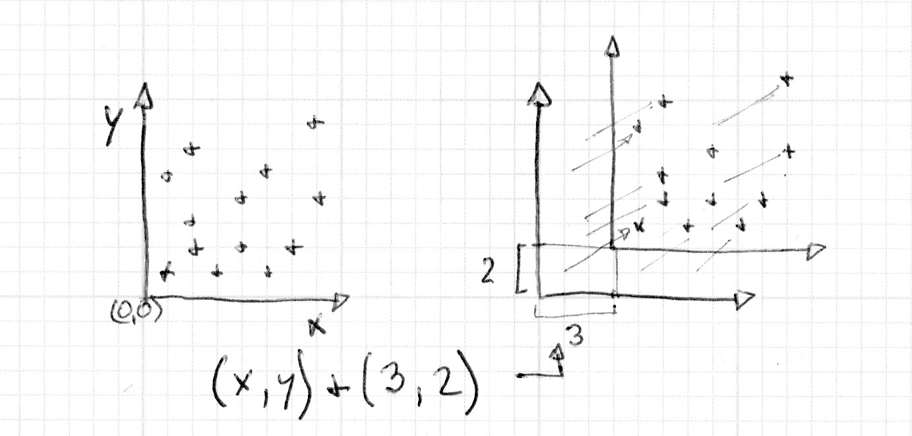
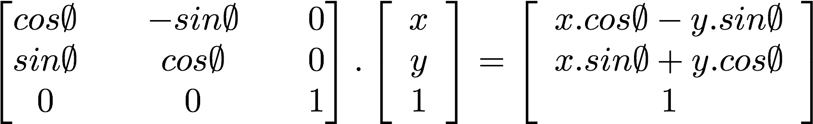
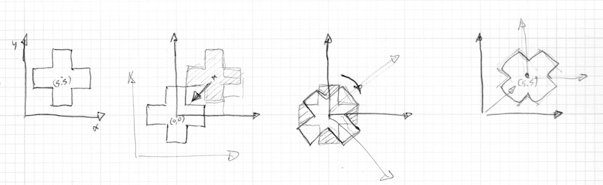
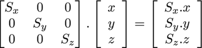

## 平移



```glsl
// Author @patriciogv ( patriciogonzalezvivo.com ) - 2015

#ifdef GL_ES
precision mediump float;
#endif

uniform vec2 u_resolution;
uniform float u_time;

float box(in vec2 _st, in vec2 _size){
    _size = vec2(0.5) - _size*0.5;
    vec2 uv = smoothstep(_size,
                        _size+vec2(0.001),
                        _st);
    uv *= smoothstep(_size,
                    _size+vec2(0.001),
                    vec2(1.0)-_st);
    return uv.x*uv.y;
}

float cross(in vec2 _st, float _size){
    return  box(_st, vec2(_size,_size/4.)) +
            box(_st, vec2(_size/4.,_size));
}

void main(){
    vec2 st = gl_FragCoord.xy/u_resolution.xy;
    vec3 color = vec3(0.0);

    // To move the cross we move the space
    vec2 translate = vec2(cos(u_time),sin(u_time));
    st += translate*0.35;

    // Show the coordinates of the space on the background
    // color = vec3(st.x,st.y,0.0);

    // Add the shape on the foreground
    color += vec3(cross(st,0.25));

    gl_FragColor = vec4(color,1.0);
}

```

<div ref="translationRef"></div>


## 旋转





```glsl
// Author @patriciogv ( patriciogonzalezvivo.com ) - 2015

#ifdef GL_ES
precision mediump float;
#endif

#define PI 3.14159265359

uniform vec2 u_resolution;
uniform float u_time;

mat2 rotate2d(float _angle){
    return mat2(cos(_angle),-sin(_angle),
                sin(_angle),cos(_angle));
}

float box(in vec2 _st, in vec2 _size){
    _size = vec2(0.5) - _size*0.5;
    vec2 uv = smoothstep(_size,
                        _size+vec2(0.001),
                        _st);
    uv *= smoothstep(_size,
                    _size+vec2(0.001),
                    vec2(1.0)-_st);
    return uv.x*uv.y;
}

float cross(in vec2 _st, float _size){
    return  box(_st, vec2(_size,_size/4.)) +
            box(_st, vec2(_size/4.,_size));
}

void main(){
    vec2 st = gl_FragCoord.xy/u_resolution.xy;
    vec3 color = vec3(0.0);

    // move space from the center to the vec2(0.0)
    st -= vec2(0.5);
    // rotate the space
    st = rotate2d( sin(u_time)*PI ) * st;
    // move it back to the original place
    st += vec2(0.5);

    // Show the coordinates of the space on the background
    // color = vec3(st.x,st.y,0.0);

    // Add the shape on the foreground
    color += vec3(cross(st,0.4));

    gl_FragColor = vec4(color,1.0);
}

```

<div ref="rotateRef"></div>


## 缩放




```glsl
// Author @patriciogv ( patriciogonzalezvivo.com ) - 2015

#ifdef GL_ES
precision mediump float;
#endif

#define PI 3.14159265359

uniform vec2 u_resolution;
uniform float u_time;

mat2 scale(vec2 _scale){
    return mat2(_scale.x,0.0,
                0.0,_scale.y);
}

float box(in vec2 _st, in vec2 _size){
    _size = vec2(0.5) - _size*0.5;
    vec2 uv = smoothstep(_size,
                        _size+vec2(0.001),
                        _st);
    uv *= smoothstep(_size,
                    _size+vec2(0.001),
                    vec2(1.0)-_st);
    return uv.x*uv.y;
}

float cross(in vec2 _st, float _size){
    return  box(_st, vec2(_size,_size/4.)) +
            box(_st, vec2(_size/4.,_size));
}

void main(){
    vec2 st = gl_FragCoord.xy/u_resolution.xy;
    vec3 color = vec3(0.0);

    st -= vec2(0.5);
    st = scale( vec2(sin(u_time)+1.0) ) * st;
    st += vec2(0.5);

    // Show the coordinates of the space on the background
    // color = vec3(st.x,st.y,0.0);

    // Add the shape on the foreground
    color += vec3(cross(st,0.2));

    gl_FragColor = vec4(color,1.0);
}

```

<div ref="scaleRef"></div>


## 雷达

```glsl
//作者： https://www.shadertoy.com/view/4s2SRt
# ifdef GL_ES
precision mediump float;
# endif
uniform vec3 iResolution;
uniform float iTime;
uniform vec4 iDate;
//Sci-fi radar based on the work of gmunk for Oblivion
//http://work.gmunk.com/OBLIVION-GFX

#define SMOOTH(r,R) (1.0-smoothstep(R-1.0,R+1.0, r))
#define RANGE(a,b,x) ( step(a,x)*(1.0-step(b,x)) )
#define RS(a,b,x) ( smoothstep(a-1.0,a+1.0,x)*(1.0-smoothstep(b-1.0,b+1.0,x)) )
#define M_PI 3.1415926535897932384626433832795

#define blue1 vec3(0.74,0.95,1.00)
#define blue2 vec3(0.87,0.98,1.00)
#define blue3 vec3(0.35,0.76,0.83)
#define blue4 vec3(0.953,0.969,0.89)
#define red   vec3(1.00,0.38,0.227)

#define MOV(a,b,c,d,t) (vec2(a*cos(t)+b*cos(0.1*(t)), c*sin(t)+d*cos(0.1*(t))))

float movingLine(vec2 uv, vec2 center, float radius)
{
    //angle of the line
    float theta0 = 90.0 * iTime;
    vec2 d = uv - center;
    float r = sqrt( dot( d, d ) );
    if(r<radius)
    {
        //compute the distance to the line theta=theta0
        vec2 p = radius*vec2(cos(theta0*M_PI/180.0),
                            -sin(theta0*M_PI/180.0));
        float l = length( d - p*clamp( dot(d,p)/dot(p,p), 0.0, 1.0) );
    	d = normalize(d);
        //compute gradient based on angle difference to theta0
   	 	float theta = mod(180.0*atan(d.y,d.x)/M_PI+theta0,360.0);
        float gradient = clamp(1.0-theta/90.0,0.0,1.0);
        return SMOOTH(l,1.0)+0.5*gradient;
    }
    else return 0.0;
}

float circle(vec2 uv, vec2 center, float radius, float width)
{
    float r = length(uv - center);
    return SMOOTH(r-width/2.0,radius)-SMOOTH(r+width/2.0,radius);
}

float circle2(vec2 uv, vec2 center, float radius, float width, float opening)
{
    vec2 d = uv - center;
    float r = sqrt( dot( d, d ) );
    d = normalize(d);
    if( abs(d.y) > opening )
	    return SMOOTH(r-width/2.0,radius)-SMOOTH(r+width/2.0,radius);
    else
        return 0.0;
}
float circle3(vec2 uv, vec2 center, float radius, float width)
{
    vec2 d = uv - center;
    float r = sqrt( dot( d, d ) );
    d = normalize(d);
    float theta = 180.0*(atan(d.y,d.x)/M_PI);
    return smoothstep(2.0, 2.1, abs(mod(theta+2.0,45.0)-2.0)) *
        mix( 0.5, 1.0, step(45.0, abs(mod(theta, 180.0)-90.0)) ) *
        (SMOOTH(r-width/2.0,radius)-SMOOTH(r+width/2.0,radius));
}

float triangles(vec2 uv, vec2 center, float radius)
{
    vec2 d = uv - center;
    return RS(-8.0, 0.0, d.x-radius) * (1.0-smoothstep( 7.0+d.x-radius,9.0+d.x-radius, abs(d.y)))
         + RS( 0.0, 8.0, d.x+radius) * (1.0-smoothstep( 7.0-d.x-radius,9.0-d.x-radius, abs(d.y)))
         + RS(-8.0, 0.0, d.y-radius) * (1.0-smoothstep( 7.0+d.y-radius,9.0+d.y-radius, abs(d.x)))
         + RS( 0.0, 8.0, d.y+radius) * (1.0-smoothstep( 7.0-d.y-radius,9.0-d.y-radius, abs(d.x)));
}

float _cross(vec2 uv, vec2 center, float radius)
{
    vec2 d = uv - center;
    int x = int(d.x);
    int y = int(d.y);
    float r = sqrt( dot( d, d ) );
    if( (r<radius) && ( (x==y) || (x==-y) ) )
        return 1.0;
    else return 0.0;
}
float dots(vec2 uv, vec2 center, float radius)
{
    vec2 d = uv - center;
    float r = sqrt( dot( d, d ) );
    if( r <= 2.5 )
        return 1.0;
    if( ( r<= radius) && ( (abs(d.y+0.5)<=1.0) && ( mod(d.x+1.0, 50.0) < 2.0 ) ) )
        return 1.0;
    else if ( (abs(d.y+0.5)<=1.0) && ( r >= 50.0 ) && ( r < 115.0 ) )
        return 0.5;
    else
	    return 0.0;
}
float bip1(vec2 uv, vec2 center)
{
    return SMOOTH(length(uv - center),3.0);
}
float bip2(vec2 uv, vec2 center)
{
    float r = length(uv - center);
    float R = 8.0+mod(87.0*iTime, 80.0);
    return (0.5-0.5*cos(30.0*iTime)) * SMOOTH(r,5.0)
        + SMOOTH(6.0,r)-SMOOTH(8.0,r)
        + smoothstep(max(8.0,R-20.0),R,r)-SMOOTH(R,r);
}
void main(  )
{
    vec3 finalColor;
	vec2 uv = gl_FragCoord.xy;
    //center of the image
    vec2 c = iResolution.xy/2.0;
    finalColor = vec3( 0.3*_cross(uv, c, 240.0) );
    finalColor += ( circle(uv, c, 100.0, 1.0)
                  + circle(uv, c, 165.0, 1.0) ) * blue1;
    finalColor += (circle(uv, c, 240.0, 2.0) );//+ dots(uv,c,240.0)) * blue4;
    finalColor += circle3(uv, c, 313.0, 4.0) * blue1;
    finalColor += triangles(uv, c, 315.0 + 30.0*sin(iTime)) * blue2;
    finalColor += movingLine(uv, c, 240.0) * blue3;
    finalColor += circle(uv, c, 10.0, 1.0) * blue3;
    finalColor += 0.7 * circle2(uv, c, 262.0, 1.0, 0.5+0.2*cos(iTime)) * blue3;
    if( length(uv-c) < 240.0 )
    {
        //animate some bips with random movements
    	vec2 p = 130.0*MOV(1.3,1.0,1.0,1.4,3.0+0.1*iTime);
   		finalColor += bip1(uv, c+p) * vec3(1,1,1);
        p = 130.0*MOV(0.9,-1.1,1.7,0.8,-2.0+sin(0.1*iTime)+0.15*iTime);
        finalColor += bip1(uv, c+p) * vec3(1,1,1);
        p = 50.0*MOV(1.54,1.7,1.37,1.8,sin(0.1*iTime+7.0)+0.2*iTime);
        finalColor += bip2(uv,c+p) * red;
    }

    gl_FragColor = vec4( finalColor, 1.0 );
}  


```

<div ref="radarRef"></div>

<script setup>
import {ref,onMounted} from 'vue'
import * as THREE from 'three'

import {
    OrbitControls
} from 'three/examples/jsm/controls/OrbitControls'

const initScene = (shader)=>{
    // 1.创建场景
    const scene = new THREE.Scene()
    const clock = new THREE.Clock();
    const uniforms = {
        u_time: { type: "f", value: 1.0 },
        u_resolution: { type: "v2", value: new THREE.Vector2()}
    }
    // 2.创建相机
    const camera = new THREE.PerspectiveCamera(75,
    2 , 0.1, 1000);

    // 设置相机位置
    camera.position.set(0, 0, 20)
    scene.add(camera)

    // 着色器配置
    const shaderMaterial = new THREE.ShaderMaterial({
        uniforms:uniforms,
            vertexShader:`
        precision lowp float;
        varying vec2 v_uv;
        void main(){
            v_uv = uv;
            gl_Position = projectionMatrix *viewMatrix* modelMatrix * vec4( position, 1.0 );
        }
        `,
        fragmentShader: shader.fragmentShader,
        side: THREE.DoubleSide
    })
    // 创建平面
    const floor = new THREE.Mesh(new THREE.PlaneGeometry(100, 100), shaderMaterial)
    floor.position.set(0,0,0)
    scene.add(floor)
    // 初始化渲染器
    const renderer = new THREE.WebGLRenderer()
    if(!__VUEPRESS_SSR__) {
        renderer.setPixelRatio( window.devicePixelRatio );
    }
    // 设置渲染器大小

    renderer.setSize(shader.shaderDom.value.offsetWidth, shader.shaderDom.value.offsetWidth/2)
    renderer.shadowMap.enabled = true
    shader.shaderDom.value.appendChild(renderer.domElement)
    renderer.render(scene,camera)
        // 创建轨道控制器
    const controls = new OrbitControls(camera, renderer.domElement)
    // 设置控制器阻尼
    controls.enableDamping = true
    uniforms.u_resolution.value.x = renderer.domElement.width
    uniforms.u_resolution.value.y = renderer.domElement.height
    function render() {
        uniforms.u_time.value += clock.getDelta();
        controls.update()
        renderer.render(scene, camera)
        requestAnimationFrame(render)
    }

    render()

}
const initShaderToy = (shader) => {
        // 1.创建场景
    const scene = new THREE.Scene()
    const clock = new THREE.Clock();
    const uniforms = {
        iResolution: { value: new THREE.Vector3() },
        iTime: { value: 0 },
        iTimeDelta: { value: 0 },
        iFrameRate: { value: 60 },
        iFrame: { value: 0 },
        iChannelTime: { value: [0, 0, 0, 0] },
        iChannelResolution: { value: [new THREE.Vector3(), new THREE.Vector3(), new THREE.Vector3(), new THREE.Vector3()] },
        iMouse: { value: new THREE.Vector4() },
        iChannel0: { value: new THREE.Texture() },
        iChannel1: { value: new THREE.Texture() },
        iChannel2: { value: new THREE.Texture() },
        iChannel3: { value: new THREE.Texture() },
        iDate: { value: new THREE.Vector4() }
    }
    // 2.创建相机
    const camera = new THREE.PerspectiveCamera(75,
    2 , 0.1, 1000);

    // 设置相机位置
    camera.position.set(0, 0, 20)
    scene.add(camera)

    // 着色器配置
    const shaderMaterial = new THREE.ShaderMaterial({
        uniforms:uniforms,
            vertexShader:`
        precision lowp float;
        varying vec2 v_uv;
        void main(){
            v_uv = uv;
            gl_Position = projectionMatrix *viewMatrix* modelMatrix * vec4( position, 1.0 );
        }
        `,
        fragmentShader: shader.fragmentShader,
        side: THREE.DoubleSide
    })
    // 创建平面
    const floor = new THREE.Mesh(new THREE.PlaneGeometry(100, 100), shaderMaterial)
    floor.position.set(0,0,0)
    scene.add(floor)
    // 初始化渲染器
    const renderer = new THREE.WebGLRenderer()
    if(!__VUEPRESS_SSR__) {
        renderer.setPixelRatio( window.devicePixelRatio );
    }
    // 设置渲染器大小

    renderer.setSize(shader.shaderDom.value.offsetWidth, shader.shaderDom.value.offsetWidth/2)
    renderer.shadowMap.enabled = true
    shader.shaderDom.value.appendChild(renderer.domElement)
    renderer.render(scene,camera)
        // 创建轨道控制器
    const controls = new OrbitControls(camera, renderer.domElement)
    // 设置控制器阻尼
    controls.enableDamping = true
    const textureLoader = new THREE.TextureLoader();
    shaderMaterial.uniforms.iResolution.value.set(shader.shaderDom.value.offsetWidth, shader.shaderDom.value.offsetWidth/2,1);

    // shaderMaterial.uniforms.iResolution.value.set(renderer.domElement.width, renderer.domElement.height, 1);
    // shaderMaterial.uniforms.iResolution.value.set(window.innerWidth, window.innerHeight, 1);
    shaderMaterial.uniforms.iChannel0.value = textureLoader.load("/assets/textures/ca.jpeg");;
    if(!__VUEPRESS_SSR__) {
        shader.shaderDom.value.addEventListener('mousemove',(event) => {
            // console.log(event.clientX,event.clientY,'event')
            shaderMaterial.uniforms.iMouse.value.set(event.clientX, event.clientY, 0, 0);

        })
    }

    function render() {
        controls.update()
        renderer.render(scene, camera)
        requestAnimationFrame(render)
        const now = new Date();
        const time = now.getTime() * 0.001;
        shaderMaterial.uniforms.iTime.value += clock.getDelta();
        shaderMaterial.uniforms.iDate.value.set(
          now.getFullYear(),
          now.getMonth(),
          now.getDate(),
          time
        );

    }

    render()
}
const translationRef = ref()

const translationShader = {
    shaderDom:translationRef,
    fragmentShader:`
#ifdef GL_ES
precision mediump float;
#endif

uniform vec2 u_resolution;
uniform float u_time;

float box(in vec2 _st, in vec2 _size){
    _size = vec2(0.5) - _size*0.5;
    vec2 uv = smoothstep(_size,
                        _size+vec2(0.001),
                        _st);
    uv *= smoothstep(_size,
                    _size+vec2(0.001),
                    vec2(1.0)-_st);
    return uv.x*uv.y;
}

float newCross(in vec2 _st, float _size){
    return  box(_st, vec2(_size,_size/4.)) + box(_st, vec2(_size/4.,_size));
}

void main(){
    vec2 st = gl_FragCoord.xy/u_resolution.xy;
    vec3 color = vec3(0.0);

    // To move the cross we move the space
    // -1 到 1 
    vec2 translate = vec2(cos(u_time),sin(u_time));
    // z坐标移动
    st += translate*0.35;

    // Show the coordinates of the space on the background
    // color = vec3(st.x,st.y,0.0);

    // Add the shape on the foreground
    color += vec3(newCross(st,0.25));

    gl_FragColor = vec4(color,1.0);
}
    `
}

const rotateRef = ref()

const rotateShader = {
    shaderDom:rotateRef,
    fragmentShader:`
    #ifdef GL_ES
precision mediump float;
#endif

#define PI 3.14159265359

uniform vec2 u_resolution;
uniform float u_time;

mat2 rotate2d(float _angle){
    return mat2(cos(_angle),-sin(_angle),
                sin(_angle),cos(_angle));
}

float box(in vec2 _st, in vec2 _size){
    _size = vec2(0.5) - _size*0.5;
    vec2 uv = smoothstep(_size,
                        _size+vec2(0.001),
                        _st);
    uv *= smoothstep(_size,
                    _size+vec2(0.001),
                    vec2(1.0)-_st);
    return uv.x*uv.y;
}

float newCross(in vec2 _st, float _size){
    return  box(_st, vec2(_size,_size/4.)) +
            box(_st, vec2(_size/4.,_size));
}

void main(){
    vec2 st = gl_FragCoord.xy/u_resolution.xy;
    vec3 color = vec3(0.0);

    // move space from the center to the vec2(0.0)
    st -= vec2(0.5);
    // rotate the space
    st = rotate2d( sin(u_time)*PI ) * st;
    // move it back to the original place
    st += vec2(0.5);

    // Show the coordinates of the space on the background
    // color = vec3(st.x,st.y,0.0);

    // Add the shape on the foreground
    color += vec3(newCross(st,0.4));

    gl_FragColor = vec4(color,1.0);
}
    
    `
}

const scaleRef = ref()

const scaleShader = {
    shaderDom:scaleRef,
    fragmentShader:`
#ifdef GL_ES
precision mediump float;
#endif

#define PI 3.14159265359

uniform vec2 u_resolution;
uniform float u_time;

mat2 scale(vec2 _scale){
    return mat2(_scale.x,0.0,
                0.0,_scale.y);
}

float box(in vec2 _st, in vec2 _size){
    _size = vec2(0.5) - _size*0.5;
    vec2 uv = smoothstep(_size,
                        _size+vec2(0.001),
                        _st);
    uv *= smoothstep(_size,
                    _size+vec2(0.001),
                    vec2(1.0)-_st);
    return uv.x*uv.y;
}

float newCross(in vec2 _st, float _size){
    return  box(_st, vec2(_size,_size/4.)) +
            box(_st, vec2(_size/4.,_size));
}

void main(){
    vec2 st = gl_FragCoord.xy/u_resolution.xy;
    vec3 color = vec3(0.0);

    st -= vec2(0.5);
    st = scale( vec2(sin(u_time)+1.0) ) * st;
    st += vec2(0.5);

    // Show the coordinates of the space on the background
    // color = vec3(st.x,st.y,0.0);

    // Add the shape on the foreground
    color += vec3(newCross(st,0.2));

    gl_FragColor = vec4(color,1.0);
}
    
    `
}

const radarRef = ref()

const radarShader = {
    shaderDom:radarRef,
    fragmentShader:`
# ifdef GL_ES
precision mediump float;
# endif
uniform vec3 iResolution;
uniform float iTime;
uniform vec4 iDate;
//Sci-fi radar based on the work of gmunk for Oblivion
//http://work.gmunk.com/OBLIVION-GFX

#define SMOOTH(r,R) (1.0-smoothstep(R-1.0,R+1.0, r))
#define RANGE(a,b,x) ( step(a,x)*(1.0-step(b,x)) )
#define RS(a,b,x) ( smoothstep(a-1.0,a+1.0,x)*(1.0-smoothstep(b-1.0,b+1.0,x)) )
#define M_PI 3.1415926535897932384626433832795

#define blue1 vec3(0.74,0.95,1.00)
#define blue2 vec3(0.87,0.98,1.00)
#define blue3 vec3(0.35,0.76,0.83)
#define blue4 vec3(0.953,0.969,0.89)
#define red   vec3(1.00,0.38,0.227)

#define MOV(a,b,c,d,t) (vec2(a*cos(t)+b*cos(0.1*(t)), c*sin(t)+d*cos(0.1*(t))))

float movingLine(vec2 uv, vec2 center, float radius)
{
    //angle of the line
    float theta0 = 90.0 * iTime;
    vec2 d = uv - center;
    float r = sqrt( dot( d, d ) );
    if(r<radius)
    {
        //compute the distance to the line theta=theta0
        vec2 p = radius*vec2(cos(theta0*M_PI/180.0),
                            -sin(theta0*M_PI/180.0));
        float l = length( d - p*clamp( dot(d,p)/dot(p,p), 0.0, 1.0) );
    	d = normalize(d);
        //compute gradient based on angle difference to theta0
   	 	float theta = mod(180.0*atan(d.y,d.x)/M_PI+theta0,360.0);
        float gradient = clamp(1.0-theta/90.0,0.0,1.0);
        return SMOOTH(l,1.0)+0.5*gradient;
    }
    else return 0.0;
}

float circle(vec2 uv, vec2 center, float radius, float width)
{
    float r = length(uv - center);
    return SMOOTH(r-width/2.0,radius)-SMOOTH(r+width/2.0,radius);
}

float circle2(vec2 uv, vec2 center, float radius, float width, float opening)
{
    vec2 d = uv - center;
    float r = sqrt( dot( d, d ) );
    d = normalize(d);
    if( abs(d.y) > opening )
	    return SMOOTH(r-width/2.0,radius)-SMOOTH(r+width/2.0,radius);
    else
        return 0.0;
}
float circle3(vec2 uv, vec2 center, float radius, float width)
{
    vec2 d = uv - center;
    float r = sqrt( dot( d, d ) );
    d = normalize(d);
    float theta = 180.0*(atan(d.y,d.x)/M_PI);
    return smoothstep(2.0, 2.1, abs(mod(theta+2.0,45.0)-2.0)) *
        mix( 0.5, 1.0, step(45.0, abs(mod(theta, 180.0)-90.0)) ) *
        (SMOOTH(r-width/2.0,radius)-SMOOTH(r+width/2.0,radius));
}

float triangles(vec2 uv, vec2 center, float radius)
{
    vec2 d = uv - center;
    return RS(-8.0, 0.0, d.x-radius) * (1.0-smoothstep( 7.0+d.x-radius,9.0+d.x-radius, abs(d.y)))
         + RS( 0.0, 8.0, d.x+radius) * (1.0-smoothstep( 7.0-d.x-radius,9.0-d.x-radius, abs(d.y)))
         + RS(-8.0, 0.0, d.y-radius) * (1.0-smoothstep( 7.0+d.y-radius,9.0+d.y-radius, abs(d.x)))
         + RS( 0.0, 8.0, d.y+radius) * (1.0-smoothstep( 7.0-d.y-radius,9.0-d.y-radius, abs(d.x)));
}

float _cross(vec2 uv, vec2 center, float radius)
{
    vec2 d = uv - center;
    int x = int(d.x);
    int y = int(d.y);
    float r = sqrt( dot( d, d ) );
    if( (r<radius) && ( (x==y) || (x==-y) ) )
        return 1.0;
    else return 0.0;
}
float dots(vec2 uv, vec2 center, float radius)
{
    vec2 d = uv - center;
    float r = sqrt( dot( d, d ) );
    if( r <= 2.5 )
        return 1.0;
    if( ( r<= radius) && ( (abs(d.y+0.5)<=1.0) && ( mod(d.x+1.0, 50.0) < 2.0 ) ) )
        return 1.0;
    else if ( (abs(d.y+0.5)<=1.0) && ( r >= 50.0 ) && ( r < 115.0 ) )
        return 0.5;
    else
	    return 0.0;
}
float bip1(vec2 uv, vec2 center)
{
    return SMOOTH(length(uv - center),3.0);
}
float bip2(vec2 uv, vec2 center)
{
    float r = length(uv - center);
    float R = 8.0+mod(87.0*iTime, 80.0);
    return (0.5-0.5*cos(30.0*iTime)) * SMOOTH(r,5.0)
        + SMOOTH(6.0,r)-SMOOTH(8.0,r)
        + smoothstep(max(8.0,R-20.0),R,r)-SMOOTH(R,r);
}
void main(  )
{
    vec3 finalColor;
	vec2 uv = gl_FragCoord.xy;
    //center of the image
    vec2 c = iResolution.xy/2.0;
    finalColor = vec3( 0.3*_cross(uv, c, 240.0) );
    finalColor += ( circle(uv, c, 100.0, 1.0)
                  + circle(uv, c, 165.0, 1.0) ) * blue1;
    finalColor += (circle(uv, c, 240.0, 2.0) );//+ dots(uv,c,240.0)) * blue4;
    finalColor += circle3(uv, c, 313.0, 4.0) * blue1;
    finalColor += triangles(uv, c, 315.0 + 30.0*sin(iTime)) * blue2;
    finalColor += movingLine(uv, c, 240.0) * blue3;
    finalColor += circle(uv, c, 10.0, 1.0) * blue3;
    finalColor += 0.7 * circle2(uv, c, 262.0, 1.0, 0.5+0.2*cos(iTime)) * blue3;
    if( length(uv-c) < 240.0 )
    {
        //animate some bips with random movements
    	vec2 p = 130.0*MOV(1.3,1.0,1.0,1.4,3.0+0.1*iTime);
   		finalColor += bip1(uv, c+p) * vec3(1,1,1);
        p = 130.0*MOV(0.9,-1.1,1.7,0.8,-2.0+sin(0.1*iTime)+0.15*iTime);
        finalColor += bip1(uv, c+p) * vec3(1,1,1);
        p = 50.0*MOV(1.54,1.7,1.37,1.8,sin(0.1*iTime+7.0)+0.2*iTime);
        finalColor += bip2(uv,c+p) * red;
    }

    gl_FragColor = vec4( finalColor, 1.0 );
}    
    
    `

}

onMounted(()=>{
    initScene(translationShader)
    initScene(rotateShader)
    initScene(scaleShader)
    initShaderToy(radarShader)
})

<<<<<<< HEAD
</script>
=======
</script>
>>>>>>> 6456c69b7aa604175684f41baf40d6eb929d17cb
