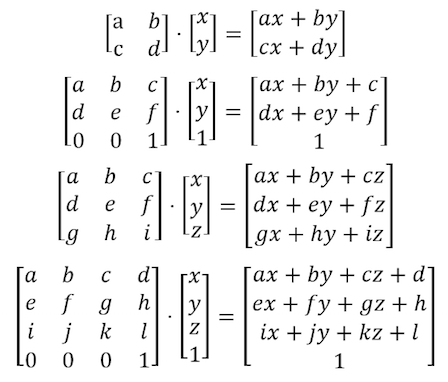

## 平移


```glsl
// Author @patriciogv ( patriciogonzalezvivo.com ) - 2015

#ifdef GL_ES
precision mediump float;
#endif

uniform vec2 u_resolution;
uniform float u_time;

float box(in vec2 _st, in vec2 _size){
    _size = vec2(0.5) - _size*0.5;
    vec2 uv = smoothstep(_size,
                        _size+vec2(0.001),
                        _st);
    uv *= smoothstep(_size,
                    _size+vec2(0.001),
                    vec2(1.0)-_st);
    return uv.x*uv.y;
}

float cross(in vec2 _st, float _size){
    return  box(_st, vec2(_size,_size/4.)) +
            box(_st, vec2(_size/4.,_size));
}

void main(){
    vec2 st = gl_FragCoord.xy/u_resolution.xy;
    vec3 color = vec3(0.0);

    // To move the cross we move the space
    vec2 translate = vec2(cos(u_time),sin(u_time));
    st += translate*0.35;

    // Show the coordinates of the space on the background
    // color = vec3(st.x,st.y,0.0);

    // Add the shape on the foreground
    color += vec3(cross(st,0.25));

    gl_FragColor = vec4(color,1.0);
}

```

<div ref="translationRef"></div>


## 旋转




<script setup>
import {ref,onMounted} from 'vue'
import * as THREE from 'three'

import {
    OrbitControls
} from 'three/examples/jsm/controls/OrbitControls'

const initScene = (shader)=>{
    // 1.创建场景
    const scene = new THREE.Scene()
    const clock = new THREE.Clock();
    const uniforms = {
        u_time: { type: "f", value: 1.0 },
        u_resolution: { type: "v2", value: new THREE.Vector2()}
    }
    // 2.创建相机
    const camera = new THREE.PerspectiveCamera(75,
    2 , 0.1, 1000);

    // 设置相机位置
    camera.position.set(0, 0, 20)
    scene.add(camera)

    // 着色器配置
    const shaderMaterial = new THREE.ShaderMaterial({
        uniforms:uniforms,
            vertexShader:`
        precision lowp float;
        varying vec2 v_uv;
        void main(){
            v_uv = uv;
            gl_Position = projectionMatrix *viewMatrix* modelMatrix * vec4( position, 1.0 );
        }
        `,
        fragmentShader: shader.fragmentShader,
        side: THREE.DoubleSide
    })
    // 创建平面
    const floor = new THREE.Mesh(new THREE.PlaneGeometry(100, 100), shaderMaterial)
    floor.position.set(0,0,0)
    scene.add(floor)
    // 初始化渲染器
    const renderer = new THREE.WebGLRenderer()
    if(!__VUEPRESS_SSR__) {
        renderer.setPixelRatio( window.devicePixelRatio );
    }
    // 设置渲染器大小

    renderer.setSize(shader.shaderDom.value.offsetWidth, shader.shaderDom.value.offsetWidth/2)
    renderer.shadowMap.enabled = true
    shader.shaderDom.value.appendChild(renderer.domElement)
    renderer.render(scene,camera)
        // 创建轨道控制器
    const controls = new OrbitControls(camera, renderer.domElement)
    // 设置控制器阻尼
    controls.enableDamping = true
    uniforms.u_resolution.value.x = renderer.domElement.width
    uniforms.u_resolution.value.y = renderer.domElement.height
    function render() {
        uniforms.u_time.value += clock.getDelta();
        controls.update()
        renderer.render(scene, camera)
        requestAnimationFrame(render)
    }

    render()

}

const translationRef = ref()

const translationShader = {
    shaderDom:translationRef,
    fragmentShader:`
#ifdef GL_ES
precision mediump float;
#endif

uniform vec2 u_resolution;
uniform float u_time;

float box(in vec2 _st, in vec2 _size){
    _size = vec2(0.5) - _size*0.5;
    vec2 uv = smoothstep(_size,
                        _size+vec2(0.001),
                        _st);
    uv *= smoothstep(_size,
                    _size+vec2(0.001),
                    vec2(1.0)-_st);
    return uv.x*uv.y;
}

float newCross(in vec2 _st, float _size){
    return  box(_st, vec2(_size,_size/4.)) + box(_st, vec2(_size/4.,_size));
}

void main(){
    vec2 st = gl_FragCoord.xy/u_resolution.xy;
    vec3 color = vec3(0.0);

    // To move the cross we move the space
    // -1 到 1 
    vec2 translate = vec2(cos(u_time),sin(u_time));
    // z坐标移动
    st += translate*0.35;

    // Show the coordinates of the space on the background
    // color = vec3(st.x,st.y,0.0);

    // Add the shape on the foreground
    color += vec3(newCross(st,0.25));

    gl_FragColor = vec4(color,1.0);
}
    `
}

onMounted(()=>{
    initScene(translationShader)
})

</script>