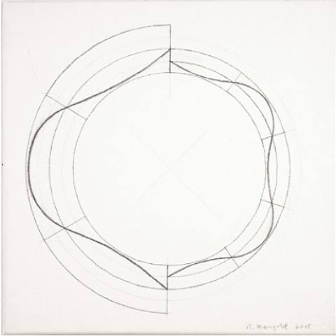
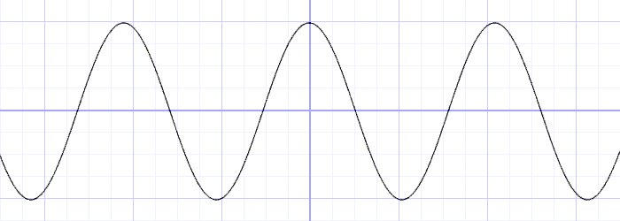

 部分参考： 《OpenGL 编程指南》、《The Book of Shader》

## 长方形

```glsl
// Author @patriciogv - 2015
// http://patriciogonzalezvivo.com

#ifdef GL_ES
precision mediump float;
#endif

uniform vec2 u_resolution;
uniform vec2 u_mouse;
uniform float u_time;

void main(){
    vec2 st = gl_FragCoord.xy/u_resolution.xy;
    vec3 color = vec3(0.0);

    // bottom-left
    // step 比0.1大 1  小 0
    vec2 bl = step(vec2(0.1),st);
    //放大边框
    float pct = bl.x * bl.y;

    // top-right
    // vec2 tr = step(vec2(0.1),1.0-st);
    // pct *= tr.x * tr.y;

    color = vec3(pct);

    gl_FragColor = vec4(color,1.0);
}


```

<div ref="rectangularRef"></div>

```glsl
#ifdef GL_ES
precision mediump float;
# endif
uniform vec2 u_resolution;  
void main() {
    vec2 uv = gl_FragCoord.xy / u_resolution.xy;
    vec4 color = vec4(0.129, 0.588, 0.953, 1.0);
    if (uv.x < 0.6 && uv.y < 0.6) {
        gl_FragColor = color;
    } else {
        gl_FragColor = vec4(1.0, 1.0, 1.0, 1.0);
        // gl_FragColor = color;
    }
}
```

<div ref="rectangularRef2"></div>

## 圆

```glsl
// Author @patriciogv - 2015
// http://patriciogonzalezvivo.com

#ifdef GL_ES
precision mediump float;
#endif

uniform vec2 u_resolution;
uniform vec2 u_mouse;
uniform float u_time;

void main(){
 vec2 st = gl_FragCoord.xy/u_resolution;
    float pct = 0.0;

    // a. The DISTANCE from the pixel to the center
    pct = distance(st,vec2(0.5));

    // b. The LENGTH of the vector
    //    from the pixel to the center
    // vec2 toCenter = vec2(0.5)-st;
    // pct = length(toCenter);

    // c. The SQUARE ROOT of the vector
    //    from the pixel to the center
    // vec2 tC = vec2(0.5)-st;
    // pct = sqrt(tC.x*tC.x+tC.y*tC.y);

    vec3 color = vec3(pct);

 gl_FragColor = vec4( color, 1.0 );
}
```

<div ref="circleRef"></div>

```glsl
//作者：https://www.shadertoy.com/view/XdlSDs

# ifdef GL_ES
precision mediump float;
# endif
uniform vec3 iResolution;
uniform float iTime;
uniform vec4 iDate;

void main() {
 vec2 p = (2.0*gl_FragCoord.xy-iResolution.xy)/iResolution.y;
 float tau = 3.1415926535*2.0;
 float a = atan(p.x,p.y);
 float r = length(p)*0.75;
 vec2 uv = vec2(a/tau,r);
 
 //get the color
 float xCol = (uv.x - (iTime / 3.0)) * 3.0;
 xCol = mod(xCol, 3.0);
 vec3 horColour = vec3(0.25, 0.25, 0.25);
 
 if (xCol < 1.0) {
  
  horColour.r += 1.0 - xCol;
  horColour.g += xCol;
 }
 else if (xCol < 2.0) {
  
  xCol -= 1.0;
  horColour.g += 1.0 - xCol;
  horColour.b += xCol;
 }
 else {
  
  xCol -= 2.0;
  horColour.b += 1.0 - xCol;
  horColour.r += xCol;
 }

 // draw color beam
 uv = (2.0 *uv) - 1.0;
 float beamWidth = (0.7+0.5*cos(uv.x*10.0*tau*0.15*clamp(floor(5.0 + 10.0*cos(iTime)), 0.0, 10.0)))* abs(1.0 / (30.0 *uv.y));
 vec3 horBeam = vec3(beamWidth);
gl_FragColor = vec4((( horBeam)* horColour), 1.0);
}

```

<div ref="circleRef2"></div>

## 距离场

通过“空间距离”来重新解释什么是图形。这种技巧被称之为“距离场”

```glsl
// Author @patriciogv - 2015
// http://patriciogonzalezvivo.com

#ifdef GL_ES
precision mediump float;
#endif

uniform vec2 u_resolution;
uniform vec2 u_mouse;
uniform float u_time;

float circle(in vec2 _st, in float _radius){
    vec2 dist = _st-vec2(0.5);
 return 1.-smoothstep(_radius-(_radius*0.01),
                         _radius+(_radius*0.01),
                         dot(dist,dist)*4.0);
}

void main(){
 vec2 st = gl_FragCoord.xy/u_resolution.xy;

 vec3 color = vec3(circle(st,0.9));

 gl_FragColor = vec4( color, 1.0 );
}

```

<div ref="whiteCircleRef"></div>

```glsl
#ifdef GL_ES
precision mediump float;
#endif

#define PI 3.14159265359
#define TWO_PI 6.28318530718

uniform vec2 u_resolution;
uniform vec2 u_mouse;
uniform float u_time;

// Reference to
// http://thndl.com/square-shaped-shaders.html

void main(){
  vec2 st = gl_FragCoord.xy/u_resolution.xy;
  st.x *= u_resolution.x/u_resolution.y;
  vec3 color = vec3(0.0);
  float d = 0.0;

  // Remap the space to -1. to 1.
  st = st *2.-1.;

  // Number of sides of your shape
  int N = 3;

  // Angle and radius from the current pixel
  float a = atan(st.x,st.y)+PI;
  float r = TWO_PI/float(N);

  // Shaping function that modulate the distance
  d = cos(floor(.5+a/r)*r-a)*length(st);

  color = vec3(1.0-smoothstep(.4,.41,d));
  // color = vec3(d);

  gl_FragColor = vec4(color,1.0);
}

```

<div ref="whiteTriangleRef"></div>

## 极坐标下的图形





```glsl
y = cos(x*3.);
//y = abs(cos(x*3.));
//y = abs(cos(x*2.5))*0.5+0.3;
//y = abs(cos(x*12.)*sin(x*3.))*.8+.1;
//y = smoothstep(-.5,1., cos(x*10.))*0.2+0.5;
```

```glsl
// Author @patriciogv - 2015
// http://patriciogonzalezvivo.com

#ifdef GL_ES
precision mediump float;
#endif

uniform vec2 u_resolution;
uniform vec2 u_mouse;
uniform float u_time;

void main(){
    vec2 st = gl_FragCoord.xy/u_resolution.xy;
    vec3 color = vec3(0.0);

    vec2 pos = vec2(0.5)-st;

    float r = length(pos)*2.0;
    float a = atan(pos.y,pos.x);

    float f = cos(a*3.);
    // f = abs(cos(a*3.));
    // f = abs(cos(a*2.5))*.5+.3;
    // f = abs(cos(a*12.)*sin(a*3.))*.8+.1;
    // f = smoothstep(-.5,1., cos(a*10.))*0.2+0.5;

    color = vec3( 1.-smoothstep(f,f+0.02,r) );

    gl_FragColor = vec4(color, 1.0);
}


```
<div ref="cloverRef"></div>

<script  setup>
import {ref,onMounted} from 'vue'
import * as THREE from 'three'
import {
    OrbitControls
} from 'three/examples/jsm/controls/OrbitControls'

const initScene = (shader)=>{
    // 1.创建场景
    const scene = new THREE.Scene()
    const clock = new THREE.Clock();
    const uniforms = {
        u_time: { type: "f", value: 1.0 },
        u_resolution: { type: "v2", value: new THREE.Vector2(shader.shaderDom.value.offsetWidth, shader.shaderDom.value.offsetWidth/2)}
    }
    // 2.创建相机
    const camera = new THREE.PerspectiveCamera(75,
    2 , 0.1, 1000);

    // 设置相机位置
    camera.position.set(0, 0, 20)
    scene.add(camera)

    // 着色器配置
    const shaderMaterial = new THREE.ShaderMaterial({
        uniforms:uniforms,
        fragmentShader: shader.fragmentShader,
        side: THREE.DoubleSide
    })
    // 创建平面
    const floor = new THREE.Mesh(new THREE.PlaneGeometry(100, 100), shaderMaterial)
    floor.position.set(0,0,0)
    scene.add(floor)
    // 初始化渲染器
    const renderer = new THREE.WebGLRenderer()
 
    // 设置渲染器大小

    renderer.setSize(shader.shaderDom.value.offsetWidth, shader.shaderDom.value.offsetWidth/2)
    renderer.shadowMap.enabled = true
    shader.shaderDom.value.appendChild(renderer.domElement)
    renderer.render(scene,camera)
        // 创建轨道控制器
    const controls = new OrbitControls(camera, renderer.domElement)
    // 设置控制器阻尼
    controls.enableDamping = true
    uniforms.u_resolution.value
    // uniforms.u_resolution.value.x = renderer.domElement.width
    // uniforms.u_resolution.value.y = renderer.domElement.height
    function render() {
        uniforms.u_time.value += clock.getDelta();
        controls.update()
        renderer.render(scene, camera)
        requestAnimationFrame(render)
    }

    render()

}
const initShaderToy = (shader) => {
        // 1.创建场景
    const scene = new THREE.Scene()
    const clock = new THREE.Clock();
    const uniforms = {
        iResolution: { value: new THREE.Vector3() },
        iTime: { value: 0 },
        iTimeDelta: { value: 0 },
        iFrameRate: { value: 60 },
        iFrame: { value: 0 },
        iChannelTime: { value: [0, 0, 0, 0] },
        iChannelResolution: { value: [new THREE.Vector3(), new THREE.Vector3(), new THREE.Vector3(), new THREE.Vector3()] },
        iMouse: { value: new THREE.Vector4() },
        iChannel0: { value: new THREE.Texture() },
        iChannel1: { value: new THREE.Texture() },
        iChannel2: { value: new THREE.Texture() },
        iChannel3: { value: new THREE.Texture() },
        iDate: { value: new THREE.Vector4() }
    }
    // 2.创建相机
    const camera = new THREE.PerspectiveCamera(75,
    2 , 0.1, 1000);

    // 设置相机位置
    camera.position.set(0, 0, 20)
    scene.add(camera)

    // 着色器配置
    const shaderMaterial = new THREE.ShaderMaterial({
        uniforms:uniforms,
            vertexShader:`
        precision lowp float;
        varying vec2 v_uv;
        void main(){
            v_uv = uv;
            gl_Position = projectionMatrix *viewMatrix* modelMatrix * vec4( position, 1.0 );
        }
        `,
        fragmentShader: shader.fragmentShader,
        side: THREE.DoubleSide
    })
    // 创建平面
    const floor = new THREE.Mesh(new THREE.PlaneGeometry(100, 100), shaderMaterial)
    floor.position.set(0,0,0)
    scene.add(floor)
    // 初始化渲染器
    const renderer = new THREE.WebGLRenderer()
 
    // 设置渲染器大小

    renderer.setSize(shader.shaderDom.value.offsetWidth, shader.shaderDom.value.offsetWidth/2)
    renderer.shadowMap.enabled = true
    shader.shaderDom.value.appendChild(renderer.domElement)
    renderer.render(scene,camera)
        // 创建轨道控制器
    const controls = new OrbitControls(camera, renderer.domElement)
    // 设置控制器阻尼
    controls.enableDamping = true
    const textureLoader = new THREE.TextureLoader();
    shaderMaterial.uniforms.iResolution.value.set(shader.shaderDom.value.offsetWidth, shader.shaderDom.value.offsetWidth/2,1);

    // shaderMaterial.uniforms.iResolution.value.set(renderer.domElement.width, renderer.domElement.height, 1);
    // shaderMaterial.uniforms.iResolution.value.set(window.innerWidth, window.innerHeight, 1);
    shaderMaterial.uniforms.iChannel0.value = textureLoader.load("/assets/textures/ca.jpeg");;
    if(!__VUEPRESS_SSR__) {
        shader.shaderDom.value.addEventListener('mousemove',(event) => {
            // console.log(event.clientX,event.clientY,'event')
            shaderMaterial.uniforms.iMouse.value.set(event.clientX, event.clientY, 0, 0);

        })
    }

    function render() {
        controls.update()
        renderer.render(scene, camera)
        requestAnimationFrame(render)
        const now = new Date();
        const time = now.getTime() * 0.001;
        shaderMaterial.uniforms.iTime.value += clock.getDelta();
        shaderMaterial.uniforms.iDate.value.set(
          now.getFullYear(),
          now.getMonth(),
          now.getDate(),
          time
        );

    }

    render()
}
const rectangularRef = ref()
const rectangularShader = {
     shaderDom:rectangularRef,
     fragmentShader:`
     #ifdef GL_ES
precision mediump float;
# endif

uniform vec2 u_resolution;
uniform vec2 u_mouse;
uniform float u_time;

void main(){
    vec2 st = gl_FragCoord.xy/u_resolution.xy;
    vec3 color = vec3(0.0);

    // bottom-left
    vec2 bl = step(vec2(0.1),st);
    float pct = bl.x * bl.y;

    // top-right
    // vec2 tr = step(vec2(0.1),1.0-st);
    // pct *= tr.x* tr.y;

    color = vec3(pct);

    gl_FragColor = vec4(color,1.0);
}
     `
}

const circleRef = ref()
const circleShader = {
    shaderDom:circleRef,
    fragmentShader:`
# ifdef GL_ES
precision mediump float;
# endif

uniform vec2 u_resolution;
uniform vec2 u_mouse;
uniform float u_time;

void main(){
 vec2 st = gl_FragCoord.xy/u_resolution;
    float pct = 0.0;

    // a. The DISTANCE from the pixel to the center
    pct = distance(st,vec2(0.5));

    // b. The LENGTH of the vector
    //    from the pixel to the center
    // vec2 toCenter = vec2(0.5)-st;
    // pct = length(toCenter);

    // c. The SQUARE ROOT of the vector
    //    from the pixel to the center
    // vec2 tC = vec2(0.5)-st;
    // pct = sqrt(tC.x*tC.x+tC.y*tC.y);

    vec3 color = vec3(pct);

 gl_FragColor = vec4( color, 1.0 );
}
    `
}

const rectangularRef2 = ref()
const rectangularShader2 = {
    shaderDom:rectangularRef2,
    fragmentShader:`
    #ifdef GL_ES
    precision mediump float;
    # endif
    uniform vec2 u_resolution;  
    void main() {
        vec2 uv = gl_FragCoord.xy / u_resolution.xy;
        vec4 color = vec4(0.129, 0.588, 0.953, 1.0);

        if (uv.x < 0.6 && uv.y < 0.6) {
            gl_FragColor = color;
        } else {
            gl_FragColor = vec4(1.0, 1.0, 1.0, 1.0);
            // gl_FragColor = color;
        }
    }

    `
}

const circleRef2 = ref()
const circleShader2 = {
    shaderDom:circleRef2,
    fragmentShader:`
# ifdef GL_ES
precision mediump float;
# endif
uniform vec3 iResolution;
uniform float iTime;
uniform vec4 iDate;

void main() {
 vec2 p = (2.0*gl_FragCoord.xy-iResolution.xy)/iResolution.y;
    float tau = 3.1415926535*2.0;
    float a = atan(p.x,p.y);
    float r = length(p)*0.75;
    vec2 uv = vec2(a/tau,r);

 //get the color
 float xCol = (uv.x - (iTime / 3.0)) * 3.0;
 xCol = mod(xCol, 3.0);
 vec3 horColour = vec3(0.25, 0.25, 0.25);

 if (xCol < 1.0) {
  
  horColour.r += 1.0 - xCol;
  horColour.g += xCol;
 }
 else if (xCol < 2.0) {
  
  xCol -= 1.0;
  horColour.g += 1.0 - xCol;
  horColour.b += xCol;
 }
 else {
  
  xCol -= 2.0;
  horColour.b += 1.0 - xCol;
  horColour.r += xCol;
 }

 // draw color beam
 uv = (2.0 *uv) - 1.0;
 float beamWidth = (0.7+0.5*cos(uv.x*10.0*tau*0.15*clamp(floor(5.0 + 10.0*cos(iTime)), 0.0, 10.0)))* abs(1.0 / (30.0 *uv.y));
 vec3 horBeam = vec3(beamWidth);
gl_FragColor = vec4((( horBeam)* horColour), 1.0);
}

    `
}

const whiteCircleRef = ref()
const whiteCircleShader = {
    shaderDom:whiteCircleRef,
    fragmentShader:`
    #ifdef GL_ES
precision mediump float;
# endif

uniform vec2 u_resolution;
uniform vec2 u_mouse;
uniform float u_time;

float circle(in vec2 _st, in float _radius){
vec2 dist =_st-vec2(0.5);
 return 1.-smoothstep(_radius-(_radius*0.01),
                         _radius+(_radius*0.01),
                         dot(dist,dist)*4.0);
}

void main(){
 vec2 st = gl_FragCoord.xy/u_resolution.xy;

 vec3 color = vec3(circle(st,0.9));

 gl_FragColor = vec4( color, 1.0 );
}

    `
}

const whiteTriangleRef = ref()
const whiteTriangleShader = {
    shaderDom:whiteTriangleRef,
    fragmentShader:`
    #ifdef GL_ES
precision mediump float;
# endif

# define PI 3.14159265359
# define TWO_PI 6.28318530718

uniform vec2 u_resolution;
uniform vec2 u_mouse;
uniform float u_time;

// Reference to
// http://thndl.com/square-shaped-shaders.html

void main(){
  vec2 st = gl_FragCoord.xy/u_resolution.xy;
  st.x *= u_resolution.x/u_resolution.y;
  vec3 color = vec3(0.0);
  float d = 0.0;

  // Remap the space to -1. to 1.
  st = st *2.-1.;

  // Number of sides of your shape
  int N = 3;

  // Angle and radius from the current pixel
  float a = atan(st.x,st.y)+PI;
  float r = TWO_PI/float(N);

  // Shaping function that modulate the distance
  d = cos(floor(.5+a/r)*r-a)*length(st);

  color = vec3(1.0-smoothstep(.4,.41,d));
  // color = vec3(d);

  gl_FragColor = vec4(color,1.0);
}

    `
}

const cloverRef = ref()
const cloverShader = {
    shaderDom:cloverRef,
    fragmentShader:`
#ifdef GL_ES
precision mediump float;
#endif

uniform vec2 u_resolution;
uniform vec2 u_mouse;
uniform float u_time;

void main(){
    vec2 st = gl_FragCoord.xy/u_resolution.xy;
    vec3 color = vec3(0.0);

    vec2 pos = vec2(0.5)-st;

    float r = length(pos)*2.0;
    float a = atan(pos.y,pos.x);

    float f = cos(a*3.);
    // f = abs(cos(a*3.));
    // f = abs(cos(a*2.5))*.5+.3;
    // f = abs(cos(a*12.)*sin(a*3.))*.8+.1;
    // f = smoothstep(-.5,1., cos(a*10.))*0.2+0.5;

    color = vec3( 1.-smoothstep(f,f+0.02,r) );

    gl_FragColor = vec4(color, 1.0);
}
    
    `
}

onMounted(()=>{
    initScene(rectangularShader)
    initScene(circleShader)
    initScene(rectangularShader2)
    initShaderToy(circleShader2)

    initScene(whiteCircleShader)
    initScene(whiteTriangleShader)
    initScene(cloverShader)
})
</script>
