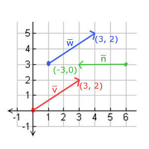

| 参考：                                                    |
| :-------------------------------------------------------- |
| https://zhuanlan.zhihu.com/p/349296191                    |
| https://colin1994.github.io/2017/11/11/OpenGLES-Lesson04/ |
| https://learnopengl.com/Advanced-OpenGL/Advanced-GLSL     |
| https://learnopengl-cn.readthedocs.io/                    |
| https://registry.khronos.org/OpenGL-Refpages/gl4/         |
| 《OpenGL 编程指南》                                       |

## 变量

<!-- | 类型  | 含义                              |
| ----- | --------------------------------- |
| vecn  | 包含 n 个 float 分量的默认向量    |
| bvecn | 包含 n 个 bool 分量的向量         |
| ivecn | 包含 n 个 int 分量的向量          |
| uvecn | 包含 n 个 unsigned int 分量的向量 |
| dvecn | 包含 n 个 double 分量的向量       | -->

| 变量类别   | 变量类型                  | 描述                               |
| ---------- | ------------------------- | ---------------------------------- |
| 空         | void                      | 用于无返回值的函数或空的参数列表   |
| 标量       | float, int, bool          | 浮点型，整型，布尔型的标量数据类型 |
| 浮点型向量 | float, vec2, vec3, vec4   | 包含 1，2，3，4 个元素的浮点型向量 |
| 整数型向量 | int, ivec2, ivec3, ivec4  | 包含 1，2，3，4 个元素的整型向量   |
| 布尔型向量 | bool, bvec2, bvec3, bvec4 | 包含 1，2，3，4 个元素的布尔型向量 |
| 矩阵       | mat2, mat3, mat4          | 尺寸为 2x2，3x3，4x4 的浮点型矩阵  |
| 纹理句柄   | sampler2D, samplerCube    | 表示 2D，立方体纹理的句柄          |

### 标量

```glsl
float myFloat = 1.0;
bool myBool = true;

myFloat = float(myBool); 	// bool -> float
myBool = bool(myFloat);     // float -> bool
```

### 向量



$$
y = \begin{pmatrix} a\\b\\c \end{pmatrix} \quad
$$

```glsl
vec4 myVec4 = vec4(1.0); 			// myVec4 = {1.0, 1.0, 1.0, 1.0}
vec3 myVec3 = vec3(1.0, 0.0, 0.5);  // myVec3 = {1.0, 0.0, 0.5}

vec3 temp = vec3(myVec3); 			// temp = myVec3
vec2 myVec2 = vec2(myVec3);         // myVec2 = {myVec3.x, myVec3.y}

myVec4 = vec4(myVec2, temp, 0.0);   // myVec4 = {myVec2.x, myVec2.y , temp, 0.0 }


```

| 分量访问符 | 符号描述             |
| ---------- | -------------------- |
| (x,y,z,w)  | 与位置相关的分量     |
| (r,g,b,a)  | 与颜色相关的分量     |
| (s,t,p,q)  | 与纹理坐标相关的分量 |

```glsl
vec3 myVec3 = vec3(0.0, 1.0, 2.0); // myVec3 = {0.0, 1.0, 2.0}
vec3 temp;
temp = myVec3.xyz; // temp = {0.0, 1.0, 2.0}
temp = myVec3.xxx; // temp = {0.0, 0.0, 0.0}
temp = myVec3.zyx; // temp = {2.0, 1.0, 0.0}

```

### 矩阵

mat2, mat3, mat4 尺寸为 2x2，3x3，4x4 的浮点型矩阵

$$
\begin{bmatrix} 1&2&3\\4&5&6 \end{bmatrix} \quad
$$

```glsl
mat3 myMat3 = mat3(1.0, 0.0, 0.0,  // 第一列
                   0.0, 1.0, 0.0,  // 第二列
                   0.0, 1.0, 1.0); // 第三列

```

### 数组

```glsl
float floatArray[4];
vec4 vecArray[2];
```

- 除了 uniform 变量之外，数组的索引只允许使用常数整型表达式。
- 在 GLSL 中不能在创建的同时给数组初始化，即数组中的元素需要在定义数组之后逐个初始化，且数组不能使用 const 限定符。

### 结构体

```glsl
struct rotateMatrix {
    float x;
    float y;
    float z;
    float coffee[8];
}
```


## 内置变量

**顶点着色器**

| 名称                   | 类型  | 描述                                                                                          |
| ---------------------- | ----- | --------------------------------------------------------------------------------------------- |
| gl_Color               | vec4  | 输入属性-表示顶点的主颜色                                                                     |
| gl_SecondaryColor      | vec4  | 输入属性-表示顶点的辅助颜色                                                                   |
| gl_Normal              | vec3  | 输入属性-表示顶点的法线值                                                                     |
| gl_Vertex              | vec4  | 输入属性-表示物体空间的顶点位置                                                               |
| gl_MultiTexCoordn      | vec4  | 输入属性-表示顶点的第 n 个纹理的坐标                                                          |
| gl_FogCoord            | float | 输入属性-表示顶点的雾坐标                                                                     |
| gl_Position            | vec4  | 输出属性-变换后的顶点的位置，用于后面的固定的裁剪等操作。**所有的顶点着色器都必须写这个值。** |
| gl_ClipVertex          | vec4  | 输出坐标，用于用户裁剪平面的裁剪                                                              |
| gl_PointSize           | float | 点的大小                                                                                      |
| gl_FrontColor          | vec4  | 正面的主颜色的 varying 输出                                                                   |
| gl_BackColor           | vec4  | 背面主颜色的 varying 输出                                                                     |
| gl_FrontSecondaryColor | vec4  | 正面的辅助颜色的 varying 输出                                                                 |
| gl_BackSecondaryColor  | vec4  | 背面的辅助颜色的 varying 输出                                                                 |
| gl_TexCoord[]          | vec4  | 纹理坐标的数组 varying 输出                                                                   |
| gl_FogFragCoord        | float | 雾坐标的 varying 输出                                                                         |

**片段着色器**

| 名称              | 类型  | 描述                                                                                     |
| ----------------- | ----- | ---------------------------------------------------------------------------------------- |
| gl_Color          | vec4  | 包含主颜色的插值只读输入                                                                 |
| gl_SecondaryColor | vec4  | 包含辅助颜色的插值只读输入                                                               |
| gl_TexCoord[]     | vec4  | 包含纹理坐标数组的插值只读输入                                                           |
| gl_FogFragCoord   | float | 包含雾坐标的插值只读输入                                                                 |
| gl_FragCoord      | vec4  | 只读输入，窗口的 x,y,z 和 1/w                                                            |
| gl_FrontFacing    | bool  | 只读输入，如果是窗口正面图元的一部分，则这个值为 true                                    |
| gl_PointCoord     | vec2  | 点精灵的二维空间坐标范围在(0.0, 0.0)到(1.0, 1.0)之间，仅用于点图元和点精灵开启的情况下。 |
| gl_FragData[]     | vec4  | 使用 glDrawBuffers 输出的数据数组。不能与 gl_FragColor 结合使用。                        |
| gl_FragColor      | vec4  | 输出的颜色用于随后的像素操作                                                             |
| gl_FragDepth      | float | 输出的深度用于随后的像素操作，如果这个值没有被写，则使用固定功能管线的深度值代替         |

## 修饰符

| 修饰符             | 描述                                                                                                                                                                                                                                                                                                          |
| ------------------ | ------------------------------------------------------------------------------------------------------------------------------------------------------------------------------------------------------------------------------------------------------------------------------------------------------------- |
| const              | 常量值必须在声明时初始化。它是只读的不可修改的。                                                                                                                                                                                                                                                              |
| attribute          | 表示只读的顶点数据，只用在顶点着色器中。数据来自当前的顶点状态或者顶点数组。它必须是全局范围声明的，不能在函数内部。一个 attribute 可以是浮点数类型的标量，向量，或者矩阵。不可以是数组或者结构体                                                                                                             |
| uniform            | 一致变量。在着色器执行期间一致变量的值是不变的。与 const 常量不同的是，这个值在编译时期是未知的是由着色器外部初始化的。一致变量在顶点着色器和片段着色器之间是共享的。它也只能在全局范围进行声明。                                                                                                             |
| varying            | 顶点着色器的输出。例如颜色或者纹理坐标，（插值后的数据）作为片段着色器的只读输入数据。必须是全局范围声明的全局变量。可以是浮点数类型的标量，向量，矩阵。不能是数组或者结构体。                                                                                                                                |
| centorid varying   | 在没有多重采样的情况下，与 varying 是一样的意思。在多重采样时，centorid varying 在光栅化的图形内部进行求值而不是在片段中心的固定位置求值。                                                                                                                                                                    |
| invariant (不变量) | 用于表示顶点着色器的输出和任何匹配片段着色器的输入，在不同的着色器中计算产生的值必须是一致的。所有的数据流和控制流，写入一个 invariant 变量的是一致的。编译器为了保证结果是完全一致的，需要放弃那些可能会导致不一致值的潜在的优化。除非必要，不要使用这个修饰符。在多通道渲染中避免 z-fighting 可能会使用到。 |
| in                 | 用在函数的参数中，表示这个参数是输入的，在函数中改变这个值，并不会影响对调用的函数产生副作用。（相当于 C 语言的传值），这个是函数参数默认的修饰符                                                                                                                                                             |
| out                | 用在函数的参数中，表示该参数是输出参数，值是会改变的。                                                                                                                                                                                                                                                        |
| inout              | 用在函数的参数，表示这个参数即是输入参数也是输出参数。                                                                                                                                                                                                                                                        |

## 精度限定符

|限定符| 描述|
|highp| 满足顶点着色语言的最低要求。对片段着色语言是可选项|
|mediump| 满足片段着色语言的最低要求，其对于范围和精度的要求必须不低于 lowp 并且不高于 highp|
|lowp| 范围和精度可低于 mediump，但仍可以表示所有颜色通道的所有颜色值|


## uniforms

尽管每个线程和其他线程之间不能有数据交换，但我们能从 CPU 给每个线程输入数据。因为显卡的架构，所有线程的输入值必须统一（uniform），而且必须设为只读。
