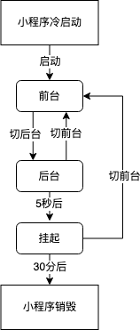
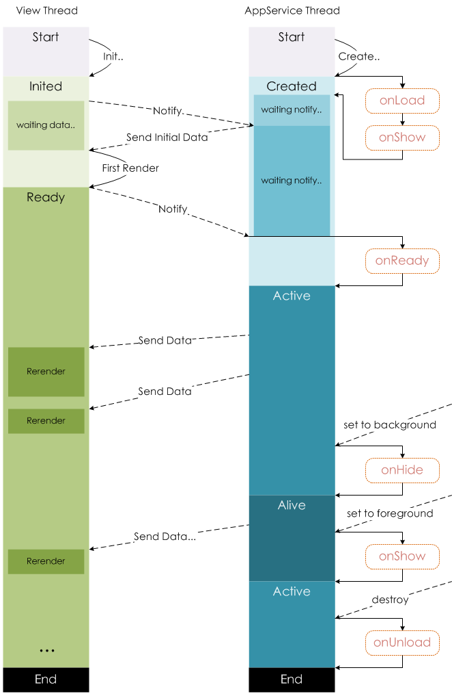

## 小程序启动



冷启动：如果用户首次打开，或小程序销毁后被用户再次打开，此时小程序需要重新加载启动，即冷启动。
热启动：如果用户已经打开过某小程序，然后在一定时间内再次打开该小程序，此时小程序并未被销毁，只是从后台状态进入前台状态，这个过程就是热启动


### 前台和后台

小程序启动后，界面被展示给用户，此时小程序处于「前台」状态。

当用户「关闭」小程序时，小程序并没有真正被关闭，而是进入了「后台」状态，此时小程序还可以短暂运行一小段时间，但部分 API 的使用会受到限制。切后台的方式包括但不限于以下几种：

点击右上角胶囊按钮离开小程序
iOS 从屏幕左侧右滑离开小程序
安卓点击返回键离开小程序
小程序前台运行时直接把微信切后台（手势或 Home 键）
小程序前台运行时直接锁屏
当用户再次进入微信并打开小程序，小程序又会重新进入「前台」状态。

## 生命周期

首先执行 App.onLaunch -> App.onShow
其次执行 Component.created -> Component.attached
再执行 Page.onLoad -> Page.onShow
最后 执行 Component.ready -> Page.onReady

### 小程序

```js
// app.js
App({
  onLaunch (options) {
    // Do something initial when launch.
  },
  onShow (options) {
    // Do something when show.
  },
  onHide () {
    // Do something when hide.
  },
  onError (msg) {
    console.log(msg)
  },
  globalData: 'I am global data'
})

```


### 页面



```js
//index.js
Page({
  data: {
    text: "This is page data."
  },
  onLoad: function(options) {
    // 页面创建时执行
  },
  onShow: function() {
    // 页面出现在前台时执行
  },
  onReady: function() {
    // 页面首次渲染完毕时执行
  },
  onHide: function() {
    // 页面从前台变为后台时执行
  },
  onUnload: function() {
    // 页面销毁时执行
  },
  onPullDownRefresh: function() {
    // 触发下拉刷新时执行
  },
  onReachBottom: function() {
    // 页面触底时执行
  },
  onShareAppMessage: function () {
    // 页面被用户分享时执行
  },
  onPageScroll: function() {
    // 页面滚动时执行
  },
  onResize: function() {
    // 页面尺寸变化时执行
  },
  onTabItemTap(item) {
    // tab 点击时执行
    console.log(item.index)
    console.log(item.pagePath)
    console.log(item.text)
  },
  // 事件响应函数
  viewTap: function() {
    this.setData({
      text: 'Set some data for updating view.'
    }, function() {
      // this is setData callback
    })
  },
  // 自由数据
  customData: {
    hi: 'MINA'
  }
})

```

### 组件


```js
Component({
  lifetimes: {
    attached: function() {
      // 在组件实例进入页面节点树时执行
    },
    detached: function() {
      // 在组件实例被从页面节点树移除时执行
    },
  },
  // 以下是旧式的定义方式，可以保持对 <2.2.3 版本基础库的兼容
  attached: function() {
    // 在组件实例进入页面节点树时执行
  },
  detached: function() {
    // 在组件实例被从页面节点树移除时执行
  },
  // ...
})

```