## 创建嵌套字

### 协议栈的内部结构

**浏览器、邮件等一般应用程序收发数据时用TCP；
DNS 查询等收发较短的控制数据时用UDP。**

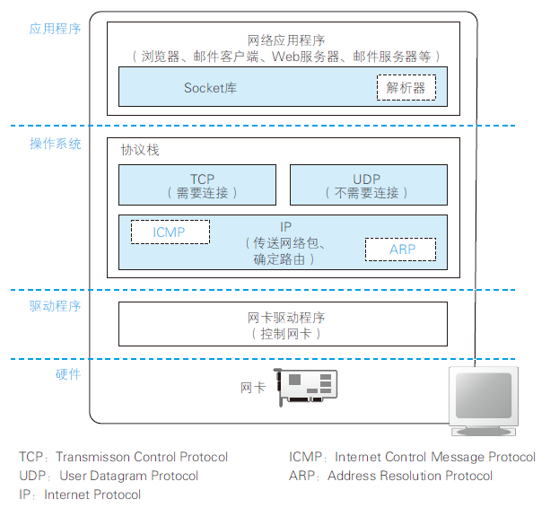

### 套接字的实体就是通信控制信息

在协议栈内部有一块用于存放控制信息的内存空间，这里记录了用于控制通信操作的控制信息，例如通信对象的IP 地址、端口号、通信操作的进行状态等

**协议栈是根据套接字中记录的控制信息来工作的。**

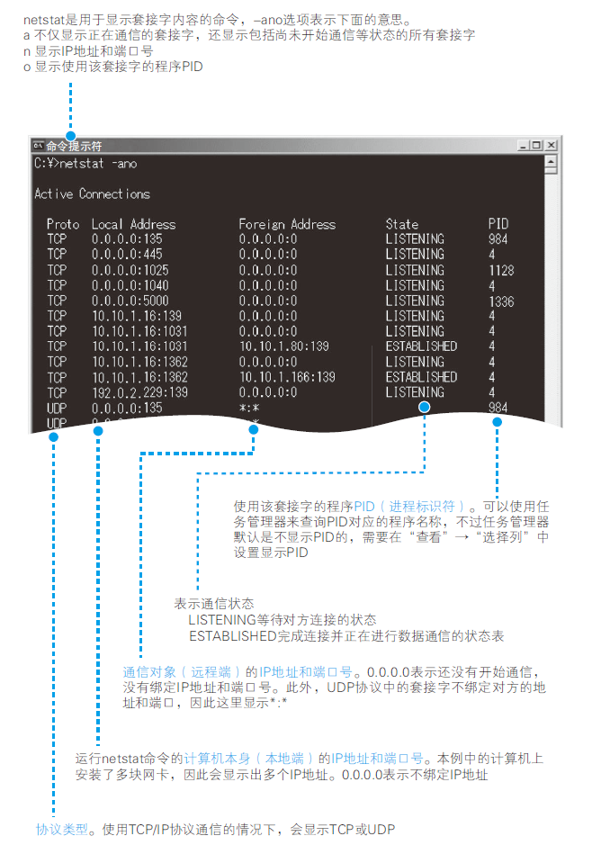

### 调用socket时的操作

创建套接字时，首先分配一个套接字所需的内存空间，然后向其中写入初始状态。

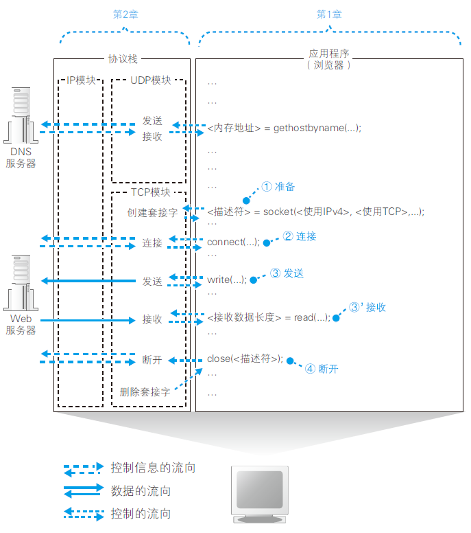

## 连接服务器

创建套接字之后，应用程序（浏览器）就会调用connect，随后协议栈会将本地的套接字与服务器的套接字进行连接。

### 保存控制信息的头部

客户端和服务器在通信中会将必要的信息记录在头部并相互确认

控制信息大体上分为两类。

第一类是客户端和服务器相互联络时交换的控制信息。

另外一类，那就是保存在套接字中，用来控制协议栈操作的信息

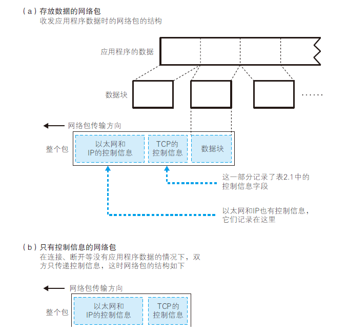

通信操作中使用的控制信息分为两类。
（1） 头部中记录的信息
（2） 套接字（协议栈中的内存空间）中记录的信息

### 连接操作的实际过程

连接操作的第一步是在TCP 模块处创建表示连接控制信息的头部。

通过TCP 头部中的发送方和接收方端口号可以找到要连接的套接字。

## 收发数据

### 将HTTP 请求消息交给协议栈

### 对较大的数据进行拆分

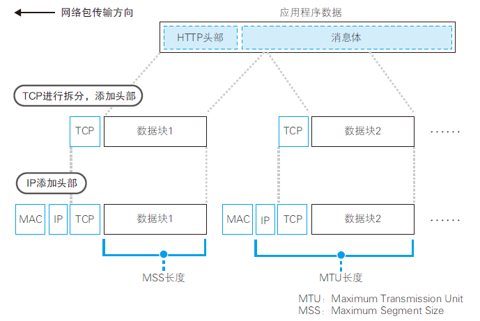

### 使用ACK号确认网络包已收到

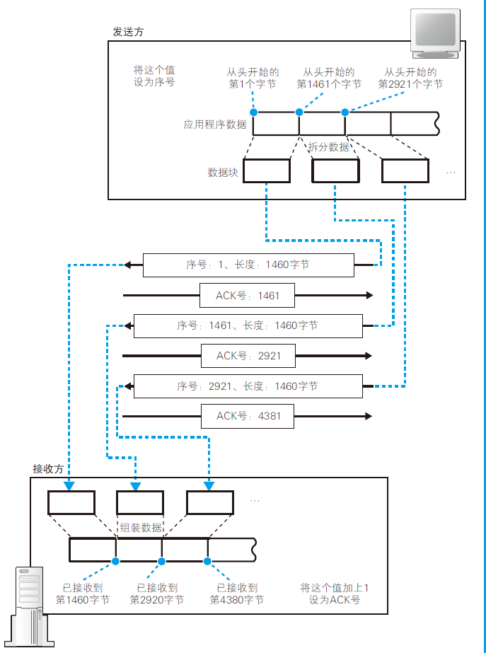

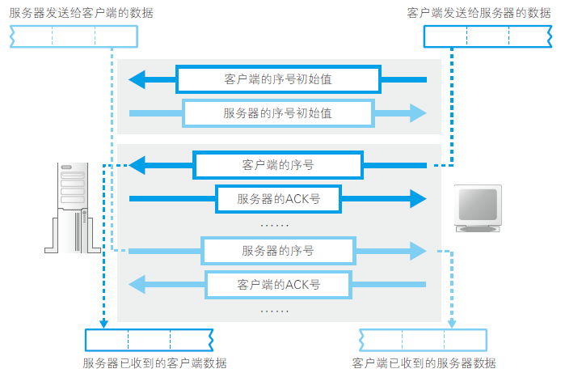

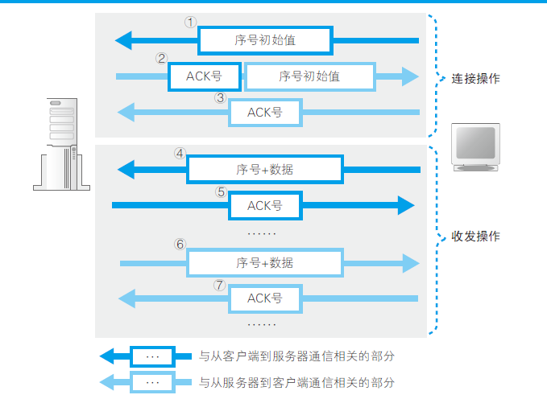

### 根据网络包平均往返时间调整ACK 号等待时间

这个等待时间叫超时时间

### 使用窗口有效管理ACK号

能够接收的最大数据量称为窗口大小

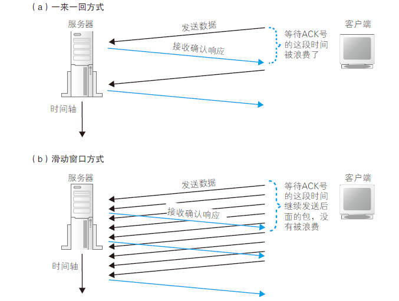

当接收方的TCP 收到包后，会先将数据存放到接收缓冲区中。

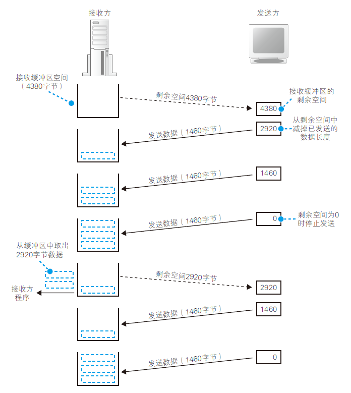

### ACK与窗口的合并

返回ACK号和更新窗口的时机？

其实没必要每次都向发送方更新窗口大小，因为只要发送方在每次发送数据时减掉已发送的数据长度就可以自行计算出当前窗口的剩余长度。

**接收方在发送ACK 号和窗口更新时，并不会马上把包发送出去，而是会等待一段时间**

因为ACK 号表示的是已收到的数据量，也就是说，它是告诉发送方目前已接收的数据的最后位置在哪里，因此当需要连续发送ACK 号时，只要发送最后一个ACK 号就可以了

### 接受HTTP响应消息

协议栈会检查收到的数据块和TCP 头部的内容，判断是否有数据丢失，如果没有问题则返回ACK 号

协议栈将数据块暂存到接收缓冲区中，并将数据块按顺序连接起来还原出原始的数据，最后将数据交给应用程序

协议栈会将接收到的数据复制到应用程序指定的内存地址中，然后将控制流程交回应用程序

## 从服务器断开并删除嵌套字

### 数据发送完毕后断开连接

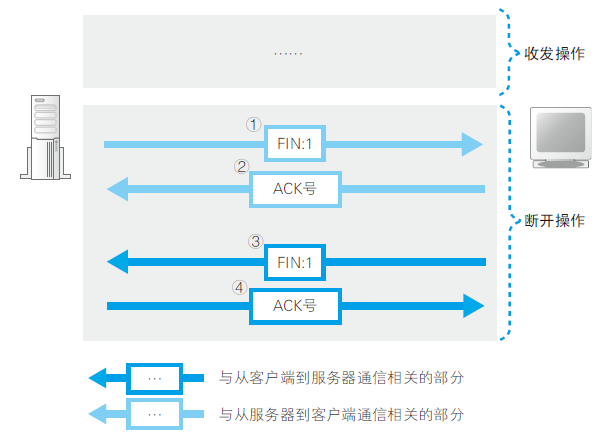

### 删除套接字

（1）客户端发送FIN
（2）服务器返回ACK 号
（3）服务器发送FIN
（4）客户端返回ACK 号

### 数据收发操作小结

创建套接字之后，客户端会向服务器发起连接操作。

客户端会生成一个SYN 为1 的TCP 包并发送给服务器

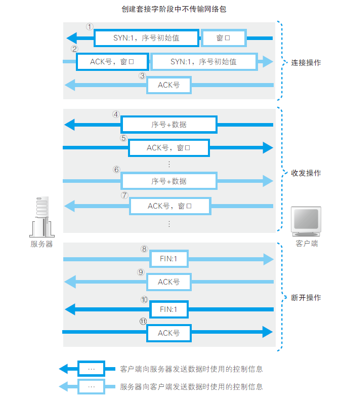

## ip与以太网的包收发操

### 包的基本知识

TCP 模块在执行连接、收发、断开等各阶段操作时，都需要委托IP 模块将数据封装成包发送给通信对象。

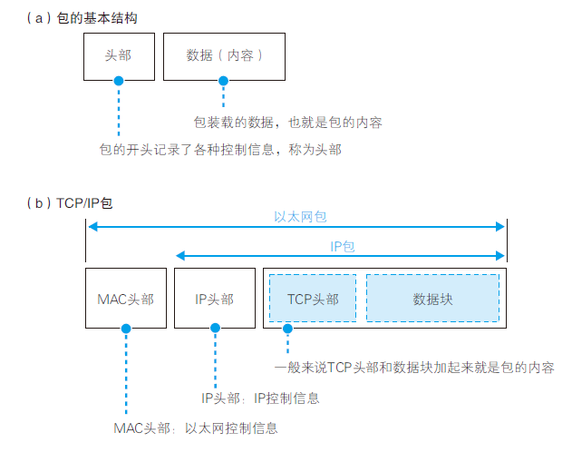

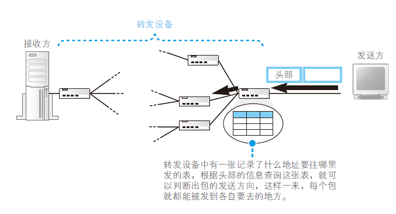

（1）路由器根据目标地址判断下一个路由器的位置
（2）集线器在子网中将网络包传输到下一个路由

（1）IP 协议根据目标地址判断下一个IP 转发设备的位置
（2）子网中的以太网协议将包传输到下一个转发设备

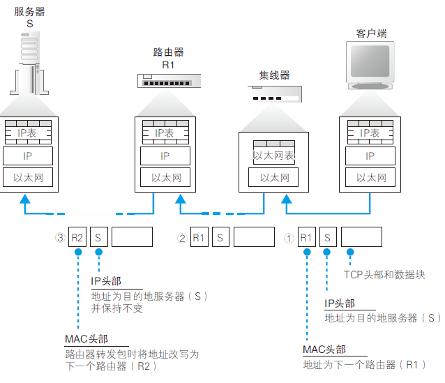

### 包收发操作概览

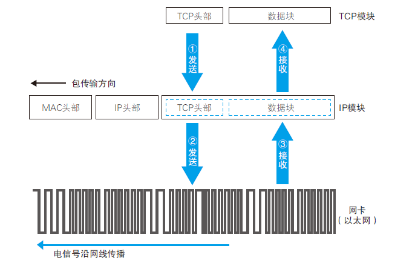

**包收发操作的起点是TCP 模块委托IP 模块发送包的操作**

这个委托的过程就是TCP 模块在数据块的前面加上TCP头部，然后整个传递给IP 模块，这部分就是网络包的内容。

收到委托后，IP 模块会将包的内容当作一整块数据，在前面加上包含制信息的头部

> IP 模块负责添加如下两个头部。
（1） MAC 头部：以太网用的头部，包含MAC 地址
（2） IP 头部：IP 用的头部，包含IP 地址
> 

### 生成包含接收方IP地址的IP头部

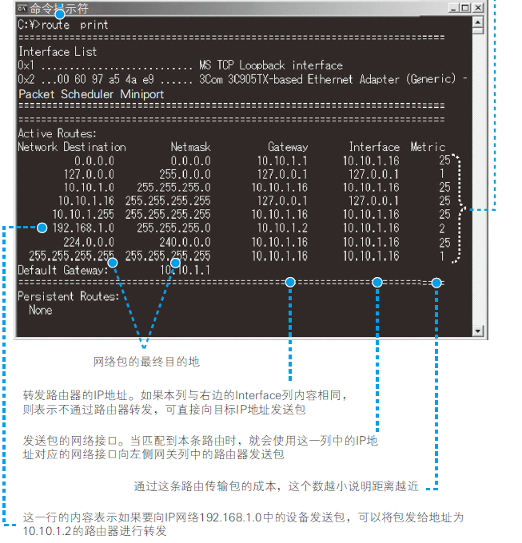

### 生成以太网用的MAC头部

### 通过ARP查询目标路由器的MAC地址

**查询MAC 地址需要使用ARP。**

### 以太网的基本知识

以太网是一种为多台计算机能够彼此自由和廉价地相互通信而设计的通信技术

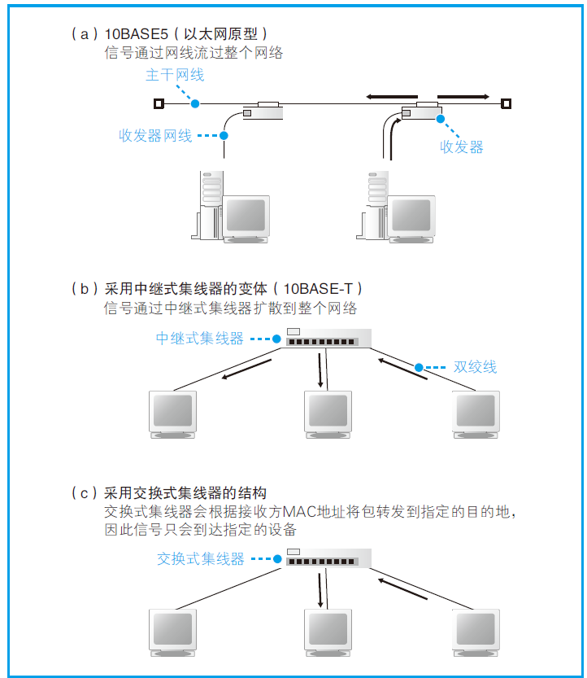

### 将IP包转换为电或光信号发送出去

生成的网络包只是存放在内存中的一串数字信息，没有办法直接发送给对方。因此，我们需要将数字信息转换为电或光信号，才能在网线上传输，也就是说，这才是真正的数据发送过程。负责执行这一操作的是网卡

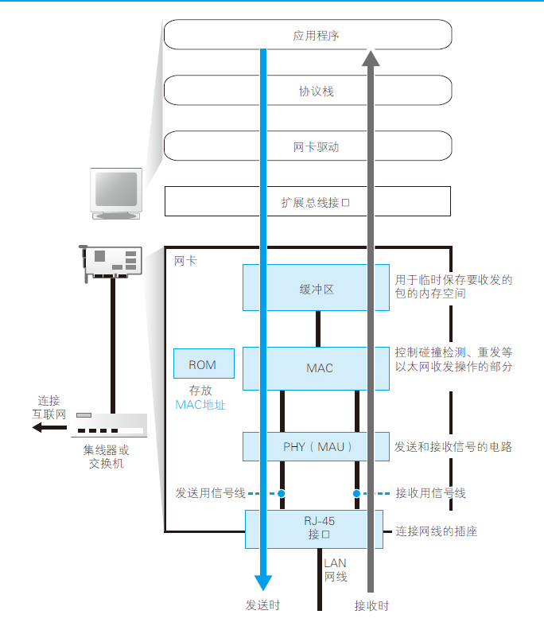

**网卡的ROM 中保存着全世界唯一的MAC 地址，这是在生产网卡时写入的**

**网卡中保存的MAC 地址会由网卡驱动程序读取并分配给MAC模块。**

### 给网络包加3个控制数据

网卡驱动从IP 模块获取包之后，会将其复制到网卡内的缓冲区中，然后向MAC 模块发送发送包的命令

MAC 模块会将包从缓冲区中取出，并在开头加上报头和起始帧分界符，在末尾加上用于检测错误的帧校验序列

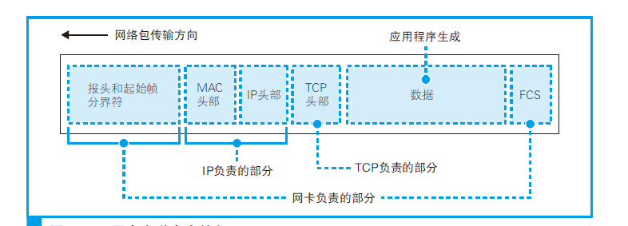

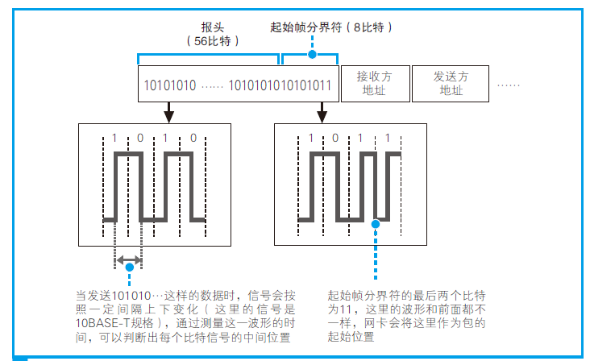

用电信号来表达数字信息时，我们需要让0 和1 两种比特分别对应特定的电压和电流

在数据信号之外再发送一组用来区分比特间隔的时钟信号

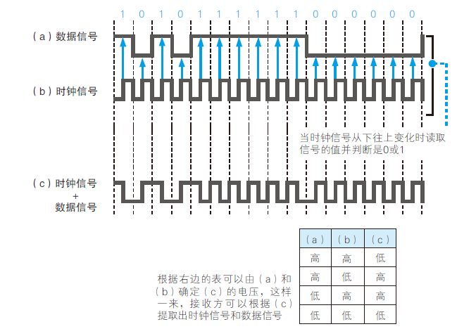

## 向集线器发送网络包

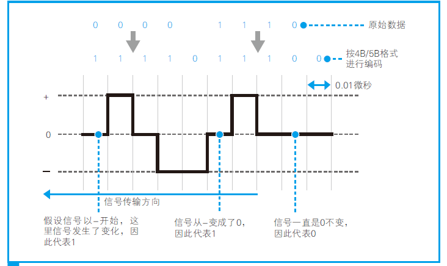

**网卡的MAC 模块生成通用信号，然后由PHY（MAU）模块转换成可在网线中传输的格式，并通过网线发送出去。**