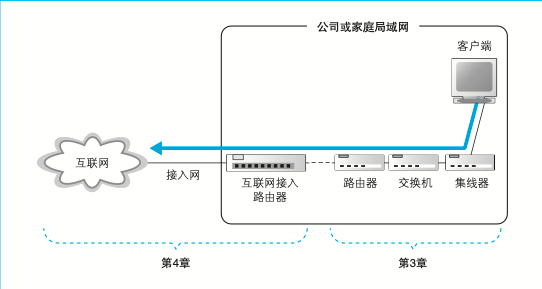
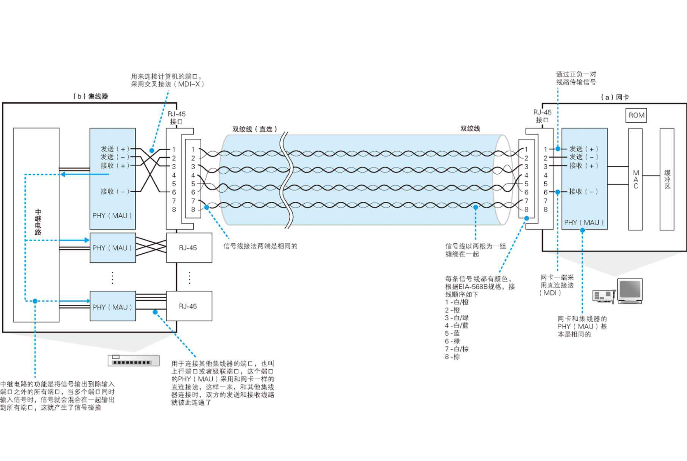

| 参考 | 《网络是怎样连接的》 |
| ---- | -------------------- |
## 信号在网线和集线器中传输

信号从计算机中流出之后，会在网线中经过集线器等设备前进。此时， 信号是如何在网线和集线器传输的，就是我们的第一个看点。信号在传输 过程中会衰减，还会受到噪声干扰而失真，如何抑制这些影响是我们的另 一个看点。

### 每个包都是独立传输的

从计算机发送出来的网络包会通过集线器、路由器等设备被转发，最终到达目的地。
**实际上，路由器已经集成了集线器和交换机的功能**

信号到达集线器的时候并不是跟刚发送出去的时候一模一样。集线器收到的信号有时会出现衰减。信号在网线的传输过程中，能量会逐渐损失。网线越长，信号衰减就越严重。

### 防止网线中的信号衰减很重要

网卡中的 PHY(MAU)A 模 块负责将包转换成电信号，信号通过 RJ-45 接口进入双绞线
以太网信号的本质是正负变化的电压

## 交换机的包转发操作

交换机的工作方式也是本章看点之一。交换机并不只是简单地让信号 流过，而是先接收信号并将其还原为数字信息，然后再重新转换成信号并 发送出去的过程。这里我们将详细探索这一过程。

## 路由器的包转发操作

路由器和交换机一样也负责对包进行转发，但它们的工作方式有一些 差异。交换机是基于以太网规格工作的设备，而路由器是基于 IP 工作的， 它们之间的差异也是本章看点之一。

## 路由器的附加功能

位于互联网接入端的路由器通常还会提供一些附加功能，例如将私有 地址转换为公有地址的地址转换功能，以及阻止危险网络包的包过滤功 能等。
