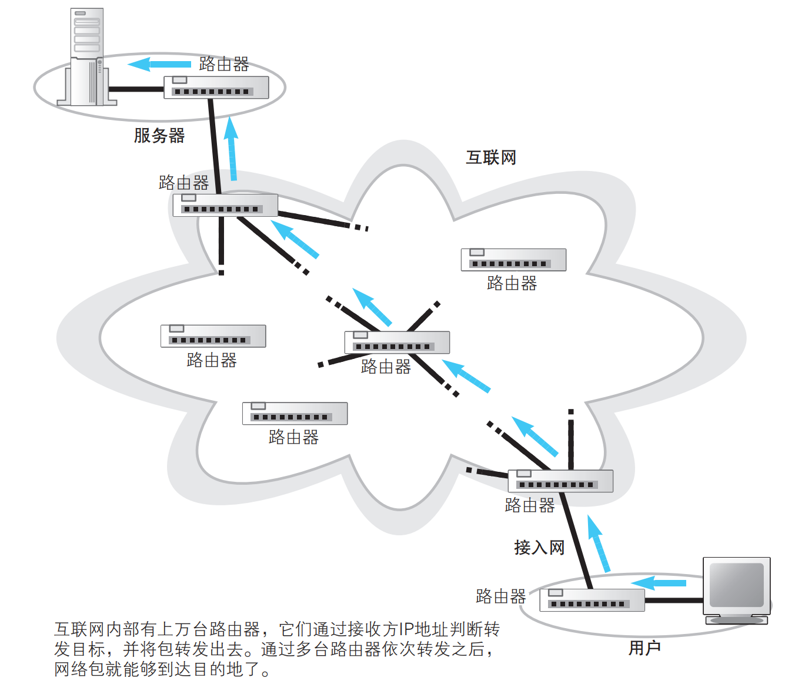
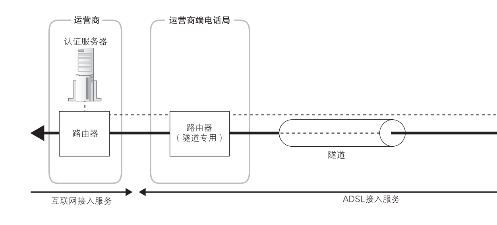
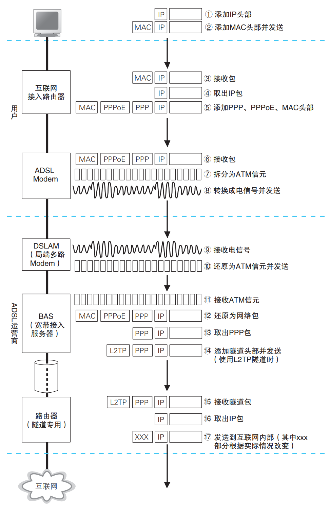
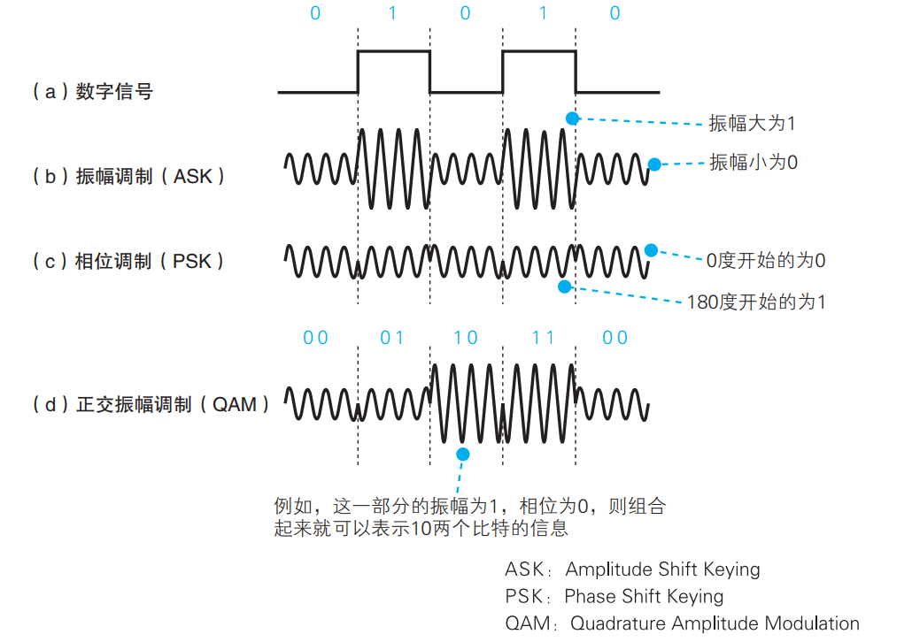
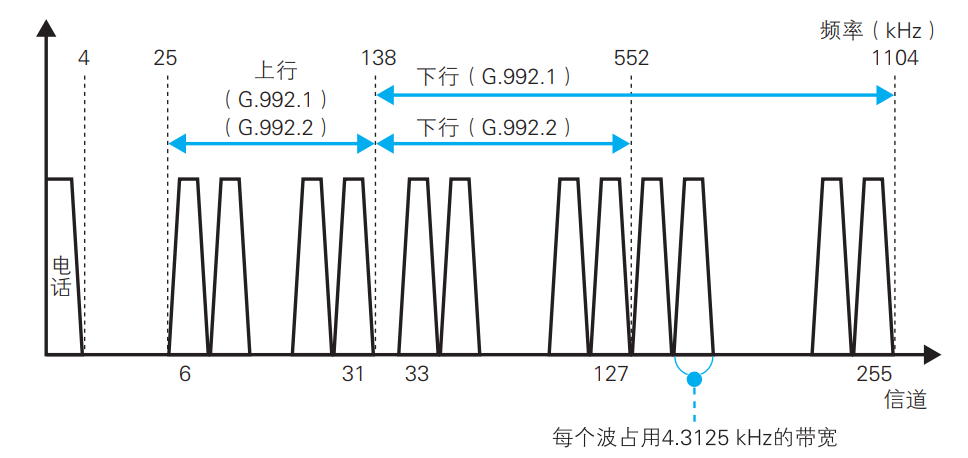
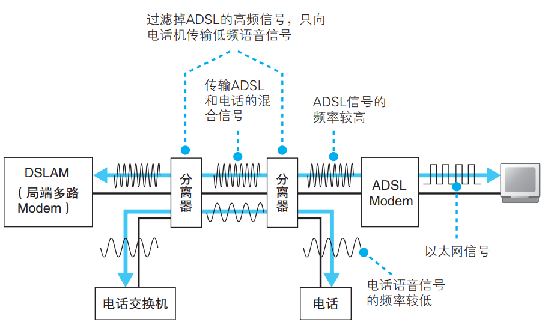
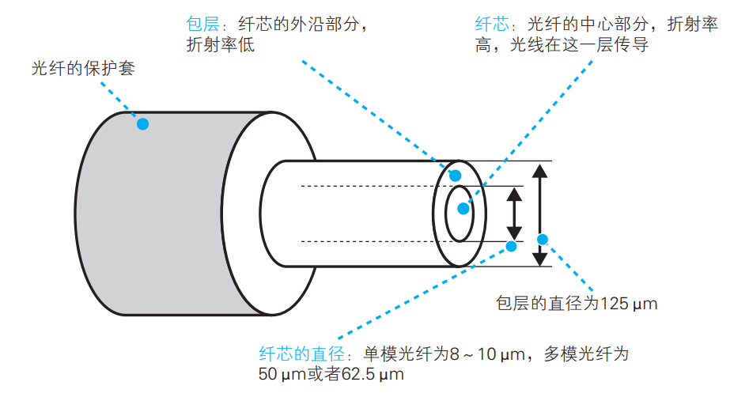
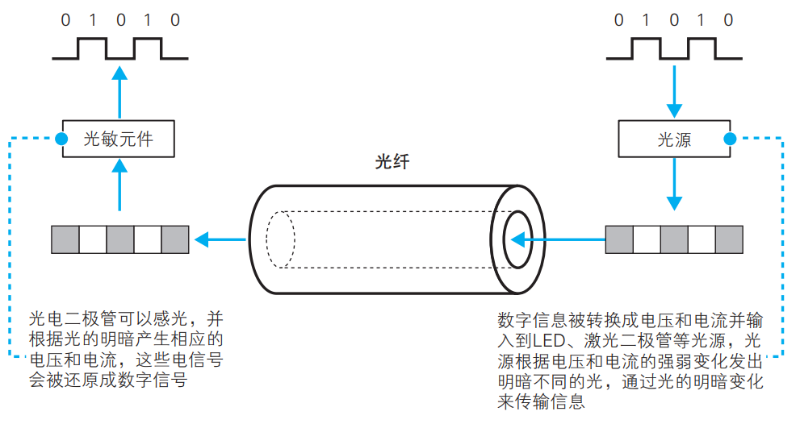

## ADSL 接入网的结构和工作方式

家庭和公司的内网是通过接入网连接到网络运营商的。接入网有很多类型，这里我们将介绍 ADSL 接入网的知识，重点包括 ADSL 接入网的结构、电话线中传输的信号以及与电话共用的方式

### 互联网的基本结构和家庭、公司网络是相同的

和家庭、公司网络一样，互联网也是通过路由器来转发包的

互联网也是根据路由表中的记录来判断转发目标的，但路由表记录的维护方式不同

距离的不同和路由的维护方式，就是互联网与家庭、公司网络之间最主要的两个不同点

### 连接用户与互联网的接入网

网络包通过交换机和路由器的转发一步一步地接近它的目的地，在通过互联网接入路由器之后，就进入了互联网

根据包 IP 头部中的接收方 IP 地址在路由表的目标地址中进行匹配，找到相应的路由记录后将包转发到这条路由的目标网关。

互联网接入路由器发送网络包的操作和以太网路由器有一点不同，互联网接入路由器是按照接入网规则来发送包的

所谓接入网，就是指连接互联网与家庭、公司网络的通信线路。一般家用的接入网方式包括 ADSL、FTTH、CATV、电话线、ISDN 等

### ADSL Modem 将包拆分成信元

ADSL 技术使用的接入线路

互联网接入路由器会在网络包前面加上 MAC 头部、PPPoE 头部、PPP 头 部 总 共 3 种 头 部， 然 后 发 送 给 ADSL Modem

ADSL Modem 将包拆分成信元，并转换成电信号发送给分离器。

### ADSL 将信元“调制”成信号

ADSL Modem 采用了一种用圆滑波形（正弦波）对信号进行合成来表示 0 和 1 的技术，这种技术称为调制

振幅调制是用信号的强弱，也就是信号振幅的大小来对应 0 和 1 的方式。振幅小的信号为 0，振幅大的信号为 1

正交振幅调制中，通过增加振幅和相位的级别，就可以增加能表示的比特数。

### ADSL 通过使用多个波来提高速率

实际上信号不一定要限制在一个频率。不同频率的波可以合成，也可以用滤波器从合成的波中分离出某个特定频率的波。

使用多个频率合成的波来传输信号,能够表示的比特数就可以成倍提高

ADSL 使用间隔为 4.3125 kHz 的上百个不同频率的波进行合成，每个波都采用正交振幅调制

### 分离器的作用

## 光纤接入网（FTTH)

常用的接入网技术与 ADSL 技术的利用率不相上下的光纤技术，重点包括光纤结构、单模和多模的区别之类的光纤性质，以及光纤用作接入网时的工作方式。

### 光纤的基本知识

将数字信息转换成电信号，然后再将电信号转换成光信号,高电压发光亮，低电压发光暗

### 单模与多模

## 接入网中使用的 PPP 和隧道

接入网需要通过用户名和密码验证用户的身份，然后由网络运营商向
用户分配公有地址。

，从接入网向网络运营商传输网络包时还使用了
隧道技术

## 网络运营商的内部

接入网后面连接着网络运营商的网络，运营商网络也是以路由器为核
心组成的，这一点和家庭、公司网络是一样的，包转发的工作原理也没有
区别。不过，运营商网络也使用了一些和家庭、公司网络不同的技术，比
如运营商之间可以自动交换路由信息和更新路由表

## 跨越运营商的网络包

互联网是由多个运营商网络相互连接形成的巨大网络，而多个运营商
之间相互连接的部分可以说就是互联网的核心部分
