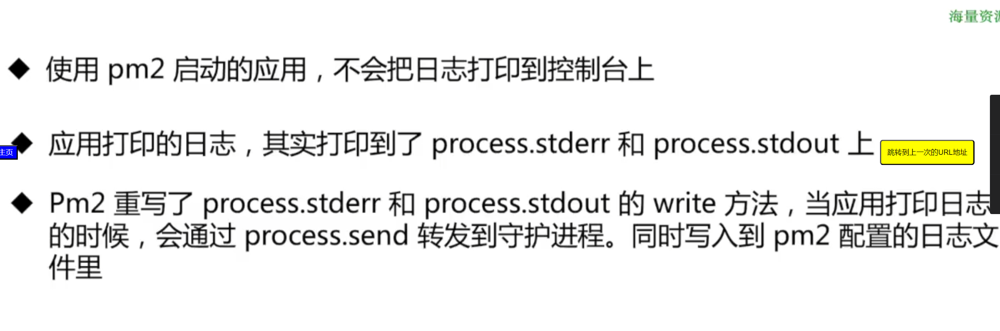

## Use Method

utilization: as a percent over a time interval. eg, "one disk is running at 90% utilization".
saturation: as a queue length. eg, "the CPUs have an average run queue length of four".
errors: scalar counts. eg, "this network interface has had fifty late collisions".

## APM 性能指标

Application performance monitoring guide

## QPS & TPS

## RT & Concurrency

## Crafana + Graphite

## Gauges Counter Sets

## Alinode

## 网络部署架构

## 负载均衡

https://aws.amazon.com/cn/what-is/load-balancing/

### 进程负载均衡和 RPC 负载均衡

### RPC 调用原理

### 服务负载均衡 集群 cluster

```js
const cluster = require('cluster')
const http = require('http')

const numCPUs = require('os').cpus().length;

if(cluster.isMater) {
    for (let i=0;i<numCPUs;i++) {
        cluster.fork()
    }
    cluster.on('exit',(work,code,signal) => {

    })
}ele {
    http.createServe((req,res) => {

    })
}

```

#### 共享端口、时序图、进程间通信

### 分布式 RPC 负载均衡

### 负载均衡算法： Round Robin、Weighted Round Robin、Source IP hash

### 布隆过滤器

## Nodejs 优雅退出

### Graceful exit 的概念

优雅退出

### 灰度发布机制 （health check）

灰度发布和金丝雀

金丝雀滚动发布

负债均衡+金丝雀发布

蓝绿发布

功能开关发布

LB 发布

健康检查 health check

pm2 的启动流程

守护进程（deamon process）

```js
const { spawn } = require("child_process");

const subprocess = spawn(process.argv[0], ["child_program.jss"], {
  detached: true,
  stdio: "ignore",
});

subprocess.unref();
```

pm2 的 cluster mode



egg.js为什么不使用pm2

