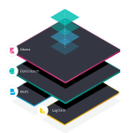

## 日志

日志记录是将应用程序运行生成的信息记录到日志文件中的过程，保存在日志文件中的记录称为日志，日志是一种保存应用程序信息的简单方法。

Debug(调试)、问题定位、用户行为、现场记录与根因分析

Console的底层

Process.stdout.write

Nodejs日志的原理


### console

```js
console.log('Hello there')

Console.prototype.log = function () {
    this._stdout.write(util.format.apply(this,arguments) + '\n')
}

```

底层调用process.stdout.write,stdin,stdout

process.stdout.write

- 文件: 在Windows和POSIX上同步的
- TTY(终端):在Windows上是异步的，在POSIX上是同步的
- 管道（和套接字）:在Windows上是同步的，在POSIX上是异步的
- POSIX: Mac OS，Unix,Linux


**日志写入文件**

```js
fs.writeFile('log.txt','message','utf8',callback)

fs.readFile('log.txt',{encoding:'utf8'},(err,data) => {
    fs.writeFile('log.txt',newData,'utf8',callback)
})

```

写入新日志会打开一个文件，将所有文件数据加载到内存中，在打开同一文件写入新数据

`appendFile`

```js
fs.appendFile = function(path, data, options, callback_) {
 
  var callback = maybeCallback(arguments[arguments.length - 1]);
 
  if (util.isFunction(options) || !options) {
 
    options = { encoding: 'utf8', mode: 438 /*=0666*/, flag: 'a' };
 
  } else if (util.isString(options)) {
 
    options = { encoding: options, mode: 438, flag: 'a' };
 
  } else if (!util.isObject(options)) {
 
    throw new TypeError('Bad arguments');
 
  }
 
  if (!options.flag)
 
    options = util._extend({ flag: 'a' }, options);
 
  fs.writeFile(path, data, options, callback);
 
```

- 打开一个文件，获取文件句柄（fd)
- 将数据写入文件

文件句柄:进程每新打开一个文件，系统会分配一个新的文件描述符（FD）

appendFile在每次需要写日志时都会打开一个文件，高并发会导致EMFILE错误


```js
const log = fs.createWriteStream('log.txt',{flags:'a'})
log.write('new entry\n')

```


## 服务器应用日志


## 日志的级别介绍

- ALL 最低等级的，用于打开所有日志记录。

- TRACE designates finer-grained informational events than the DEBUG.Since:1.2.12，很低的日志级别，一般不会使用。

- DEBUG 指出细粒度信息事件对调试应用程序是非常有帮助的，主要用于开发过程中打印一些运行信息。

- INFO 消息在粗粒度级别上突出强调应用程序的运行过程。打印一些你感兴趣的或者重要的信息，这个可以用于生产环境中输出程序运行的一些重要信息，但是不能滥用，避免打印过多的日志。

- WARN 表明会出现潜在错误的情形，有些信息不是错误信息，但是也要给程序员的一些提示。

- ERROR 指出虽然发生错误事件，但仍然不影响系统的继续运行。打印错误和异常信息，如果不想输出太多的日志，可以使用这个级别。

- FATAL 指出每个严重的错误事件将会导致应用程序的退出。这个级别比较高了。重大错误，这种级别你可以直接停止程序了。

- OFF 最高等级的，用于关闭所有日志记录。

### 好的日志

- 时间戳
- 计算机/服务器名称/ip
- 进程ID
- 消息，报错
- 堆栈跟踪
- 上下文

### 避免

- 不应该会产生异常
- 不应该产生副作用
- 不应该带敏感信息


## 日志切割技术（logrotate）

- 定时切割
- 按大小切割

### create/copytruncate

create 

- 将test.log重命名为test.log.1
- 创建一个新的test.log文件

copytruncate

- 将test.log拷贝一份为test.log.1
- 将test.log清空


## 命令行日志

### 彩色日志

\033+背景颜色+颜色+m作为前缀

```js
const chalk = require('chalk')

//禁止打印彩色
console.log(process.stdout.isTTY)

const ProgressBar = require('process')

process.stdout.cursorTo(0)
process.stdout.write(str)
process.stdout.clearLine(1);

```

inquirer.js:交互式命令行
blessed-contrib:命令行图表
commander.js:命令行基础库
cfonts:命令行大logo


## ELK



“ELK”是三个开源项目的首字母缩写，这三个项目分别是：Elasticsearch、Logstash 和 Kibana。
- Elasticsearch 是一个搜索和分析引擎。
- Logstash 是服务器端数据处理管道，能够同时从多个来源采集数据，转换数据，然后将数据发送到诸如 Elasticsearch 等“存储库”中。
- Kibana 则可以让用户在 Elasticsearch 中使用图形和图表对数据进行可视化。


```js

//https://github.com/deviantony/docker-elk
import express from "express";
import log4js from "log4js";
import * as homeController from "./controllers/home";

const app = express();

const PORT: number = app.get("port") || 3000;
const ENV: string = app.get("env");

log4js.configure({
  appenders: {
    console: { type: "console" },
    // file: { type: "file", filename: "all-the-logs.log" },
    // https://github.com/Aigent/log4js-logstash-tcp
    elk_learn: {
      type: "log4js-logstash-tcp",
      host: "127.0.0.1",
      port: 5000
    }
  },
  categories: {
    default: { appenders: ["elk_learn"], level: "debug" }
  }
});

const logger = log4js.getLogger("default");
logger.level = "debug";

app.get("/index", homeController.index);

const server = app.listen(PORT, () => {
  logger.info("App is running at http://localhost:%d in %s mode", PORT, ENV);
  logger.info("Press CTRL-C to stop\n");
});

export default server;

```

## Sentry


## Sentry和ELK

ELK一般适用于收集、整理全量日志，并且对日志内容进行切分并存储起来

Sentry不会收集全量日志，他只会在你主动上报给他的时候进行收集处理

分析类（行为日志分析，访问日志分析，流量分析）以及大规模的日志存储和检索合适使用ELK

预警类如错误监控，异常监控，波动预警等合适使用Sentry进行处理

