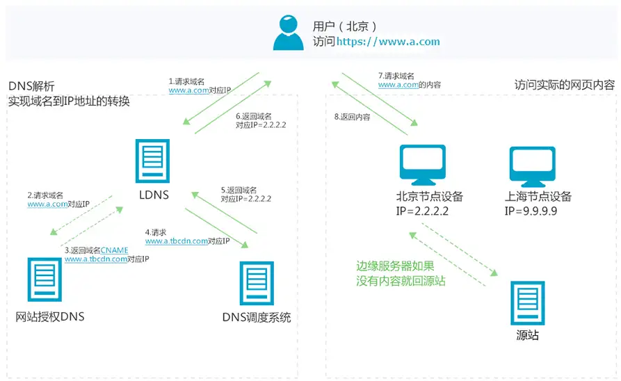

## 懒加载

延迟加载（懒加载）是一种将资源标识为非阻塞（非关键）资源并仅在需要时加载它们的策略。这是一种缩短关键渲染路径长度的方法，可以缩短页面加载时间。

### CSS模块加载

```html
<!-- 加载和解析 styles.css 会阻塞渲染 -->
<link rel="stylesheet" href="styles.css" />

<!-- 加载和解析 print.css 不会阻塞渲染 -->
<link rel="stylesheet" href="print.css" media="print" />

<!-- 在大屏幕上，加载和解析 mobile.css 不会阻塞渲染 -->
<link
  rel="stylesheet"
  href="mobile.css"
  media="screen and (max-width: 480px)" />
```  

## DNS预解析、预加载、预渲染

## DNS预解析

dns-prefetch(DNS预获取)是前端网络性能优化的一种措施。它根据浏览器定义的规则，提前解析之后可能会用到的域名，使解析结果缓存到系统缓存中，缩短DNS解析时间，进而提高网站的访问速度。

```html
<link rel="dns-prefetch" href="https://fonts.googleapis.com/" />
```

当浏览器访问一个域名的时候，需要解析一次DNS，获得对应域名的ip地址。 在解析过程中，按照:

- 浏览器缓存
- 系统缓存
- 路由器缓存
- ISP(运营商)DNS缓存
- 根域名服务器
- 顶级域名服务器
- 主域名服务器

dns-prefetch就是在将解析后的IP缓存在系统中。

## 预先建立连接

连接不仅需要 DNS 查询，还需要进行 TCP 协议握手，有些还会有 TLS/SSL 协议

```html
<link rel="preconnect" href="https://fonts.googleapis.com/" />
```

浏览器大致做了如下处理：

- 首先，解析 Preconnect 的 url；
- 其次，根据当前 link 元素中的属性进行 cors 的设置；
- 然后，默认先将 credential 设为 true，如果 cors 为 Anonymous 并且存在跨域，则将 credential 置为 false；
- 最后，进行连接。

## CDN

内容分发网络 (CDN) 是一个分布在不同地理位置的服务器群，用于缓存靠近最终用户的内容。CDN 可以快速传输加载互联网内容所需的资产，包括 HTML 网页、JavaScript 文件、样式表、图像和视频。



假设通过CDN加速的域名为www.a.com，接入CDN网络，开始使用加速服务后，当终端用户（北京）发起HTTP请求时，处理流程如下：

- 当终端用户（北京）向www.a.com下的指定资源发起请求时，首先向LDNS（本地DNS）发起域名解析请求。
- LDNS检查缓存中是否有www.a.com的IP地址记录。如果有，则直接返回给终端用户；如果没有，则向授权DNS查询。
- 当授权DNS解析www.a.com时，返回域名CNAME www.a.tbcdn.com对应IP地址。
- 域名解析请求发送至阿里云DNS调度系统，并为请求分配最佳节点IP地址。
- LDNS获取DNS返回的解析IP地址。
- 用户获取解析IP地址。
- 用户向获取的IP地址发起对该资源的访问请求。
- 如果该IP地址对应的节点已缓存该资源，则会将数据直接返回给用户，例如，图中步骤7和8，请求结束。
- 如果该IP地址对应的节点未缓存该资源，则节点向源站发起对该资源的请求。获取资源后，结合用户自定义配置的缓存策略，将资源缓存至节点，例如，图中的北京节点，并返回给用户，请求结束。


（1）CDN的加速资源是跟域名绑定的。
（2）通过域名访问资源，首先是通过DNS分查找离用户最近的CDN节点（边缘服务器）的IP
（3）通过IP访问实际资源时，如果CDN上并没有缓存资源，则会到源站请求资源，并缓存到CDN节点上，这样，用户下一次访问时，该CDN节点就会有对应资源的缓存了。

## 预渲染

当项目代码构建时（build time）简单地生成一些针对特定路由的静态HTML文件，使浏览器在请求服务器之前就能渲染一些文字或内容，以便于提高SEO优化和首页白屏的缺陷（至少用户可以看到东西不那么焦虑）

```js
// webpack.config.js
const path = require('path');
const PrerenderSPAPlugin = require('prerender-spa-plugin');

module.exports = {
  plugins: [
    // ... other config
    new PrerenderSPAPlugin({
      // required，打包的文件输出目录，预渲染工具会在这个目录启动express服务
      staticDir: path.join(__dirname, 'dist'),
      // required，指定需要预渲染的路由
      routes: [ '/', '/about', '/some/deep/nested/route' ]
    })
  ]
};
```

## 预加载

### Resource Hints

Resource Hints

[Resource Hints](https://html.spec.whatwg.org/#linkTypes) 是一种预加载相关的标准，它告诉浏览器哪些源下的资源我们的 Web 应用需要获取，哪些资源在之后的操作或浏览时需要被使用，从而让浏览器能够进行一些预先连接或预先加载操作。Resource Hints 标准包括 DNS Prefetch、Preconnect、Prefetch 与 Prerender。


#### Prefetch

提前获取资源，但是不会对资源进行预处理
```html
<link rel="prefetch" href="/prefetch.js" as="script">
```

#### Prerender
Prerender 比 Prefetch 更进一步，可以粗略地理解不仅会预获取，还会预执行。

```html
<link rel="prerender" href="//sample.com/nextpage.html">
```

#### Preload
在遇到需要 Preload 的资源时，浏览器会**立刻**进行预获取，并将结果放在内存中，资源的获取不会影响页面 parse 与 load 事件的触发。
```html
<link rel="preload" href="/preload.js" as="script">
```


## 离线化

### PWA

## HTTP缓存

## 数据缓存

## 资源加载

## 请求合并

## HTTP2

## CDN
