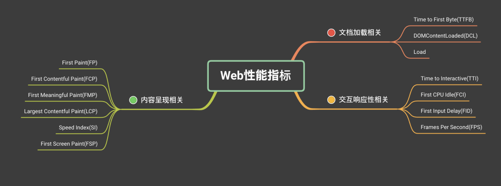

# Web Vitals

什么是 Web Vitals，Google给的定义是一个良好网站的基本指标 (Essential metrics for a healthy site)。由于过去要衡量一个好的网站，需要使用的指标太多，于是推出了 Web Vitals ，也是为了简化学习的曲线，开发者只需要关注 Web Vitals 指标表现即可。

而在 Web Vitals 指标中，Core Web Vitals 是其中的核心，目前包含三个指标：

- LCP：(Largest Contentful Paint) 从页面加载开始到最大文本块或图像元素在屏幕上完成渲染的时间（衡量网站初次载入速度）
- FID：（First Input Delay） 首次输入延迟时间 (衡量网站互动顺畅程度)
- CLS：(Cumulative Layout Shift)，从页面加载开始和其生命周期状态变为隐藏期间发生的所有意外布局偏移的累积分数（衡量视觉稳定性）


# 首屏渲染时间

首屏这个概念目前来说没有一个官方的定义，一般来说都以约定俗成的说法为准即 从输入 URL 开始到第一屏（可视区域）的内容加载完毕的时间。根据业务场景的不同，也有不同的指标和规范。

```js
class FCP {
  static details = [];
  static ignoreEleList = ["script", "style", "link", "br"];
  constructor() {}
  static isEleInArray(target, arr) {
    if (!target || target === document.documentElement) {
      return false;
    } else if (arr.indexOf(target) !== -1) {
      return true;
    } else {
      return this.isEleInArray(target.parentElement, arr);
    }
  }
  // 判断元素是否在首屏内
  static isInFirstScreen(target) {
    if (!target || !target.getBoundingClientRect) return false;
    var rect = target.getBoundingClientRect(),
      screenHeight = window.innerHeight,
      screenWidth = window.innerWidth;
    return (
      rect.left >= 0 &&
      rect.left < screenWidth &&
      rect.top >= 0 &&
      rect.top < screenHeight
    );
  }

  static getFCP() {
    return new Promise((resolve, reject) => {
      // 5s之内先收集所有的dom变化，并以key（时间戳）、value（dom list）的结构存起来。
      var observeDom = new MutationObserver((mutations) => {
        if (!mutations || !mutations.forEach) return;
        var detail = {
          time: performance.now(),
          roots: [],
        };
        mutations.forEach((mutation) => {
          if (!mutation || !mutation.addedNodes || !mutation.addedNodes.forEach)
            return;
          mutation.addedNodes.forEach((ele) => {
            if (
              // nodeType = 1 代表元素节点
              ele.nodeType === 1 &&
              this.ignoreEleList.indexOf(ele.nodeName.toLocaleLowerCase()) ===
                -1
            ) {
              if (!this.isEleInArray(ele, detail.roots)) {
                detail.roots.push(ele);
              }
            }
          });
        });
        if (detail.roots.length) {
          this.details.push(detail);
        }
      });
      observeDom.observe(document, {
        childList: true,
        subtree: true,
      });
      setTimeout(() => {
        observeDom.disconnect();
        resolve(this.details);
      }, 5000);
    }).then((details) => {
      // 分析上面收集到的数据，返回最终的结果
      var result;
      details.forEach((detail) => {
        for (var i = 0; i < detail.roots.length; i++) {
          if (this.isInFirstScreen(detail.roots[i])) {
            result = detail.time;
            break;
          }
        }
      });
      // 遍历当前请求的图片中，如果有开始请求时间在首屏dom渲染期间的，则表明该图片是首屏渲染中的一部分，
      // 所以dom渲染时间和图片返回时间中大的为首屏渲染时间
      window.performance
        .getEntriesByType("resource")
        .forEach(function (resource) {
          if (
            resource.initiatorType === "img" &&
            (resource.fetchStart < result || resource.startTime < result) &&
            resource.responseEnd > result
          ) {
            result = resource.responseEnd;
          }
        });
      return result;
    });
  }
}
```

# 白屏时间

白屏会在页面加载之前触发，在这段时间里，不会呈现任何内容和信息给用户。虽然背景色会很快完成绘制，但是实际的内容和交互可能要花很长的时间去加载，因此，白屏时间过长，会让用户认为我们的页面不能用或可用性差。

通常认为浏览器开始渲染` <body>` 标签或者解析完` <head>` 标签的时刻就是页面白屏结束的时间点。

```html
<!DOCTYPE html>
<html lang="en">
<head>
  <meta charset="UTF-8">
  <title>白屏</title>
  <script type="text/javascript">
    // 不兼容performance.timing 的浏览器，如IE8
    window.pageStartTime = Date.now();
  </script>
  <!-- 页面 CSS 资源 -->
  <link rel="stylesheet" href="common.css">
  <link rel="stylesheet" href="page.css">
  <script type="text/javascript">
    // 白屏时间结束点
    window.firstPaint = Date.now();
  </script>
</head>
<body>
  <!-- 页面内容 -->
</body>

```
- 可使用 `Performance API` 时：
    - 白屏时间 = `firstPaint - performance.timing.navigationStart`
- 不可使用 Performance API 时
    - 白屏时间 = `firstPaint - pageStartTime`


# 接口请求耗时

**XMLHttpRequest**

```js
const originalProto = XMLHttpRequest.prototype;
const originalOpen = originalProto.open;
const originalSend = originalProto.send;

originalProto.open = function newOpen(...args) {
  // ...省略
  return originalOpen.call(this, args);
};

originalProto.send = function newSend(...args) {
    // ...省略

    this.addEventListener("readystatechange", function () {
      if (this.readyState === 4) {
        if (this.status >= 200 && this.status < 300) {
          // ...省略
        } else {
          // ...省略
        }
      }
    });

    return originalSend.apply(this, args);
  };

```

**fetch**
```js
const originalFetch = window.fetch;

Object.defineProperty(window, "fetch", {
  configurable: true,
  enumerable: true,
  get() {
    return (url: string, options: any = {}) => {
      return originalFetch(url, options)
        .then((res) => {
            // ...
        })
    };
  }
});
```

# 帧率

`FPS`一般用来检测页面卡顿

```js
const next = window.requestAnimationFrame
  ? requestAnimationFrame
  : (callback) => {
      setTimeout(callback, 1000 / 60);
    };

const frames = [];

export default function fps() {
  let frame = 0;
  let lastTime = performance.now();

  function calculateFPS() {
    frame++;
    const now = performance.now();
    if (lastTime + 1000 <= now) {
      const fps = Math.round((frame * 1000) / (now - lastTime));
      frames.push(fps);

      frame = 0;
      lastTime = now;
    }
    next(calculateFPS);
  }

  calculateFPS();
}

```
一般当连续出现三个低于 20 的FPS时，就可断定页面出现了卡顿：

```js
export function isBlocking(fpsList, below = 20, last = 3) {
  let count = 0;
  for (let i = 0; i < fpsList.length; i++) {
    if (fpsList[i] && fpsList[i] < below) {
      count++;
    } else {
      count = 0;
    }

    if (count >= last) return true;
  }

  return false;
}

```

# 资源加载时间

通过 PerformanceObserver 可以监听 resource 和 navigation 事件，如果浏览器不支持 PerformanceObserver，还可以通过 performance.getEntriesByType(entryType) 来进行降级处理。

```js
const resourceList = []
const resource = performance.getEntriesByType('resource')
console.log('resource', resource)
resource.forEach((item) => {
  resourceList.push({
    type: item.initiatorType, // 资源类型
    name: item.name, // 资源名称
    loadTime: `${(item.duration / 1000).toFixed(3)}s`, // 资源加载时间
    size: `${(item.transferSize / 1024).toFixed(0)}kb`, // 资源大小
  })
})

```

**动态资源加载**
```js
new PerformanceObserver((list) => {
  list
    .getEntries()
    .filter(
      //  获取页面图片加载信息
    (entry) =>
    entry.initiatorType === 'img' || entry.initiatorType === 'css',
  )
    .forEach((entry) => {
    resourceList.push({
      name: entry.name, // 资源名称
      loadTime: `${(entry.duration / 1000).toFixed(3)}s`, // 资源加载时间
      type: entry.initiatorType, // 资源类型
      size: `${(entry.transferSize / 1024).toFixed(0)}kb`, // 资源大小
    })
    console.log('--', resourceList)
  })
}).observe({ entryTypes: ['resource'] })

```

# 参考
- https://cloud.tencent.com/developer/article/2190273
