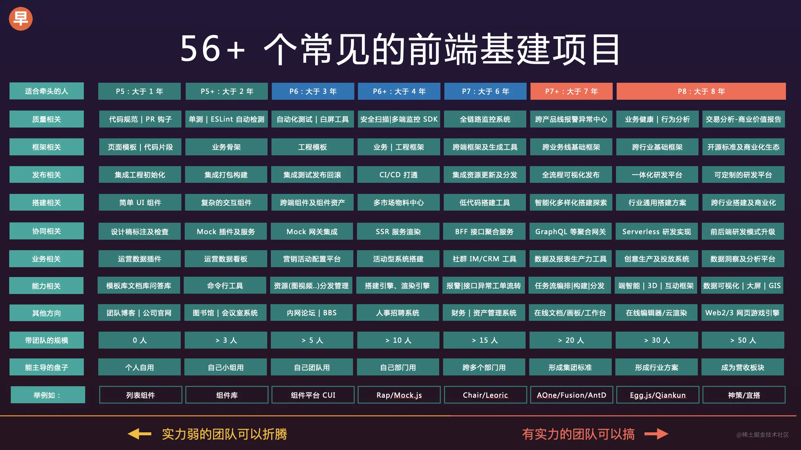

# 计划

- [] 浏览器打印
- [] 直播流
- [] 网络协议
- [] webpack 流程
- [] vue 源码 v-on v-bind 等 自定义指令的实现
- [] http 协议
- [] vuex 持久化
- [] eslint 原理
- [] prettier
- [] async 被调用的函数标记了 async， 这个函数的返回值就是 promise， 调用的时候不用 await，就会得到一个 promise，你喜欢 await 或者.then 获取 promise 的结果都行
- [] 小程序组件、支付
- [] 前端埋点
- [] pinia, vuex 使用
- [] scoped 原理
- [] vue3
- [] vue3 和 vue2区别
- [] react hooks原理
- 
- [] 表单打印 @media print 按照1英寸=25.41mm换算，A4纸张可实际显示的像素宽度为794px×1123px，即打印网页的宽度为794px。
  
