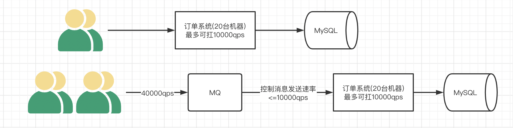
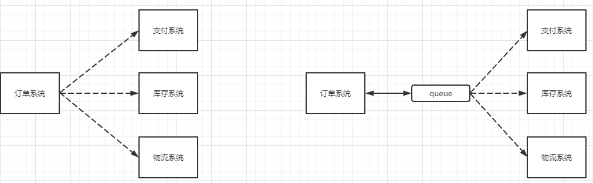
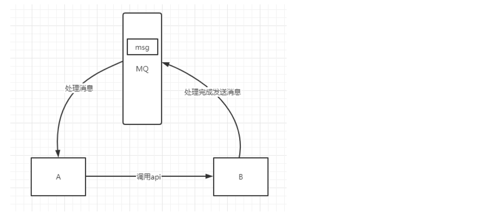
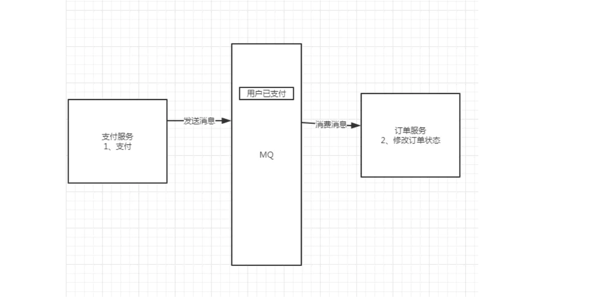
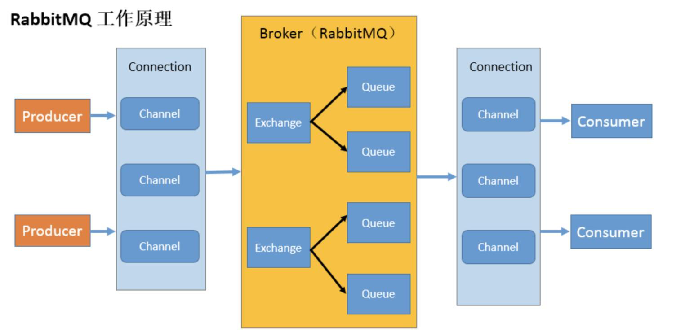
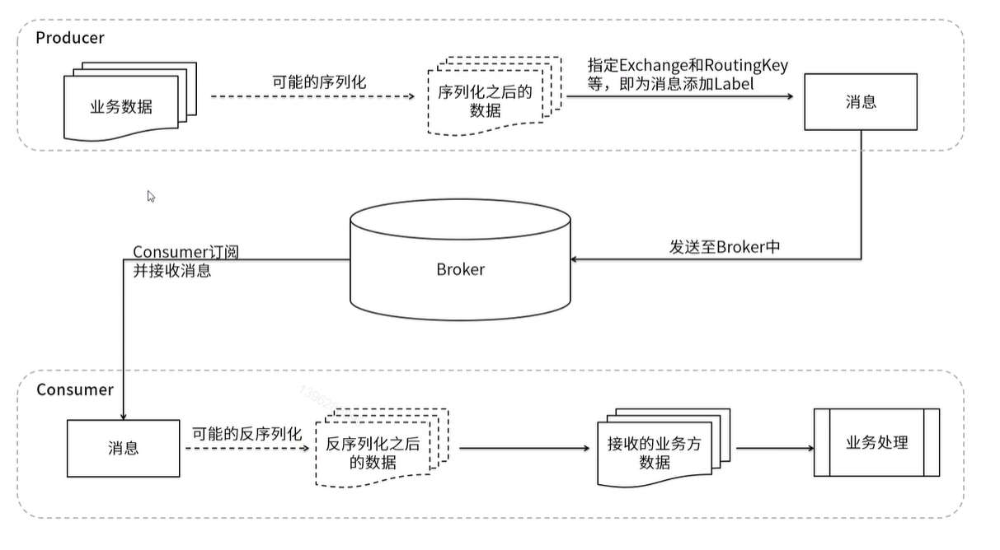

RabbitMQ 是一个实现了 AMQP 协议的消息队列，AMQP 被定义为作为消息传递中间件的开放标准的应用层协议。它代表高级消息队列协议，具有消息定位、路由、队列、安全性和可靠性等特点。

RabbitMQ 的优点、用途等，大概是可靠性高、灵活的路由规则配置、支持分布式部署、遵守 AMQP 协议等。可以用于异步通讯、日志收集(日志收集还是 Kafka 比较好)、事件驱动架构系统、应用通讯解耦等

特点

- 持多种消息传递协议、消息队列、传递确认、灵活的队列路由、多种交换类型(交换器)。

- 支持 Kubernetes 等分布式部署，提供多种语言的 SDK，如 Java、Go、C#。

- 可插入的身份验证、授权，支持 TLS 和 LDAP。

- 支持持续集成、操作度量和与其他企业系统集成的各种工具和插件。

- 提供一套用于管理和监视 RabbitMQ 的 HTTP-API、命令行工具和 UI。

## 为什么要用MQ

- 高并发的流量削峰
举个例子，假设某订单系统每秒最多能处理一万次订单，也就是最多承受的10000qps，这个处理能力应付正常时段的下单时绰绰有余，正常时段我们下单一秒后就能返回结果。但是在高峰期，如果有两万次下单操作系统是处理不了的，只能限制订单超过一万后不允许用户下单。使用消息队列做缓冲，我们可以取消这个限制，把一秒内下的订单分散成一段时间来处理，这时有些用户可能在下单十几秒后才能收到下单成功的操作，但是比不能下单的体验要好。



- 应用解耦

以电商应用为例，应用中有订单系统、库存系统、物流系统、支付系统。用户创建订单后，如果耦合调用库存系统、物流系统、支付系统，任何一个子系统出了故障，都会造成下单操作异常。当转变成基于消息队列的方式后，系统间调用的问题会减少很多，比如物流系统因为发生故障，需要几分钟来修复。在这几分钟的时间里，物流系统要处理的内存被缓存在消息队列中，用户的下单操作可以正常完成。当物流系统恢复后，继续处理订单信息即可，中单用户感受不到物流系统的故障，提升系统的可用性。



- 异步处理

例如 A 调用 B，B 需要花费很长时间执行，但是 A 需要知道 B 什么时候可以执行完，以前一般有两种方式，A 过一段时间去调用 B 的查询 api 查询。或者 A 提供一个 callback api， B 执行完之后调用 api 通知 A 服务。这两种方式都不是很优雅，使用消息队列，可以很方便解决这个问题，A 调用 B 服务后，只需要监听 B 处理完成的消息，当 B 处理完成后，会发送一条消息给 MQ，MQ 会将此消息转发给 A 服务。



- 分布式事务

传统的方式为单体应用，支付、修改订单状态、创建物流订单三个步骤集成在一个服务中，因此这三个步骤可以放在一个jdbc事务中，要么全成功，要么全失败。而在微服务的环境下，会将三个步骤拆分成三个服务，例如：支付服务，订单服务，物流服务。三者各司其职，相互之间进行服务间调用，但这会带来分布式事务的问题，因为三个步骤操作的不是同一个数据库，导致无法使用jdbc事务管理以达到一致性。而 MQ 能够很好的帮我们解决分布式事务的问题，有一个比较容易理解的方案，就是二次提交。基于MQ的特点，MQ作为二次提交的中间节点，负责存储请求数据，在失败的情况可以进行多次尝试，或者基于MQ中的队列数据进行回滚操作，是一个既能保证性能，又能保证业务一致性的方案



- 数据分发

MQ 具有发布订阅机制，不仅仅是简单的上游和下游一对一的关系，还有支持一对多或者广播的模式，并且都可以根据规则选择分发的对象。


## RabbitMQ的架构

### 工作原理



生产者（Producer）
生产者是发送消息的客户端应用。在图中，有两个生产者，它们通过各自的连接（Connection）和通道（Channel）与 RabbitMQ 服务器进行通信。

连接（Connection）
连接是生产者和消费者与 RabbitMQ 服务器之间的 TCP 连接。一个客户端可以建立多个连接，每个连接可以包含多个通道。

通道（Channel）
通道是连接中的一个虚拟通道，用于在客户端和服务器之间发送和接收消息。一个连接可以包含多个通道，每个通道可以独立发送和接收消息。通道是线程安全的，可以提高通信效率。

交换器（Exchange）
交换器是 RabbitMQ 中的一个核心组件，它接收生产者发送的消息，并根据一定的规则将消息路由到一个或多个队列中。图中有两个交换器，每个交换器可以连接到多个队列。

队列（Queue）
队列是存储消息的容器，消息在队列中等待被消费者消费。图中有多个队列，每个队列可以接收来自一个或多个交换器的消息。

绑定（Binding）
绑定是交换器和队列之间的连接关系，它定义了消息如何从交换器路由到队列。绑定时，可以指定路由键（Routing Key）或主题模式（Binding Key），具体取决于交换器的类型。

消费者（Consumer）
消费者是接收消息的客户端应用。消费者通过各自的连接和通道从队列中获取消息并处理。图中有两个消费者，它们通过各自的连接和通道与 RabbitMQ 服务器进行通信。

工作流程

1. 生产者通过通道将消息发送到交换器。
2. 交换器根据绑定关系将消息路由到一个或多个队列。
3. 消费者通过通道从队列中获取消息并处理。

### 核心概念



- 生产者：产生数据发送消息的程序是生产者。
- 交换机：交换机是 RabbitMQ 非常重要的一个部件，一方面它接收来自生产者的消息，另一方面它将消息推送到队列中。交换机必须确切知道如何处理它接收到的消息，是将这些消息推送到特定队列还是推送到多个队列，亦或者是把消息丢弃，这个是由交换机类型决定的。- 队列：队列是 RabbitMQ 内部使用的一种数据结构，尽管消息流经 RabbitMQ 和应用程序，但它们只能存储在队列中。队列仅受主机的内存和磁盘限制的约束，本质上是一个大的消息缓冲区。许多生产者可以将消息发送到一个队列，许多消费者可以尝试从一个队列接收数据。
- 消费者：消费与接收具有相似的含义。消费者大多时候是一个等待接收消息的程序。请注意生产者，消费者和消息中间件很多时候并不在同一机器上。同一个应用程序既可以是生产者又是可以是消费者。

## 常用API

|用法 | 方法 | 说明|
|---|---|---|
|创建连接 | ConnectionFactory.CreateConnection() | 建立 TCP 连接|
|创建通道 | IConnection.CreateModel() | 建立操作通道|
|声明队列 | IModel.QueueDeclare() | 确保队列存在|
|发送消息 | IModel.BasicPublish() | 发布消息到队列或交换机|
|消费消息 | IModel.BasicConsume() | 注册消费者|
|确认消息 | IModel.BasicAck() | 手动确认（可选）|

```csharp
public class RabbitMqOptions
{
    public string HostName { get; set; } = "localhost";
    public string UserName { get; set; } = "guest";
    public string Password { get; set; } = "guest";
    public string QueueName { get; set; } = "order_created";
}

public interface IRabbitMqHelper
{
    void Publish<T>(T message);
    void Consume<T>(Action<T> onMessageReceived);
}

public class RabbitMqHelper : IRabbitMqHelper, IDisposable
{
    private readonly IConnection _connection;
    private readonly IModel _channel;
    private readonly RabbitMqOptions _options;

    public RabbitMqHelper(IConfiguration config)
    {
        _options = config.GetSection("RabbitMQ").Get<RabbitMqOptions>() ?? new();

        var factory = new ConnectionFactory
        {
            HostName = _options.HostName,
            UserName = _options.UserName,
            Password = _options.Password
        };

        _connection = factory.CreateConnection();
        _channel = _connection.CreateModel();

        _channel.QueueDeclare(
            queue: _options.QueueName,
            durable: true,
            exclusive: false,
            autoDelete: false,
            arguments: null
        );
    }

    public void Publish<T>(T message)
    {
        var body = Encoding.UTF8.GetBytes(JsonSerializer.Serialize(message));
        _channel.BasicPublish(
            exchange: "",
            routingKey: _options.QueueName,
            basicProperties: null,
            body: body
        );
    }

    public void Consume<T>(Action<T> onMessageReceived)
    {
        var consumer = new EventingBasicConsumer(_channel);

        consumer.Received += (model, ea) =>
        {
            var json = Encoding.UTF8.GetString(ea.Body.ToArray());
            var obj = JsonSerializer.Deserialize<T>(json);
            if (obj != null)
                onMessageReceived(obj);
        };

        _channel.BasicConsume(
            queue: _options.QueueName,
            autoAck: true,
            consumer: consumer
        );
    }

    public void Dispose()
    {
        _channel?.Close();
        _connection?.Close();
    }
}
```

## 示例场景：订单系统 → 支付系统

- Order.API：用户创建订单，发送消息到 order_created 队列。

- Payment.API：监听 order_created 队列，当检测到有新订单创建时，模拟自动发起支付。

```bash
RabbitMqDemo/
├── Order.API/        # 订单服务：Controller 中发送消息
├── Payment.API/      # 支付服务：Controller 启动监听或调用消费者
├── Shared/           # 共享模型：OrderMessage
```

### Order.API

`Shared/Models/OrderMessage.cs`

```csharp
namespace Shared.Models;

public class OrderMessage
{
    public string OrderId { get; set; } = string.Empty;
    public decimal Amount { get; set; }
    public DateTime CreatedTime { get; set; }
}

```

`Order.API/Services/RabbitMqService.cs`

```csharp

using RabbitMQ.Client;
using Shared.Models;
using System.Text;
using System.Text.Json;

namespace Order.API.Services;

public interface IRabbitMqService
{
    void PublishOrder(OrderMessage message);
}

public class RabbitMqService : IRabbitMqService
{
    private readonly IConfiguration _config;

    public RabbitMqService(IConfiguration config)
    {
        _config = config;
    }

    public void PublishOrder(OrderMessage message)
    {
        var factory = new ConnectionFactory
        {
            HostName = _config["RabbitMQ:HostName"] ?? "localhost"
        };

        using var connection = factory.CreateConnection();
        using var channel = connection.CreateModel();

        channel.QueueDeclare(queue: "order_created",
                             durable: true,
                             exclusive: false,
                             autoDelete: false,
                             arguments: null);

        var body = Encoding.UTF8.GetBytes(JsonSerializer.Serialize(message));

        channel.BasicPublish(exchange: "",
                             routingKey: "order_created",
                             basicProperties: null,
                             body: body);
    }
}
```

`Order.API/Program.cs`

```csharp
var app = builder.Build();
builder.Services.AddScoped<IRabbitMqService, RabbitMqService>();
```

`Order.API/Controllers/OrderController.cs`

```csharp

using Microsoft.AspNetCore.Mvc;
using Order.API.Services;
using Shared.Models;

namespace Order.API.Controllers;

[ApiController]
[Route("api/[controller]")]
public class OrderController : ControllerBase
{
    private readonly IRabbitMqService _rabbitMqService;

    public OrderController(IRabbitMqService rabbitMqService)
    {
        _rabbitMqService = rabbitMqService;
    }

    [HttpPost]
    public IActionResult CreateOrder([FromBody] OrderMessage order)

    {
        order.CreatedTime = DateTime.UtcNow;
        _rabbitMqService.PublishOrder(order);
        return Ok(new { Message = "订单已创建并发送到消息队列", Order = order });
    }
}
```

### Payment.API

**Controller监听**
`Payment.API/Controllers/PaymentController.cs`

```csharp
using Microsoft.AspNetCore.Mvc;
using Payment.API.Services;

namespace Payment.API.Controllers;

[ApiController]
[Route("api/[controller]")]
public class PaymentController : ControllerBase
{
    private readonly OrderConsumerService _consumer;

    public PaymentController(OrderConsumerService consumer)
    {
        _consumer = consumer;
    }

    [HttpGet("listen")]
    public IActionResult Listen()
    {
        _consumer.Start(); // 启动 RabbitMQ 消息监听
        return Ok("支付服务已开始监听订单队列...");
    }
}
```

**BackgroundService 实现后台监听**
`Payment.API/Services/OrderConsumerService.cs`

```csharp
using RabbitMQ.Client;
using RabbitMQ.Client.Events;
using Shared.Models;
using System.Text;
using System.Text.Json;

namespace Payment.API.Services;

public class OrderConsumerBackgroundService : BackgroundService
{
    private readonly IConfiguration _config;
    private readonly ILogger<OrderConsumerBackgroundService> _logger;

    public OrderConsumerBackgroundService(IConfiguration config, ILogger<OrderConsumerBackgroundService> logger)
    {
        _config = config;
        _logger = logger;
    }

    protected override Task ExecuteAsync(CancellationToken stoppingToken)
    {
        var factory = new ConnectionFactory
        {
            HostName = _config["RabbitMQ:HostName"] ?? "localhost"
        };

        var connection = factory.CreateConnection();
        var channel = connection.CreateModel();

        channel.QueueDeclare(queue: "order_created",
                             durable: true,
                             exclusive: false,
                             autoDelete: false,
                             arguments: null);

        _logger.LogInformation("📦 BackgroundService 启动中，监听订单队列...");

        var consumer = new EventingBasicConsumer(channel);

        consumer.Received += (model, ea) =>
        {
            var body = ea.Body.ToArray();
            var json = Encoding.UTF8.GetString(body);
            var order = JsonSerializer.Deserialize<OrderMessage>(json);

            _logger.LogInformation($"💰 后台服务收到订单：{order?.OrderId} 金额：{order?.Amount} 创建时间：{order?.CreatedTime}");
        };

        channel.BasicConsume(queue: "order_created",
                             autoAck: true,
                             consumer: consumer);

        return Task.CompletedTask;
    }
}
```

`Payment.API`

```csharp
var app = builder.Build();
 builder.Services.AddHostedService<OrderConsumerBackgroundService>();
```

## 参考

- [RabbitMQ超详细学习笔记（章节清晰+通俗易懂）](https://blog.csdn.net/qq_45173404/article/details/121687489)
- [万字长文：从 C# 入门学会 RabbitMQ 消息队列编程](https://www.cnblogs.com/whuanle/p/17837034.html)

# 消息丢失

# 重复消费
