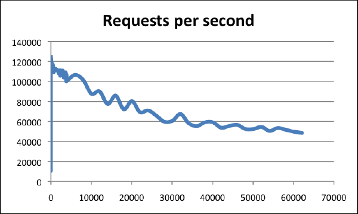
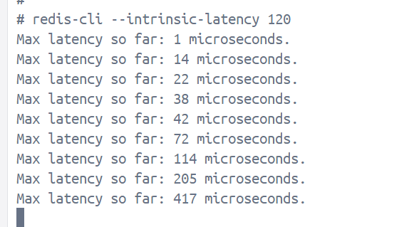

## 判断是否变慢

在较高的配置基准下（比如 8C 16G +），在连接数为0~10000的时候，最高QPS可达到120000。Redis以超过60000个连接为基准，仍然能够在这些条件下维持50000个q/s，体现了超高的性能。下图中横轴是连接数，纵轴是QPS。



### 基线延迟测试

redis-cli 提供了一个指令选项 --intrinsic-latency，用于监测和统计某个时间段内Redis的最大延迟。

可以在终端上连接Redis的服务端进行测试，避免客户端测试因为网络的影响导致差异较大。
可以通过-h host -p port 来连接到服务端。

```bash
redis-cli --latency -h `host` -p `port`
```

## 复杂度过高

查看Redis慢日志

```bash
# 命令执行耗时超过 5 毫秒，记录慢日志
CONFIG SET slowlog-log-slower-than 5000
# 只保留最近 500 条慢日志
CONFIG SET slowlog-max-len 500
```

查询到最近记录的慢日志

```bash
127.0.0.1:6379> SLOWLOG get 5
1) 1) (integer) 32693       # 慢日志ID
   2) (integer) 1593763337  # 执行时间戳
   3) (integer) 5299        # 执行耗时(微秒)
   4) 1) "LRANGE"           # 具体执行的命令和参数
      2) "user_list:2000"
      3) "0"
      4) "-1"
2) 1) (integer) 32692
   2) (integer) 1593763337
   3) (integer) 5044
   4) 1) "GET"
      2) "user_info:1000"
```

### bigKey

**如果一个 key 写入的 value 非常大，那么 Redis 在分配内存时就会比较耗时。**

在 Redis 中，**Big Key（大键）** 指的是占用内存较大或元素数量非常多的键。定位这些键对于优化性能、避免阻塞是非常重要的。

---

### 🎯 为什么要扫描 BigKey？

- 某个 key 占了过多内存，可能导致 Redis 内存不够或性能变差  
- 删除或访问某些大 key 会造成阻塞，影响整个实例  
- 定位数据倾斜问题

---

### 🧰 一些常用的方法（重点推荐前两种）

| 方法 | 说明 |
|------|------|
| 1️⃣ `redis-cli --bigkeys` | 官方工具，快速扫描整个数据库的大 key（推荐） |
| 2️⃣ 使用 SCAN + TYPE + DEBUG OBJECT | 手动逐个扫描 key 判断大小 |
| 3️⃣ 使用 `MEMORY USAGE key` 命令 | 精确查看某个 key 占用的字节数 |
| 4️⃣ 使用 AOF/RDB 分析工具 | 离线分析数据文件，查看大 key 分布 |

---

### ✅ 方法一：使用 `redis-cli --bigkeys`（强烈推荐）

```bash
redis-cli --bigkeys
```

📌 输出示例：

```
# Scanning the entire keyspace to find biggest keys as well as average sizes per key type.
# Press ctrl-c to stop at any time.

[00.00%] Biggest string found so far 'log:debug' with 834245 bytes
[10.00%] Biggest list found so far 'queue:pending' with 12500 items

------ summary ------
Sampled 10000 keys
Total key length in bytes is 123456 (avg len 12.35)

Biggest string: log:debug (834245 bytes)
Biggest list: queue:pending (12500 items)
```

---

### ✅ 方法二：SCAN + 手动分析 key（用于自动化脚本）

```bash
SCAN 0 COUNT 1000
TYPE yourkey
MEMORY USAGE yourkey
```

示例脚本（伪代码逻辑）：

```bash
SCAN cursor
→ 对每个 key 调用 TYPE key
→ 如果是 list/set/zset/hash：
   → 用 LLEN / SCARD / ZCARD / HLEN 查看大小
→ 用 MEMORY USAGE key 查看内存占用
→ 如果超过阈值就报警
```

你也可以用 C# 自动化调用这个流程，写个 `RedisBigKeyScanner` 小工具类。

---

### 🔬 方法三：查看单个 key 占用内存

```bash
MEMORY USAGE mykey
```

返回值为 **字节数（bytes）**。

---

### 🔎 方法四：分析 RDB/AOF 文件（适合大规模排查）

工具包括：

- [`redis-rdb-tools`](https://github.com/sripathikrishnan/redis-rdb-tools)
- [`rdr`](https://github.com/hit9/rdr)
- [`aof-tools`](https://github.com/RedisLabs/aof-tools)

---

### ⚠️ Redis 中常见的大 key 类型（要重点关注）

| 类型 | 命令 | 说明 |
|------|------|------|
| List | LLEN key | 太长可能会阻塞 |
| Hash | HLEN key | 太大不适合用作对象存储 |
| Set  | SCARD key | 元素过多迭代会卡顿 |
| ZSet | ZCARD key | 排行榜、打分场景中易成为大 key |
| String | MEMORY USAGE key | 图片、日志、大 JSON 字符串可能很大 |

---

## 集中过期

## 参考

- [Redis进阶 - 性能调优：Redis性能调优详解](https://pdai.tech/md/db/nosql-redis/db-redis-x-performance.html)
- [Redis系列23： 性能优化指南](https://www.cnblogs.com/wzh2010/p/17205492.html)
