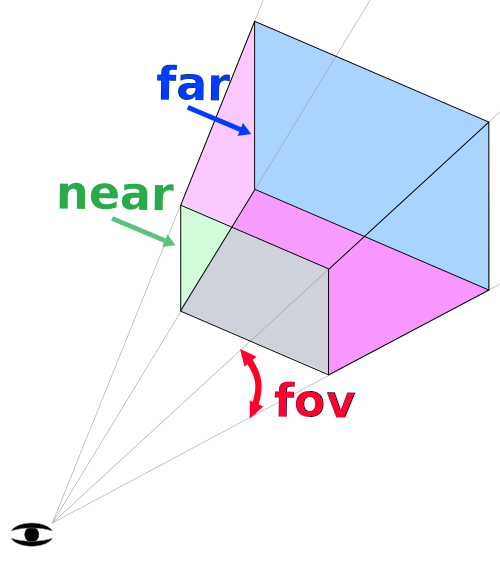

**参考：https://threejs.org/**

## Three.js 和 WebGL

Three.js 经常会和 WebGL 混淆， 但也并不总是，three.js 其实是使用 WebGL 来绘制三维效果的。 WebGL 是一个只能画点、线和三角形的非常底层的系统. <br />
想要用 WebGL 来做一些实用的东西通常需要大量的代码， 这就是 Three.js 的用武之地。它封装了诸如场景、灯光、阴影、材质、贴图、空间运算等一系列功能，让你不必要再从底层 WebGL 开始写起。

## 基础的 three.js 应用结构


- 首先有一个渲染器(Renderer)。这可以说是 three.js 的主要对象。你传入一个场景(Scene)和一个摄像机(Camera)到渲染器(Renderer)中，然后它会将摄像机视椎体中的三维场景渲染成一个二维图片显示在画布上。

- 其次有一个场景图 它是一个树状结构，由很多对象组成，比如图中包含了一个场景(Scene)对象 ，多个网格(Mesh)对象，光源(Light)对象，群组(Group)，三维物体(Object3D)，和摄像机(Camera)对象。一个场景(Scene)对象定义了场景图最基本的要素，并包了含背景色和雾等属性。这些对象通过一个层级关系明确的树状结构来展示出各自的位置和方向。子对象的位置和方向总是相对于父对象而言的。比如说汽车的轮子是汽车的子对象，这样移动和定位汽车时就会自动移动轮子。你可以在场景图的这篇文章中了解更多内容。

- 注意图中摄像机(Camera)是一半在场景图中，一半在场景图外的。这表示在 three.js 中，摄像机(Camera)和其他对象不同的是，它不一定要在场景图中才能起作用。相同的是，摄像机(Camera)作为其他对象的子对象，同样会继承它父对象的位置和朝向。在场景图这篇文章的结尾部分有放置多个摄像机(Camera)在一个场景中的例子。

- 网格(Mesh)对象可以理解为用一种特定的材质(Material)来绘制的一个特定的几何体(Geometry)。材质(Material)和几何体(Geometry)可以被多个网格(Mesh)对象使用。比如在不同的位置画两个蓝色立方体，我们会需要两个网格(Mesh)对象来代表每一个立方体的位置和方向。但只需一个几何体(Geometry)来存放立方体的顶点数据，和一种材质(Material)来定义立方体的颜色为蓝色就可以了。两个网格(Mesh)对象都引用了相同的几何体(Geometry)和材质(Material)。

- 几何体(Geometry)对象顾名思义代表一些几何体，如球体、立方体、平面、狗、猫、人、树、建筑等物体的顶点信息。Three.js 内置了许多基本几何体 。你也可以创建自定义几何体或从文件中加载几何体。

- 材质(Material)对象代表绘制几何体的表面属性，包括使用的颜色，和光亮程度。一个材质(Material)可以引用一个或多个纹理(Texture)，这些纹理可以用来，打个比方，将图像包裹到几何体的表面。

- 纹理(Texture)对象通常表示一幅要么从文件中加载，要么在画布上生成，要么由另一个场景渲染出的图像。

- 光源(Light)对象代表不同种类的光。

## 使用 three.js


1.首先是加载 three.js

```js
import * as THREE from "three";
```

2.创建一个 WebGL 渲染器(WebGLRenderer)。

渲染器负责将你提供的所有数据渲染绘制到 canvas 上。之前还有其他渲染器，比如 CSS 渲染器(CSSRenderer)、Canvas 渲染器(CanvasRenderer)。将来也可能会有 WebGL2 渲染器(WebGL2Renderer)或 WebGPU 渲染器(WebGPURenderer)。目前的话是 WebGL 渲染器(WebGLRenderer)，它通过 WebGL 将三维空间渲染到 canvas 上。

**注意这里有一些细节。如果你没有给 three.js 传 canvas，three.js 会自己创建一个 ，但是你必须手动把它添加到文档中。**

```js
import * as THREE from "three";
const renderer = new THREE.WebGLRenderer();
```

3.需要一个透视摄像机(PerspectiveCamera)。

```js
const fov = 75;
const aspect = 2; // 相机默认值
const near = 0.1;
const far = 5;
const camera = new THREE.PerspectiveCamera(fov, aspect, near, far);
```

- fov 是视野范围(field of view)的缩写。上述代码中是指垂直方向为 75 度。 注意 three.js 中大多数的角用弧度表示，但是因为某些原因透视摄像机使用角度表示。

- aspect 指画布的宽高比。我们将在别的文章详细讨论，在默认情况下 画布是 300x150 像素，所以宽高比为 300/150 或者说 2。

- near 和 far 代表近平面和远平面，它们限制了摄像机面朝方向的可绘区域。 任何距离小于或超过这个范围的物体都将被裁剪掉(不绘制)。

这四个参数定义了一个 "视椎(frustum)"。 视椎(frustum)是指一个像被削去顶部的金字塔形状。换句话说，可以把"视椎(frustum)"想象成其他三维形状如球体、立方体、棱柱体、截椎体。



4.一个场景(Scene)。场景(Scene)是 three.js 的基本的组成部分。需要 three.js 绘制的东西都需要加入到 scene 中。

```js
const scene = new THREE.Scene();
```

5.一个包含盒子信息的立方几何体(BoxGeometry)。几乎所有希望在 three.js 中显示的物体都需要一个包含了组成三维物体的顶点信息的几何体。

```js
const boxWidth = 1;
const boxHeight = 1;
const boxDepth = 1;
const geometry = new THREE.BoxGeometry(boxWidth, boxHeight, boxDepth);
```

6.一个基本的材质并设置它的颜色. 颜色的值可以用 css 方式和十六进制来表示。

```js
const material = new THREE.MeshBasicMaterial({ color: 0x44aa88 });
```

7.一个网格(Mesh)对象

- 几何体(Geometry)(物体的形状)
- 材质(Material)(如何绘制物体，光滑还是平整，什么颜色，什么贴图等等)
- 对象在场景中相对于他父对象的位置、朝向、和缩放。下面的代码中父对象即为场景对象。

```js
const cube = new THREE.Mesh(geometry, material);
// 将网格添加到场景中。
scene.add(cube);
// 之后将场景和摄像机传递给渲染器来渲染出整个场景。
renderer.render(scene, camera);
```

8.添加些光照效果

```js
const color = 0xffffff;
const intensity = 1;
const light = new THREE.DirectionalLight(color, intensity);
light.position.set(-1, 2, 4);
scene.add(light);
```


9.让立方体旋转起来

```js
function render(time) {
  time *= 0.001; // 将时间单位变为秒
  cube.rotation.x = time;
  cube.rotation.y = time;
  renderer.render(scene, camera);

  requestAnimationFrame(render);
}
requestAnimationFrame(render);
```

<div ref="helloCube"></div>

<script setup>
import * as THREE from 'three'
import {ref,onMounted} from 'vue'

const helloCube = ref()

const initScene = () => {
 
  const scene = new THREE.Scene()
  const geometry = new THREE.BoxGeometry(1,1,1);
  const material = new THREE.MeshBasicMaterial({ color: 0x44aa88 });
  const cube = new THREE.Mesh(geometry, material);

  // 将网格添加到场景中。
  scene.add(cube);
  // 摄相机
  const camera = new THREE.PerspectiveCamera(75, 2, 0.1, 10);
  camera.position.set(0, 0, 2) 
  scene.add(camera)

 const renderer = new THREE.WebGLRenderer();
  if(!__VUEPRESS_SSR__) {
      renderer.setPixelRatio( window.devicePixelRatio );
      window.addEventListener("resize",onWindowResize)
  }

  renderer.setSize(helloCube.value.offsetWidth, helloCube.value.offsetWidth/2)
  helloCube.value.appendChild(renderer.domElement)

  // 之后将场景和摄像机传递给渲染器来渲染出整个场景。
  renderer.render(scene, camera);

  const light = new THREE.DirectionalLight(0xffffff, 1);
  light.position.set(-1, 2, 4);
  scene.add(light);

  function render(time) {
      // console.log(time,'time')
      time*=0.001
      cube.rotation.x = time;
      cube.rotation.y = time;
      renderer.render(scene, camera)
      requestAnimationFrame(render)
  }
  function onWindowResize(){
    if(!__VUEPRESS_SSR__) {
      renderer.setPixelRatio(window.devicePixelRatio)
      renderer.setSize(helloCube.value.offsetWidth, helloCube.value.offsetWidth/2)

    }
  }
  render()
}
onMounted(()=>{
  initScene()
})
</script>
