| 转载 | http://www.cnblogs.com/wanbo/ |
| ---- | ----------------------------- |

## WebGL 的工作原理

### WebGL API

在了解一门新技术前，我们都会先看看它的开发文档或者 API。
查看 Canvas 的绘图 API，我们会发现它能画直线、矩形、圆、弧线、贝塞尔曲线。
于是，我们看了看 WebGL 绘图 API，发现：

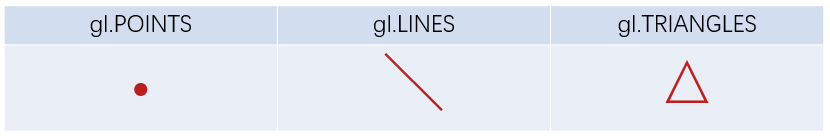

它只能会点、线、三角形？一定是我看错了。
没有，你没看错。

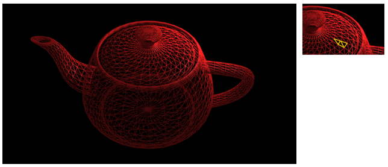

就算是这样一个复杂的模型，也是一个个三角形画出来的。

### WebGL 绘制流程

简单说来，WebGL 绘制过程包括以下三步：<br/>
1、获取顶点坐标<br/>
2、图元装配（即画出一个个三角形）<br/>
3、光栅化（生成片元，即一个个像素点）

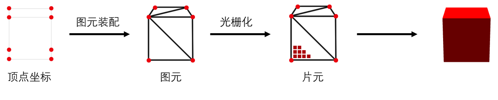

#### 获取顶点坐标

顶点坐标从何而来呢？一个立方体还好说，如果是一个机器人呢？
没错，我们不会一个一个写这些坐标。
往往它来自三维软件导出，或者是框架生成，如下图：

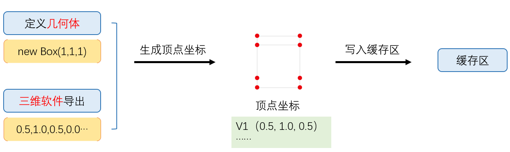

写入缓存区是啥？
没错，为了简化流程，之前我没有介绍。
由于顶点数据往往成千上万，在获取到顶点坐标后，我们通常会将它存储在显存，即缓存区内，方便 GPU 更快读取。

#### 图元装配

我们已经知道，图元装配就是由顶点生成一个个图元（即三角形）。那这个过程是自动完成的吗？答案是并非完全如此。
为了使我们有更高的可控性，即自由控制顶点位置，WebGL 把这个权力交给了我们，这就是可编程渲染管线（不用理解）。<br/>
WebGL 需要我们先处理顶点，那怎么处理呢？我们先看下图：

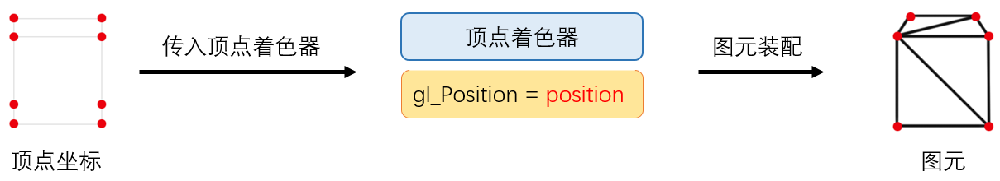

我们引入了一个新的名词，叫“顶点着色器”，它由 opengl es 编写，由 javascript 以字符串的形式定义并传递给 GPU 生成。
比如如下就是一段顶点着色器代码：

```glsl
attribute vec4 position;
void main() {
  gl_Position = position;
}
```

attribute 修饰符用于声明由浏览器（javascript）传输给顶点着色器的变量值；
position 即我们定义的顶点坐标；
gl_Position 是一个内建的传出变量。
这段代码什么也没做，如果是绘制 2d 图形，没问题，但如果是绘制 3d 图形，即传入的顶点坐标是一个三维坐标，我们则需要转换成屏幕坐标。
比如：v(-0.5, 0.0, 1.0)转换为 p(0.2, -0.4)，这个过程类似我们用相机拍照。

##### 顶点着色器处理流程

回到刚才的话题，顶点着色器是如何处理顶点坐标的呢？

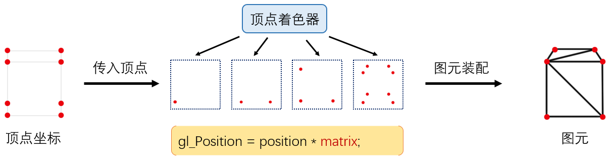

如上图，顶点着色器会先将坐标转换完毕，然后由 GPU 进行图元装配，有多少顶点，这段顶点着色器程序就运行了多少次。
你可能留意到，这时候顶点着色器变为：

```glsl
attribute vec4 position;
uniform mat4 matrix;
void main() {
  gl_Position = position * matrix;
}
```

这就是应用了矩阵 matrix，将三维世界坐标转换成屏幕坐标，这个矩阵叫投影矩阵，由 javascript 传入，至于这个 matrix 怎么生成，我们暂且不讨论。

#### 光栅化

和图元装配类似，光栅化也是可控的。

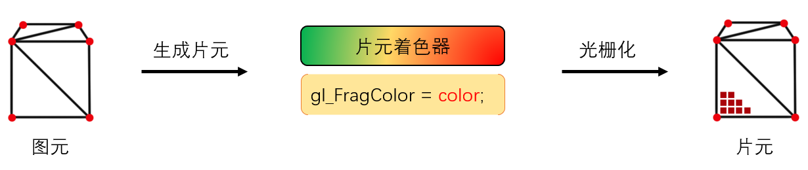

在图元生成完毕之后，我们需要给模型“上色”，而完成这部分工作的，则是运行在 GPU 的“片元着色器”来完成。
它同样是一段 opengl es 程序，模型看起来是什么质地（颜色、漫反射贴图等）、灯光等由片元着色器来计算。
如下是一段简单的片元着色器代码：

```glsl
precision mediump float;
void main(void) {
    gl_FragColor = vec4(1.0, 1.0, 1.0, 1.0);
}
```

gl_FragColor 即输出的颜色值。

##### 片元着色器处理流程

片元着色器具体是如何控制颜色生成的呢？

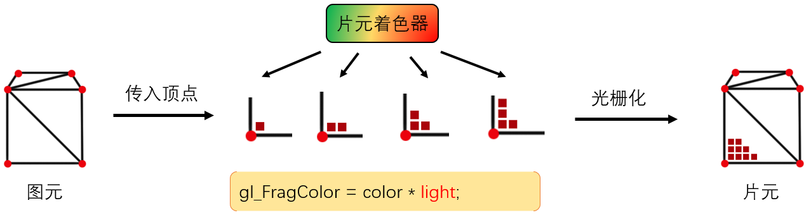

如上图，顶点着色器是有多少顶点，运行了多少次，而片元着色器则是，生成多少片元（像素），运行多少次。

### WebGL 的完整工作流程

至此，实质上，WebGL 经历了如下处理流程：<br/>
1、准备数据阶段<br/>
在这个阶段，我们需要提供顶点坐标、索引（三角形绘制顺序）、uv（决定贴图坐标）、法线（决定光照效果），以及各种矩阵（比如投影矩阵）。
其中顶点数据存储在缓存区（因为数量巨大），以修饰符 attribute 传递给顶点着色器；
矩阵则以修饰符 uniform 传递给顶点着色器。<br/>
2、生成顶点着色器<br/>
根据我们需要，由 Javascript 定义一段顶点着色器（opengl es）程序的字符串，生成并且编译成一段着色器程序传递给 GPU。<br/>
3、图元装配<br/>
GPU 根据顶点数量，挨个执行顶点着色器程序，生成顶点最终的坐标，完成坐标转换。<br/>
4、生成片元着色器<br/>
模型是什么颜色，看起来是什么质地，光照效果，阴影（流程较复杂，需要先渲染到纹理，可以先不关注），都在这个阶段处理。<br/>
5、光栅化<br/>
能过片元着色器，我们确定好了每个片元的颜色，以及根据深度缓存区判断哪些片元被挡住了，不需要渲染，最终将片元信息存储到颜色缓存区，最终完成整个渲染。<br/>

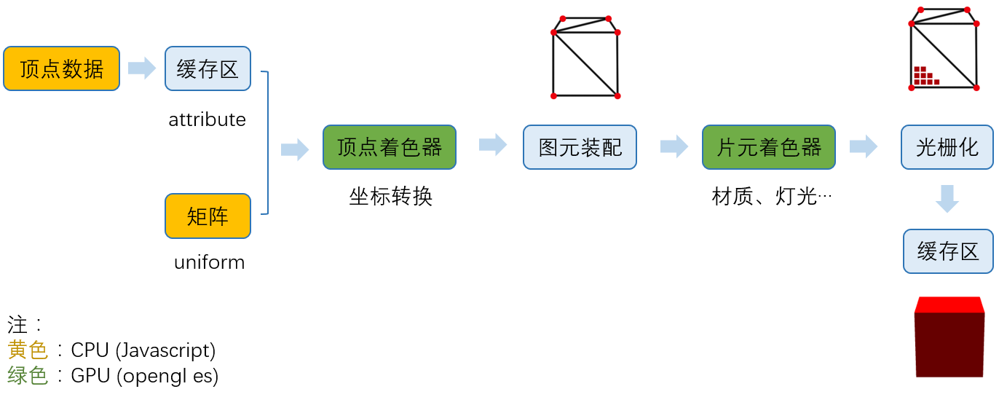

## Three.js 做了什么

我们知道，three.js 帮我们完成了很多事情，但是它具体做了什么呢，他在整个流程中，扮演了什么角色呢？
我们先简单看一下，three.js 参与的流程：

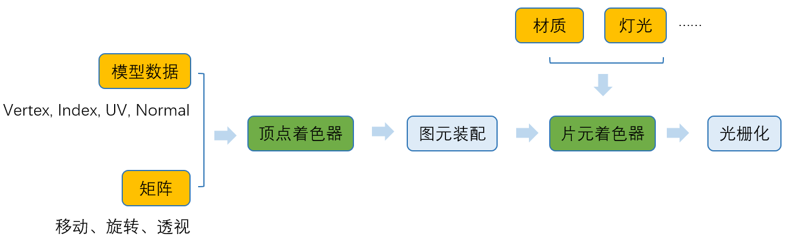

黄色和绿色部分，都是 three.js 参与的部分，其中黄色是 javascript 部分，绿色是 opengl es 部分。
我们发现，能做的，three.js 基本上都帮我们做了。

辅助我们导出了模型数据；
自动生成了各种矩阵；
生成了顶点着色器；
辅助我们生成材质，配置灯光；
根据我们设置的材质生成了片元着色器。
而且将 webGL 基于光栅化的 2D API，封装成了我们人类能看懂的 3D API。

### Three.js 顶点处理流程

从 WebGL 工作原理的章节中，我们已经知道了顶点着色器会将三维世界坐标转换成屏幕坐标，但实际上，坐标转换不限于投影矩阵。
如下图：

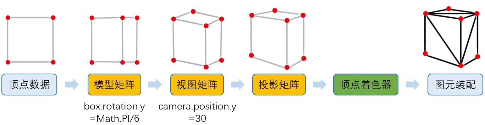

之前 WebGL 在图元装配之后的结果，由于我们认为模型是固定在坐标原点，并且相机在 x 轴和 y 轴坐标都是 0，其实正常的结果是这样的：

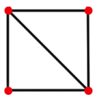

#### 模型矩阵

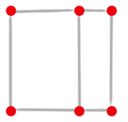

现在，我们将模型顺时针旋转 Math.PI/6，所有顶点位置肯定都变化了。

```glsl
box.rotation.y = Math.PI/6;
```

但是，如果我们直接将顶点位置用 javascript 计算出来，那性能会很低（顶点通常成千上万），而且，这些数据也非常不利于维护。
所以，我们用矩阵 modelMatrix 将这个旋转信息记录下来。

#### 视图矩阵

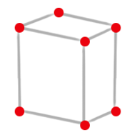

然后，我们将相机往上偏移 30。

```glsl
camera.position.y = 30;
```

同理，我们用矩阵 viewMatrix 将移动信息记录下来。

#### 投影矩阵

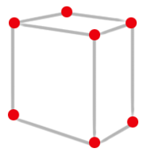

这是我们之前介绍过的了，我们用 projectMatrix 记录。

#### 应用矩阵

然后，我们编写顶点着色器：

```glsl
gl_Position = position * modelMatrix * viewMatrix * projectionMatrix;
```

这样，我们就在 GPU 中，将最终顶点位置计算出来了。
实际上，上面所有步骤，three.js 都帮我们完成了。

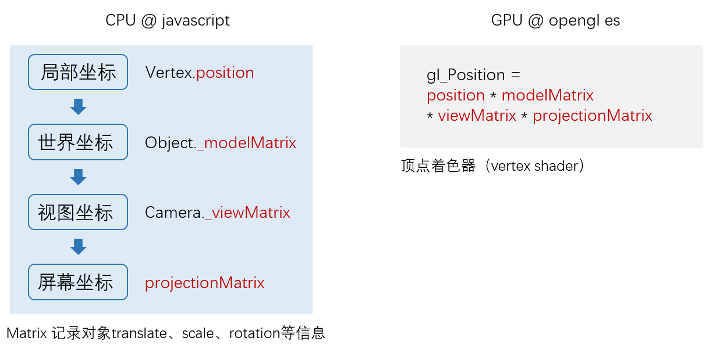

### 片元着色器处理流程

我们已经知道片元着色器负责处理材质、灯光等信息，但具体是怎么处理呢？
如下图：

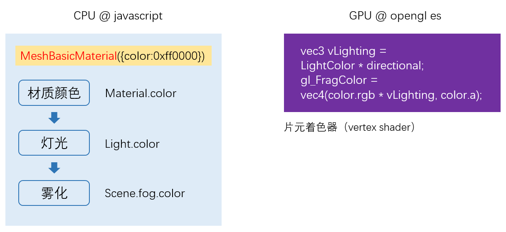

### three.js 完整运行流程

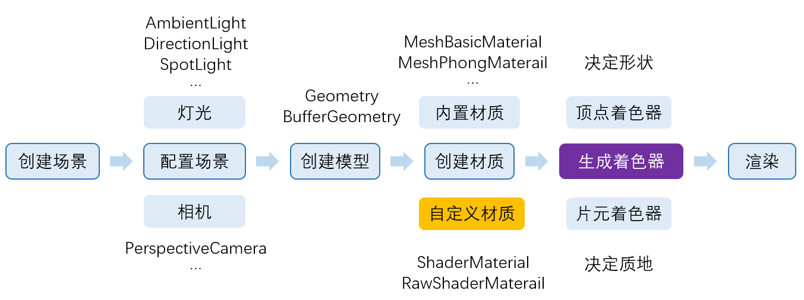

当我们选择材质后，three.js 会根据我们所选的材质，选择对应的顶点着色器和片元着色器。
three.js 中已经内置了我们常用着色器。
