官方文档：https://nativesupport.dcloud.net.cn/AppDocs/#

1.安装 jdk
https://www.oracle.com/java/technologies/downloads/

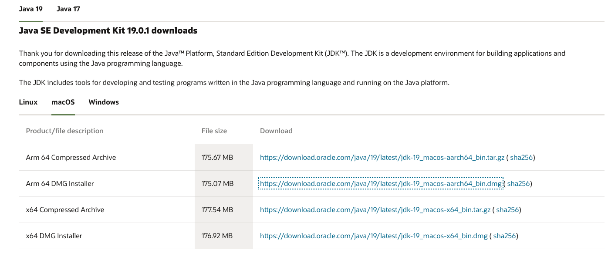

```bash
/usr/libexec/java_home -V
```

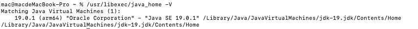

2.生成签名证书

```bash
keytool -genkey -alias testalias -keyalg RSA -keysize 2048 -validity 36500 -keystore test.keystore
```

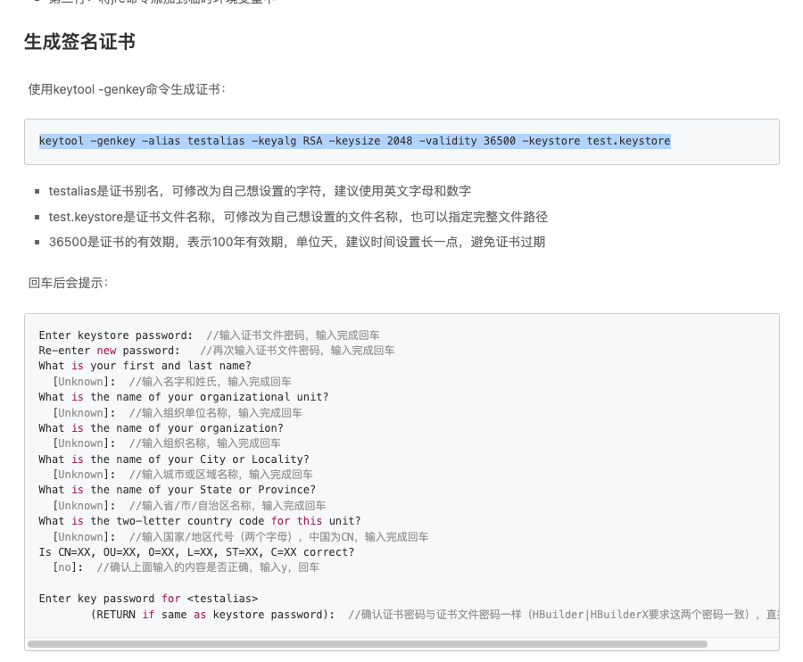

3.查看证书

```bash
keytool -list -v -keystore test.keystore
Enter keystore password: //输入密码，回车
```

4.生成 AppKey

```bash
keytool -list -v -keystore test.keystore
Enter keystore password: //输入密码，回车

# 新版没有md5
keytool -exportcert -keystore xxx.keystore | openssl dgst -md5
# 参考 https://www.jianshu.com/p/3799489898b3
```

**包名必须和 android studio 项目的包名一致**

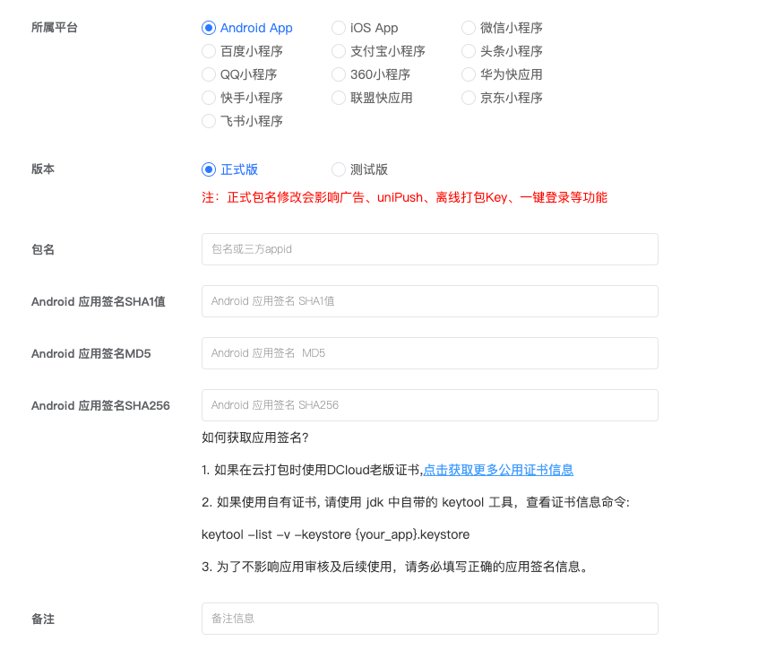

5.下载离线 SDK

hbuilderX 版本要和 SDK 保持一致

https://nativesupport.dcloud.net.cn/AppDocs/download/android.html#

6.android 创建项目

创建项目的包名必须和 Dclound 里的包名一致

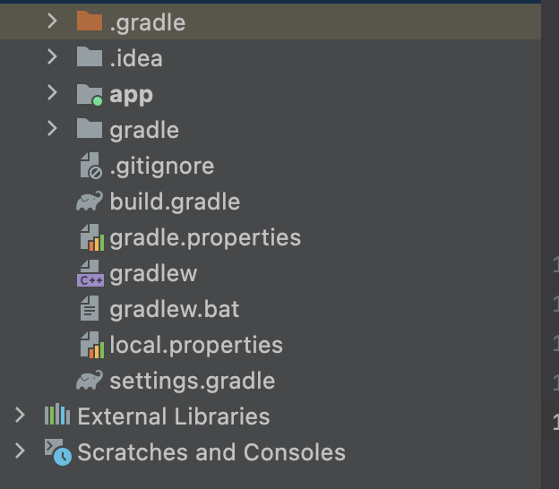

- `.gradle 和.idea`在这两个目录下放置的都是 Android Studio 自动生成的文件，所以无需关心，不用编辑。

- `app`项目中的代码、资源等内容几乎都是放在这个目录之下，后续的开发工作也是在这个目录下进行的。

  - 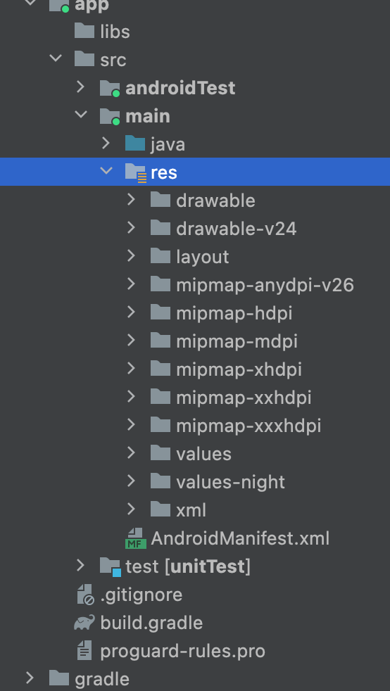
  - `build`和外层的 build 一样，包含了一些编译时自动生成的文件，无需关心。

  - `libs`如果你在项目中使用到了第三方 jar 包，就需要把这些 jar 包放置在 libs 目录之下，放置之后，jar 包会被自动添加到构建路径里面去。

  - `androidTest`用来编写 Android Test 测试用例的，对项目进行一些自动化测试。

  - `java`放置我们所有 java 代码的地方。

  - `res`内容巨多，你在项目中用到的所有图片、布局、字符串等等资源都要存放在这个目录下。

  - `AndroidMainifest.xml`整个 Android 项目的配置文件，你在程序中定义的所有四大组件都需要在这个文件中注册，另外可以在这个文件中给应用程序添加权限声明。

  - `test`用来编写 Unit Test 测试用例的，是对项目自动化测试的另一种方式。

  - `gitignore`和外层的 gitignore 文件类似，也是用来将指定目录或文件排除在版本控制之外的

  - `build.gradle`这是 app 模块中的 gradle 构建脚本，会指定很多项目构建的相关配置。

  - `proguard-rules.pro`用于指定项目代码的混淆规则，当代码开发完打包成安装包之后，如果不希望代码被别人破解，通常会对代码进行混淆，从而让破解者难以阅读。

- `gradle`这个目录之下包含了 gradle wrapper 的配置文件，使用 gradle wrapper 的方式不需要提前将 gradle 下载好，而是会自动根据本地的缓存情况决定是否需要联网下载 gradle。
- `gitignore`这个是用来将指定目录或文件排除在版本控制之外的。（其实看到单词—ignore 就可以知道了）

- `build.gradle`这是项目全局的 gradle 构建脚本，通常其内容是不需要更改的。

- `gradle.properties`这个文件是全局的 gradle 配置文件，在这里配置的属性将会影响到项目所有的 gradle 编译脚本。

- `gradlew 和 gradlew.bat`是用来在命令行界面中执行 gradle 文件的。不同的是：gradlew 适用于 Linux 或 Mac 系统，gradlew.bat 是在 Windows 系统使用。

- `local.properties`用于指定本机中的 Android SDK 路径，通常不需要进行修改，除非你挪动了 Android SDK 路径。

- `settings.gradle`用于指定项目中所有引进的模块。

- `MyDemo.iml`iml 文件是所有 IntelliJ IDEA 项目都会自动生成的一个文件（因为 Android Studio 是基于 IntelliJ IDEA 开发的），用于表示这是一个 IntelliJ IDEA 文件，我们无需修改。

7. 配置工程

将 SDK 实例项目中 `res/values`和`assets/data` 拷贝过来

将 lib.5plus.base-release.aar、android-gif-drawable-release@1.2.23.aar、uniapp-v8-release.aar、oaid_sdk_1.0.25.aar 和 breakpad-build-release.aar 拷贝到 libs 目录下

在 build.gradle 中添加资源引用

```gradle
android{
    aaptOptions{
        additionalParameters '--auto-add-overlay'
        ignoreAssetsPattern "!.svn:!.git:.*:!CVS:!thumbs.db:!picasa.ini:!*.scc:*~"
    }
}

dependencies {
    implementation fileTree(include: ['*.jar'], dir: 'libs')
    implementation fileTree(include: ['*.aar'], dir: 'libs')
    implementation 'androidx.appcompat:appcompat:1.0.0'
    implementation 'androidx.legacy:legacy-support-v4:1.0.0'
    implementation 'androidx.recyclerview:recyclerview:1.0.0'
    implementation 'com.facebook.fresco:fresco:2.5.0'
    implementation "com.facebook.fresco:animated-gif:2.5.0"
    implementation 'com.github.bumptech.glide:glide:4.9.0'
    implementation 'com.alibaba:fastjson:1.1.46.android'
    implementation 'androidx.webkit:webkit:1.3.0'
}
```

在 Androidmanifest.xml 添加

```xml
<application
    ...>
    <meta-data
        android:name="dcloud_appkey"
        android:value="替换为自己申请的Appkey" />
```

删除默认 MainActivity 节点

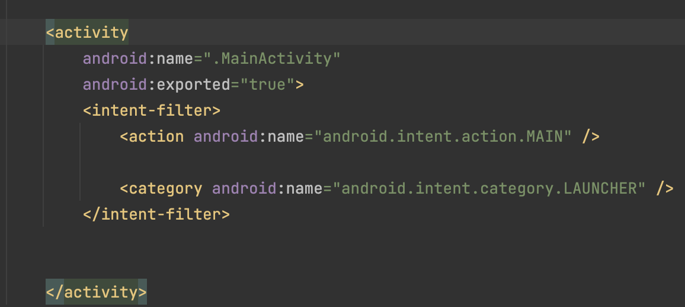

8.gradle 导入证书

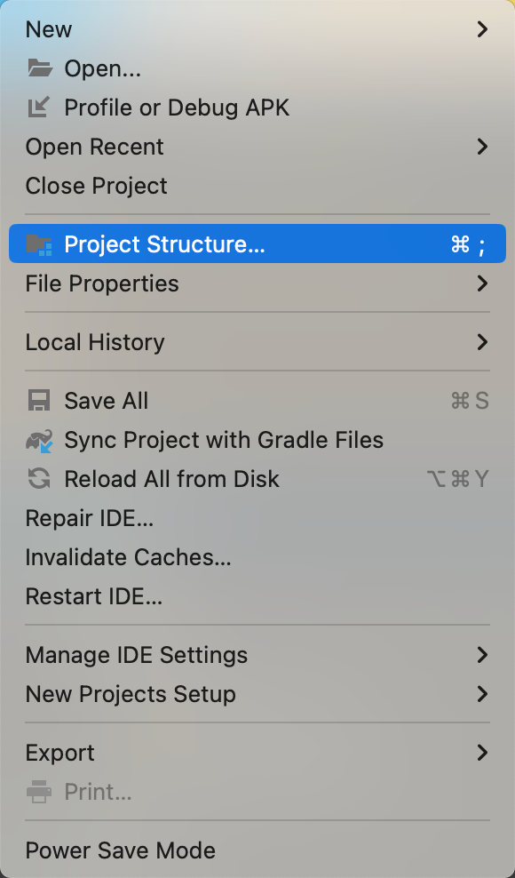

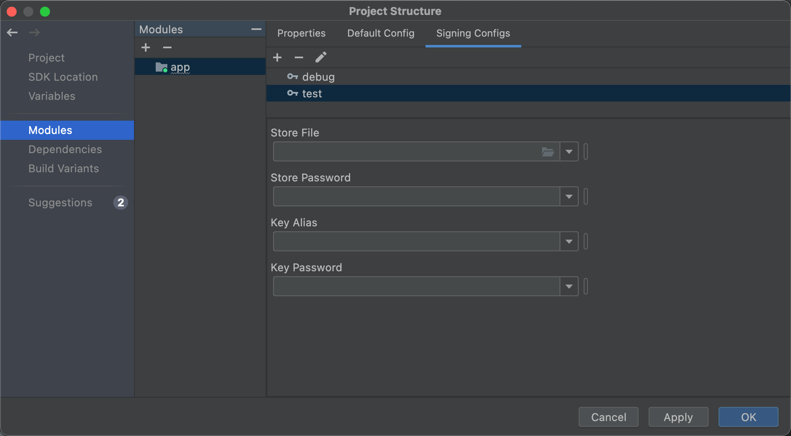

9.uniapp进行打包将打包好的文件复制到 `assets/apps`里

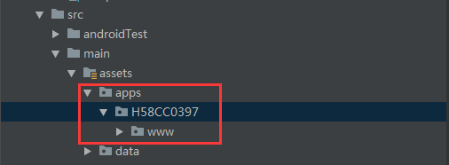

**保证`dcloud_control.xml`及uniapp项目id及Dcloud后台appID一致**

10.输出apk文件

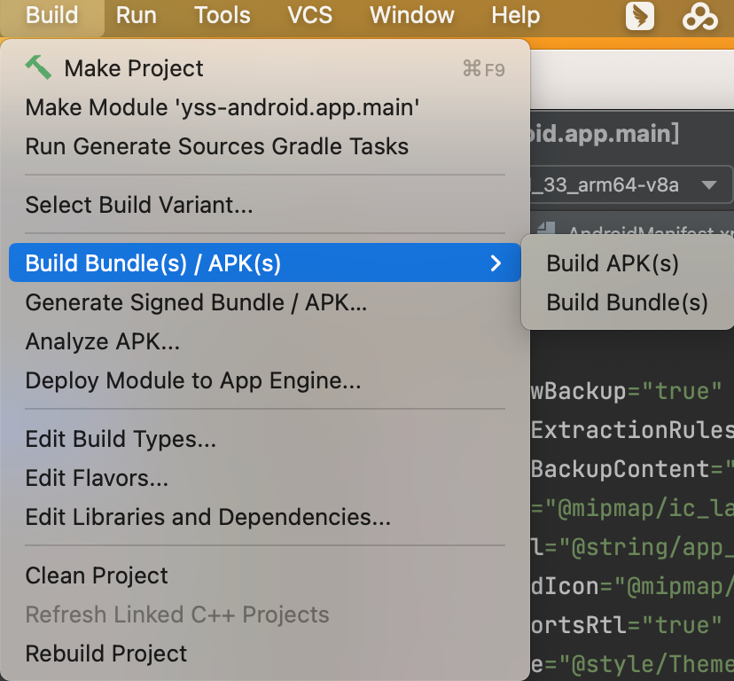