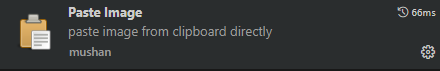

## 复制图片到文件，同时创建文件

`ctrl+alt+v`



```json
${currentFileDir}: 当前打开文件的目录路径。
${projectRoot}: 当前打开项目的根目录路径。
${currentFileName}: 当前打开文件的名称，包括扩展名。
${currentFileNameWithoutExt}: 当前打开文件的名称，不包括扩展名。
```

`vscode setting.json`
```json
  "pasteImage.encodePath": "urlEncode",
  "pasteImage.path": "${currentFileDir}/images/${currentFileNameWithoutExt}",
  "pasteImage.basePath": "${currentFileDir}",
  "pasteImage.forceUnixStyleSeparator": true,
  "pasteImage.prefix": "./",
  "pasteImage.defaultName": "DDDDEwwx"
```

pasteImage.encodePath (可选): 指定如何对图像路径进行编码。默认情况下不进行编码。这里设置为 "urlEncode" 表示将路径中的特殊字符进行 URL 编码，防止出现解析问题。

pasteImage.path: 指定将图像保存到的目标目录和文件名格式。

"${currentFileDir}": 使用当前打开文件的目录路径。
/images/: 子目录名称，用来存放图片。
"${currentFileNameWithoutExt}": 使用当前打开文件名的 不带扩展名 部分作为图片文件名。
例如，如果当前文件为 readme.md，则图像将保存到 readme/images 目录，文件名可能类似于 readme.png。

pasteImage.basePath (可选): 影响粘贴图像时生成的 Markdown 代码中的路径。

"${currentFileDir}": 使用与 pasteImage.path 相同的路径，但不会包含在最终的 Markdown 代码中（因为它是图片所在的基础目录）。
这实际上起到简化路径的作用，避免冗余信息出现在生成的 Markdown 代码中。

pasteImage.forceUnixStyleSeparator (可选): 强制使用 Unix 风格的分隔符（即 /）作为目录分隔符。即使在 Windows 系统上，也会将路径中的分隔符转换为 /。

pasteImage.prefix (可选): 添加前缀到生成的图像路径。这里设置为 "/"，表示在生成的 Markdown 代码中的图像路径前面加上一个斜杠。

例如，最终的 Markdown 代码中的图像引用可能类似于 !/images/readme.png。

pasteImage.defaultName (可选): 指定当无法从剪贴板中获取文件名时使用的默认文件名。这里设置为 "DDDDEwwx"，似乎并不是一个常用的命名规则。建议使用更具描述性的命名方式，例如加入时间戳或哈希值等。

