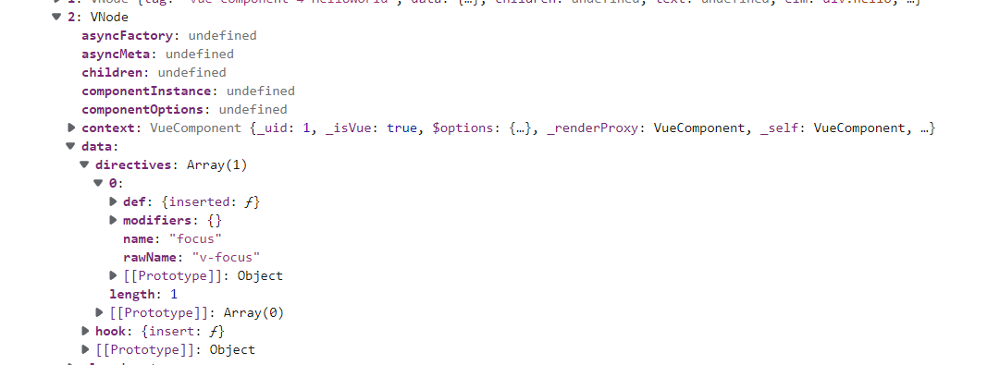
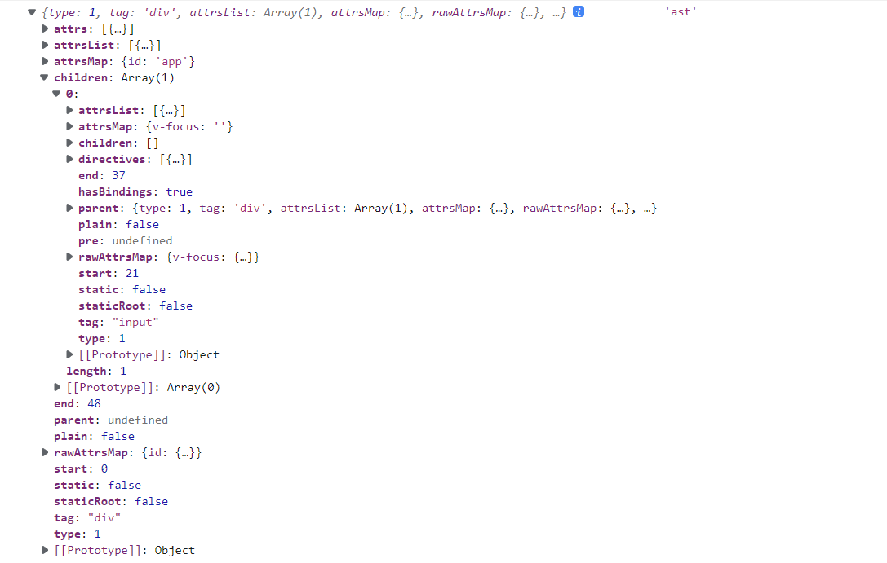
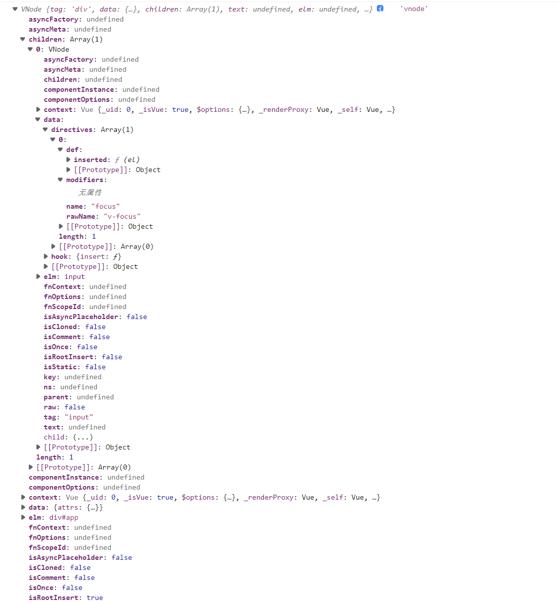

## 内置指令

### v-model

v-model 本质上不过是语法糖。

v-model 在内部为不同的输入元素使用不同的 property 并抛出不同的事件：

- text 和 textarea 元素使用 value property 和 input 事件；
- checkbox 和 radio 使用 checked property 和 change 事件；
- select 字段将 value 作为 prop 并将 change 作为事件。

原生元素

```js
<input v-model="pageName" />;
// render
_c("input", {
  directives: [
    {
      name: "model",
      rawName: "v-model",
      value: _vm.pageName,
      expression: "pageName",
    },
  ],
  domProps: { value: _vm.pageName },
  on: {
    input: function ($event) {
      if ($event.target.composing) {
        return;
      }
      _vm.pageName = $event.target.value;
    },
  },
});
```

```js
Vue.component("base-checkbox", {
  model: {
    prop: "checked",
    event: "change",
  },
  props: {
    checked: Boolean,
  },
  template: `
    <input
      type="checkbox"
      v-bind:checked="checked"
      v-on:change="$emit('change', $event.target.checked)"
    >
  `,
});
// 使用
<base-checkbox v-model="lovingVue"></base-checkbox>;
```

### v-if

```js
  
  // render()
  _vm.isFalse
        ? _c("img", {
            attrs: { alt: "Vue logo", src: require("./assets/logo.png") },
          })
        : _vm._e(),
```

### v-for

## 自定义指令

### 全局方法

```js
// 注册
Vue.directive("my-directive", {
  bind: function () {},
  inserted: function () {},
  update: function () {},
  componentUpdated: function () {},
  unbind: function () {},
});
```

- bind：只调用一次，指令第一次绑定到元素时调用。在这里可以进行一次性的初始化设置。

- inserted：被绑定元素插入父节点时调用 (仅保证父节点存在，但不一定已被插入文档中)。

- update：所在组件的 VNode 更新时调用，但是可能发生在其子 VNode 更新之前。指令的值可能发生了改变，也可能没有。

- componentUpdated：指令所在组件的 VNode 及其子 VNode 全部更新后调用。

- unbind：只调用一次，指令与元素解绑时调用。

```js
Vue["direction"] = function (
  id: string,
  definition?: Function | Object
): Function | Object | void {
  if (!definition) {
    return this.options["directions"][id];
  }

  definition = { bind: definition, update: definition };
  this.options["directions"][id] = definition;
  return definition;
};
```

```js

// 注册一个全局自定义指令 `v-focus`
Vue.directive("focus", {
  // 当被绑定的元素插入到 DOM 中时……
  inserted: function (el) {
    // 聚焦元素
    el.focus();
  },
});
  <input v-focus />
  // render
_c("input", { directives: [{ name: "focus", rawName: "v-focus" }] }),
```



### 局部方法

```js
directives: {
  focus: {
    // 指令的定义
    inserted: function (el) {
      el.focus()
    }
  }
}
```

```js

```

### 指令解析

template => AST

```js
<template>
  <div id="app">
    <input v-focus />
  </div>
</template>
```



::: details render

```js
with (this) {
  return _c("div", { attrs: { id: "app" } }, [
    _c("input", { directives: [{ name: "focus", rawName: "v-focus" }] }),
  ]);
}
```

:::



`src/compiler/parser/index.ts`
`parseHTML()` => `end()` => `closeElement()` => `processElement` => `processAttrs`

::: details processAttrs

```js
function processAttrs(el) {
  const list = el.attrsList;
  let i, l, name, rawName, value, modifiers, syncGen, isDynamic;
  for (i = 0, l = list.length; i < l; i++) {
    name = rawName = list[i].name;
    value = list[i].value;
    if (dirRE.test(name)) {
      // mark element as dynamic
      el.hasBindings = true;
      // modifiers
      modifiers = parseModifiers(name.replace(dirRE, ""));
      // support .foo shorthand syntax for the .prop modifier
      if (process.env.VBIND_PROP_SHORTHAND && propBindRE.test(name)) {
        (modifiers || (modifiers = {})).prop = true;
        name = `.` + name.slice(1).replace(modifierRE, "");
      } else if (modifiers) {
        name = name.replace(modifierRE, "");
      }
      // export const bindRE = /^:|^\.|^v-bind:/
      if (bindRE.test(name)) {
        // v-bind
        name = name.replace(bindRE, "");
        value = parseFilters(value);
        isDynamic = dynamicArgRE.test(name);
        if (isDynamic) {
          name = name.slice(1, -1);
        }
        if (modifiers) {
          if (modifiers.prop && !isDynamic) {
            name = camelize(name);
            if (name === "innerHtml") name = "innerHTML";
          }
          if (modifiers.camel && !isDynamic) {
            name = camelize(name);
          }
          if (modifiers.sync) {
            syncGen = genAssignmentCode(value, `$event`);
            if (!isDynamic) {
              addHandler(
                el,
                `update:${camelize(name)}`,
                syncGen,
                null,
                false,
                warn,
                list[i]
              );
              if (hyphenate(name) !== camelize(name)) {
                addHandler(
                  el,
                  `update:${hyphenate(name)}`,
                  syncGen,
                  null,
                  false,
                  warn,
                  list[i]
                );
              }
            } else {
              // handler w/ dynamic event name
              addHandler(
                el,
                `"update:"+(${name})`,
                syncGen,
                null,
                false,
                warn,
                list[i],
                true // dynamic
              );
            }
          }
        }
        if (
          (modifiers && modifiers.prop) ||
          (!el.component && platformMustUseProp(el.tag, el.attrsMap.type, name))
        ) {
          addProp(el, name, value, list[i], isDynamic);
        } else {
          addAttr(el, name, value, list[i], isDynamic);
        }
      } else if (onRE.test(name)) {
        // v-on
        name = name.replace(onRE, "");
        isDynamic = dynamicArgRE.test(name);
        if (isDynamic) {
          name = name.slice(1, -1);
        }
        addHandler(el, name, value, modifiers, false, warn, list[i], isDynamic);
      } else {
        // normal directives
        /*
        export const dirRE = process.env.VBIND_PROP_SHORTHAND
        ? /^v-|^@|^:|^\.|^#/
        : /^v-|^@|^:|^#/
        */
        name = name.replace(dirRE, "");
        // parse arg
        const argMatch = name.match(argRE);
        let arg = argMatch && argMatch[1];
        isDynamic = false;
        if (arg) {
          name = name.slice(0, -(arg.length + 1));
          if (dynamicArgRE.test(arg)) {
            arg = arg.slice(1, -1);
            isDynamic = true;
          }
        }
        // 把处理的指令 添加到 directives属性
        addDirective(
          el,
          name,
          rawName,
          value,
          arg,
          isDynamic,
          modifiers,
          list[i]
        );
      }
    } else {
      addAttr(el, name, JSON.stringify(value), list[i]);
      // #6887 firefox doesn't update muted state if set via attribute
      // even immediately after element creation
      if (
        !el.component &&
        name === "muted" &&
        platformMustUseProp(el.tag, el.attrsMap.type, name)
      ) {
        addProp(el, name, "true", list[i]);
      }
    }
  }
}
```

### 指令生效

`patch()` => `createElm()` => `invokeCreateHooks()` => `crate() = updateDirectives()`

```js
export default {
  create: updateDirectives,
  update: updateDirectives,
  destroy: function unbindDirectives(vnode: VNodeWithData) {
    // @ts-expect-error emptyNode is not VNodeWithData
    updateDirectives(vnode, emptyNode);
  },
};
```

```js
function updateDirectives(oldVnode: VNodeWithData, vnode: VNodeWithData) {
  if (oldVnode.data.directives || vnode.data.directives) {
    _update(oldVnode, vnode);
  }
}
function _update(oldVnode, vnode) {
  const isCreate = oldVnode === emptyNode;
  const isDestroy = vnode === emptyNode;
  const oldDirs = normalizeDirectives(
    oldVnode.data.directives,
    oldVnode.context
  );
  const newDirs = normalizeDirectives(vnode.data.directives, vnode.context);

  const dirsWithInsert: any[] = [];
  const dirsWithPostpatch: any[] = [];

  let key, oldDir, dir;
  for (key in newDirs) {
    oldDir = oldDirs[key];
    dir = newDirs[key];
    if (!oldDir) {
      // new directive, bind
      callHook(dir, "bind", vnode, oldVnode);
      if (dir.def && dir.def.inserted) {
        dirsWithInsert.push(dir);
      }
    } else {
      // existing directive, update
      dir.oldValue = oldDir.value;
      dir.oldArg = oldDir.arg;
      callHook(dir, "update", vnode, oldVnode);
      if (dir.def && dir.def.componentUpdated) {
        dirsWithPostpatch.push(dir);
      }
    }
  }

  if (dirsWithInsert.length) {
    const callInsert = () => {
      for (let i = 0; i < dirsWithInsert.length; i++) {
        callHook(dirsWithInsert[i], "inserted", vnode, oldVnode);
      }
    };
    if (isCreate) {
      mergeVNodeHook(vnode, "insert", callInsert);
    } else {
      callInsert();
    }
  }

  if (dirsWithPostpatch.length) {
    mergeVNodeHook(vnode, "postpatch", () => {
      for (let i = 0; i < dirsWithPostpatch.length; i++) {
        callHook(dirsWithPostpatch[i], "componentUpdated", vnode, oldVnode);
      }
    });
  }

  if (!isCreate) {
    for (key in oldDirs) {
      if (!newDirs[key]) {
        // no longer present, unbind
        callHook(oldDirs[key], "unbind", oldVnode, oldVnode, isDestroy);
      }
    }
  }
}
```
