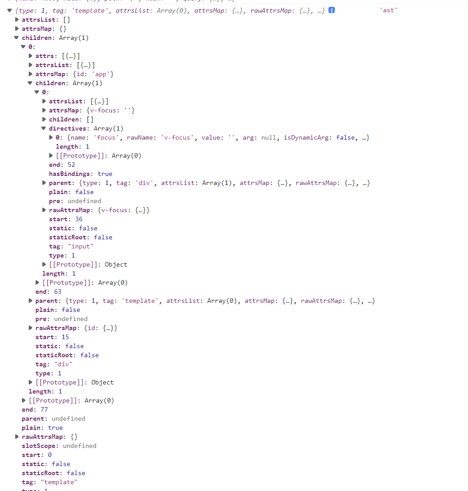

## 内置指令

### v-model

v-model 本质上不过是语法糖。

v-model 在内部为不同的输入元素使用不同的 property 并抛出不同的事件：

- text 和 textarea 元素使用 value property 和 input 事件；
- checkbox 和 radio 使用 checked property 和 change 事件；
- select 字段将 value 作为 prop 并将 change 作为事件。

原生元素

```js
<input v-model="pageName" />;
// render
_c("input", {
  directives: [
    {
      name: "model",
      rawName: "v-model",
      value: _vm.pageName,
      expression: "pageName",
    },
  ],
  domProps: { value: _vm.pageName },
  on: {
    input: function ($event) {
      if ($event.target.composing) {
        return;
      }
      _vm.pageName = $event.target.value;
    },
  },
});
```

```js
Vue.component("base-checkbox", {
  model: {
    prop: "checked",
    event: "change",
  },
  props: {
    checked: Boolean,
  },
  template: `
    <input
      type="checkbox"
      v-bind:checked="checked"
      v-on:change="$emit('change', $event.target.checked)"
    >
  `,
});
// 使用
<base-checkbox v-model="lovingVue"></base-checkbox>;
```

### v-if

```js
  
  // render()
  _vm.isFalse
        ? _c("img", {
            attrs: { alt: "Vue logo", src: require("./assets/logo.png") },
          })
        : _vm._e(),
```

### v-for

## 自定义指令

### 全局方法

```js
// 注册
Vue.directive("my-directive", {
  bind: function () {},
  inserted: function () {},
  update: function () {},
  componentUpdated: function () {},
  unbind: function () {},
});
```

- bind：只调用一次，指令第一次绑定到元素时调用。在这里可以进行一次性的初始化设置。

- inserted：被绑定元素插入父节点时调用 (仅保证父节点存在，但不一定已被插入文档中)。

- update：所在组件的 VNode 更新时调用，但是可能发生在其子 VNode 更新之前。指令的值可能发生了改变，也可能没有。

- componentUpdated：指令所在组件的 VNode 及其子 VNode 全部更新后调用。

- unbind：只调用一次，指令与元素解绑时调用。

```js
Vue["direction"] = function (
  id: string,
  definition?: Function | Object
): Function | Object | void {
  if (!definition) {
    return this.options["directions"][id];
  }

  definition = { bind: definition, update: definition };
  this.options["directions"][id] = definition;
  return definition;
};
```

```js

// 注册一个全局自定义指令 `v-focus`
Vue.directive("focus", {
  // 当被绑定的元素插入到 DOM 中时……
  inserted: function (el) {
    // 聚焦元素
    el.focus();
  },
});
  <input v-focus />
  // render
_c("input", { directives: [{ name: "focus", rawName: "v-focus" }] }),
```


### 局部方法

```js
directives: {
  focus: {
    // 指令的定义
    inserted: function (el) {
      el.focus()
    }
  }
}
```

```js

```

## 模板编译

```js
<template>
  <div id="app">
    <input v-focus />
  </div>
</template>
```



```js

```

##
