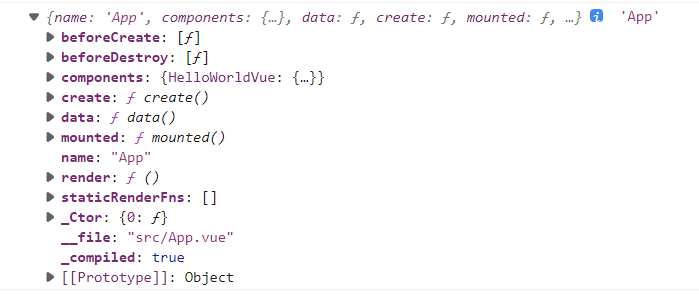

## 开始

```js
import Vue from "vue";
import App from "./App.vue";

new Vue({
  el: "#app",
  // h => createElement()
  // _init => vm._renderProxy = vm
  //  render.call(vm._renderProxy,vm.$createElement)
  render: (h) => h(App),
});
```

### vue-loader

```js
import App from "./App.vue";
console.log(App, "App");
```



### entry

::: details Vue 入口

`platforms/web/entry-runtime.ts`

```js
import Vue from "./runtime/index";
import * as vca from "v3";
import { extend } from "shared/util";

extend(Vue, vca);

export default Vue;
```

---

`platforms/runtime/index`

```js
import Vue from "core/index";
import config from "core/config";
// 省略
import platformDirectives from "./directives/index";
import platformComponents from "./components/index";
//这里都是web平台相关的一些配置
// install platform specific utils
Vue.config.mustUseProp = mustUseProp;
// 省略
// 注册指令和组件，这里的 directives 和 components 也是web平台上的，是内置的指令和组件，其实很少
// install platform runtime directives & components
extend(Vue.options.directives, platformDirectives); // 内置的directives只有两个，`v-show` 和 `v-model`
extend(Vue.options.components, platformComponents); // 内置的组件也很少，只有`keepAlive`, `transition`和 `transitionGroup`
// 如果不是浏览器，就不进行 `patch` 操作了
// install platform patch function
Vue.prototype.__patch__ = inBrowser ? patch : noop;
// 如果有 `el` 且在浏览器中，则进行 `mount` 操作
// public mount method
Vue.prototype.$mount = function (
  el?: string | Element,
  hydrating?: boolean
): Component {
  el = el && inBrowser ? query(el) : undefined;
  return mountComponent(this, el, hydrating);
};
// 省略devtool相关代码
export default Vue;
```

:::

### vue

`core/index`

```js
import Vue from "./instance/index";
import { initGlobalAPI } from "./global-api/index";
initGlobalAPI(Vue); // 这个函数添加了一些类方法属性
// 省略一些ssr相关的内容
// 省略
Vue.version = "__VERSION__";
export default Vue;
```

---

### initGlobalAPI

::: details initGlobalAPI

```js
export function initGlobalAPI(Vue: GlobalAPI) {
  // config
  const configDef = {};
  configDef.get = () => config;
  // 省略
  // 这里添加了一个`Vue.config` 对象，至于在哪里会用到，后面会讲
  Object.defineProperty(Vue, "config", configDef);
  // exposed util methods.
  // NOTE: these are not considered part of the public API - avoid relying on
  // them unless you are aware of the risk.
  Vue.util = {
    warn,
    extend,
    mergeOptions,
    defineReactive,
  };
  //一般我们用实例方法而不是这三个类方法
  Vue.set = set;
  Vue.delete = del;
  Vue.nextTick = nextTick;
  // 注意这里，循环出来的结果其实是三个 `components`,`directives`, `filters`，这里先创建了空对象作为容器，后面如果有对应的插件就会放进来。
  Vue.options = Object.create(null);
  ASSET_TYPES.forEach((type) => {
    Vue.options[type + "s"] = Object.create(null);
  });
  // this is used to identify the "base" constructor to extend all plain-object
  // components with in Weex's multi-instance scenarios.
  Vue.options._base = Vue;
  // 内置组件只有一个，就是 `keepAlive`
  extend(Vue.options.components, builtInComponents);
  initUse(Vue); // 添加了 Vue.use 方法，可以注册插件
  initMixin(Vue); //添加了Vue.mixin 方法
  initExtend(Vue); // 添加了 Vue.extend 方法
  // 这一步是注册了 `Vue.component` ,`Vue.directive` 和 `Vue.filter` 三个方法，上面不是有 `Vue.options.components` 等空对象吗，这三个方法的作用就是把注册的组件放入对应的容器中。
  initAssetRegisters(Vue);
}
```

:::

### instance

::: details instance
`core/instance/index`

```js
//  省略import语句
function Vue(options) {
  if (process.env.NODE_ENV !== "production" && !(this instanceof Vue)) {
    warn("Vue is a constructor and should be called with the `new` keyword");
  }
  this._init(options);
}
import { initMixin } from "./init";
import { stateMixin } from "./state";
import { renderMixin } from "./render";
import { eventsMixin } from "./events";
import { lifecycleMixin } from "./lifecycle";
//添加 _init方法
initMixin(Vue);
//添加了 $data,$props,$watch,$set,$delete 几个属性和方法
stateMixin(Vue);
//添加了 $on,$off,$once,$emit 三个方法
eventsMixin(Vue);
//添加了 _update, $forceUpdate, $destroy 三个方法
lifecycleMixin(Vue);
//添加了 $nextTick 和 _render 两个方法以及一大堆renderHelpers
renderMixin(Vue);
export default Vue;
```

`执行方法后添加的属性`

```js
//构造函数
function Vue () {
  this._init()
}
//全局config对象，我们几乎不会用到
Vue.config = {
  keyCodes,
  _lifecycleHooks: ['beforeCreate', 'created', ...]
}
// 默认的options配置，我们每个组件都会继承这个配置。
Vue.options = {
  beforeCreate, // 比如 vue-router 就会注册这个回调，因此会每一个组件继承
  components, // 前面提到了，默认组件有三个 `KeepAlive`,`transition`, `transitionGroup`，这里注册的组件就是全局组件，因为任何一个组件中不用声明就能用了。所以全局组件的原理就是这么简单
  directives, // 默认只有 `v-show` 和 `v-model`
  filters // 不推荐使用了
}
//一些全局方法
Vue.use // 注册插件
Vue.component // 注册组件
Vue.directive // 注册指令
Vue.nextTick //下一个tick执行函数
Vue.set/delete // 数据的修改操作
Vue.mixin // 混入mixin用的
//Vue.prototype 上有几种不同作用的方法
//由initMixin 添加的 `_init` 方法，是Vue实例初始化的入口方法，会调用其他的功能初始话函数
Vue.prototype._init
// 由 initState 添加的三个用来进行数据操作的方法
Vue.prototype.$data
Vue.prototype.$props
Vue.prototype.$watch
// 由initEvents添加的事件方法
Vue.prototype.$on
Vue.prototype.$off
Vue.prototype.$one
Vue.prototype.$emit
// 由 lifecycle添加的生命周期相关的方法
Vue.prototype._update
Vue.prototype.$forceUpdate
Vue.prototype.$destroy
//在 platform 中添加的生命周期方法
Vue.prototype.$mount
// 由renderMixin添加的`$nextTick` 和 `_render` 以及一堆renderHelper
Vue.prototype.$nextTick
Vue.prototype._render
Vue.prototype._b
Vue.prototype._e
//...
```

:::

## \_init

```js
function Vue(options) {
  this._init(options);
}
```

::: detail Vue.\_init()

```js
  Vue.prototype._init = function (options?: Record<string, any>) {

    // vm this 的别名
    const vm: Component = this
    // a uid
    vm._uid = uid++

    let startTag, endTag
    /* istanbul ignore if */
    if (__DEV__ && config.performance && mark) {
      startTag = `vue-perf-start:${vm._uid}`
      endTag = `vue-perf-end:${vm._uid}`
      mark(startTag)
    }

    // a flag to mark this as a Vue instance without having to do instanceof
    // check
    vm._isVue = true
    // avoid instances from being observed
    vm.__v_skip = true
    // effect scope
    vm._scope = new EffectScope(true /* detached */)
    // merge options
    if (options && options._isComponent) {
      // optimize internal component instantiation
      // since dynamic options merging is pretty slow, and none of the
      // internal component options needs special treatment.
      initInternalComponent(vm, options as any)
    } else {
      vm.$options = mergeOptions(
        resolveConstructorOptions(vm.constructor as any),
        options || {},
        vm
      )
    }
    /* istanbul ignore else */
    if (__DEV__) {
      initProxy(vm)
    } else {
      vm._renderProxy = vm
    }
    // expose real self
    vm._self = vm
    // // 做了一些生命周期的初始化工作，初始化了很多变量，最主要是设置了父子组件的引用关系，也就是设置了 `$parent` 和 `$children`的值
    initLifecycle(vm)
    // 注册事件，注意这里注册的不是自己的，而是父组件的。因为很明显父组件的监听器才会注册到孩子身上。
    initEvents(vm)
    // 做一些 render 的准备工作，比如处理父子继承关系等，并没有真的开始 render
    initRender(vm)
    // 准备工作完成，接下来进入 `create` 阶段
    callHook(vm, 'beforeCreate')
    initInjections(vm) // resolve injections before data/props
    // `data`, `props`, `computed` 等都是在这里初始化的，常见的面试考点比如`Vue是如何实现数据响应化的` 答案就在这个函数中寻找
    initState(vm)
    initProvide(vm) // resolve provide after data/props
    callHook(vm, 'created')

    /* istanbul ignore if */
    if (__DEV__ && config.performance && mark) {
      vm._name = formatComponentName(vm, false)
      mark(endTag)
      measure(`vue ${vm._name} init`, startTag, endTag)
    }

    if (vm.$options.el) {
      vm.$mount(vm.$options.el)
    }
  }
```

:::

### vm.$options 处理

```js
vm.$options = mergeOptions(
    resolveConstructorOptions(vm.constructor as any),
    options || {},
    vm
  )
```

#### resolveConstructorOptions

解析对象的 options 并且合并 Sub 上的 options
::: details resolveConstructorOptions

```js
export function resolveConstructorOptions(Ctor: typeof Component) {
  let options = Ctor.options;
  // super  Vue.extend时 return Sub => Sub.super = this = Vue
  //
  if (Ctor.super) {
    // 获取父类身上options
    const superOptions = resolveConstructorOptions(Ctor.super);

    const cachedSuperOptions = Ctor.superOptions;
    // 如果父类有，进行合并
    if (superOptions !== cachedSuperOptions) {
      // super option changed,
      // need to resolve new options.
      Ctor.superOptions = superOptions;
      // check if there are any late-modified/attached options (#4976)
      const modifiedOptions = resolveModifiedOptions(Ctor);
      // update base extend options
      if (modifiedOptions) {
        extend(Ctor.extendOptions, modifiedOptions);
      }
      options = Ctor.options = mergeOptions(superOptions, Ctor.extendOptions);
      if (options.name) {
        options.components[options.name] = Ctor;
      }
    }
  }
  return options;
}
```

:::

#### mergeOptions

::: details mergeOptions
合并两个选项，出现相同配置项时，子选项会覆盖父选项的配置

```js
export function mergeOptions(
  parent: Record<string, any>,
  child: Record<string, any>,
  vm?: Component | null
): ComponentOptions {

  if (isFunction(child)) {
    // @ts-expect-error
    child = child.options
  }

  normalizeProps(child, vm)
  normalizeInject(child, vm)
  normalizeDirectives(child)

  // Apply extends and mixins on the child options,
  // but only if it is a raw options object that isn't
  // the result of another mergeOptions call.
  // Only merged options has the _base property.
  if (!child._base) {
    if (child.extends) {
      parent = mergeOptions(parent, child.extends, vm)
    }
    if (child.mixins) {
      for (let i = 0, l = child.mixins.length; i < l; i++) {
        parent = mergeOptions(parent, child.mixins[i], vm)
      }
    }
  }

  const options: ComponentOptions = {} as any
  let key
  for (key in parent) {
    mergeField(key)
  }
  for (key in child) {
    if (!hasOwn(parent, key)) {
      mergeField(key)
    }
  }
  function mergeField(key: any) {
    const strat = strats[key] || defaultStrat
    options[key] = strat(parent[key], child[key], vm, key)
  }
  return options
}
```

:::

::: details resolveConstructorOptions

```js
export function resolveConstructorOptions(Ctor: typeof Component) {
  let options = Ctor.options;
  if (Ctor.super) {
    const superOptions = resolveConstructorOptions(Ctor.super);
    const cachedSuperOptions = Ctor.superOptions;
    if (superOptions !== cachedSuperOptions) {
      // super option changed,
      // need to resolve new options.
      Ctor.superOptions = superOptions;
      // check if there are any late-modified/attached options (#4976)
      const modifiedOptions = resolveModifiedOptions(Ctor);
      // update base extend options
      if (modifiedOptions) {
        extend(Ctor.extendOptions, modifiedOptions);
      }
      options = Ctor.options = mergeOptions(superOptions, Ctor.extendOptions);
      if (options.name) {
        options.components[options.name] = Ctor;
      }
    }
  }
  return options;
}
```

:::

`props`在 `mergeOptions`时调用`normalizeProps`方法进行处理

```js
props: ["name"];
props: {
  name: String;
}
props: {
  name: {
    type: String;
  }
}
```

`normalizeProps`

```js
function normalizeProps(options: Record<string, any>, vm?: Component | null) {
  const props = options.props;
  if (!props) return;
  const res: Record<string, any> = {};
  let i, val, name;
  if (isArray(props)) {
    i = props.length;
    while (i--) {
      val = props[i];
      if (typeof val === "string") {
        // 转化成驼峰式命名
        name = camelize(val);
        res[name] = { type: null };
      }
    }
  } else if (isPlainObject(props)) {
    for (const key in props) {
      val = props[key];
      name = camelize(key);
      res[name] = isPlainObject(val) ? val : { type: val };
    }
  }
  options.props = res;
}
```

### callHook

```js
export function callHook(vm: Component, hook: string, args?: any[]) {
  // #7573 disable dep collection when invoking lifecycle hooks
  pushTarget();
  const prev = currentInstance;
  setCurrentInstance(vm);
  const handlers = vm.$options[hook];
  const info = `${hook} hook`;
  if (handlers) {
    for (let i = 0, j = handlers.length; i < j; i++) {
      invokeWithErrorHandling(handlers[i], vm, args || null, vm, info);
    }
  }
  if (vm._hasHookEvent) {
    vm.$emit("hook:" + hook);
  }
  setCurrentInstance(prev);
  popTarget();
}
```

## initState

**数据响应式的入口：分别处理 props、methods、data、computed、watch**
**优先级：props、methods、data、computed 对象中的属性不能出现重复，优先级和列出顺序一致**
**其中 computed 中的 key 不能和 props、data 中的 key 重复，methods 不影响**

```js
export function initState(vm: Component) {
  // $option 会将 vue.constructor 和new Vue({}) 里的对象进行合并
  const opts = vm.$options;
  if (opts.props) initProps(vm, opts.props);

  // Composition API
  initSetup(vm);

  if (opts.methods) initMethods(vm, opts.methods);

  if (opts.data) {
    initData(vm);
  } else {
    const ob = observe((vm._data = {}));
    ob && ob.vmCount++;
  }
  if (opts.computed) initComputed(vm, opts.computed);
  if (opts.watch && opts.watch !== nativeWatch) {
    initWatch(vm, opts.watch);
  }
}
```

### proxy

把 props 和 data 上的属性代理到 vm 实例上

```js
const sharedPropertyDefinition = {
  enumerable: true,
  configurable: true,
  get: noop,
  set: noop,
};
export function proxy(target: Object, sourceKey: string, key: string) {
  sharedPropertyDefinition.get = function proxyGetter() {
    return this[sourceKey][key];
  };
  sharedPropertyDefinition.set = function proxySetter(val) {
    this[sourceKey][key] = val;
  };
  Object.defineProperty(target, key, sharedPropertyDefinition);
}
```

### initProps

处理 props 对象，将 props 对象的每个属性设置为响应式，代理到 vm 上 => vm.props.xx = vm.xx

```js
//
function initProps(vm: Component, propsOptions: Object) {
  const propsData = vm.$options.propsData || {};
  const props = (vm._props = shallowReactive({}));
  // cache prop keys so that future props updates can iterate using Array
  // instead of dynamic object key enumeration.
  const keys: string[] = (vm.$options._propKeys = []);
  const isRoot = !vm.$parent;
  // root instance props should be converted
  if (!isRoot) {
    toggleObserving(false);
  }
  // 遍历 props 对象
  for (const key in propsOptions) {
    keys.push(key);
    // 获取 props[key] 的默认值
    const value = validateProp(key, propsOptions, propsData, vm);
    // 为 props 的每个 key 是设置数据响应式
    defineReactive(props, key, value);

    // static props are already proxied on the component's prototype
    // during Vue.extend(). We only need to proxy props defined at
    // instantiation here.
    if (!(key in vm)) {
      // 代理 key 到 vm 对象上
      proxy(vm, `_props`, key);
    }
  }
  toggleObserving(true);
}
```

### initMethods

```js
function initMethods(vm: Component, methods: Object) {
  const props = vm.$options.props;
  for (const key in methods) {
    // bind() 方法创建一个新的函数，在 bind() 被调用时，这个新函数的 this 被指定为 bind() 的第一个参数，而其余参数将作为新函数的参数，供调用时使用。
    // (fn,ctx) => fn.bind(ctx)
    vm[key] =
      typeof methods[key] !== "function" ? noop : bind(methods[key], vm);
  }
}
```

### initData

```js
function initData(vm: Component) {
  let data: any = vm.$options.data;
  data = vm._data = isFunction(data) ? getData(data, vm) : data || {};
  if (!isPlainObject(data)) {
    data = {};
  }
  // proxy data on instance
  const keys = Object.keys(data);
  const props = vm.$options.props;
  const methods = vm.$options.methods;
  let i = keys.length;
  while (i--) {
    const key = keys[i];
    if (!isReserved(key)) {
      proxy(vm, `_data`, key);
    }
  }
  // observe data
  const ob = observe(data);
  ob && ob.vmCount++;
}
```

### initComputed

```js
function initComputed(vm: Component, computed: Object) {
  // $flow-disable-line
  const watchers = (vm._computedWatchers = Object.create(null));
  // computed properties are just getters during SSR
  const isSSR = isServerRendering();

  for (const key in computed) {
    const userDef = computed[key];
    const getter = isFunction(userDef) ? userDef : userDef.get;
    if (!isSSR) {
      // create internal watcher for the computed property.
      // 这是一个computer watcher
      watchers[key] = new Watcher(
        vm,
        getter || noop,
        noop,
        computedWatcherOptions
      );
    }
    // component-defined computed properties are already defined on the
    // component prototype. We only need to define computed properties defined
    // at instantiation here.
    // 代理 computed 对象中的属性到 vm 实例
    // 这样就可以使用 vm.computedKey 访问计算属性了
    if (!(key in vm)) {
      defineComputed(vm, key, userDef);
    }
  }
}
export function defineComputed(
  target: any,
  key: string,
  userDef: Record<string, any> | (() => any)
) {
  const shouldCache = !isServerRendering();
  if (isFunction(userDef)) {
    sharedPropertyDefinition.get = shouldCache
      ? createComputedGetter(key)
      : createGetterInvoker(userDef);
    sharedPropertyDefinition.set = noop;
  } else {
    sharedPropertyDefinition.get = userDef.get
      ? shouldCache && userDef.cache !== false
        ? createComputedGetter(key)
        : createGetterInvoker(userDef.get)
      : noop;
    sharedPropertyDefinition.set = userDef.set || noop;
  }
  Object.defineProperty(target, key, sharedPropertyDefinition);
}

function createComputedGetter(key) {
  return function computedGetter() {
    // 得到当前 key 对应的 watcher
    const watcher = this._computedWatchers && this._computedWatchers[key];
    if (watcher) {
      // 计算 key 对应的值，通过执行 computed.key 的回调函数来得到
      // watcher.dirty 属性就是大家常说的 computed 计算结果会缓存的原理
      // <template>
      //   <div>{{ computedProperty }}</div>
      //   <div>{{ computedProperty }}</div>
      // </template>
      // 像这种情况下，在页面的一次渲染中，两个 dom 中的 computedProperty 只有第一个
      // 会执行 computed.computedProperty 的回调函数计算实际的值，
      // 即执行 watcher.evalaute，而第二个就不走计算过程了，
      // 因为上一次执行 watcher.evalute 时把 watcher.dirty 置为了 false，
      // 待页面更新后，wathcer.update 方法会将 watcher.dirty 重新置为 true，
      // 供下次页面更新时重新计算 computed.key 的结果
      if (watcher.dirty) {
        watcher.evaluate();
      }
      if (Dep.target) {
        // watcher.depend => Dep.depend => 将Dep.target = 当前watcher
        watcher.depend();
      }
      // watcher.value => this.get() 会读取data的响应式数据，触发data中的getter将当前的watcher收集
      //
      return watcher.value;
    }
  };
}
```

### initWatch

```js
  watch: {
    // 写法1 string, 即执行this.foo()
    count: 'foo'
    // 写法2 函数
    count(v) {
      console.log(v)
    },
    // 写法3 普通对象
    count: {
      handler(v) {
        console.log(v)
      },
      deep: true,
      immediate: true
    },
    // 写法4 数组里面放stirng，即执行 this.foo(),this.bar()
    count: [
      'foo',
      'bar'
    ],
    // 写法5 数组里面放普通对象或者stirng,自由组合
    count: [
      {
        handler(v) {
          console.log(v)
        },
        deep: true,
        immediate: true
      },
      {
        handler: 'foo'
      }
    ]
  }
```

```js
function initWatch(vm: Component, watch: Object) {
  for (const key in watch) {
    const handler = watch[key];
    if (isArray(handler)) {
      for (let i = 0; i < handler.length; i++) {
        createWatcher(vm, key, handler[i]);
      }
    } else {
      createWatcher(vm, key, handler);
    }
  }
}
// 1、兼容性处理，保证 handler 肯定是一个函数
// 2、调用 $watch
function createWatcher(
  vm: Component,
  expOrFn: string | (() => any),
  handler: any,
  options?: Object
) {
  // 如果 handler 为对象，则获取其中的 handler 选项的值
  if (isPlainObject(handler)) {
    options = handler;
    handler = handler.handler;
  }
  // 如果 hander 为字符串，则说明是一个 methods 方法，获取 vm[handler]
  if (typeof handler === "string") {
    handler = vm[handler];
  }
  return vm.$watch(expOrFn, handler, options);
}

Vue.prototype.$watch = function (
  expOrFn: string | (() => any),
  cb: any,
  options?: Record<string, any>
): Function {
  const vm: Component = this;
  // 兼容性处理，因为用户调用 vm.$watch 时设置的 cb 可能是对象
  if (isPlainObject(cb)) {
    return createWatcher(vm, expOrFn, cb, options);
  }
  options = options || {};
  //user = true, watcher.run => this.cb()
  // user时 watcher run方法逻辑不同
  options.user = true;
  const watcher = new Watcher(vm, expOrFn, cb, options);
  // 如果用户设置了 immediate 为 true，则立即执行一次回调函数
  if (options.immediate) {
    const info = `callback for immediate watcher "${watcher.expression}"`;
    pushTarget();
    invokeWithErrorHandling(cb, vm, [watcher.value], vm, info);
    popTarget();
  }
  return function unwatchFn() {
    watcher.teardown();
  };
};
```

## 响应式原理

### defineProperty

Object.defineProperty() 方法会直接在一个对象上定义一个新属性，或者修改一个对象的现有属性，并返回此对象。

::: details defineProperty

```js
let car = {};
let val = 3000;
Object.defineProperty(car, "price", {
  enumerable: true,
  configurable: true,
  get() {
    console.log("price属性被读取了");
    return val;
  },
  set(newVal) {
    console.log("price属性被修改了");
    val = newVal;
  },
});
```

:::

### observe

`initState()`-->`observe(data)`-->`new Observer()`
监测数据
为对象创建观察者实例，如果对象已经被观察过，则返回已有的观察者实例，否则创建新的观察者实例

```js
// initData
function initData(vm: Component) {
  let data: any = vm.$options.data;
  data = vm._data = isFunction(data) ? getData(data, vm) : data || {};
  // ...
  // observe data
  const ob = observe(data);
  ob && ob.vmCount++;
}
```

::: details observe

```js
// 给非 VNode 的对象类型数据添加一个 Observer，如果已经添加过则直接返回
export function observe(value: any, shallow?: boolean): Observer | void {
  if (!isObject(value) || isRef(value) || value instanceof VNode) {
    return;
  }
  let ob: Observer | void;
  if (hasOwn(value, "__ob__") && value.__ob__ instanceof Observer) {
    // 如果 value 对象上存在 __ob__ 属性，则表示已经做过观察了，直接返回 __ob__ 属性
    ob = value.__ob__;
  } else if (
    shouldObserve &&
    !isServerRendering() &&
    (isArray(value) || isPlainObject(value)) &&
    Object.isExtensible(value) &&
    !value.__v_skip
  ) {
    ob = new Observer(value, shallow);
  }
  return ob;
}
```

:::

### Observer

对象的属性添加 getter 和 setter，用于依赖收集和派发更新：
::: details Observer

```js
export class Observer {
  dep: Dep
  vmCount: number // number of vms that have this object as root $data

  constructor(public value: any, public shallow = false) {
    // this.value = value
    this.dep = new Dep()
    this.vmCount = 0
    // 给value新增一个__ob__属性，值为该value的Observer实例
    // 相当于为value打上标记，表示它已经被转化成响应式了，避免重复操作
    def(value, '__ob__', this)
    if (isArray(value)) {
        /**
       * value 为数组
       * hasProto = '__proto__' in {}
       * 用于判断对象是否存在 __proto__ 属性，通过 obj.__proto__ 可以访问对象的原型链
       * 但由于 __proto__ 不是标准属性，所以有些浏览器不支持，比如 IE6-10，Opera10.1
       * 为什么要判断，是因为一会儿要通过 __proto__ 操作数据的原型链
       * 覆盖数组默认的七个原型方法，以实现数组响应式
       * https://juejin.cn/post/6950826293923414047
       */

      if (hasProto) {
        // 如果数组有_proto_属性 则将_proto_指向 数组的七个方法
        // value.__proto__ = arrayMathods
        protoAugment(value, arrayMethods)
      } else {
        // 数组不支持_proto_
        // 循环遍历arrayKeys 通过defineProperty给数组添加方法
        copyAugment(value, arrayMethods, arrayKeys)
      }
      if (!shallow) {
        this.observeArray(value)
      }
    } else {
      this.walk(value, shallow)
    }
  }

  /**
   * Walk through all properties and convert them into
   * getter/setters. This method should only be called when
   * value type is Object.
   * 遍历对象上的每个 key，为每个 key 设置响应式
   * 仅当值为对象时才会走这里
   */
  // 使一个对象转化成可观测对象
  walk(obj: object, shallow: boolean) {
    const keys = Object.keys(obj)
    for (let i = 0; i < keys.length; i++) {
      const key = keys[i]
      defineReactive(obj, key, NO_INIITIAL_VALUE, undefined, shallow)
    }
  }

  /**
   * Observe a list of Array items.
    遍历数组，为数组的每一项设置观察，处理数组元素为对象的情况
   */
  observeArray(items: Array<any>) {
    for (let i = 0, l = items.length; i < l; i++) {
      observe(items[i])
    }
  }
}
```

:::

#### arrayMethods

::: details arrayMethods

```js
const arrayProto = Array.prototype;
export const arrayMethods = Object.create(arrayProto);

const methodsToPatch = [
  "push",
  "pop",
  "shift",
  "unshift",
  "splice",
  "sort",
  "reverse",
];

/**
 * Intercept mutating methods and emit events
 */
methodsToPatch.forEach(function (method) {
  // cache original method
  const original = arrayProto[method];
  def(arrayMethods, method, function mutator(...args) {
    const result = original.apply(this, args);
    const ob = this.__ob__;
    let inserted;
    switch (method) {
      case "push":
      case "unshift":
        inserted = args;
        break;
      case "splice":
        inserted = args.slice(2);
        break;
    }
    if (inserted) ob.observeArray(inserted);
    // notify change

    ob.dep.notify();

    return result;
  });
});
```

:::

#### defineReactive

- 拦截 obj[key] 的读取和设置操作：
- 1、在第一次读取时收集依赖，比如执行 render 函数生成虚拟 DOM 时会有读取操作
- 2、在更新时设置新值并通知依赖更新

::: details Dep.target

```js
Dep.target = null;
const targetStack: Array<DepTarget | null | undefined> = [];

export function pushTarget(target?: DepTarget | null) {
  targetStack.push(target);
  Dep.target = target;
}

export function popTarget() {
  targetStack.pop();
  Dep.target = targetStack[targetStack.length - 1];
}
```

:::

::: details defineReactive

```js
export function defineReactive(
  obj: object,
  key: string,
  val?: any,
  customSetter?: Function | null,
  shallow?: boolean
) {
  const dep = new Dep();
  // 获取 obj[key] 的属性描述符，发现它是不可配置对象的话直接 return

  /*
  Object.getOwnPropertyDescriptor() 方法返回指定对象上一个自有属性对应的属性描述符。
  */
  const property = Object.getOwnPropertyDescriptor(obj, key);
  if (property && property.configurable === false) {
    return;
  }
  // 只有定义了响应式get和set才有这个属性  第一次进来没有该属性
  // cater for pre-defined getter/setters
  const getter = property && property.get;
  const setter = property && property.set;
  if (
    (!getter || setter) &&
    (val === NO_INIITIAL_VALUE || arguments.length === 2)
  ) {
    val = obj[key];
  }

  // 只有对象
  // 递归调用，处理 val 即 obj[key] 的值为对象的情况，保证对象中的所有 key 都被观察
  // observe 放回一个Observer对象
  let childOb = !shallow && observe(val);
  Object.defineProperty(obj, key, {
    enumerable: true,
    configurable: true,
    get: function reactiveGetter() {
      const value = getter ? getter.call(obj) : val;

      /**
       * Dep.target 为 Dep 类的一个静态属性，值为 watcher，在实例化 Watcher 时会被设置
       * 实例化 Watcher 时会执行 new Watcher 时传递的回调函数（computed 除外，因为它懒执行）
       * 而回调函数中如果有 vm.key 的读取行为，则会触发这里的 读取 拦截，进行依赖收集
       * 回调函数执行完以后又会将 Dep.target 设置为 null，避免这里重复收集依赖
       */
      if (Dep.target) {
        // 在 dep 的subs数组中添加watcher
        dep.depend();
        // childOb 表示对象中嵌套对象的观察者对象，如果存在也对其进行依赖收集
        if (childOb) {
          childOb.dep.depend();
          if (isArray(value)) {
            dependArray(value);
            /*
            function dependArray(value: Array<any>) {
              for (let e, i = 0, l = value.length; i < l; i++) {
                e = value[i]
                if (e && e.__ob__) {
                  e.__ob__.dep.depend()
                }
                if (isArray(e)) {
                  dependArray(e)
                }
              }
            }         
            */
          }
        }
      }
      return isRef(value) ? value.value : value;
    },
    set: function reactiveSetter(newVal) {
      const value = getter ? getter.call(obj) : val;
      // 如果新老值一样，则直接 return，不跟新更不触发响应式更新过程
      if (!hasChanged(value, newVal)) {
        return;
      }

      if (setter) {
        setter.call(obj, newVal);
      } else if (getter) {
        // #7981: for accessor properties without setter
        return;
      } else if (isRef(value) && !isRef(newVal)) {
        value.value = newVal;
        return;
      } else {
        val = newVal;
      }
      // 对新值进行观察，让新值也是响应式的
      childOb = !shallow && observe(newVal);
      dep.notify();
    },
  });

  return dep;
}
```

:::

### Dep

依赖收集

```js
export default class Dep {
  static target?: DepTarget | null
  id: number
  subs: Array<DepTarget>
  constructor() {
    this.id = uid++
    this.subs = []
  }
  addSub(sub: DepTarget) {
    this.subs.push(sub)
  }
  removeSub(sub: DepTarget) {
    remove(this.subs, sub)
  }
  depend(info?: DebuggerEventExtraInfo) {
    // this => watcher
    // new Watcher 执行 this.get()方法 =》 pushTarget(this)
    // 将watcher定义为 Dep.target
    if (Dep.target) {
      Dep.target.addDep(this)
    }
  }
  notify(info?: DebuggerEventExtraInfo) {
    const subs = this.subs.slice()
    for (let i = 0, l = subs.length; i < l; i++) {
      //  watcher 类的update方法
      subs[i].update()
    }
  }
}
```

### Watcher

```js
export default class Watcher implements DepTarget {
  vm?: Component | null
  expression: string
  cb: Function
  id: number
  deep: boolean
  user: boolean
  lazy: boolean
  sync: boolean
  dirty: boolean
  active: boolean
  deps: Array<Dep>
  newDeps: Array<Dep>
  depIds: SimpleSet
  newDepIds: SimpleSet
  before?: Function
  onStop?: Function
  noRecurse?: boolean
  getter: Function
  value: any

  // dev only
  onTrack?: ((event: DebuggerEvent) => void) | undefined
  onTrigger?: ((event: DebuggerEvent) => void) | undefined

  constructor(
    vm: Component | null,
    expOrFn: string | (() => any),
    cb: Function,
    options?: WatcherOptions | null,
    isRenderWatcher?: boolean
  ) {
    recordEffectScope(this, activeEffectScope || (vm ? vm._scope : undefined))
    if ((this.vm = vm)) {
      if (isRenderWatcher) {
        vm._watcher = this
      }
    }
    // options
    if (options) {
      this.deep = !!options.deep
      this.user = !!options.user
      this.lazy = !!options.lazy
      this.sync = !!options.sync
      this.before = options.before
      if (__DEV__) {
        this.onTrack = options.onTrack
        this.onTrigger = options.onTrigger
      }
    } else {
      this.deep = this.user = this.lazy = this.sync = false
    }
    this.cb = cb
    this.id = ++uid // uid for batching
    this.active = true
    this.dirty = this.lazy // for lazy watchers
    this.deps = []
    this.newDeps = []
    this.depIds = new Set()
    this.newDepIds = new Set()
    this.expression = __DEV__ ? expOrFn.toString() : ''
    // parse expression for getter
    if (isFunction(expOrFn)) {
      this.getter = expOrFn
    } else {
      this.getter = parsePath(expOrFn)
      if (!this.getter) {
        this.getter = noop
      }
    }
    this.value = this.lazy ? undefined : this.get()
  }

  /**
   * Evaluate the getter, and re-collect dependencies.
   */
  get() {
    pushTarget(this)
    let value
    const vm = this.vm
    try {
      value = this.getter.call(vm, vm)
    } catch (e: any) {
      if (this.user) {
        handleError(e, vm, `getter for watcher "${this.expression}"`)
      } else {
        throw e
      }
    } finally {
      // "touch" every property so they are all tracked as
      // dependencies for deep watching
      if (this.deep) {
        traverse(value)
      }
      popTarget()
      this.cleanupDeps()
    }
    return value
  }

  /**
   * Add a dependency to this directive.
   */
  addDep(dep: Dep) {
    const id = dep.id
    if (!this.newDepIds.has(id)) {
      this.newDepIds.add(id)
      this.newDeps.push(dep)
      if (!this.depIds.has(id)) {
        dep.addSub(this)
      }
    }
  }

  /**
   * Clean up for dependency collection.
   */
  cleanupDeps() {
    let i = this.deps.length
    while (i--) {
      const dep = this.deps[i]
      if (!this.newDepIds.has(dep.id)) {
        dep.removeSub(this)
      }
    }
    let tmp: any = this.depIds
    this.depIds = this.newDepIds
    this.newDepIds = tmp
    this.newDepIds.clear()
    tmp = this.deps
    this.deps = this.newDeps
    this.newDeps = tmp
    this.newDeps.length = 0
  }

  /**
   * Subscriber interface.
   * Will be called when a dependency changes.
   */
  update() {
    /* istanbul ignore else */
    if (this.lazy) {
      this.dirty = true
    } else if (this.sync) {
      this.run()
    } else {
      queueWatcher(this)
    }
  }

  /**
   * Scheduler job interface.
   * Will be called by the scheduler.
   */
  run() {
    if (this.active) {
      const value = this.get()
      if (
        value !== this.value ||
        // Deep watchers and watchers on Object/Arrays should fire even
        // when the value is the same, because the value may
        // have mutated.
        isObject(value) ||
        this.deep
      ) {
        // set new value
        const oldValue = this.value
        this.value = value
        if (this.user) {
          const info = `callback for watcher "${this.expression}"`
          invokeWithErrorHandling(
            this.cb,
            this.vm,
            [value, oldValue],
            this.vm,
            info
          )
        } else {
          this.cb.call(this.vm, value, oldValue)
        }
      }
    }
  }

  /**
   * Evaluate the value of the watcher.
   * This only gets called for lazy watchers.
   */
  evaluate() {
    this.value = this.get()
    this.dirty = false
  }

  /**
   * Depend on all deps collected by this watcher.
   */
  depend() {
    let i = this.deps.length
    while (i--) {
      this.deps[i].depend()
    }
  }

  /**
   * Remove self from all dependencies' subscriber list.
   */
  teardown() {
    if (this.vm && !this.vm._isBeingDestroyed) {
      remove(this.vm._scope.effects, this)
    }
    if (this.active) {
      let i = this.deps.length
      while (i--) {
        this.deps[i].removeSub(this)
      }
      this.active = false
      if (this.onStop) {
        this.onStop()
      }
    }
  }
}

```

## 过程分析

```js
//1. vue._init()
if (vm.$options.el) {
  // 先定义只包含运行时版本的$mount方法，再定义完整版本的$mount 方法
  vm.$mount(vm.$options.el);
}

//2. vm.$mount
Vue.prototype.$mount = function (
  el?: string | Element,
  hydrating?: boolean
): Component {
  el = el && inBrowser ? query(el) : undefined;
  return mountComponent(this, el, hydrating);
};

//3. mountComponent
export function mountComponent(
  vm: Component,
  el: Element | null | undefined,
  hydrating?: boolean
): Component {
  let updateComponent;
  updateComponent = () => {
    vm._update(vm._render(), hydrating);
  };
  new Watcher(
    vm,
    updateComponent,
    noop,
    watcherOptions,
    true /* isRenderWatcher */
  );
}
//4.  new Watcher()
// 调用 updateComponent()
export default class Watcher implements DepTarget {
  constructor(
    vm: Component | null,
    // updateComponent
    expOrFn: string | (() => any),
    cb: Function,
    options?: WatcherOptions | null,
    isRenderWatcher?: boolean
  ) {
    // ...
    if (isFunction(expOrFn)) {
      this.getter = expOrFn;
    } else {
      this.getter = parsePath(expOrFn);
    }
    //  this.get() 调用 updateComponent
    this.value = this.lazy ? undefined : this.get();
  }
  get() {
    pushTarget(this);
    let value;
    const vm = this.vm;
    try {
      value = this.getter.call(vm, vm);
    } finally {
      if (this.deep) {
        traverse(value);
      }
      popTarget();
      this.cleanupDeps();
    }
    return value;
  }
}
//5. _render()
//vm._update(vm._render(), hydrating);
Vue.prototype._render = function (): VNode {
  // ...
  const { render, _parentVnode } = vm.$options;
  vnode = render.call(vm._renderProxy, vm.$createElement);
};
```

#### 依赖收集

```js
// core/instance/lifecycle
updateComponent = () => {
  vm._update(vm._render(), hydrating);
};

new Watcher(
  vm,
  updateComponent,
  noop,
  watcherOptions,
  true /* isRenderWatcher */
);
// new Watcher constructor
this.value = this.lazy ? undefined : this.get();
// this.get
  get() {
    // Dep.target = this => Watcher
    pushTarget(this)
    let value
    const vm = this.vm
    try {
      // this.getter = updateComponent
      value = this.getter.call(vm, vm)
    } catch (e: any) {
      if (this.user) {
        handleError(e, vm, `getter for watcher "${this.expression}"`)
      } else {
        throw e
      }
    } finally {
      // "touch" every property so they are all tracked as
      // dependencies for deep watching
      if (this.deep) {
        traverse(value)
      }
      popTarget()
      this.cleanupDeps()
    }
    return value
  }
  // this.getter.call(vm,vm) => vm.updateComponent(vm)
   vm._update(vm._render(), hydrating);
  //  vm._render()
  vnode=render.call(vm._renderProxy,vm.$createElement)
  // render 是模板编译后生成的函数 调用生成VNode
  // 第二个参数为 data  会从 vm中获取数据 => vm.msg
  // vm.msg 获取msg数据 触发 reactiveGetter 中的get 进行依赖收集


```

#### 派发更新

数据发生变化时触发`defineReactive`中的 get

```js
dep.notify();
//
notify(info?: DebuggerEventExtraInfo) {
  const subs = this.subs.slice()
  for (let i = 0, l = subs.length; i < l; i++) {
    //  watcher 类的update方法
    subs[i].update()
  }
}
// Watcher update
update() {
  /* istanbul ignore else */
  if (this.lazy) {
    this.dirty = true
  } else if (this.sync) {
    this.run()
  } else {
    queueWatcher(this)
  }
}
// queueWatcher
export function queueWatcher(watcher: Watcher) {
  const id = watcher.id
  // 如果 watcher 已经存在，则跳过，不会重复入队
  if (has[id] != null) {
    return
  }
  if (watcher === Dep.target && watcher.noRecurse) {
    return
  }
  // 缓存 watcher.id，用于判断 watcher 是否已经入队
  has[id] = true
  if (!flushing) {
    // 当前没有处于刷新队列状态，watcher 直接入队
    queue.push(watcher)
  } else {
    // if already flushing, splice the watcher based on its id
    // if already past its id, it will be run next immediately.
    // 已经在刷新队列了
    // 从队列末尾开始倒序遍历，根据当前 watcher.id 找到它大于的 watcher.id 的位置，然后将自己插入到该位置之后的下一个位置
    // 即将当前 watcher 放入已排序的队列中，且队列仍是有序的
    let i = queue.length - 1
    while (i > index && queue[i].id > watcher.id) {
      i--
    }
    queue.splice(i + 1, 0, watcher)
  }
  // queue the flush
  if (!waiting) {
    waiting = true
    nextTick(flushSchedulerQueue)
  }
}
```

##### flushSchedulerQueue

- Flush both queues and run the watchers.
- 刷新队列，由 flushCallbacks 函数负责调用，主要做了如下两件事：
- 1、更新 flushing 为 ture，表示正在刷新队列，在此期间往队列中 push 新的 watcher 时需要特殊处理（将其放在队列的合适位置）
- 2、按照队列中的 watcher.id 从小到大排序，保证先创建的 watcher 先执行，也配合 第一步
- 3、遍历 watcher 队列，依次执行 watcher.before、watcher.run，并清除缓存的 watcher

```js
function flushSchedulerQueue() {
  currentFlushTimestamp = getNow();
  flushing = true;
  let watcher, id;

  // Sort queue before flush.
  // This ensures that:
  // 1. Components are updated from parent to child. (because parent is always
  //    created before the child)
  // 2. A component's user watchers are run before its render watcher (because
  //    user watchers are created before the render watcher)
  // 3. If a component is destroyed during a parent component's watcher run,
  //    its watchers can be skipped.

  queue.sort((a, b) => a.id - b.id);
  /**
   * 刷新队列之前先给队列排序（升序），可以保证：
   *   1、组件的更新顺序为从父级到子级，因为父组件总是在子组件之前被创建
   *   2、一个组件的用户 watcher 在其渲染 watcher 之前被执行，因为用户 watcher 先于 渲染 watcher 创建
   *   3、如果一个组件在其父组件的 watcher 执行期间被销毁，则它的 watcher 可以被跳过
   * 排序以后在刷新队列期间新进来的 watcher 也会按顺序放入队列的合适位置
   */

  for (index = 0; index < queue.length; index++) {
    watcher = queue[index];
    if (watcher.before) {
      // 执行 before 钩子，在使用 vm.$watch 或者 watch 选项时可以通过配置项（options.before）传递
      watcher.before();
    }
    // 将缓存的 watcher 清除
    id = watcher.id;
    has[id] = null;
    //执行 watcher.run，最终触发更新函数，比如 updateComponent 或者 获取 this.xx（xx 为用户 watch 的第二个参数），当然第二个参数也有可能是一个函数，那就直接执行
    watcher.run();
  }

  // keep copies of post queues before resetting state
  const activatedQueue = activatedChildren.slice();
  const updatedQueue = queue.slice();
  /**
   * 重置调度状态：
   *   1、重置 has 缓存对象，has = {}
   *   2、waiting = flushing = false，表示刷新队列结束
   *     waiting = flushing = false，表示可以像 callbacks 数组中放入新的 flushSchedulerQueue 函数，并且可以向浏览器的任务队列放入下一个 flushCallbacks 函数了
   */
  resetSchedulerState();

  // call component updated and activated hooks
  callActivatedHooks(activatedQueue);
  callUpdatedHooks(updatedQueue);

  // devtool hook
  /* istanbul ignore if */
  if (devtools && config.devtools) {
    devtools.emit("flush");
  }
}
```

##### watcher.run

```js
/*
 * 由 刷新队列函数 flushSchedulerQueue 调用，如果是同步 watch，则由 this.update 直接调用，完成如下几件事：
 *   1、执行实例化 watcher 传递的第二个参数，updateComponent 或者 获取 this.xx 的一个函数(parsePath 返回的函数)
 *   2、更新旧值为新值
 *   3、执行实例化 watcher 时传递的第三个参数，比如用户 watcher 的回调函数
*/
  run() {
    if (this.active) {
       // 调用 this.get 方法
      const value = this.get()
      if (
        value !== this.value ||
        // Deep watchers and watchers on Object/Arrays should fire even
        // when the value is the same, because the value may
        // have mutated.
        isObject(value) ||
        this.deep
      ) {
        // set new value
        // 更新旧值为新值
        const oldValue = this.value
        this.value = value
        if (this.user) {
          // 如果是用户 watcher，则执行用户传递的第三个参数 —— 回调函数，参数为 val 和 oldVal
          const info = `callback for watcher "${this.expression}"`
          invokeWithErrorHandling(
            this.cb,
            this.vm,
            [value, oldValue],
            this.vm,
            info
          )
        } else {
           // 渲染 watcher，this.cb = noop，一个空函数
          this.cb.call(this.vm, value, oldValue)
        }
      }
    }
  }
```

`this.get`时调用 this.getter

```js
  get() {
    pushTarget(this)
    let value
    const vm = this.vm
    try {
      // this.getter = updateComponent = () => {
      // vm._update(vm._render(), hydrating);
      //};
      value = this.getter.call(vm, vm)
    } catch (e: any) {
      if (this.user) {
        handleError(e, vm, `getter for watcher "${this.expression}"`)
      } else {
        throw e
      }
    } finally {
      // "touch" every property so they are all tracked as
      // dependencies for deep watching
      if (this.deep) {
        traverse(value)
      }
      popTarget()
      this.cleanupDeps()
    }
    return value
  }
```

#### nextTick

```js
const callbacks: Array<Function> = []
/*
如果 pending 为 false，表示现在浏览器的任务队列中没有 flushCallbacks 函数
如果 pending 为 true，则表示浏览器的任务队列中已经被放入了 flushCallbacks 函数，
待执行 flushCallbacks 函数时，pending 会被再次置为 false，表示下一个 flushCallbacks 函数可以进入浏览器的任务队列了
*/
let pending = false
export function nextTick(cb?: (...args: any[]) => any, ctx?: object) {
  let _resolve
  callbacks.push(() => {
    if (cb) {
      try {
        cb.call(ctx)
      } catch (e: any) {
        handleError(e, ctx, 'nextTick')
      }
    } else if (_resolve) {
      _resolve(ctx)
    }
  })
  if (!pending) {
    pending = true
    // 执行 timerFunc，在浏览器的任务队列中（首选微任务队列）放入 flushCallbacks 函数
    timerFunc()
  }
  // $flow-disable-line
  if (!cb && typeof Promise !== 'undefined') {
    return new Promise(resolve => {
      _resolve = resolve
    })
  }
}

```

##### timerFunc

```js
/**
 * 做了三件事：
 *   1、将 pending 置为 false
 *   2、清空 callbacks 数组
 *   3、执行 callbacks 数组中的每一个函数（比如 flushSchedulerQueue、用户调用 nextTick 传递的回调函数）
 */
function flushCallbacks() {
  pending = false;
  const copies = callbacks.slice(0);
  callbacks.length = 0;
  for (let i = 0; i < copies.length; i++) {
    copies[i]();
  }
}
// timerFunc 的作用很简单，就是将 flushCallbacks 函数放入浏览器的异步任务队列中
let timerFunc;
if (typeof Promise !== "undefined" && isNative(Promise)) {
  const p = Promise.resolve();
  timerFunc = () => {
    p.then(flushCallbacks);
    /**
     * 在有问题的UIWebViews中，Promise.then不会完全中断，但是它可能会陷入怪异的状态，
     * 在这种状态下，回调被推入微任务队列，但队列没有被刷新，直到浏览器需要执行其他工作，例如处理一个计时器。
     * 因此，我们可以通过添加空计时器来“强制”刷新微任务队列。
     */
    if (isIOS) setTimeout(noop);
  };
  isUsingMicroTask = true;
} else if (
  !isIE &&
  typeof MutationObserver !== "undefined" &&
  (isNative(MutationObserver) ||
    // PhantomJS and iOS 7.x
    MutationObserver.toString() === "[object MutationObserverConstructor]")
) {
  let counter = 1;
  // MutationObserver()创建并返回一个新的观察器，它会在触发指定 DOM 事件时，调用指定的回调函数
  const observer = new MutationObserver(flushCallbacks);
  const textNode = document.createTextNode(String(counter));
  observer.observe(textNode, {
    characterData: true,
  });
  timerFunc = () => {
    counter = (counter + 1) % 2;
    textNode.data = String(counter);
  };
  isUsingMicroTask = true;
} else if (typeof setImmediate !== "undefined" && isNative(setImmediate)) {
  // 在浏览器完成后面的其他语句后，就立刻执行这个回调函数。
  timerFunc = () => {
    setImmediate(flushCallbacks);
  };
} else {
  // Fallback to setTimeout.
  timerFunc = () => {
    setTimeout(flushCallbacks, 0);
  };
}
```
