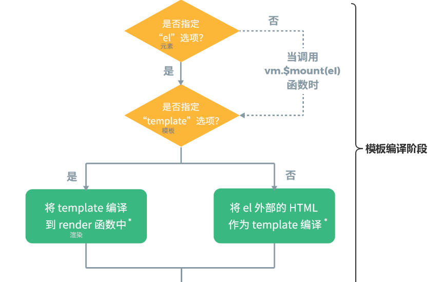
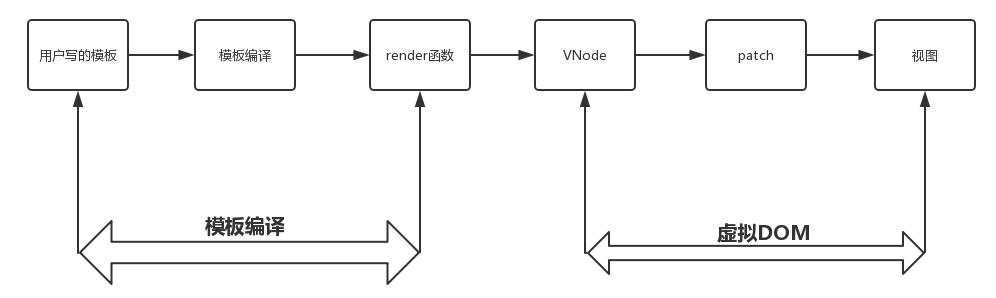
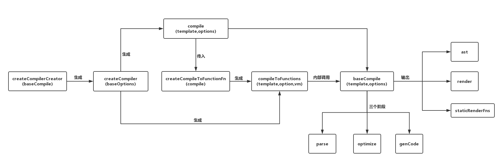
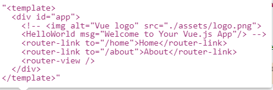
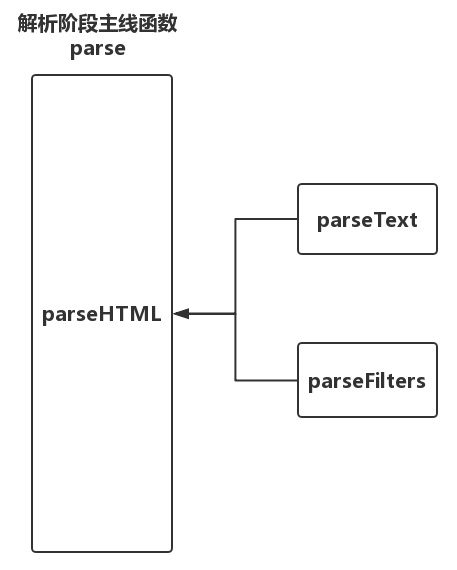
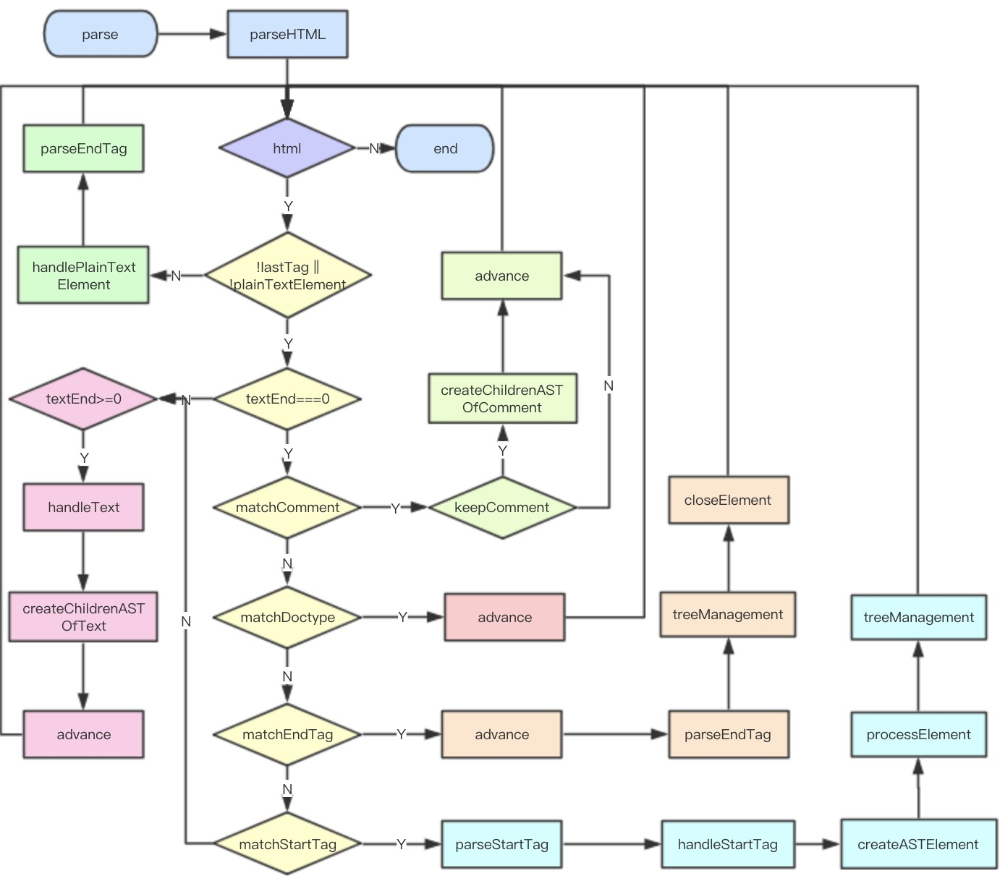
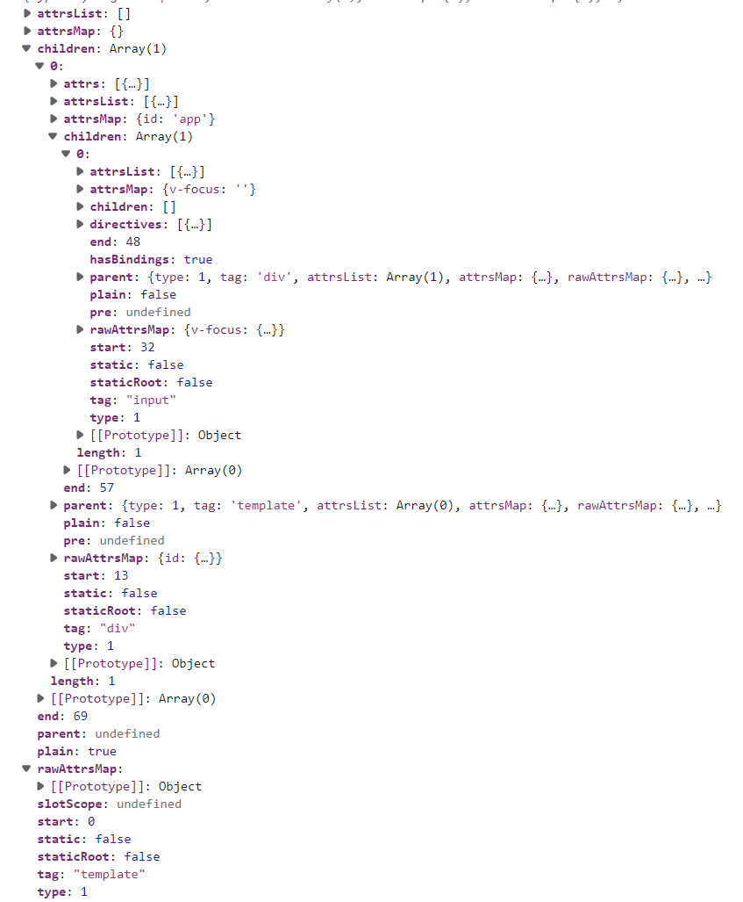

# 前言



vue 基于源码构建的有两个版本，一个是 runtime only(一个只包含运行时的版本)，另一个是 runtime + compiler(一个同时包含编译器和运行时的完整版本)。而两个版本的区别仅在于后者包含了一个编译器。

## 完整版本

- 完整版本

```js
new Vue({
  template:'<div></div>'
})
```

源码中，是先定义只包含运行时版本的$mount方法，再定义完整版本的$mount方法
`plantforms/web/runtime-with-compiler`

```js
const mount = Vue.prototype.$mount
Vue.prototype.$mount = function (
  el?: string | Element,
  hydrating?: boolean
): Component {
  el = el && query(el)
  /* istanbul ignore if */
  if (el === document.body || el === document.documentElement) {
    return this
  }

  const options = this.$options
  // resolve template/el and convert to render function
  if (!options.render) {
    let template = options.template
    if (template) {
      if (typeof template === 'string') {
        if (template.charAt(0) === '#') {
          template = idToTemplate(template)
          /* istanbul ignore if */
        }
      } else if (template.nodeType) {
        template = template.innerHTML
      } else {
        return this
      }
    } else if (el) {
      // @ts-expect-error
      template = getOuterHTML(el)
    }
    if (template) {
      /* istanbul ignore if */
      const { render, staticRenderFns } = compileToFunctions(
        template,
        {
          outputSourceRange: __DEV__,
          shouldDecodeNewlines,
          shouldDecodeNewlinesForHref,
          delimiters: options.delimiters,
          comments: options.comments
        },
        this
      )
      options.render = render
      options.staticRenderFns = staticRenderFns
    }
  }
  return mount.call(this, el, hydrating)
}


```

## 运行时

- 只包含运行时版本

```js
import App from "./App.vue";
new Vue({
  render (h) {
  
  }
})
```

**完整版和只包含运行时版之间的差异主要在于是否有模板编译阶段**
`运行时`

```js
Vue.prototype.$mount = function (
  el?: string | Element,
  hydrating?: boolean
): Component {
  el = el && inBrowser ? query(el) : undefined
  return mountComponent(this, el, hydrating)
}
```

# 流程




- 模板解析阶段：将一堆模板字符串用正则等方式解析成抽象语法树 AST；
- 优化阶段：遍历 AST，找出其中的静态节点，并打上标记；
- 代码生成阶段：将 AST 转换成渲染函数；

template -> compileToFunctions() ->

`template`



`src/platforms/web`

```js
const mount = Vue.prototype.$mount;
Vue.prototype.$mount = function (
  el?: string | Element,
  hydrating?: boolean
): Component {
  el = el && query(el);

  /* istanbul ignore if */
  if (el === document.body || el === document.documentElement) {
    return this;
  }

  const options = this.$options;
  // resolve template/el and convert to render function
  if (!options.render) {
    let template = options.template;
    // #id 或者是一个 DOM 元素
    // 转成一个字符串模板
    if (template) {
      if (typeof template === "string") {
        if (template.charAt(0) === "#") {
          template = idToTemplate(template);
        }
      } else if (template.nodeType) {
        template = template.innerHTML;
      } else {
        return this;
      }
    } else if (el) {
      // @ts-expect-error
      template = getOuterHTML(el);
    }

    if (template) {
      const { render, staticRenderFns } = compileToFunctions(
        template,
        {
          outputSourceRange: __DEV__,
          shouldDecodeNewlines,
          shouldDecodeNewlinesForHref,
          delimiters: options.delimiters,
          comments: options.comments,
        },
        this
      );
      options.render = render;
      options.staticRenderFns = staticRenderFns;
    }
  }
  return mount.call(this, el, hydrating);
};
```

处理各种不同写法的 template

```js
const idToTemplate = cached((id) => {
  const el = query(id);
  return el && el.innerHTML;
});

function getOuterHTML(el: Element): string {
  if (el.outerHTML) {
    return el.outerHTML;
  } else {
    const container = document.createElement("div");
    container.appendChild(el.cloneNode(true));
    return container.innerHTML;
  }
}
```

- 模板解析阶段——解析器——源码路径：src/compiler/parser/index.js;
- 优化阶段——优化器——源码路径：src/compiler/optimizer.js;
- 代码生成阶段——代码生成器——源码路径：src/compiler/codegen/index.js;

- `const ast =parse(template.trim(), options):`parse 会用正则等方式解析 template 模板中的指令、class、style 等数据，形成 AST。
- `optimize(ast, options):` optimize 的主要作用是标记静态节点，这是 Vue 在编译过程中的一处优化，挡在进行 patch 的过程中， DOM-Diff 算法会直接跳过静态节点，从而减少了比较的过程，优化了 patch 的性能。
- `const code =generate(ast, options)`: 将 AST 转化成 render 函数字符串的过程，得到结果是 render 函数 的字符串以及 staticRenderFns 字符串。

`src/compiler createCompilerCreator`

```js
//createCompiler 是 createCompilerCreator 的返回值
//createCompilerCreator 返回了一个 createCompiler 函数
//CompilerOptions 最终还是调用baseCompile
const createCompiler = createCompilerCreator(function baseCompile(
  template: string,
  options: CompilerOptions
): CompiledResult {
  const ast = parse(template.trim(), options);
  if (options.optimize !== false) {
    optimize(ast, options);
  }
  const code = generate(ast, options);
  return {
    ast,
    render: code.render,
    staticRenderFns: code.staticRenderFns,
  };
});

export const { compile, compileToFunctions } = createCompiler(baseOptions);
```

`src/compiler/create-compiler`

```js
export function createCompilerCreator(baseCompile: Function): Function {
  return function createCompiler(baseOptions: CompilerOptions) {
    function compile(
      template: string,
      options?: CompilerOptions
    ): CompiledResult {
      const finalOptions = Object.create(baseOptions)
      const errors: WarningMessage[] = []
      const tips: WarningMessage[] = []

      let warn = (
        msg: WarningMessage,
        range: { start: number; end: number },
        tip: string
      ) => {
        ;(tip ? tips : errors).push(msg)
      }

      if (options) {
        // merge custom modules
        if (options.modules) {
          finalOptions.modules = (baseOptions.modules || []).concat(
            options.modules
          )
        }
        // merge custom directives
        if (options.directives) {
          finalOptions.directives = extend(
            Object.create(baseOptions.directives || null),
            options.directives
          )
        }
        // copy other options
        for (const key in options) {
          if (key !== 'modules' && key !== 'directives') {
            finalOptions[key] = options[key as keyof CompilerOptions]
          }
        }
      }

      finalOptions.warn = warn

      const compiled = baseCompile(template.trim(), finalOptions)
      compiled.errors = errors
      compiled.tips = tips
      return compiled
    }

    return {
      compile,
      compileToFunctions: createCompileToFunctionFn(compile)
    }
  }
}


```

`src/compiler createCompileToFunctionFn`

```js
export function createCompileToFunctionFn(compile: Function): Function {
  const cache = Object.create(null);

  return function compileToFunctions(
    template: string,
    options?: CompilerOptions,
    vm?: Component
  ): CompiledFunctionResult {
    options = extend({}, options);
    const warn = options.warn || baseWarn;
    delete options.warn;

    // check cache
    const key = options.delimiters
      ? String(options.delimiters) + template
      : template;
    if (cache[key]) {
      return cache[key];
    }

    // compile
    const compiled = compile(template, options);

    // turn code into functions
    const res: any = {};
    const fnGenErrors: any[] = [];
    res.render = createFunction(compiled.render, fnGenErrors);
    res.staticRenderFns = compiled.staticRenderFns.map((code) => {
      return createFunction(code, fnGenErrors);
    });

    return (cache[key] = res);
  };
}
```

# parse



type 为 1 表示是普通元素，为 2 表示是表达式，为 3 表示是纯文本

```js
const ast = parse(template.trim(), options);
```

`parse`

```js
//将HTML模板字符串转化为AST
export function parse(template: string, options: CompilerOptions): ASTElement {
  //...
  // 一些配置的处理
  // 这个变量是比较重要的，通过这个栈暂存对 parseHTML 返回的结果
  const stack: any[] = [];
  parseHTML(template, {
    warn,
    expectHTML: options.expectHTML,
    isUnaryTag: options.isUnaryTag,
    canBeLeftOpenTag: options.canBeLeftOpenTag,
    shouldDecodeNewlines: options.shouldDecodeNewlines,
    shouldDecodeNewlinesForHref: options.shouldDecodeNewlinesForHref,
    shouldKeepComment: options.comments,
    outputSourceRange: options.outputSourceRange,
    // 当解析到开始标签时，调用该函数
    start(tag, attrs, unary, start, end) {},
    // 当解析到结束标签时，调用该函数
    end(tag, start, end) {},
    // 当解析到文本时，调用该函数
    chars(text: string, start?: number, end?: number) {},
    // 当解析到注释时，调用该函数
    comment(text: string, start, end) {},
  });
  return root;
}
```

# HTML 解析

流程
`parseHTML`
`parseStartTag`
`handleStartTag`
`start`

## parseHTML

```js
export function parseHTML(html, options: HTMLParserOptions) {
  const stack: any[] = []; // 维护AST节点层级的栈
  const expectHTML = options.expectHTML;
  const isUnaryTag = options.isUnaryTag || no;
  //用来检测一个标签是否是可以省略闭合标签的非自闭合标签
  const canBeLeftOpenTag = options.canBeLeftOpenTag || no;
  let index = 0; //解析游标，标识当前从何处开始解析模板字符串
  let last, // 存储剩余还未解析的模板字符串
    lastTag; // 存储着位于 stack 栈顶的元素
  while (html) {
    last = html;
    // 确保即将 parse 的内容不是在纯文本标签里 (script,style,textarea)
    if (!lastTag || !isPlainTextElement(lastTag)) {
      let textEnd = html.indexOf("<");
      /**
       * 如果html字符串是以'<'开头,则有以下几种可能
       * 开始标签:<div>
       * 结束标签:</div>
       * 注释:<!-- 我是注释 -->
       * 条件注释:<!-- [if !IE] --> <!-- [endif] -->
       * DOCTYPE:<!DOCTYPE html>
       * 需要一一去匹配尝试
       */

      if (textEnd === 0) {
        // Comment:
        //  /^<!\--/
        if (comment.test(html)) {
          const commentEnd = html.indexOf("-->");

          if (commentEnd >= 0) {
            if (options.shouldKeepComment && options.comment) {
              options.comment(
                html.substring(4, commentEnd),
                index,
                index + commentEnd + 3
              );
            }
            advance(commentEnd + 3);
            continue;
          }
        }
        //  /^<!\[/
        if (conditionalComment.test(html)) {
          const conditionalEnd = html.indexOf("]>");

          if (conditionalEnd >= 0) {
            advance(conditionalEnd + 2);
            continue;
          }
        }

        // Doctype:
        // /^<!DOCTYPE [^>]+>/i
        const doctypeMatch = html.match(doctype);
        if (doctypeMatch) {
          advance(doctypeMatch[0].length);
          continue;
        }

        // End tag:
        const endTagMatch = html.match(endTag);
        if (endTagMatch) {
          const curIndex = index;
          advance(endTagMatch[0].length);
          parseEndTag(endTagMatch[1], curIndex, index);
          continue;
        }

        // Start tag:
        const startTagMatch = parseStartTag();
        if (startTagMatch) {
          handleStartTag(startTagMatch);
          if (shouldIgnoreFirstNewline(startTagMatch.tagName, html)) {
            advance(1);
          }
          continue;
        }
      }

      let text, rest, next;
      if (textEnd >= 0) {
        rest = html.slice(textEnd);
        while (
          !endTag.test(rest) &&
          !startTagOpen.test(rest) &&
          !comment.test(rest) &&
          !conditionalComment.test(rest)
        ) {
          // < in plain text, be forgiving and treat it as text
          next = rest.indexOf("<", 1);
          if (next < 0) break;
          textEnd += next;
          rest = html.slice(textEnd);
        }
        text = html.substring(0, textEnd);
      }

      if (textEnd < 0) {
        text = html;
      }

      if (text) {
        advance(text.length);
      }

      if (options.chars && text) {
        options.chars(text, index - text.length, index);
      }
    } else {
    }
    //将整个字符串作为文本对待
    if (html === last) {
      options.chars && options.chars(html);
      break;
    }
  }

  // Clean up any remaining tags
  parseEndTag();

  function advance(n) {
    index += n;
    html = html.substring(n);
  }
  //第一件事是解析出开始标签名称；第二件事是解析出开始标签的属性
  function parseStartTag() {}
  //标签处理
  /*
     处理前
    [
      [' v-if="isShow"', 'v-if', '=', 'isShow', null, null],
      [' class="header"', 'class', '=', 'header', null, null]
    ]
     处理后
    [
      { name: 'v-if', value: 'isShow', start: 5, end: 18 },
      { name: 'class', value: 'header', start: 19, end: 33 }
    ]
      */
  function handleStartTag(match) {}
  //parse 结束标签
  function parseEndTag(tagName?: any, start?: any, end?: any) {}
}
```

## `parseStartTag`

```js
const ncname = "[a-zA-Z_][\\w\\-\\.]*";
const qnameCapture = `((?:${ncname}\\:)?${ncname})`;
const startTagOpen = new RegExp(`^<${qnameCapture}`);
const startTagClose = /^\s*(\/?)>/;

function parseStartTag() {
  const start = html.match(startTagOpen);
  // '<div></div>'.match(startTagOpen)  => ['<div','div',index:0,input:'<div></div>']
  if (start) {
    const match = {
      tagName: start[1],
      attrs: [],
      start: index,
    };
    advance(start[0].length);
    let end, attr;
    /**
     * <div a=1 b=2 c=3></div>
     * 从<div之后到开始标签的结束符号'>'之前，一直匹配属性attrs
     * 所有属性匹配完之后，html字符串还剩下
     * 自闭合标签剩下：'/>'
     * 非自闭合标签剩下：'></div>'
     */

    /*
    
    const attribute = /^\s*([^\s"'<>\/=]+)(?:\s*(=)\s*(?:"([^"]*)"+|'([^']*)'+|([^\s"'=<>`]+)))?/
    let html = 'class="a" id="b"></div>'
    let attr = html.match(attribute)
    console.log(attr)
    ["class="a"", "class", "=", "a", undefined, undefined, index: 0, input: "class="a" id="b"></div>", groups: undefined]
    
    */
    while (
      !(end = html.match(startTagClose)) &&
      (attr = html.match(attribute))
    ) {
      advance(attr[0].length);
      match.attrs.push(attr);
    }

    /**
     * 这里判断了该标签是否为自闭合标签
     * 自闭合标签如:<input type='text' />
     * 非自闭合标签如:<div></div>
     * const startTagClose = /^\s*(\/?)>/
     * let end = html.match(startTagClose)
     * '></div>'.match(startTagClose) => [">", "", index: 0, input: "></div>", groups: undefined]
     * '/><div></div>'.match(startTagClose) => ["/>", "/", index: 0, input: "/><div></div>", groups: undefined]
     * 因此，我们可以通过end[1]是否是"/"来判断该标签是否是自闭合标签
     */
    if (end) {
      match.unarySlash = end[1];
      advance(end[0].length);
      match.end = index;
      return match;
    }
  }
}
```

## handleStartTag

```js
function handleStartTag(match) {
  // 开始标签的标签名
  const tagName = match.tagName;
  // 是否为自闭合标签的标志，自闭合为"",非自闭合为"/"
  const unarySlash = match.unarySlash;

  if (expectHTML) {
    if (lastTag === "p" && isNonPhrasingTag(tagName)) {
      parseEndTag(lastTag);
    }
    if (canBeLeftOpenTag(tagName) && lastTag === tagName) {
      parseEndTag(tagName);
    }
  }
  // 布尔值，标志是否为自闭合标签
  const unary = isUnaryTag(tagName) || !!unarySlash;
  // match.attrs 数组的长度
  const l = match.attrs.length;
  // 一个与match.attrs数组长度相等的数组
  const attrs: ASTAttr[] = new Array(l);

  for (let i = 0; i < l; i++) {
    const args = match.attrs[i];
    //const args = ["class="a"", "class", "=", "a", undefined, undefined, index: 0, input: "class="a" id="b"></div>", groups: undefined]
    const value = args[3] || args[4] || args[5] || "";
    const shouldDecodeNewlines =
      tagName === "a" && args[1] === "href"
        ? options.shouldDecodeNewlinesForHref
        : options.shouldDecodeNewlines;
    attrs[i] = {
      name: args[1],
      value: decodeAttr(value, shouldDecodeNewlines),
    };
  }

  if (!unary) {
    stack.push({
      tag: tagName,
      lowerCasedTag: tagName.toLowerCase(),
      attrs: attrs,
      start: match.start,
      end: match.end,
    });
    lastTag = tagName;
  }

  if (options.start) {
    options.start(tagName, attrs, unary, match.start, match.end);
  }
}
```

## start

```js
    start(tag, attrs, unary, start, end) {
      // check namespace.
      // inherit parent ns if there is one
      const ns =
        (currentParent && currentParent.ns) || platformGetTagNamespace(tag)

      // handle IE svg bug
      /* istanbul ignore if */
      if (isIE && ns === 'svg') {
        attrs = guardIESVGBug(attrs)
      }

      let element: ASTElement = createASTElement(tag, attrs, currentParent)
      /*
      export function createASTElement (tag,attrs,parent) {
        return {
          type: 1,
          tag,
          attrsList: attrs,
          attrsMap: makeAttrsMap(attrs),
          parent,
          children: []
        }
      }

      */
      if (ns) {
        element.ns = ns
      }

      if (isForbiddenTag(element) && !isServerRendering()) {
        element.forbidden = true
      }

      // apply pre-transforms
      for (let i = 0; i < preTransforms.length; i++) {
        element = preTransforms[i](element, options) || element
      }

      if (!inVPre) {
        processPre(element)
        if (element.pre) {
          inVPre = true
        }
      }
      if (platformIsPreTag(element.tag)) {
        inPre = true
      }
      if (inVPre) {
        processRawAttrs(element)
      } else if (!element.processed) {
        // structural directives
        processFor(element)
        processIf(element)
        processOnce(element)
      }

      if (!root) {
        root = element
        if (__DEV__) {
          checkRootConstraints(root)
        }
      }

      if (!unary) {
        // 指定当前父元素
        // end 出栈的时候 会重新指定
        currentParent = element
        stack.push(element)
      } else {
        closeElement(element)
      }
    },
```

# 文本解析

```js

    chars(text: string, start?: number, end?: number) {
      if (!currentParent) {
        return
      }
      // IE textarea placeholder bug
      /* istanbul ignore if */
      if (
        isIE &&
        currentParent.tag === 'textarea' &&
        currentParent.attrsMap.placeholder === text
      ) {
        return
      }
      //start push element 会将 currentParent => element
      const children = currentParent.children
      if (inPre || text.trim()) {
        text = isTextTag(currentParent)
          ? text
          : (decodeHTMLCached(text) as string)
      } else if (!children.length) {
        // remove the whitespace-only node right after an opening tag
        text = ''
      } else if (whitespaceOption) {
        if (whitespaceOption === 'condense') {
          // in condense mode, remove the whitespace node if it contains
          // line break, otherwise condense to a single space
          text = lineBreakRE.test(text) ? '' : ' '
        } else {
          text = ' '
        }
      } else {
        text = preserveWhitespace ? ' ' : ''
      }
      if (text) {
        if (!inPre && whitespaceOption === 'condense') {
          // condense consecutive whitespaces into single space
          text = text.replace(whitespaceRE, ' ')
        }
        let res
        let child: ASTNode | undefined
        if (!inVPre && text !== ' ' && (res = parseText(text, delimiters))) {
          child = {
            type: 2,
            expression: res.expression,
            tokens: res.tokens,
            text
          }
        } else if (
          text !== ' ' ||
          !children.length ||
          children[children.length - 1].text !== ' '
        ) {
          child = {
            type: 3,
            text
          }
        }
        if (child) {
          children.push(child)
        }
      }
    },
```

```js
//text = "我叫{{name}}，我今年{{age}}岁了"
let res = parseText(text)
res = {
    expression:"我叫"+_s(name)+"，我今年"+_s(age)+"岁了",
    tokens:[
        "我叫",
        {'@binding': name },
        "，我今年"
        {'@binding': age },
     "岁了"
    ]
}
```

## parseText

- 判断传入的文本是否包含变量
- 构造 expression
- 构造 tokens

```js
const defaultTagRE = /\{\{((?:.|\n)+?)\}\}/g;
const buildRegex = cached((delimiters) => {
  const open = delimiters[0].replace(regexEscapeRE, "\\$&");
  const close = delimiters[1].replace(regexEscapeRE, "\\$&");
  return new RegExp(open + "((?:.|\\n)+?)" + close, "g");
});
export function parseText(text, delimiters) {
  const tagRE = delimiters ? buildRegex(delimiters) : defaultTagRE;
  if (!tagRE.test(text)) {
    return;
  }
  const tokens = [];
  const rawTokens = [];
  /**
   * let lastIndex = tagRE.lastIndex = 0
   * 上面这行代码等同于下面这两行代码:
   * tagRE.lastIndex = 0
   * let lastIndex = tagRE.lastIndex
   */
  let lastIndex = (tagRE.lastIndex = 0);
  let match, index, tokenValue;
  while ((match = tagRE.exec(text))) {
    index = match.index;
    // push text token
    if (index > lastIndex) {
      // 先把'{{'前面的文本放入tokens中
      rawTokens.push((tokenValue = text.slice(lastIndex, index)));
      tokens.push(JSON.stringify(tokenValue));
    }
    // tag token
    // 取出'{{ }}'中间的变量exp
    const exp = parseFilters(match[1].trim());
    // 把变量exp改成_s(exp)形式也放入tokens中
    tokens.push(`_s(${exp})`);
    rawTokens.push({ "@binding": exp });
    // 设置lastIndex 以保证下一轮循环时，只从'}}'后面再开始匹配正则
    lastIndex = index + match[0].length;
  }
  // 当剩下的text不再被正则匹配上时，表示所有变量已经处理完毕
  // 此时如果lastIndex < text.length，表示在最后一个变量后面还有文本
  // 最后将后面的文本再加入到tokens中
  if (lastIndex < text.length) {
    rawTokens.push((tokenValue = text.slice(lastIndex)));
    tokens.push(JSON.stringify(tokenValue));
  }

  // 最后把数组tokens中的所有元素用'+'拼接起来
  return {
    expression: tokens.join("+"),
    tokens: rawTokens,
  };
}
```

# optimize

在优化阶段将所有静态节点都打上标记，这样在 patch 过程中就可以跳过对比这些节点。

- 在 AST 中找出所有静态节点并打上标记；
- 在 AST 中找出所有静态根节点并打上标记；

```js
export function optimize(
  root: ASTElement | null | undefined,
  options: CompilerOptions
) {
  if (!root) return;
  isStaticKey = genStaticKeysCached(options.staticKeys || "");
  isPlatformReservedTag = options.isReservedTag || no;
  // 标记静态节点
  markStatic(root);
  // 标记静态根节点
  markStaticRoots(root, false);
}
```

## markStatic

**从根节点开始，先标记根节点是否为静态节点，然后看根节点如果是元素节点，那么就去向下递归它的子节点，子节点如果还有子节点那就继续向下递归，直到标记完所有节点。**

```js
function markStatic(node: ASTNode) {
  node.static = isStatic(node);
  if (node.type === 1) {
    // do not make component slot content static. this avoids
    // 1. components not able to mutate slot nodes
    // 2. static slot content fails for hot-reloading
    if (
      !isPlatformReservedTag(node.tag) &&
      node.tag !== "slot" &&
      node.attrsMap["inline-template"] == null
    ) {
      return;
    }
    for (let i = 0, l = node.children.length; i < l; i++) {
      const child = node.children[i];
      markStatic(child);
      if (!child.static) {
        node.static = false;
      }
    }
    if (node.ifConditions) {
      for (let i = 1, l = node.ifConditions.length; i < l; i++) {
        const block = node.ifConditions[i].block;
        markStatic(block);
        if (!block.static) {
          node.static = false;
        }
      }
    }
  }
}
```

| type 取值 |  对应的 AST 节点类型   |
| --------- | :--------------------: |
| 1         |        元素节点        |
| 2         | 包含变量的动态文本节点 |
| 3         | 不包含变量的纯文本节点 |

- 如果节点使用了 v-pre 指令，那就断定它是静态节点；
- 如果节点没有使用 v-pre 指令，那它要成为静态节点必须满足：
  - 不能使用动态绑定语法，即标签上不能有 v-、@、:开头的属性；
  - 不能使用 v-if、v-else、v-for 指令；
  - 不能是内置组件，即标签名不能是 slot 和 component；
  - 标签名必须是平台保留标签，即不能是组件；
  - 当前节点的父节点不能是带有 v-for 的 template 标签；
  - 节点的所有属性的 key 都必须是静态节点才有的 key，注：静态节点的 key 是有限的，它只能是 type,tag,attrsList,attrsMap,plain,parent,children,attrs 之一；

```js
function isStatic(node: ASTNode): boolean {
  if (node.type === 2) {
    // 包含变量的动态文本节点
    return false;
  }
  if (node.type === 3) {
    // 不包含变量的纯文本节点
    return true;
  }
  return !!(
    node.pre ||
    (!node.hasBindings && // no dynamic bindings
      !node.if &&
      !node.for && // not v-if or v-for or v-else
      !isBuiltInTag(node.tag) && // not a built-in
      isPlatformReservedTag(node.tag) && // not a component
      !isDirectChildOfTemplateFor(node) &&
      Object.keys(node).every(isStaticKey))
  );
}
```

## markStaticRoots

- 节点本身必须是静态节点；
- 必须拥有子节点 children；
- 子节点不能只是只有一个文本节点；
  否则的话，对它的优化成本将大于优化后带来的收益。

```js
function markStaticRoots(node: ASTNode, isInFor: boolean) {
  if (node.type === 1) {
    if (node.static || node.once) {
      node.staticInFor = isInFor;
    }
    // For a node to qualify as a static root, it should have children that
    // are not just static text. Otherwise the cost of hoisting out will
    // outweigh the benefits and it's better off to just always render it fresh.
    if (
      node.static &&
      node.children.length &&
      !(node.children.length === 1 && node.children[0].type === 3)
    ) {
      node.staticRoot = true;
      return;
    } else {
      node.staticRoot = false;
    }
    if (node.children) {
      for (let i = 0, l = node.children.length; i < l; i++) {
        markStaticRoots(node.children[i], isInFor || !!node.for);
      }
    }
    if (node.ifConditions) {
      for (let i = 1, l = node.ifConditions.length; i < l; i++) {
        markStaticRoots(node.ifConditions[i].block, isInFor);
      }
    }
  }
}
```

# generate

AST => render
`template`

```html
<template>
  <div id="app">
    <input v-focus />
  </div>
</template>
```

`AST`
  
`render`

```js
_c("div", { attrs: { id: "app" } }, [
  _c("input", { directives: [{ name: "focus", rawName: "v-focus" }] }),
]);
```

```js
const code = generate(ast, options);
return { render: code.render };
```

```js
export function generate(
  ast: ASTElement | void,
  options: CompilerOptions
): CodegenResult {
  const state = new CodegenState(options);
  const code = ast ? genSSRElement(ast, state) : '_c("div")';
  return {
    render: `with(this){return ${code}}`,
    staticRenderFns: state.staticRenderFns,
  };
}
```

```js
function genSSRElement(el: ASTElement, state: CodegenState): string {
  if (el.for && !el.forProcessed) {
    return genFor(el, state, genSSRElement);
  } else if (el.if && !el.ifProcessed) {
    return genIf(el, state, genSSRElement);
  } else if (el.tag === "template" && !el.slotTarget) {
    return el.ssrOptimizability === optimizability.FULL
      ? genChildrenAsStringNode(el, state)
      : genSSRChildren(el, state) || "void 0";
  }

  switch (el.ssrOptimizability) {
    case optimizability.FULL:
      // stringify whole tree
      return genStringElement(el, state);
    case optimizability.SELF:
      // stringify self and check children
      return genStringElementWithChildren(el, state);
    case optimizability.CHILDREN:
      // generate self as VNode and stringify children
      return genNormalElement(el, state, true);
    case optimizability.PARTIAL:
      // generate self as VNode and check children
      return genNormalElement(el, state, false);
    default:
      // bail whole tree
      return genElement(el, state);
  }
}
```

`genElement`

```js
export function genElement(el: ASTElement, state: CodegenState): string {
  if (el.parent) {
    el.pre = el.pre || el.parent.pre;
  }

  if (el.staticRoot && !el.staticProcessed) {
    return genStatic(el, state);
  } else if (el.once && !el.onceProcessed) {
    return genOnce(el, state);
  } else if (el.for && !el.forProcessed) {
    return genFor(el, state);
  } else if (el.if && !el.ifProcessed) {
    return genIf(el, state);
  } else if (el.tag === "template" && !el.slotTarget && !state.pre) {
    return genChildren(el, state) || "void 0";
  } else if (el.tag === "slot") {
    return genSlot(el, state);
  } else {
    // component or element
    let code;
    if (el.component) {
      code = genComponent(el.component, el, state);
    } else {
      let data;
      if (!el.plain || (el.pre && state.maybeComponent(el))) {
        data = genData(el, state);
      }

      let tag: string | undefined;
      // check if this is a component in <script setup>
      const bindings = state.options.bindings;
      if (bindings && bindings.__isScriptSetup !== false) {
        tag =
          checkBindingType(bindings, el.tag) ||
          checkBindingType(bindings, camelize(el.tag)) ||
          checkBindingType(bindings, capitalize(camelize(el.tag)));
      }
      if (!tag) tag = `'${el.tag}'`;

      const children = el.inlineTemplate ? null : genChildren(el, state, true);
      code = `_c(${tag}${
        data ? `,${data}` : "" // data
      }${
        children ? `,${children}` : "" // children
      })`;
    }
    // module transforms
    for (let i = 0; i < state.transforms.length; i++) {
      code = state.transforms[i](el, code);
    }
    return code;
  }
}
```
