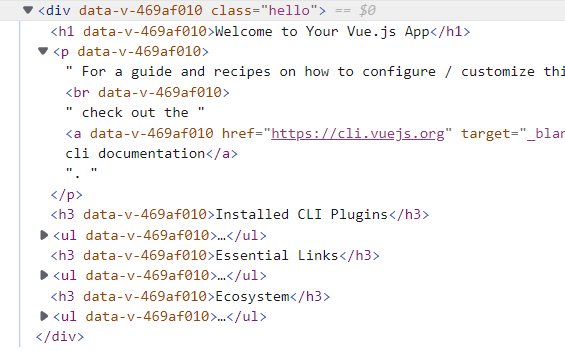

```css
.hello[data-v-469af010] {
  background-color: red;
}
```

## 用法

### Scoped CSS

当 `<style>` 标签有 `scoped` 属性时，它的 CSS 只作用于当前组件中的元素。这类似于 Shadow DOM 中的样式封装。它有一些注意事项，但不需要任何 polyfill。它通过使用 PostCSS 来实现以下转换：

```html
<style scoped>
  .example {
    color: red;
  }
</style>

<template>
  <div class="example">hi</div>
</template>
```

转换结果：

```html
<style>
  .example[data-v-f3f3eg9] {
    color: red;
  }
</style>

<template>
  <div class="example" data-v-f3f3eg9>hi</div>
</template>
```

### 混用本地和全局样式

你可以在一个组件中同时使用有 scoped 和非 scoped 样式：

```html
<style>
  /* 全局样式 */
</style>

<style scoped>
  /* 本地样式 */
</style>
```

#### 子组件的根元素

使用 `scoped` 后，父组件的样式将不会渗透到子组件中。不过一个子组件的根节点会同时受其父组件的 scoped CSS 和子组件的 scoped CSS 的影响。这样设计是为了让父组件可以从布局的角度出发，调整其子组件根元素的样式。

#### 深度作用选择器

如果你希望 `scoped` 样式中的一个选择器能够作用得“更深”，例如影响子组件，你可以使用 `>>>` 操作符：

```html
<style scoped>
  .a >>> .b {
    /* ... */
  }
</style>
```

上述代码将会编译成：

```css
.a[data-v-f3f3eg9] .b {
  /* ... */
}
```

有些像 Sass 之类的预处理器无法正确解析 `>>>`。这种情况下你可以使用 `/deep/` 或 `::v-deep` 操作符取而代之——两者都是 `>>>` 的别名，同样可以正常工作。

### 动态生成的内容

通过 `v-html` 创建的 DOM 内容不受 scoped 样式影响，但是你仍然可以通过深度作用选择器来为他们设置样式。

### 还有一些要留意

- **Scoped 样式不能代替 class**。考虑到浏览器渲染各种 CSS 选择器的方式，当 `p { color: red }` 是 scoped 时 (即与特性选择器组合使用时) 会慢很多倍。如果你使用 class 或者 id 取而代之，比如 `.example { color: red }`，性能影响就会消除。

- **在递归组件中小心使用后代选择器!** 对选择器 `.a .b` 中的 CSS 规则来说，如果匹配 `.a` 的元素包含一个递归子组件，则所有的子组件中的 `.b` 都将被这个规则匹配。

## template 处理

```js
// lib/index
// module id for scoped CSS & hot-reload
const rawShortFilePath = path
  .relative(context, resourcePath)
  .replace(/^(\.\.[\/\\])+/, "");

const shortFilePath = rawShortFilePath.replace(/\\/g, "/") + resourceQuery;

// 生成 id
const id = hash(
  isProduction
    ? shortFilePath + "\n" + source.replace(/\r\n/g, "\n")
    : shortFilePath
);

// 遍历 style 标签判断是否有scoped
const hasScoped = descriptor.styles.some((s) => s.scoped);

let templateImport = `var render, staticRenderFns`;
let templateRequest;
if (descriptor.template) {
  const src = descriptor.template.src || resourcePath;
  const idQuery = `&id=${id}`;
  const scopedQuery = hasScoped ? `&scoped=true` : ``;
  const attrsQuery = attrsToQuery(descriptor.template.attrs);
  const query = `?vue&type=template${idQuery}${scopedQuery}${attrsQuery}${inheritQuery}`;
  const request = (templateRequest = stringifyRequest(src + query));
  templateImport = `import { render, staticRenderFns } from ${request}`;
  //import { render, staticRenderFns } from "./HelloWorld.vue?vue&type=template&id=469af010&scoped=true&"
  //  pitcher loader匹配?vue
}
```

### pitcher loader

`li/loaders/pitcher`

```js
if (query.type === `template`) {
  const path = require("path");
  const cacheLoader =
    cacheDirectory && cacheIdentifier
      ? [
          `${require.resolve("cache-loader")}?${JSON.stringify({
            // For some reason, webpack fails to generate consistent hash if we
            // use absolute paths here, even though the path is only used in a
            // comment. For now we have to ensure cacheDirectory is a relative path.
            cacheDirectory: (path.isAbsolute(cacheDirectory)
              ? path.relative(process.cwd(), cacheDirectory)
              : cacheDirectory
            ).replace(/\\/g, "/"),
            cacheIdentifier: hash(cacheIdentifier) + "-vue-loader-template",
          })}`,
        ]
      : [];

  const preLoaders = loaders.filter(isPreLoader);
  const postLoaders = loaders.filter(isPostLoader);

  const request = genRequest([
    ...cacheLoader,
    ...postLoaders,
    templateLoaderPath + `??vue-loader-options`,
    ...preLoaders,
  ]);
  // console.log(request)
  // the template compiler uses esm exports
  console.log(`export * from ${request}`, "template");
  return `export * from ${request}`;
}
```

### templateLoaderPath

```js
// vue-template-compiler 把 template 转换为render函数
const compiler = options.compiler || require("vue-template-compiler");
const compilerOptions = Object.assign(
  {
    outputSourceRange: true,
  },
  options.compilerOptions,
  {
    scopeId: query.scoped ? `data-v-${id}` : null,
    comments: query.comments,
  }
);
```

## style 处理

### vue-loader

```js
let stylesCode = ``;
if (descriptor.styles.length) {
  stylesCode = genStylesCode(
    loaderContext,
    descriptor.styles,
    id,
    resourcePath,
    stringifyRequest,
    needsHotReload,
    isServer || isShadow // needs explicit injection?
  );
}
// import style0 from "./HelloWorld.vue?vue&type=style&index=0&id=469af010&scoped=true&lang=css&"
```

::: details genStylesCode

```js
const genStylesCode = require("./codegen/styleInjection");
module.exports = function genStyleInjectionCode(
  loaderContext,
  styles,
  id,
  resourcePath,
  stringifyRequest,
  needsHotReload,
  needsExplicitInjection
) {
  let styleImportsCode = ``;
  let styleInjectionCode = ``;
  let cssModulesHotReloadCode = ``;

  let hasCSSModules = false;
  const cssModuleNames = new Map();

  function genStyleRequest(style, i) {
    const src = style.src || resourcePath;
    const attrsQuery = attrsToQuery(style.attrs, "css");
    const inheritQuery = `&${loaderContext.resourceQuery.slice(1)}`;
    // make sure to only pass id when necessary so that we don't inject
    // duplicate tags when multiple components import the same css file
    const idQuery = style.scoped ? `&id=${id}` : ``;
    const query = `?vue&type=style&index=${i}${idQuery}${attrsQuery}${inheritQuery}`;
    return stringifyRequest(src + query);
  }
};
```

:::

### pitch loader

```js
if (query.type === `style`) {
  const cssLoaderIndex = loaders.findIndex(isCSSLoader);
  if (cssLoaderIndex > -1) {
    const afterLoaders = loaders.slice(0, cssLoaderIndex + 1);
    const beforeLoaders = loaders.slice(cssLoaderIndex + 1);
    const request = genRequest([
      ...afterLoaders,
      stylePostLoaderPath,
      ...beforeLoaders,
    ]);
    console.log(
      query.module
        ? `export { default } from  ${request}; export * from ${request}`
        : `export * from ${request}`,
      "request -- style"
    );
    return query.module
      ? `export { default } from  ${request}; export * from ${request}`
      : `export * from ${request}`;
  }
}
```

### stylePostLoader

```js
const qs = require("querystring");
const { compileStyle } = require("@vue/component-compiler-utils");

// This is a post loader that handles scoped CSS transforms.
// Injected right before css-loader by the global pitcher (../pitch.js)
// for any <style scoped> selection requests initiated from within vue files.
module.exports = function (source, inMap) {
  const query = qs.parse(this.resourceQuery.slice(1));
  const { code, map, errors } = compileStyle({
    source,
    filename: this.resourcePath,
    id: `data-v-${query.id}`,
    map: inMap,
    scoped: !!query.scoped,
    trim: true,
  });

  if (errors.length) {
    this.callback(errors[0]);
  } else {
    this.callback(null, code, map);
  }
};
```
