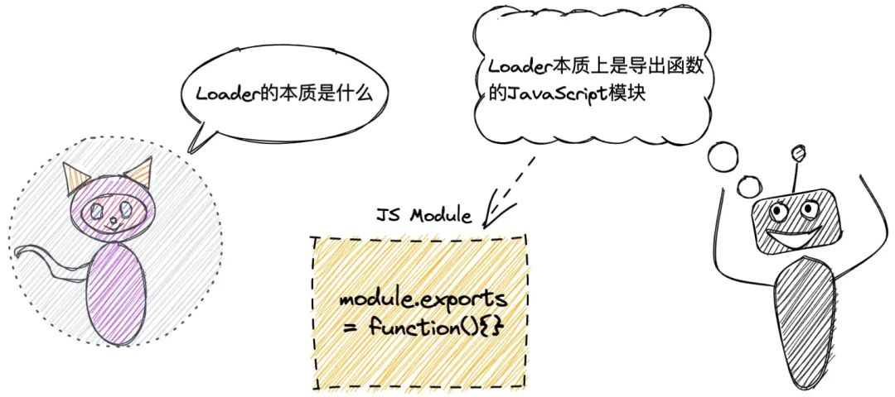
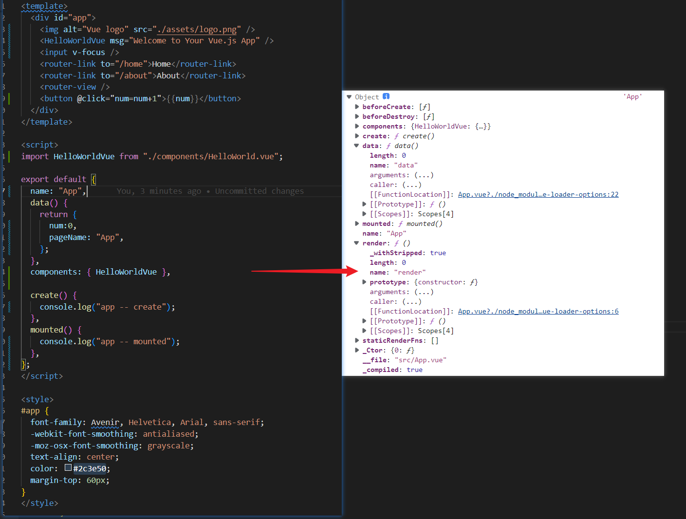
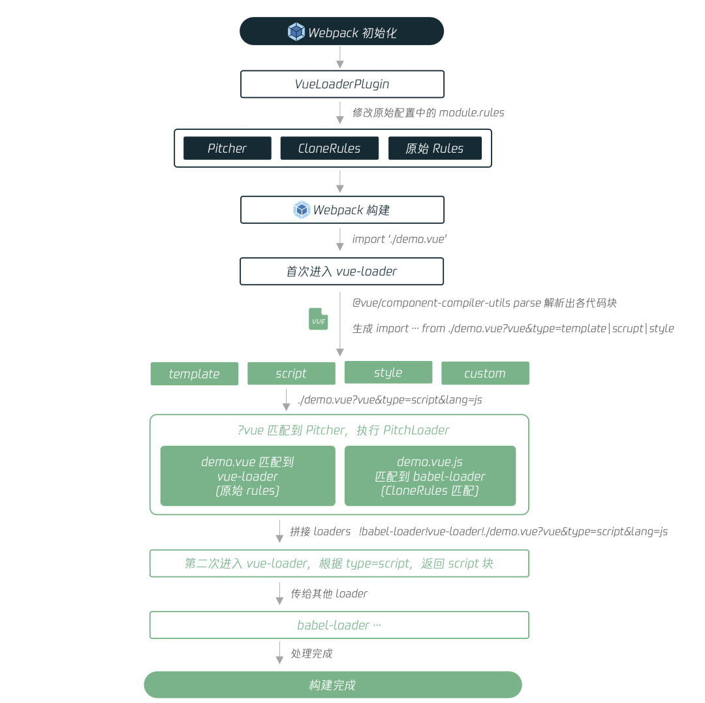
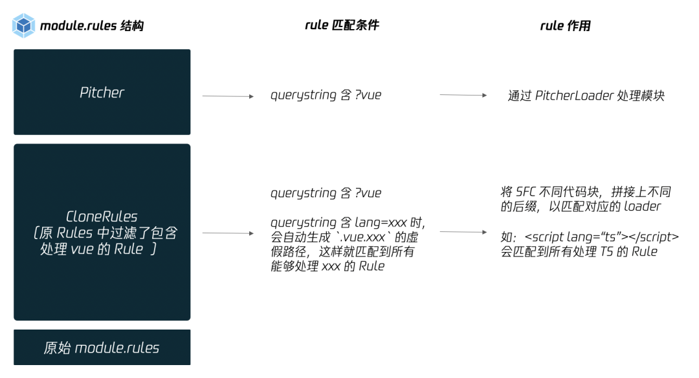
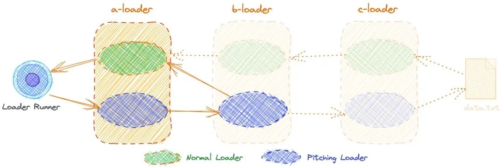
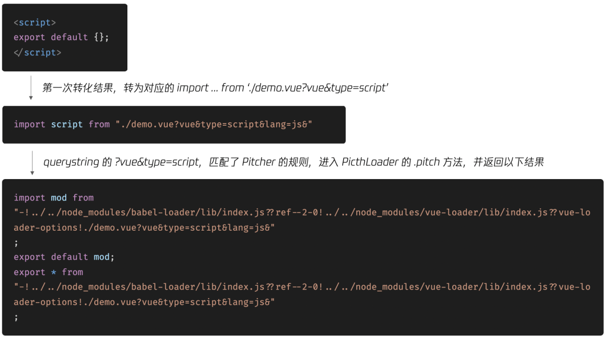
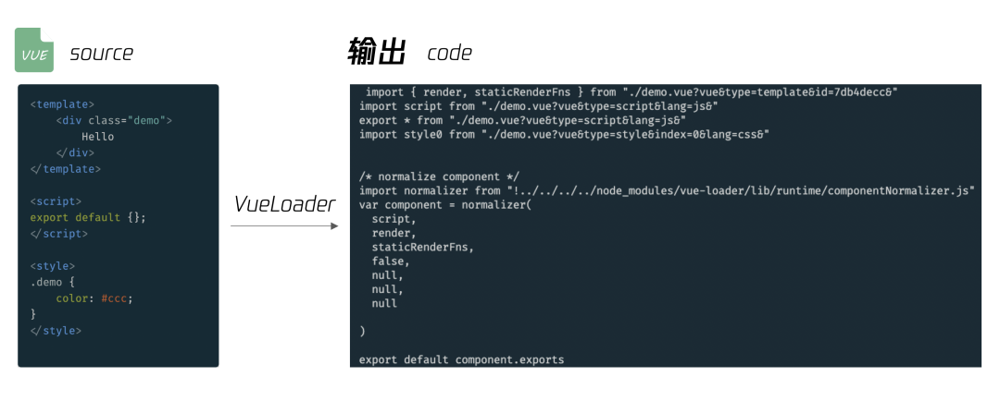

  



# loader 执行顺序

先左到右执行 loader 上的 pitch 方法
在右到左执行 loader

# vue-loader

```js
const { parse } = require("@vue/component-compiler-utils");
module.exports = function (source) {
  //....
  const descriptor = parse({
    source,
    compiler: options.compiler || loadTemplateCompiler(loaderContext),
    filename,
    sourceRoot,
    needMap: sourceMap,
  });
  /**
  descriptor {
    template: { ... },
    script: { ... },
    styles: [ ... ],
    customBlocks: [],
    errors: []
  }
  */
  // ....
};
```

`console.log(descriptor)`
<el-collapse>
<el-collapse-item title="console.log(descriptor)" name="1">
</el-collapse-item>
</el-collapse>

```js
  template: {
    type: 'template',
    content: '\n' +
      '<div class="hello">\n' +
      '  <h1>{{ msg }}</h1>\n' +
      '  <p>\n' +
      '    For a guide and recipes on how to configure / customize this project,<br>\n' +
      '    check out the\n' +
      '    <a href="https://cli.vuejs.org" target="_blank" rel="noopener">vue-cli documentation</a>.\n' +
      '  </p>\n' +
      '  <h3>Installed CLI Plugins</h3>\n' +
      '  <ul>\n' +
      '    <li><a href="https://github.com/vuejs/vue-cli/tree/dev/packages/%40vue/cli-plugin-babel" target="_blank" rel="noopener">babel</a></li>\n' +
      '    <li><a href="https://github.com/vuejs/vue-cli/tree/dev/packages/%40vue/cli-plugin-eslint" target="_blank" rel="noopener">eslint</a></li>\n' +
      '  </ul>\n' +
      '  <h3>Essential Links</h3>\n' +
      '  <ul>\n' +
      '    <li><a href="https://vuejs.org" target="_blank" rel="noopener">Core Docs</a></li>\n' +
      '    <li><a href="https://forum.vuejs.org" target="_blank" rel="noopener">Forum</a></li>\n' +
      '    <li><a href="https://chat.vuejs.org" target="_blank" rel="noopener">Community Chat</a></li>\n' +
      '    <li><a href="https://twitter.com/vuejs" target="_blank" rel="noopener">Twitter</a></li>\n' +
      '    <li><a href="https://news.vuejs.org" target="_blank" rel="noopener">News</a></li>\n' +
      '  </ul>\n' +
      '  <h3>Ecosystem</h3>\n' +
      '  <ul>\n' +
      '    <li><a href="https://router.vuejs.org" target="_blank" rel="noopener">vue-router</a></li>\n' +
      '    <li><a href="https://vuex.vuejs.org" target="_blank" rel="noopener">vuex</a></li>\n' +
      '    <li><a href="https://github.com/vuejs/vue-devtools#vue-devtools" target="_blank" rel="noopener">vue-devtools</a></li>\n' +
      '    <li><a href="https://vue-loader.vuejs.org" target="_blank" rel="noopener">vue-loader</a></li>\n' +
      '    <li><a href="https://github.com/vuejs/awesome-vue" target="_blank" rel="noopener">awesome-vue</a></li>\n' +
      '  </ul>\n' +
      '</div>\n',
    start: 10,
    attrs: {},
    end: 1681
  },
  script: {
    type: 'script',
    content: '//\n' +
      'export default {\n' +
      "  name: 'HelloWorld',\n" +
      '  props: {\n' +
      '    msg: String\n' +
      '  },\n' +
      '    data(){\n' +
      '    return {\n' +
      "      pageName:'App'\n" +
      '    }\n' +
      '  },\n' +
      '  create(){\n' +
      "      console.log('helloWorld --create')\n" +
      '  },\n' +
      '  mounted(){\n' +
      "    console.log('app -- mounted')\n" +
      '  }\n' +
      '}\n',
    start: 1702,
    attrs: {},
    end: 1942
  },
  styles: [
    {
      type: 'style',
      content: '\n' +
        'h3 {\n' +
        '  margin: 40px 0 0;\n' +
        '}\n' +
        'ul {\n' +
        '  list-style-type: none;\n' +
        '  padding: 0;\n' +
        '}\n' +
        'li {\n' +
        '  display: inline-block;\n' +
        '  margin: 0 10px;\n' +
        '}\n' +
        'a {\n' +
        '  color: #42b983;\n' +
        '}\n',
      start: 2035,
      attrs: [Object],
      scoped: true,
      end: 2183
    }
  ],
  customBlocks: [],
  errors: [ 'tag <br> has no matching end tag.' ]

```

```js
let templateImport = `var render, staticRenderFns`;
let templateRequest;
if (descriptor.template) {
  // ....
  templateImport = `import { render, staticRenderFns } from ${request}`;
}

// script
let scriptImport = `var script = {}`;
if (descriptor.script) {
  // ....
  scriptImport = `import script from ${request}\n` + `export * from ${request}`; // support named exports
}

// styles
let stylesCode = ``;
if (descriptor.styles.length) {
  // ....
}
let code = `
${templateImport}
${scriptImport}
${stylesCode}
// ...
`;
console.log(code);
/*
import render from 'app.vue?vue&type=template'

import script from 'app.vue?vue&type=script'
export * from 'app.vue?vue&type=script'

import 'app.vue?vue&type=style&index=1'
script.render = render
export default script

*/
```

# VueLoaderPlugin

Plugin 的作用，主要有以下两条：

- 能够 hook 到在每个编译(compilation)中触发的所有关键事件。
- 在插件实例的 apply 方法中，可以通过 compiler.options 获取 Webpack 配置，并进行修改。

```js

class VueLoaderPlugin {
  apply (compiler) {
    // 对 Webpack 配置进行修改
    const rawRules = compiler.options.module.rules;
    const { rules } = new RuleSet(rawRules);
    ...

    // pitcher
    const pitcher = {
      loader: require.resolve('./loaders/pitcher'),
      resourceQuery: query => {
        if (!query) { return false }
        const parsed = qs.parse(query.slice(1))
        // 匹配第一个查询条件是否是 vue
        return parsed.vue != null
      },
      options: { ... }
    }

    // 替换初始 module.rules，在原有 rule 上，增加 pitcher、clonedRules
    compiler.options.module.rules = [
       pitcher,
       ...clonedRules,
       ...rules
     ];
  }
}

```



# pitchLoader



| 提示：Webpack 内部会使用 loader-runner 这个库来运行已配置的 loaders。



```js

// vue-loader lib/loaders/pitcher.js

// PitcherLoader.pitch 方法，所有带 ?vue 的模块请求，都会走到这里
module.exports.pitch = function (remainingRequest) {
  // 如 ./demo?vue&type=script&lang=js
  // 此时，loaders 是所有能处理 .vue 和 .xxx 的 loader 列表
  let loaders = this.loaders;
  ...
  // 得到 -!babel-loader!vue-loader!
  const genRequest = loaders => { ... };

  // 处理 style 块 和 template 块，支持
  if (query.type === 'style') { ... }
  if (query.type === 'template') { ... }

  // 处理 script 块和 custom 块
  return `import mod from ${request}; export default mod; export * from ${request}`;
}
```


