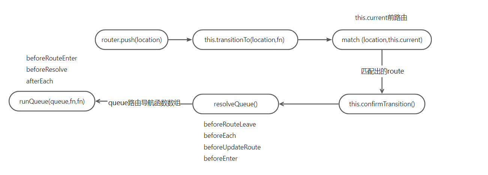
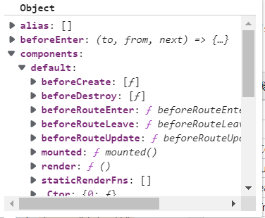

[]路由跳转匹配 - 子路由 孙路由跳转
[]路由记录表的生成

```js
import Vue from "vue";
import VueRouter from "vue-router";

Vue.use(VueRouter);

export const constantRoutes = [
  {
    path: "/login",
    component: () => import("@/views/login/index"),
    hidden: true,
  },
  // .....
];
const createRouter = () =>
  new VueRouter({
    routes: constantRoutes,
    scrollBehavior: () => ({ y: 0 }),
  });

const router = createRouter();

export default router;

new Vue({ router });
```

## install

::: details install

```js
export function install(Vue) {
  if (install.installed && _Vue === Vue) return;
  install.installed = true;
  // 保留Vue引用
  _Vue = Vue;

  const isDef = (v) => v !== undefined;
  // 为router-view组件关联路由组件
  const registerInstance = (vm, callVal) => {
    let i = vm.$options._parentVnode;
    // 调用vm.$options._parentVnode.data.registerRouteInstance方法
    // 而这个方法只在router-view组件中存在，router-view组件定义在(../components/view.js @71行)
    // 所以，如果vm的父节点为router-view，则为router-view关联当前vm，即将当前vm做为router-view的路由组件
    if (
      isDef(i) &&
      isDef((i = i.data)) &&
      isDef((i = i.registerRouteInstance))
    ) {
      // i = registerRouteInstance
      i(vm, callVal);
    }
  };
  // 只在router-view组件中存在
  const registerRouteInstance = function (vm, val) {
    // val could be undefined for unregistration
    // name => router-view props name
    var current = matched.instances[name];
    if ((val && current !== vm) || (!val && current === vm)) {
      matched.instances[name] = val;
    }
  };

  // 为所有的vue组件混入_route,_router,_routerRoot
  Vue.mixin({
    beforeCreate() {
      // this === new Vue({router:router}) === Vue根实例
      if (isDef(this.$options.router)) {
        // 保存挂载VueRouter的Vue实例，此处为根实例
        this._routerRoot = this;
        // 保存VueRouter实例，this.$options.router仅存在于Vue根实例上，其它Vue组件不包含此属性，所以下面的初始化，只会执行一次
        this._router = this.$options.router;
        this._router.init(this);
        // 响应式定义_route属性，保证_route发生变化时，组件(router-view)会重新渲染
        Vue.util.defineReactive(this, "_route", this._router.history.current);
      } else {
        this._routerRoot = (this.$parent && this.$parent._routerRoot) || this;
      }
      // 为router-view组件关联路由组件
      registerInstance(this, this);
    },
    destroyed() {
      registerInstance(this);
    },
  });

  Object.defineProperty(Vue.prototype, "$router", {
    get() {
      return this._routerRoot._router;
    },
  });

  Object.defineProperty(Vue.prototype, "$route", {
    get() {
      return this._routerRoot._route;
    },
  });

  Vue.component("RouterView", View);
  Vue.component("RouterLink", Link);

  const strats = Vue.config.optionMergeStrategies;
  // use the same hook merging strategy for route hooks
  strats.beforeRouteEnter =
    strats.beforeRouteLeave =
    strats.beforeRouteUpdate =
      strats.created;
}
```

::: details \_router.init

```js
export default class VueRouter {
  init(app: any /* Vue component instance */) {
    // app = vm根实例
    this.apps.push(app);
    // set up app destroyed handler
    // https://github.com/vuejs/vue-router/issues/2639
    app.$once("hook:destroyed", () => {
      // clean out app from this.apps array once destroyed
      const index = this.apps.indexOf(app);
      if (index > -1) this.apps.splice(index, 1);
      // ensure we still have a main app or null if no apps
      // we do not release the router so it can be reused
      if (this.app === app) this.app = this.apps[0] || null;

      if (!this.app) this.history.teardown();
    });

    // main app previously initialized
    // return as we don't need to set up new history listener
    //
    if (this.app) {
      return;
    }

    this.app = app;

    const history = this.history;

    if (history instanceof HTML5History || history instanceof HashHistory) {
      const handleInitialScroll = (routeOrError) => {
        const from = history.current;
        const expectScroll = this.options.scrollBehavior;
        const supportsScroll = supportsPushState && expectScroll;

        if (supportsScroll && "fullPath" in routeOrError) {
          handleScroll(this, routeOrError, from, false);
        }
      };

      // 监听路由变化
      const setupListeners = (routeOrError) => {
        history.setupListeners();
        handleInitialScroll(routeOrError);
      };
      history.transitionTo(
        history.getCurrentLocation(),
        setupListeners,
        setupListeners
      );
    }
    // 回调会在父类的updateRoute方法被调用时触发，重新为app._route赋值
    // 由于app._route被定义为响应式，所以app._route发生变化，依赖app._route的组件(route-view组件)都会被重新渲染
    // 调用父类的listen方法，添加回调；
    history.listen((route) => {
      this.apps.forEach((app) => {
        app._route = route;
      });
    });
  }
}
```

:::

## VueRouter

```js
const routes = [
  { path: "/foo", component: Foo },
  { path: "/bar", component: Bar },
];
const router = new VueRouter({
  routes, // (缩写) 相当于 routes: routes
});
```

::: details VueRouter

```js
export default class VueRouter {
  constructor(options: RouterOptions = {}) {
    this.app = null;
    this.apps = [];
    this.options = options;
    this.beforeHooks = [];
    this.resolveHooks = [];
    this.afterHooks = [];
    this.matcher = createMatcher(options.routes || [], this);

    let mode = options.mode || "hash";
    this.fallback =
      mode === "history" && !supportsPushState && options.fallback !== false;
    if (this.fallback) {
      mode = "hash";
    }
    if (!inBrowser) {
      mode = "abstract";
    }
    this.mode = mode;

    switch (mode) {
      case "history":
        this.history = new HTML5History(this, options.base);
        break;
      case "hash":
        this.history = new HashHistory(this, options.base, this.fallback);
        break;
      case "abstract":
        this.history = new AbstractHistory(this, options.base);
        break;
      default:
    }
  }
}
```

:::

### createMatcher

::: details createMatcher

```js
export function createMatcher(
  routes: Array<RouteConfig>,
  router: VueRouter
): Matcher {
  // 根据 传入的 routes 生成路由记录
  //  pathList 路由路径数组
  //  pathMap = {/home:record} nameMap = {/home:record}
  const { pathList, pathMap, nameMap } = createRouteMap(routes);
  return {
    match,
    addRoute,
    getRoutes,
    addRoutes,
  };
}
```

:::

::: details createRouteMap

```js
export function createRouteMap(
  routes: Array<RouteConfig>,
  oldPathList?: Array<string>,
  oldPathMap?: Dictionary<RouteRecord>,
  oldNameMap?: Dictionary<RouteRecord>,
  parentRoute?: RouteRecord
): {
  pathList: Array<string>,
  pathMap: Dictionary<RouteRecord>,
  nameMap: Dictionary<RouteRecord>,
} {
  const pathList: Array<string> = oldPathList || [];
  const pathMap: Dictionary<RouteRecord> = oldPathMap || Object.create(null);
  const nameMap: Dictionary<RouteRecord> = oldNameMap || Object.create(null);

  // 遍历路由配置 生成路由记录
  routes.forEach((route) => {
    addRouteRecord(pathList, pathMap, nameMap, route, parentRoute);
  });
  // 确保 path:*永远在前面
  for (let i = 0, l = pathList.length; i < l; i++) {
    if (pathList[i] === "*") {
      pathList.push(pathList.splice(i, 1)[0]);
      l--;
      i--;
    }
  }
  return {
    pathList,
    pathMap,
    nameMap,
  };
}
```

:::
更新路由映射表
从 route 中匹配对应的路由信息

::: details addRouteRecord

```js
function addRouteRecord(pathList, pathMap, nameMap, route, parent, matchAs) {
  var path = route.path;
  var name = route.name;
  var pathToRegexpOptions = route.pathToRegexpOptions || {};
  var normalizedPath = normalizePath(path, parent, pathToRegexpOptions.strict);
  if (typeof route.caseSensitive === "boolean") {
    pathToRegexpOptions.sensitive = route.caseSensitive;
  }
  // 记录
  // pathMap = {/home:record} nameMap = {/home:record}
  var record = {
    path: normalizedPath,
    regex: compileRouteRegex(normalizedPath, pathToRegexpOptions),
    components: route.components || { default: route.component },
    alias: route.alias
      ? typeof route.alias === "string"
        ? [route.alias]
        : route.alias
      : [],
    instances: {},
    enteredCbs: {},
    name: name,
    parent: parent,
    matchAs: matchAs,
    redirect: route.redirect,
    beforeEnter: route.beforeEnter,
    meta: route.meta || {},
    props:
      route.props == null
        ? {}
        : route.components
        ? route.props
        : { default: route.props },
  };
  // 遍历子路由
  if (route.children) {
    route.children.forEach(function (child) {
      var childMatchAs = matchAs
        ? cleanPath(matchAs + "/" + child.path)
        : undefined;
      addRouteRecord(pathList, pathMap, nameMap, child, record, childMatchAs);
    });
  }

  if (!pathMap[record.path]) {
    pathList.push(record.path);
    pathMap[record.path] = record;
  }
  // https://router.vuejs.org/zh/guide/essentials/redirect-and-alias.html#%E5%88%AB%E5%90%8D
  // 别名处理
  // 将别名定义为 path进行处理
  if (route.alias !== undefined) {
    var aliases = Array.isArray(route.alias) ? route.alias : [route.alias];
    for (var i = 0; i < aliases.length; ++i) {
      var alias = aliases[i];
      if (alias === path) {
        // skip in dev to make it work
        continue;
      }
      var aliasRoute = {
        path: alias,
        children: route.children,
      };
      addRouteRecord(
        pathList,
        pathMap,
        nameMap,
        aliasRoute,
        parent,
        record.path || "/" // matchAs
      );
    }
  }

  if (name) {
    if (!nameMap[name]) {
      nameMap[name] = record;
    }
  }
}
```

:::

## 路由跳转

```js
router.push(location, onComplete?, onAbort?)
router.push(location).then(onComplete).catch(onAbort)
router.replace(location, onComplete?, onAbort?)
router.replace(location).then(onComplete).catch(onAbort)
// 利用浏览器 window.history.go(n)
router.go(n)
router.back()
router.forward()

```



### html5

```js
export class HTML5History extends History {
  // 在 install方法中的 router_init 中 执行
  setupListeners() {
    if (this.listeners.length > 0) {
      return;
    }

    const router = this.router;
    // 传入的 options中的 scrollBehavior 方法
    const expectScroll = router.options.scrollBehavior;
    const supportsScroll = supportsPushState && expectScroll;

    if (supportsScroll) {
      this.listeners.push(setupScroll());
    }
    const handleRoutingEvent = () => {
      const current = this.current;

      // Avoiding first `popstate` event dispatched in some browsers but first
      // history route not updated since async guard at the same time.
      const location = getLocation(this.base);
      if (this.current === START && location === this._startLocation) {
        return;
      }

      this.transitionTo(location, (route) => {
        if (supportsScroll) {
          handleScroll(router, route, current, true);
        }
      });
    };
    window.addEventListener("popstate", handleRoutingEvent);
    this.listeners.push(() => {
      window.removeEventListener("popstate", handleRoutingEvent);
    });
  }
  push(location: RawLocation, onComplete?: Function, onAbort?: Function) {
    const { current: fromRoute } = this;
    this.transitionTo(
      location,
      (route) => {
        pushState(cleanPath(this.base + route.fullPath));
        handleScroll(this.router, route, fromRoute, false);
        onComplete && onComplete(route);
      },
      onAbort
    );
  }

  replace(location: RawLocation, onComplete?: Function, onAbort?: Function) {
    const { current: fromRoute } = this;
    this.transitionTo(
      location,
      (route) => {
        replaceState(cleanPath(this.base + route.fullPath));
        handleScroll(this.router, route, fromRoute, false);
        onComplete && onComplete(route);
      },
      onAbort
    );
  }
}

// 利用浏览器 history特性 向 当前浏览器会话的历史堆栈中 修改状态
export function pushState(url?: string, replace?: boolean) {
  saveScrollPosition();
  // try...catch the pushState call to get around Safari
  // DOM Exception 18 where it limits to 100 pushState calls
  const history = window.history;
  try {
    if (replace) {
      // preserve existing history state as it could be overriden by the user
      const stateCopy = extend({}, history.state);
      stateCopy.key = getStateKey();
      history.replaceState(stateCopy, "", url);
    } else {
      history.pushState({ key: setStateKey(genStateKey()) }, "", url);
    }
  } catch (e) {
    window.location[replace ? "replace" : "assign"](url);
  }
}

export function replaceState(url?: string) {
  pushState(url, true);
}
```

### hash

```js
export class HashHistory extends History {
  push(location: RawLocation, onComplete?: Function, onAbort?: Function) {
    const { current: fromRoute } = this;
    this.transitionTo(
      location,
      (route) => {
        pushHash(route.fullPath);
        handleScroll(this.router, route, fromRoute, false);
        onComplete && onComplete(route);
      },
      onAbort
    );
  }

  replace(location: RawLocation, onComplete?: Function, onAbort?: Function) {
    const { current: fromRoute } = this;
    this.transitionTo(
      location,
      (route) => {
        replaceHash(route.fullPath);
        handleScroll(this.router, route, fromRoute, false);
        onComplete && onComplete(route);
      },
      onAbort
    );
  }
}
function getUrl(path) {
  const href = window.location.href;
  const i = href.indexOf("#");
  const base = i >= 0 ? href.slice(0, i) : href;
  return `${base}#${path}`;
}
function pushHash(path) {
  if (supportsPushState) {
    pushState(getUrl(path));
  } else {
    window.location.hash = path;
  }
}

function replaceHash(path) {
  if (supportsPushState) {
    replaceState(getUrl(path));
  } else {
    window.location.replace(getUrl(path));
  }
}
```

## 路由守卫

路由导航获取顺序
beforeRouteLeave => beforeEach => beforeRouteUpdate => beforeEnter(路由独享) =>beforeRouteEnter => beforeResolve => afterEach

::: details 全局路由守卫

```js
router.beforeEach((to, from, next) => {
  console.log("beforeEach", to, from);
  next();
});
router.beforeResolve((to, from, next) => {
  console.log("beforeResolve", to, from);
  next();
});
router.afterEach((to, from) => {
  console.log("afterEach", to, from);
});
```

::: details 路由独享的守卫

```js
const router = new VueRouter({
  routes: [
    {
      path: "/foo",
      component: Foo,
      beforeEnter: (to, from, next) => {
        // ...
      },
    },
  ],
});
```

:::

::: details 组件内的守卫

```js
  beforeRouteEnter(to, from, next) {
    // 在渲染该组件的对应路由被 confirm 前调用
    // 不！能！获取组件实例 `this`
    next(vm => {
    // 通过 `vm` 访问组件实例
    })
    // 因为当守卫执行前，组件实例还没被创建
  },
  beforeRouteUpdate(to, from, next) {
    // 在当前路由改变，但是该组件被复用时调用
    // 举例来说，对于一个带有动态参数的路径 /foo/:id，在 /foo/1 和 /foo/2 之间跳转的时候，
    // 由于会渲染同样的 Foo 组件，因此组件实例会被复用。而这个钩子就会在这个情况下被调用。
    // 可以访问组件实例 `this`
  },
  beforeRouteLeave(to, from, next) {
    // 导航离开该组件的对应路由时调用
    // 可以访问组件实例 `this`
  }

```

:::

## transitionTo

::: details transitionTo

```js
  transitionTo (
    location: RawLocation,
    onComplete?: Function,
    onAbort?: Function
  ) {
    let route
    // catch redirect option https://github.com/vuejs/vue-router/issues/3201
    try {
      // 更具location匹配对应的record
      // 根据record返回一个route对象
      // route对象 name,meta,path,hash,query,params,fullPath,matched
      route = this.router.match(location, this.current)
    } catch (e) {
      this.errorCbs.forEach(cb => {
        cb(e)
      })
      // Exception should still be thrown
      throw e
    }
    const prev = this.current
    // 确定跳转
    // 执行路由守卫
    this.confirmTransition(
      route,
      () => {
        this.updateRoute(route)
        /*
          updateRoute (route: Route) {
           this.current = route
           this.cb && this.cb(route)
          }
        */
        onComplete && onComplete(route)
        // 向浏览器 历史栈 中加入记录  true 加入记录 false replace记录
        this.ensureURL()

        this.router.afterHooks.forEach(hook => {
          hook && hook(route, prev)
        })
        // fire ready cbs once
        if (!this.ready) {
          this.ready = true
          this.readyCbs.forEach(cb => {
            cb(route)
          })
        }
      },
      err => {
        if (onAbort) {
          onAbort(err)
        }
        if (err && !this.ready) {
          // Initial redirection should not mark the history as ready yet
          // because it's triggered by the redirection instead
          // https://github.com/vuejs/vue-router/issues/3225
          // https://github.com/vuejs/vue-router/issues/3331
          if (!isNavigationFailure(err, NavigationFailureType.redirected) || prev !== START) {
            this.ready = true
            this.readyErrorCbs.forEach(cb => {
              cb(err)
            })
          }
        }
      }
    )
  }


```

### match

根据 location 从 pathMap、nameMap 中找出对应的 record
::: details match

```js
match (raw: RawLocation, current?: Route, redirectedFrom?: Location): Route {
  return this.matcher.match(raw, current, redirectedFrom)
}
function match (
  raw: RawLocation,
  currentRoute?: Route,
  redirectedFrom?: Location
): Route {
  const location = normalizeLocation(raw, currentRoute, false, router)
  const { name } = location
  // 根据name 从 nameMap {name:record} 中匹配出record
  if (name) {
    const record = nameMap[name]
    if (process.env.NODE_ENV !== 'production') {
      warn(record, `Route with name '${name}' does not exist`)
    }
    if (!record) return _createRoute(null, location)
    const paramNames = record.regex.keys
      .filter(key => !key.optional)
      .map(key => key.name)
    if (typeof location.params !== 'object') {
      location.params = {}
    }
    if (currentRoute && typeof currentRoute.params === 'object') {
      for (const key in currentRoute.params) {
        if (!(key in location.params) && paramNames.indexOf(key) > -1) {
          location.params[key] = currentRoute.params[key]
        }
      }
    }
    location.path = fillParams(record.path, location.params, `named route "${name}"`)
    return _createRoute(record, location, redirectedFrom)
  } else if (location.path) {
    // 根据路径匹配出
    location.params = {}
    for (let i = 0; i < pathList.length; i++) {
      const path = pathList[i]
      const record = pathMap[path]
      if (matchRoute(record.regex, location.path, location.params)) {
        return _createRoute(record, location, redirectedFrom)
      }
    }
  }
  // no match
  //  根据location生成一个route对象
  // matched = 遍历 record.parent 生成的数组
  return _createRoute(null, location)
}
```

:::

### confirmTransition

::: details confirmTransition

```js
  confirmTransition (route: Route, onComplete: Function, onAbort?: Function) {
    // this.current 默认 /
    // updateRoute 方法执行时 会赋值为 route
    const current = this.current
    this.pending = route
    // 取消路由跳转
    const abort = err => {
      // changed after adding errors with
      // https://github.com/vuejs/vue-router/pull/3047 before that change,
      // redirect and aborted navigation would produce an err == null
      if (!isNavigationFailure(err) && isError(err)) {
        if (this.errorCbs.length) {
          this.errorCbs.forEach(cb => {
            cb(err)
          })
        } else {
          if (process.env.NODE_ENV !== 'production') {
            warn(false, 'uncaught error during route navigation:')
          }
          console.error(err)
        }
      }
      onAbort && onAbort(err)
    }
    const lastRouteIndex = route.matched.length - 1
    const lastCurrentIndex = current.matched.length - 1

    // 判断是否相同路由
    if (
      isSameRoute(route, current) &&
      // in the case the route map has been dynamically appended to
      lastRouteIndex === lastCurrentIndex &&
      route.matched[lastRouteIndex] === current.matched[lastCurrentIndex]
    ) {
      this.ensureURL()
      if (route.hash) {
        handleScroll(this.router, current, route, false)
      }
      return abort(createNavigationDuplicatedError(current, route))
    }

    // 提取出 需要更新、失活、激活的路由
    // matched 就是 当前父路由 ，子路由组成的数组
    // this.current.matched from 路由
    // route.matched to 路由
    const { updated, deactivated, activated } = resolveQueue(
      this.current.matched,
      route.matched
    )

    // 路由守卫函数 数组
    const queue: Array<?NavigationGuard> = [].concat(
      // in-component leave guards
      extractLeaveGuards(deactivated),
      // global before hooks
      this.router.beforeHooks,
      // in-component update hooks
      extractUpdateHooks(updated),
      // in-config enter guards
      activated.map(m => m.beforeEnter),
      // async components
      // 解析异步组件
      resolveAsyncComponents(activated)
    )

    const iterator = (hook: NavigationGuard, next) => {
      if (this.pending !== route) {
        return abort(createNavigationCancelledError(current, route))
      }
      try {
        hook(route, current, (to: any) => {
          if (to === false) {
            // next(false) -> abort navigation, ensure current URL
            this.ensureURL(true)
            abort(createNavigationAbortedError(current, route))
          } else if (isError(to)) {
            this.ensureURL(true)
            abort(to)
          } else if (
            typeof to === 'string' ||
            (typeof to === 'object' &&
              (typeof to.path === 'string' || typeof to.name === 'string'))
          ) {
            // next('/') or next({ path: '/' }) -> redirect
            abort(createNavigationRedirectedError(current, route))
            if (typeof to === 'object' && to.replace) {
              this.replace(to)
            } else {
              this.push(to)
            }
          } else {
            // confirm transition and pass on the value
            next(to)
          }
        })
      } catch (e) {
        abort(e)
      }
    }

    runQueue(queue, iterator, () => {
      // wait until async components are resolved before
      // extracting in-component enter guards
      const enterGuards = extractEnterGuards(activated)
      const queue = enterGuards.concat(this.router.resolveHooks)
      runQueue(queue, iterator, () => {
        if (this.pending !== route) {
          return abort(createNavigationCancelledError(current, route))
        }
        this.pending = null
        onComplete(route)
        if (this.router.app) {
          this.router.app.$nextTick(() => {
            handleRouteEntered(route)
          })
        }
      })
    })
  }
```

:::

#### resolveQueue

对比 from 和 to 的 matched

current: a a/b a/b/c
next: a a/b a/b/d a/b/d/e

第三个不同
next=》a a/b updated a/b/d a/b/d/e activated
current => a/b/c deactivated

```js
function resolveQueue(
  current: Array<RouteRecord>,
  next: Array<RouteRecord>
): {
  updated: Array<RouteRecord>,
  activated: Array<RouteRecord>,
  deactivated: Array<RouteRecord>,
} {
  let i;
  const max = Math.max(current.length, next.length);
  for (i = 0; i < max; i++) {
    if (current[i] !== next[i]) {
      break;
    }
  }
  return {
    updated: next.slice(0, i),
    activated: next.slice(i),
    deactivated: current.slice(i),
  };
}
```

#### resolveAsyncComponents

解析异步组件

::: details vue 异步组件

```js
Vue.component("async-example", function (resolve, reject) {
  setTimeout(function () {
    // 向 `resolve` 回调传递组件定义
    resolve({
      template: "<div>I am async!</div>",
    });
  }, 1000);
});
Vue.component("async-webpack-example", function (resolve) {
  // 这个特殊的 `require` 语法将会告诉 webpack
  // 自动将你的构建代码切割成多个包，这些包
  // 会通过 Ajax 请求加载
  require(["./my-async-component"], resolve);
});
Vue.component(
  "async-webpack-example",
  // 这个动态导入会返回一个 `Promise` 对象。
  () => import("./my-async-component")
);
new Vue({
  // ...
  components: {
    "my-component": () => import("./my-async-component"),
  },
});
```

:::

::: details resolveAsyncComponents

```js
export function resolveAsyncComponents(matched: Array<RouteRecord>): Function {
  return (to, from, next) => {
    let hasAsync = false;
    let pending = 0;
    let error = null;

    // matched 要激活的主机
    // flatMapComponents 从matched 中 获取 路由 components实例
    //  def      components
    //   _       instances
    //  match    records
    //  key      components.key
    flatMapComponents(matched, (def, _, match, key) => {
      // if it's a function and doesn't have cid attached,
      // assume it's an async component resolve function.
      // we are not using Vue's default async resolving mechanism because
      // we want to halt the navigation until the incoming component has been
      // resolved.
      if (typeof def === "function" && def.cid === undefined) {
        hasAsync = true;
        pending++;

        const resolve = once((resolvedDef) => {
          if (isESModule(resolvedDef)) {
            resolvedDef = resolvedDef.default;
          }
          // save resolved on async factory in case it's used elsewhere
          def.resolved =
            typeof resolvedDef === "function"
              ? resolvedDef
              : _Vue.extend(resolvedDef);
          match.components[key] = resolvedDef;
          pending--;
          if (pending <= 0) {
            next();
          }
        });

        const reject = once((reason) => {
          const msg = `Failed to resolve async component ${key}: ${reason}`;
          process.env.NODE_ENV !== "production" && warn(false, msg);
          if (!error) {
            error = isError(reason) ? reason : new Error(msg);
            next(error);
          }
        });

        let res;
        try {
          res = def(resolve, reject);
        } catch (e) {
          reject(e);
        }
        if (res) {
          if (typeof res.then === "function") {
            res.then(resolve, reject);
          } else {
            // new syntax in Vue 2.3
            const comp = res.component;
            if (comp && typeof comp.then === "function") {
              comp.then(resolve, reject);
            }
          }
        }
      }
    });

    if (!hasAsync) next();
  };
}
```

:::

#### extractGuards

获取路由守卫
从 record 中的 component 组件中获取到对应的路由导航


```js
// 获取组件离开守卫
function extractLeaveGuards(deactivated: Array<RouteRecord>): Array<?Function> {
  return extractGuards(deactivated, "beforeRouteLeave", bindGuard, true);
}
// 获取组件更新守卫
function extractUpdateHooks(updated: Array<RouteRecord>): Array<?Function> {
  return extractGuards(updated, "beforeRouteUpdate", bindGuard);
}
function bindGuard(guard: NavigationGuard, instance: ?_Vue): ?NavigationGuard {
  if (instance) {
    return function boundRouteGuard() {
      return guard.apply(instance, arguments);
    };
  }
}
//  获取 路由导航函数
function extractGuards(
  records: Array<RouteRecord>,
  name: string,
  bind: Function,
  reverse?: boolean
): Array<?Function> {
  //  fn =>  从record记录中的 components 遍历 组件name，获取到 component
  const guards = flatMapComponents(records, (def, instance, match, key) => {
    //  更具 key 从 component.options 中获取 路由导航函数
    const guard = extractGuard(def, name);
    if (guard) {
      return Array.isArray(guard)
        ? guard.map((guard) => bind(guard, instance, match, key))
        : //  guard.apply(instance,arguments)
          //  改变 this 为 组件
          bind(guard, instance, match, key);
    }
  });
  //  reverse 将数组中元素的位置颠倒
  return flatten(reverse ? guards.reverse() : guards);
}

function extractGuard(
  def: Object | Function,
  key: string
): NavigationGuard | Array<NavigationGuard> {
  if (typeof def !== "function") {
    // extend now so that global mixins are applied.
    def = _Vue.extend(def);
  }
  return def.options[key];
}

export function flatMapComponents(
  matched: Array<RouteRecord>,
  fn: Function
): Array<?Function> {
  return flatten(
    matched.map((m) => {
      // 从record记录中的 components 遍历 组件name，获取到 component
      return Object.keys(m.components).map((key) =>
        fn(m.components[key], m.instances[key], m, key)
      );
    })
  );
}

export function flatten(arr: Array<any>): Array<any> {
  return Array.prototype.concat.apply([], arr);
}
```

#### runQueue

执行 路由导航

```js
//  fn iterator
//  cb runQueue () => {}
export function runQueue(
  queue: Array<?NavigationGuard>,
  fn: Function,
  cb: Function
) {
  const step = (index) => {
    if (index >= queue.length) {
      cb();
    } else {
      if (queue[index]) {
        fn(queue[index], () => {
          step(index + 1);
        });
      } else {
        step(index + 1);
      }
    }
  };
  step(0);
}
//  hook 路由导航函数
const iterator = (hook: NavigationGuard, next) => {
  //  confirmTransition this.pending = router
  if (this.pending !== route) {
    return abort(createNavigationCancelledError(current, route));
  }
  try {
    //  to from next()
    hook(route, current, (to: any) => {
      if (to === false) {
        // next(false) -> abort navigation, ensure current URL
        this.ensureURL(true);
        abort(createNavigationAbortedError(current, route));
      } else if (isError(to)) {
        this.ensureURL(true);
        abort(to);
      } else if (
        typeof to === "string" ||
        (typeof to === "object" &&
          (typeof to.path === "string" || typeof to.name === "string"))
      ) {
        // next('/') or next({ path: '/' }) -> redirect
        abort(createNavigationRedirectedError(current, route));
        if (typeof to === "object" && to.replace) {
          this.replace(to);
        } else {
          this.push(to);
        }
      } else {
        // confirm transition and pass on the value
        next(to);
      }
    });
  } catch (e) {
    abort(e);
  }
};
// queue 路由导航数组
runQueue(queue, iterator, () => {
  // wait until async components are resolved before
  // extracting in-component enter guards
  // 获取 beforeRouteEnter
  const enterGuards = extractEnterGuards(activated);
  //  beforeResolve
  const queue = enterGuards.concat(this.router.resolveHooks);

  runQueue(queue, iterator, () => {
    if (this.pending !== route) {
      return abort(createNavigationCancelledError(current, route));
    }
    this.pending = null;
    //  向history 添加或替换一条记录
    //  页面滚动
    //  执行 afterEach 路由导航
    onComplete(route);
    // app = vue
    if (this.router.app) {
      this.router.app.$nextTick(() => {
        // ??
        handleRouteEntered(route);
      });
    }
  });
});
```

## router-view 更新机制

_route 改变触发更新

将路由主机渲染出来

```js
// core/global-api
Vue.component("RouterView", View);
```

::: details Vue.component

```js
Vue.component = function (
  id: string,
  definition?: Function | Object
): Function | Object | void {
  if (!definition) {
    return this.options[type + "s"][id];
  } else {
    /* istanbul ignore if */

    // @ts-expect-error
    definition.name = definition.name || id;
    // _base = Vue
    // extend 构造一个 Vue 的子类
    definition = this.options._base.extend(definition);
    // 挂载到Vue.options.components里面
    this.options["components"][id] = definition;
    return definition;
  }
};
```

:::

::: details router-view

```js
export default {
  name: "RouterView",
  // 定义为函数式组件
  functional: true,
  props: {
    name: {
      type: String,
      default: "default",
    },
  },
  // _createElement
  render(_, { props, children, parent, data }) {
    // used by devtools to display a router-view badge
    // 表示当前主机为router-view
    data.routerView = true;

    // directly use parent context's createElement() function
    // so that components rendered by router-view can resolve named slots
    const h = parent.$createElement;
    const name = props.name;
    const route = parent.$route;
    const cache = parent._routerViewCache || (parent._routerViewCache = {});

    // determine current view depth, also check to see if the tree
    // has been toggled inactive but kept-alive.
    // 当前 router-view嵌套深度
    let depth = 0;
    let inactive = false;
    while (parent && parent._routerRoot !== parent) {
      const vnodeData = parent.$vnode ? parent.$vnode.data : {};
      if (vnodeData.routerView) {
        depth++;
      }
      if (vnodeData.keepAlive && parent._directInactive && parent._inactive) {
        inactive = true;
      }
      parent = parent.$parent;
    }
    data.routerViewDepth = depth;

    // render previous view if the tree is inactive and kept-alive
    // 处理 keep-alive
    if (inactive) {
      const cachedData = cache[name];
      const cachedComponent = cachedData && cachedData.component;
      if (cachedComponent) {
        // #2301
        // pass props
        if (cachedData.configProps) {
          fillPropsinData(
            cachedComponent,
            data,
            cachedData.route,
            cachedData.configProps
          );
        }
        return h(cachedComponent, data, children);
      } else {
        // render previous empty view
        return h();
      }
    }

    const matched = route.matched[depth];
    // 获取组件
    const component = matched && matched.components[name];

    // render empty node if no matched route or no config component
    if (!matched || !component) {
      cache[name] = null;
      return h();
    }

    // cache component
    cache[name] = { component };

    // attach instance registration hook
    // this will be called in the instance's injected lifecycle hooks
    data.registerRouteInstance = (vm, val) => {
      // val could be undefined for unregistration
      const current = matched.instances[name];
      if ((val && current !== vm) || (!val && current === vm)) {
        matched.instances[name] = val;
      }
    };

    // also register instance in prepatch hook
    // in case the same component instance is reused across different routes
    (data.hook || (data.hook = {})).prepatch = (_, vnode) => {
      matched.instances[name] = vnode.componentInstance;
    };

    // register instance in init hook
    // in case kept-alive component be actived when routes changed
    data.hook.init = (vnode) => {
      if (
        vnode.data.keepAlive &&
        vnode.componentInstance &&
        vnode.componentInstance !== matched.instances[name]
      ) {
        matched.instances[name] = vnode.componentInstance;
      }

      // if the route transition has already been confirmed then we weren't
      // able to call the cbs during confirmation as the component was not
      // registered yet, so we call it here.
      handleRouteEntered(route);
    };

    const configProps = matched.props && matched.props[name];
    // save route and configProps in cache
    if (configProps) {
      extend(cache[name], {
        route,
        configProps,
      });
      fillPropsinData(component, data, route, configProps);
    }

    return h(component, data, children);
  },
};
```

:::
