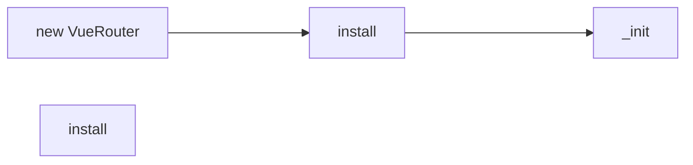

# 前言

实现一个前端路由，需要三部分

- 路由映射表
  - 一个能表达 url 和组件关系的映射表，可以使用 Map、对象字面量来实现
- 匹配器
  - 负责在访问 url 时，进行匹配找出对应的组件
- 历史记录栈
  - 浏览器平台，原生支持

```js
import Vue from "vue";
import VueRouter from "vue-router";

Vue.use(VueRouter);

export const constantRoutes = [
  {
    path: "/login",
    component: () => import("@/views/login/index"),
    hidden: true,
  },
  // .....
];
const createRouter = () =>
  new VueRouter({
    routes: constantRoutes,
    scrollBehavior: () => ({ y: 0 }),
  });

const router = createRouter();

export default router;

new Vue({ router });
```

# VueRouter

```js
export default class VueRouter {
  constructor(options: RouterOptions = {}) {
    this.app = null;
    this.apps = [];
    this.options = options;
    this.beforeHooks = [];
    this.resolveHooks = [];
    this.afterHooks = [];
    this.matcher = createMatcher(options.routes || [], this);

    let mode = options.mode || "hash";
    this.fallback =
      mode === "history" && !supportsPushState && options.fallback !== false;
    if (this.fallback) {
      mode = "hash";
    }
    if (!inBrowser) {
      mode = "abstract";
    }
    this.mode = mode;

    switch (mode) {
      case "history":
        this.history = new HTML5History(this, options.base);
        break;
      case "hash":
        this.history = new HashHistory(this, options.base, this.fallback);
        break;
      case "abstract":
        this.history = new AbstractHistory(this, options.base);
        break;
      default:
    }
  }
}
```

## createMatcher

```js
export function createMatcher(
  routes: Array<RouteConfig>,
  router: VueRouter
): Matcher {
  const { pathList, pathMap, nameMap } = createRouteMap(routes);
  return {
    match,
    addRoute,
    getRoutes, //从 pathMap 里获取对应的 route
    addRoutes,
  };
}
```

### createRouteMap

```js
export function createRouteMap(
  routes: Array<RouteConfig>,
  oldPathList?: Array<string>,
  oldPathMap?: Dictionary<RouteRecord>,
  oldNameMap?: Dictionary<RouteRecord>,
  parentRoute?: RouteRecord
): {
  pathList: Array<string>,
  pathMap: Dictionary<RouteRecord>,
  nameMap: Dictionary<RouteRecord>,
} {
  const pathList: Array<string> = oldPathList || [];
  const pathMap: Dictionary<RouteRecord> = oldPathMap || Object.create(null);
  const nameMap: Dictionary<RouteRecord> = oldNameMap || Object.create(null);

  // 遍历路由配置 生成路由记录
  routes.forEach((route) => {
    addRouteRecord(pathList, pathMap, nameMap, route, parentRoute);
  });
  // 确保 path:*永远在前面
  for (let i = 0, l = pathList.length; i < l; i++) {
    if (pathList[i] === "*") {
      pathList.push(pathList.splice(i, 1)[0]);
      l--;
      i--;
    }
  }
  return {
    pathList,
    pathMap,
    nameMap,
  };
}
```

### addRouteRecord

更新路由映射表
从 route 中匹配对应的路由信息

```js
function addRouteRecord(pathList, pathMap, nameMap, route, parent, matchAs) {
  var path = route.path;
  var name = route.name;
  var pathToRegexpOptions = route.pathToRegexpOptions || {};
  var normalizedPath = normalizePath(path, parent, pathToRegexpOptions.strict);
  if (typeof route.caseSensitive === "boolean") {
    pathToRegexpOptions.sensitive = route.caseSensitive;
  }
  // 记录
  // pathMap = {/home:record} nameMap = {/home:record}
  var record = {
    path: normalizedPath,
    regex: compileRouteRegex(normalizedPath, pathToRegexpOptions),
    components: route.components || { default: route.component },
    alias: route.alias
      ? typeof route.alias === "string"
        ? [route.alias]
        : route.alias
      : [],
    instances: {},
    enteredCbs: {},
    name: name,
    parent: parent,
    matchAs: matchAs,
    redirect: route.redirect,
    beforeEnter: route.beforeEnter,
    meta: route.meta || {},
    props:
      route.props == null
        ? {}
        : route.components
        ? route.props
        : { default: route.props },
  };

  if (route.children) {
    route.children.forEach(function (child) {
      var childMatchAs = matchAs
        ? cleanPath(matchAs + "/" + child.path)
        : undefined;
      addRouteRecord(pathList, pathMap, nameMap, child, record, childMatchAs);
    });
  }

  if (!pathMap[record.path]) {
    pathList.push(record.path);
    pathMap[record.path] = record;
  }
  // https://router.vuejs.org/zh/guide/essentials/redirect-and-alias.html#%E5%88%AB%E5%90%8D
  // 别名处理
  // 将别名定义为 path进行处理
  if (route.alias !== undefined) {
    var aliases = Array.isArray(route.alias) ? route.alias : [route.alias];
    for (var i = 0; i < aliases.length; ++i) {
      var alias = aliases[i];
      if (alias === path) {
        // skip in dev to make it work
        continue;
      }
      var aliasRoute = {
        path: alias,
        children: route.children,
      };
      addRouteRecord(
        pathList,
        pathMap,
        nameMap,
        aliasRoute,
        parent,
        record.path || "/" // matchAs
      );
    }
  }

  if (name) {
    if (!nameMap[name]) {
      nameMap[name] = record;
    }
  }
}
```

# install

```js
export function install(Vue) {
  if (install.installed && _Vue === Vue) return;
  install.installed = true;
  // 保留Vue引用
  _Vue = Vue;

  const isDef = (v) => v !== undefined;
  // 为router-view组件关联路由组件
  const registerInstance = (vm, callVal) => {
    let i = vm.$options._parentVnode;
    // 调用vm.$options._parentVnode.data.registerRouteInstance方法
    // 而这个方法只在router-view组件中存在，router-view组件定义在(../components/view.js @71行)
    // 所以，如果vm的父节点为router-view，则为router-view关联当前vm，即将当前vm做为router-view的路由组件
    if (
      isDef(i) &&
      isDef((i = i.data)) &&
      isDef((i = i.registerRouteInstance))
    ) {
      i(vm, callVal);
    }
  };

  Vue.mixin({
    beforeCreate() {
      // this === new Vue({router:router}) === Vue根实例
      if (isDef(this.$options.router)) {
        // 保存挂载VueRouter的Vue实例，此处为根实例
        this._routerRoot = this;
        // 保存VueRouter实例，this.$options.router仅存在于Vue根实例上，其它Vue组件不包含此属性，所以下面的初始化，只会执行一次
        this._router = this.$options.router;
        this._router.init(this);
        // 响应式定义_route属性，保证_route发生变化时，组件(router-view)会重新渲染
        Vue.util.defineReactive(this, "_route", this._router.history.current);
      } else {
        this._routerRoot = (this.$parent && this.$parent._routerRoot) || this;
      }
      // 为router-view组件关联路由组件
      registerInstance(this, this);
    },
    destroyed() {
      registerInstance(this);
    },
  });

  Object.defineProperty(Vue.prototype, "$router", {
    get() {
      return this._routerRoot._router;
    },
  });

  Object.defineProperty(Vue.prototype, "$route", {
    get() {
      return this._routerRoot._route;
    },
  });

  Vue.component("RouterView", View);
  Vue.component("RouterLink", Link);

  const strats = Vue.config.optionMergeStrategies;
  // use the same hook merging strategy for route hooks
  strats.beforeRouteEnter =
    strats.beforeRouteLeave =
    strats.beforeRouteUpdate =
      strats.created;
}
```

## \_router.init

```js
export default class VueRouter {
  init(app: any /* Vue component instance */) {
    // app = vm根实例
    this.apps.push(app);
    // set up app destroyed handler
    // https://github.com/vuejs/vue-router/issues/2639
    app.$once("hook:destroyed", () => {
      // clean out app from this.apps array once destroyed
      const index = this.apps.indexOf(app);
      if (index > -1) this.apps.splice(index, 1);
      // ensure we still have a main app or null if no apps
      // we do not release the router so it can be reused
      if (this.app === app) this.app = this.apps[0] || null;

      if (!this.app) this.history.teardown();
    });

    // main app previously initialized
    // return as we don't need to set up new history listener
    //
    if (this.app) {
      return;
    }

    this.app = app;

    const history = this.history;

    if (history instanceof HTML5History || history instanceof HashHistory) {
      const handleInitialScroll = (routeOrError) => {
        const from = history.current;
        const expectScroll = this.options.scrollBehavior;
        const supportsScroll = supportsPushState && expectScroll;

        if (supportsScroll && "fullPath" in routeOrError) {
          handleScroll(this, routeOrError, from, false);
        }
      };
      const setupListeners = (routeOrError) => {
        history.setupListeners();
        handleInitialScroll(routeOrError);
      };
      history.transitionTo(
        history.getCurrentLocation(),
        setupListeners,
        setupListeners
      );
    }
    // 回调会在父类的updateRoute方法被调用时触发，重新为app._route赋值
    // 由于app._route被定义为响应式，所以app._route发生变化，依赖app._route的组件(route-view组件)都会被重新渲染
    // 调用父类的listen方法，添加回调；
    history.listen((route) => {
      this.apps.forEach((app) => {
        app._route = route;
      });
    });
  }
}
```

# history

## extends

**Class 可以通过 extends 关键字实现继承，让子类继承父类的属性和方法**
父类所有的属性和方法，都会被子类继承，除了私有的属性和方法。
<https://es6.ruanyifeng.com/?search=extend&x=0&y=0#docs/class-extends>

```js
class Animal {
  name: string;
}
```

## transitionTo

路由跳转

```js
// 从 match中得到新的路由对象
  transitionTo (
    location: RawLocation,
    onComplete?: Function,
    onAbort?: Function
  ) {
    let route
    // catch redirect option https://github.com/vuejs/vue-router/issues/3201
    try {
      // 更具location匹配对应的record
      // 根据record返回一个route对象
      // name,meta,path,hash,query,params,fullPath,matched
      route = this.router.match(location, this.current)
    } catch (e) {
      this.errorCbs.forEach(cb => {
        cb(e)
      })
      // Exception should still be thrown
      throw e
    }
    const prev = this.current

    this.confirmTransition(
      route,
      () => {
        // 对 this.current 赋值 将跳转路由赋值为 前路由
        this.updateRoute(route)
        onComplete && onComplete(route)
        // 使用 pushState 或者 replaceState 更新url
        this.ensureURL()
        this.router.afterHooks.forEach(hook => {
          hook && hook(route, prev)
        })
        // fire ready cbs once
        if (!this.ready) {
          this.ready = true
          this.readyCbs.forEach(cb => {
            cb(route)
          })
        }
      },
      err => {
        if (onAbort) {
          onAbort(err)
        }
        if (err && !this.ready) {
          // Initial redirection should not mark the history as ready yet
          // because it's triggered by the redirection instead
          // https://github.com/vuejs/vue-router/issues/3225
          // https://github.com/vuejs/vue-router/issues/3331
          if (!isNavigationFailure(err, NavigationFailureType.redirected) || prev !== START) {
            this.ready = true
            this.readyErrorCbs.forEach(cb => {
              cb(err)
            })
          }
        }
      }
    )
  }


```

### match

根据 location 从 pathMap、nameMap 中找出对应的 record

```js
match (raw: RawLocation, current?: Route, redirectedFrom?: Location): Route {
  return this.matcher.match(raw, current, redirectedFrom)
}
function match (
  raw: RawLocation,
  currentRoute?: Route,
  redirectedFrom?: Location
): Route {
  const location = normalizeLocation(raw, currentRoute, false, router)
  const { name } = location
  if (name) {
    const record = nameMap[name]
    if (process.env.NODE_ENV !== 'production') {
      warn(record, `Route with name '${name}' does not exist`)
    }
    if (!record) return _createRoute(null, location)
    const paramNames = record.regex.keys
      .filter(key => !key.optional)
      .map(key => key.name)
    if (typeof location.params !== 'object') {
      location.params = {}
    }
    if (currentRoute && typeof currentRoute.params === 'object') {
      for (const key in currentRoute.params) {
        if (!(key in location.params) && paramNames.indexOf(key) > -1) {
          location.params[key] = currentRoute.params[key]
        }
      }
    }
    location.path = fillParams(record.path, location.params, `named route "${name}"`)
    return _createRoute(record, location, redirectedFrom)
  } else if (location.path) {
    location.params = {}
    for (let i = 0; i < pathList.length; i++) {
      const path = pathList[i]
      const record = pathMap[path]
      if (matchRoute(record.regex, location.path, location.params)) {
        return _createRoute(record, location, redirectedFrom)
      }
    }
  }
  // no match
  return _createRoute(null, location)
}
```

## confirmTransition

```js
// 处理路由导航
  confirmTransition (route: Route, onComplete: Function, onAbort?: Function) {
    // this.current 默认 /
    // updateRoute 方法执行时 会赋值为 route
    const current = this.current
    this.pending = route
    // 取消路由跳转
    const abort = err => {
      // changed after adding errors with
      // https://github.com/vuejs/vue-router/pull/3047 before that change,
      // redirect and aborted navigation would produce an err == null
      if (!isNavigationFailure(err) && isError(err)) {
        if (this.errorCbs.length) {
          this.errorCbs.forEach(cb => {
            cb(err)
          })
        } else {
          if (process.env.NODE_ENV !== 'production') {
            warn(false, 'uncaught error during route navigation:')
          }
          console.error(err)
        }
      }
      onAbort && onAbort(err)
    }
    const lastRouteIndex = route.matched.length - 1
    const lastCurrentIndex = current.matched.length - 1

    // 判断是否相同路由
    if (
      isSameRoute(route, current) &&
      // in the case the route map has been dynamically appended to
      lastRouteIndex === lastCurrentIndex &&
      route.matched[lastRouteIndex] === current.matched[lastCurrentIndex]
    ) {
      this.ensureURL()
      if (route.hash) {
        handleScroll(this.router, current, route, false)
      }
      return abort(createNavigationDuplicatedError(current, route))
    }

    // 提取出 需要更新、失活、激活的路由
    const { updated, deactivated, activated } = resolveQueue(
      this.current.matched,
      route.matched
    )

    // 路由守卫
    const queue: Array<?NavigationGuard> = [].concat(
      // in-component leave guards
      extractLeaveGuards(deactivated),
      // global before hooks
      this.router.beforeHooks,
      // in-component update hooks
      extractUpdateHooks(updated),
      // in-config enter guards
      activated.map(m => m.beforeEnter),
      // async components
      resolveAsyncComponents(activated)
    )

    const iterator = (hook: NavigationGuard, next) => {
      if (this.pending !== route) {
        return abort(createNavigationCancelledError(current, route))
      }
      try {
        hook(route, current, (to: any) => {
          if (to === false) {
            // next(false) -> abort navigation, ensure current URL
            this.ensureURL(true)
            abort(createNavigationAbortedError(current, route))
          } else if (isError(to)) {
            this.ensureURL(true)
            abort(to)
          } else if (
            typeof to === 'string' ||
            (typeof to === 'object' &&
              (typeof to.path === 'string' || typeof to.name === 'string'))
          ) {
            // next('/') or next({ path: '/' }) -> redirect
            abort(createNavigationRedirectedError(current, route))
            if (typeof to === 'object' && to.replace) {
              this.replace(to)
            } else {
              this.push(to)
            }
          } else {
            // confirm transition and pass on the value
            next(to)
          }
        })
      } catch (e) {
        abort(e)
      }
    }

    runQueue(queue, iterator, () => {
      // wait until async components are resolved before
      // extracting in-component enter guards
      const enterGuards = extractEnterGuards(activated)
      const queue = enterGuards.concat(this.router.resolveHooks)
      runQueue(queue, iterator, () => {
        if (this.pending !== route) {
          return abort(createNavigationCancelledError(current, route))
        }
        this.pending = null
        onComplete(route)
        if (this.router.app) {
          this.router.app.$nextTick(() => {
            handleRouteEntered(route)
          })
        }
      })
    })
  }
```

## \_createRoute

```js
function _createRoute(
  record: ?RouteRecord,
  location: Location,
  redirectedFrom?: Location
): Route {
  if (record && record.redirect) {
    return redirect(record, redirectedFrom || location);
  }
  if (record && record.matchAs) {
    return alias(record, location, record.matchAs);
  }
  return createRoute(record, location, redirectedFrom, router);
}
```

### createRoute

```js
export function createRoute(
  record: ?RouteRecord,
  location: Location,
  redirectedFrom?: ?Location,
  router?: VueRouter
): Route {
  const stringifyQuery = router && router.options.stringifyQuery;

  let query: any = location.query || {};
  try {
    query = clone(query);
  } catch (e) {}

  const route: Route = {
    name: location.name || (record && record.name),
    meta: (record && record.meta) || {},
    path: location.path || "/",
    hash: location.hash || "",
    query,
    params: location.params || {},
    fullPath: getFullPath(location, stringifyQuery),
    matched: record ? formatMatch(record) : [],
  };
  if (redirectedFrom) {
    route.redirectedFrom = getFullPath(redirectedFrom, stringifyQuery);
  }
  return Object.freeze(route);
}
```

## html5

### push

```js
// 字符串
router.push("home");

// 对象
router.push({ path: "home" });

// 命名的路由
router.push({ name: "user", params: { userId: "123" } });

// 带查询参数，变成 /register?plan=private
router.push({ path: "register", query: { plan: "private" } });
```

```js
  go (n: number) {
    window.history.go(n)
  }

  push (location: RawLocation, onComplete?: Function, onAbort?: Function) {
    // 前一个路由
    const { current: fromRoute } = this
    this.transitionTo(location, route => {
      pushState(cleanPath(this.base + route.fullPath))
      handleScroll(this.router, route, fromRoute, false)
      onComplete && onComplete(route)
    }, onAbort)
  }

  replace (location: RawLocation, onComplete?: Function, onAbort?: Function) {
    const { current: fromRoute } = this
    this.transitionTo(location, route => {
      replaceState(cleanPath(this.base + route.fullPath))
      handleScroll(this.router, route, fromRoute, false)
      onComplete && onComplete(route)
    }, onAbort)
  }
```


